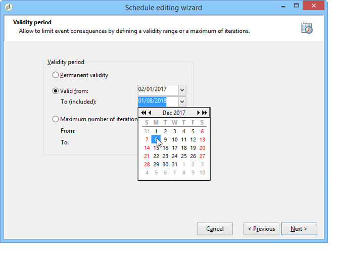
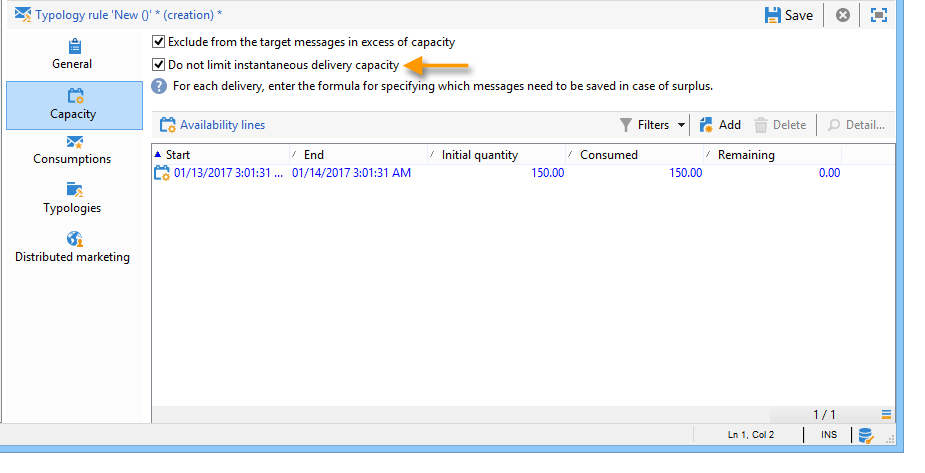

# 일관성 규칙{#consistency-rules}

## 일관성 규칙 기본 정보 {#about-consistency-rules}

Adobe Campaign은 캠페인 유형화에 포함된 규칙 세트를 통해 일관된 통신을 보장합니다. 목표는 볼륨, 특성, 관련성 등과 같이 수신자에게 전송되는 게재를 제어하는 것입니다.

**용량** 예를 들어 규칙 을 사용하면 메시지 게재와 관련된 플랫폼을 오버로드할 수 있습니다. 예를 들어, 다운로드 링크가 포함된 특별 오퍼는 서버가 포화 상태가 되지 않도록 한 번에 너무 많은 사용자에게 전송되지 않아야 합니다. 전화 캠페인은 콜 센터 등의 처리 용량을 초과할 수 없습니다. 자세한 내용은 다음을 참조하십시오. [수용작업량 제어](#controlling-capacity).

## 수용작업량 제어 {#controlling-capacity}

메시지를 게재하기 전에 조직에서 게재를 처리할 수 있는 용량(물리적 인프라), 게재에서 생성할 수 있는 응답(인바운드 메시지) 및 구독자에게 연락할 수 있는 호출 수(콜 센터 처리 용량)를 확보해야 합니다.

이렇게 하려면 다음을 만들어야 합니다. **[!UICONTROL Capacity]** 유형화 규칙.

다음 예에서는 전화 충성도 캠페인에 대한 유형화 규칙을 만듭니다. 우리는 메시지 수를 하루에 20개, 즉 콜센터의 일일 처리 용량으로 제한합니다. 규칙이 두 게재에 적용되면 로그를 통해 소비를 모니터링할 수 있습니다.

새 용량 규칙을 디자인하려면 아래 단계를 수행하십시오.

1. 아래 **[!UICONTROL Administration > Campaign management > Typology management > Typology rules]** 노드, 클릭 **[!UICONTROL New]**.
1. 선택 **[!UICONTROL Capacity]** 규칙 유형.

   

1. 다음에서 **[!UICONTROL Capacity]** 탭에서 가용성 라인을 생성합니다. 이 예에서는 호출이 가능한 기간입니다. 24시간 기간을 선택하고 초기 수량에 150을 입력하면 콜센터에서 하루 150건의 통화를 처리할 수 있다는 의미다.

   

   >[!NOTE]
   >
   >가용성 라인은 정보 목적으로만 사용됩니다. 용량 한도에 도달했을 때 메시지를 제외해야 하는 경우 다음을 참조하십시오. [이 섹션](#exclude-messages-when-capacity-limit-reached).

1. 이 규칙을 유형화에 연결한 다음 해당 유형화를 게재에 참조하여 이 용량 규칙을 적용합니다. 이 작업에 대한 자세한 정보는 [이 섹션](applying-rules.md#applying-a-typology-to-a-delivery)을 참조하십시오.
1. 규칙에서 소비를 모니터링할 수 있습니다 **[!UICONTROL Consumptions]** 및 **[!UICONTROL Capacity]** 탭.

   규칙이 게재에 사용되는 경우 **[!UICONTROL Consumed]** 및 **[!UICONTROL Remaining]** 열은 아래와 같이 로드에 대한 정보를 제공합니다.

   

   이 작업에 대한 자세한 정보는 [이 섹션](#monitoring-consumption)을 참조하십시오.

## 최대 로드 정의 {#defining-the-maximum-load}

최대 로드를 정의하려면 가용성 라인을 정의해야 합니다. 이를 위해 두 가지 옵션을 사용할 수 있습니다. 수동으로 하나 이상의 가용성 라인을 생성할 수 있습니다(참조) [가용성 라인을 하나씩 추가](#adding-availability-lines-one-by-one)) 또는 가용성 범위를 만듭니다. 이러한 기간의 빈도는 자동화할 수 있습니다(참조). [가용성 라인 세트 추가](#add-a-set-of-availability-lines)).

### 가용성 라인을 하나씩 추가 {#adding-availability-lines-one-by-one}

가용성 라인을 생성하려면 **[!UICONTROL Add]** 단추 및 선택 **[!UICONTROL Add an availability line]**. 가용 기간과 가용 로드를 입력합니다.

처리 용량에 맞게 필요한 만큼 줄을 추가합니다.

### 가용성 라인 세트 추가 {#add-a-set-of-availability-lines}

주어진 시간에 대한 가용성 기간을 정의하려면 **[!UICONTROL Add]** 버튼을 클릭하고 다음을 선택합니다. **[!UICONTROL Add a set of availability lines]** 옵션을 선택합니다. 각 기간에 대한 기간 및 생성할 기간 수를 나타냅니다.

페이지 생성 빈도를 자동화하려면 **[!UICONTROL Change]** 버튼을 누르고 기간 스케줄링을 정의합니다.

예를 들어 오전 9시에서 오후 5시 사이에 모든 근무일에 대해 시간당 10회 호출의 비율로 가용성 기간을 생성하는 일정을 정의해 보겠습니다. 그렇게 하려면 다음 단계를 적용합니다.

1. 주기 유형과 유효 기간(일, 시간)을 선택합니다.

   

1. 유효 일자를 나타냅니다.

   

1. 승인하기 전에 일정을 확인하십시오.

   

다음 **[!UICONTROL Forecasting]** 워크플로우는 자동으로 일치하는 모든 줄을 생성합니다.

>[!NOTE]
>
>파일 가져오기를 통해 가용성 라인을 생성하는 것이 좋습니다. 이 탭에서는 소비 라인을 조회하고 확인할 수 있습니다.

## 용량 제한에 도달했을 때 메시지 제외 {#exclude-messages-when-capacity-limit-reached}

가용성 라인은 정보 목적으로만 사용됩니다. 초과 메시지를 제외하려면 다음을 확인하십시오. **[!UICONTROL Exclude from the target messages in excess of capacity]** 옵션을 선택합니다. 이렇게 하면 용량이 초과되는 것을 방지할 수 있습니다. 앞의 예와 동일한 모집단의 경우 소비 및 잔여 능력은 초기 수량을 초과할 수 없습니다.

처리할 메시지 수는 정의된 가용성 범위에 걸쳐 고르게 분류됩니다. 이는 하루 최대 통화 수가 제한되어 있기 때문에 콜센터에 특히 유용합니다. 이메일 게재의 경우 **[!UICONTROL Do not limit instantaneous delivery capacity]** 옵션을 사용하면 이 가용성 범위를 무시하고 이메일을 동시에 보낼 수 있습니다.

>[!NOTE]
>
>과부하인 경우 저장된 메시지는 게재 속성에 정의된 수식에 따라 선택됩니다.

## 사용량 모니터링 {#monitoring-consumption}

기본적으로 용량 규칙은 표시 용도로만 사용됩니다. 다음 항목 선택 **[!UICONTROL Exclude messages in excess of capacity from the target]** 정의된 로드가 초과되지 않도록 하는 옵션입니다. 이 경우 초과 메시지는 이 유형화 규칙을 사용하여 게재에서 자동으로 제외됩니다.

소비를 모니터링하려면 **[!UICONTROL Consumed]** 열 **[!UICONTROL Capacity]** 탭을 클릭합니다.

소비 라인을 보려면 **[!UICONTROL Consumptions]** 규칙의 탭입니다.
