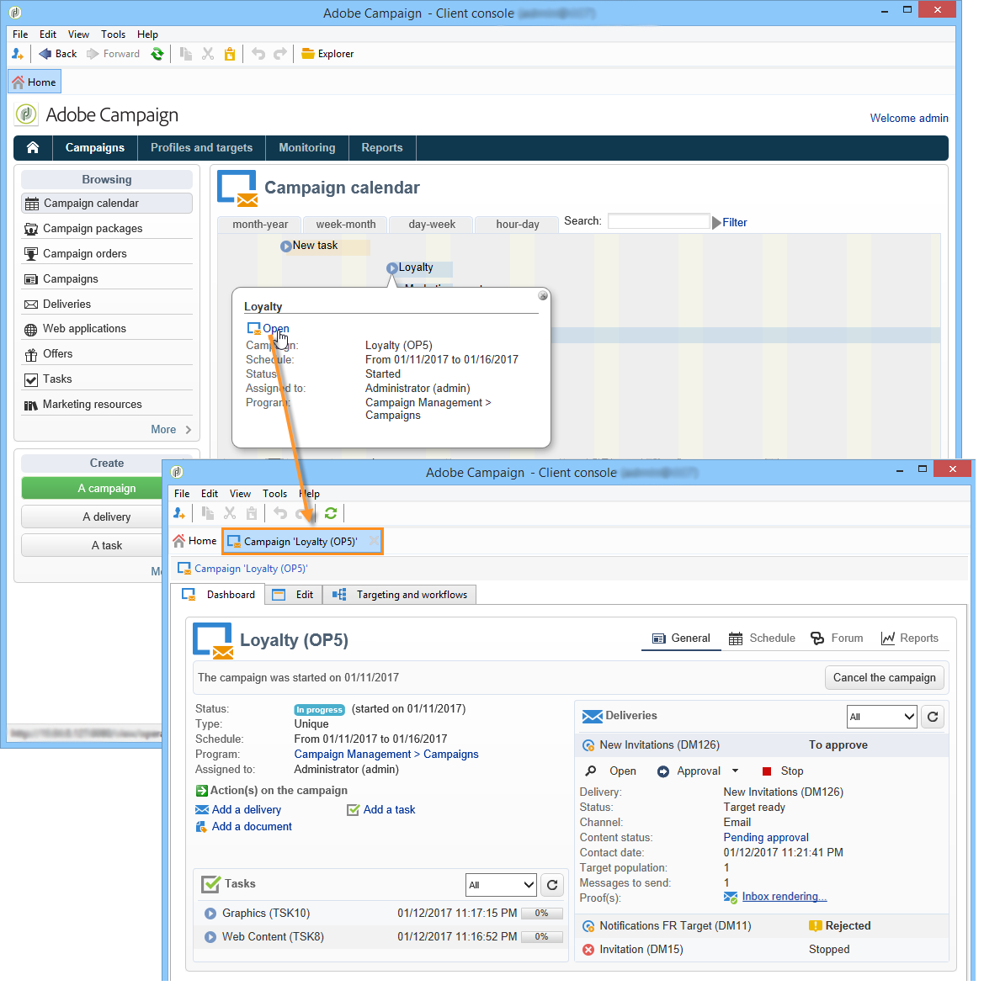

# 마케팅 캠페인 액세스{#accessing-marketing-campaigns}

Adobe Campaign을 사용하면 마케팅 캠페인을 생성, 구성, 실행 및 분석할 수 있습니다. 모든 마케팅 캠페인은 통합 제어 센터에서 관리할 수 있습니다.

## 작업 영역 기본 사항 {#workspace-basics}

### 홈 페이지 {#home-page}

Adobe Campaign에 연결하면 홈 페이지가 표시됩니다.

탐색 막대에서 링크를 클릭하여 다양한 우주에 액세스합니다.

캠페인 요소는 **[!UICONTROL Campaigns]** 우주에서 찾을 수 있습니다.여기서는 마케팅 프로그램 및 캠페인과 하위 세트에 대한 개요를 볼 수 있습니다. 마케팅 프로그램은 게재, 작업, 연결된 리소스 등으로 구성된 캠페인으로 구성됩니다. Campaign을 사용한 마케팅 캠페인 관리 컨텍스트에서는 게재, 예산, 검토자 및 연결된 문서에 대한 정보가 캠페인에 있습니다.

우주의 탐색 블록은 인스턴스에 설치된 모듈에 따라 다양한 항목을 제공합니다. **[!UICONTROL Campaigns]** 예를 들어 다음 항목에 액세스할 수 있습니다.

* **캠페인 달력**:일정(플랜, 마케팅 프로그램, 전달 및 캠페인)을 참조하십시오. 캠페인 [달력을](#campaign-calendar)참조하십시오.
* **캠페인**:모든 마케팅 프로그램에 포함된 캠페인에 액세스할 수 있습니다.
* **배달**:캠페인에 연결된 게재에 대한 액세스.
* **웹 애플리케이션**:웹 애플리케이션(양식, 설문 조사 등)에 대한 액세스.

>[!NOTE]
>
>전체 Adobe Campaign 인체 공학, 권한 및 프로필 관리 기능에 대한 자세한 내용은 [이 섹션을](../../platform/using/adobe-campaign-workspace.md)참조하십시오.
>
>채널 및 게재와 관련된 모든 기능은 [이 섹션에](../../delivery/using/communication-channels.md)자세히 설명되어 있습니다.

### 캠페인 달력 {#campaign-calendar}

각 캠페인은 계획에 속하는 프로그램에 속합니다. 플랜, 프로그램 및 캠페인은 캠페인 **[!UICONTROL Campaign calendar]** 영역의 메뉴를 통해 **액세스합니다** .

플랜, 프로그램, 캠페인 또는 배달을 편집하려면 달력에서 해당 이름을 클릭한 다음 을 클릭합니다 **[!UICONTROL Open...]**. 그런 다음 아래와 같이 새 탭에 표시됩니다.

캠페인 달력에 표시되는 정보를 필터링할 수 있습니다. 이렇게 하려면 링크를 클릭하고 필터링 기준을 선택합니다 **[!UICONTROL Filter]** .

>[!NOTE]
>
>날짜를 필터링하면 시작 날짜가 지정된 날짜보다 늦거나 종료 날짜가 지정된 날짜보다 빠른 모든 캠페인이 표시됩니다. 각 필드 오른쪽의 달력을 사용하여 날짜를 선택해야 합니다.

필드를 사용하여 표시된 항목을 필터링할 수도 **[!UICONTROL Search]** 있습니다.

각 항목에 연결된 아이콘을 사용하여 상태를 볼 수 있습니다.완료, 진행 중, 편집 중 등

### 마케팅 프로그램에서 찾아보기 {#browsing-in-a-marketing-program}

Campaign을 사용하면 다양한 마케팅 캠페인으로 구성된 프로그램 세트를 관리할 수 있습니다. 각 캠페인에는 게재와 관련 프로세스 및 리소스가 포함되어 있습니다.

#### 프로그램 탐색 {#browsing-a-program}

프로그램을 편집할 때 아래 설명된 탭을 사용하여 프로그램을 찾아 구성합니다.

* [ **예약** ] 탭에는 달력 헤더에서 클릭한 탭에 따라 월, 주 또는 일에 대한 프로그램 달력이 표시됩니다.

   필요한 경우 이 페이지를 통해 캠페인, 프로그램 또는 작업을 만들 수 있습니다.

   

* 편집 **탭을 사용하여** 프로그램을 개인화할 수 있습니다.이름, 시작 및 종료 날짜, 예산, 연결된 문서 등

   

#### 캠페인 검색 {#browsing-campaigns}

캠페인 달력, 프로그램 **[!UICONTROL Schedule]** 탭 또는 캠페인 목록을 통해 캠페인에 액세스할 수 있습니다.

1. 캠페인 달력을 통해 표시할 캠페인을 선택한 다음 **[!UICONTROL Open]** 링크를 클릭합니다.

   

   캠페인은 아래와 같이 새 탭에서 편집됩니다.

   

1. 프로그램의 **[!UICONTROL Schedule]** 탭을 통해 편집 모드는 캠페인 달력을 통한 것과 동일합니다.
1. 우주의 **[!UICONTROL Campaigns]** 링크를 통해 **[!UICONTROL Campaigns]** 편집할 캠페인의 이름을 클릭합니다.

   

### 캠페인 제어 {#controlling-a-campaign}

#### 대시보드 {#dashboard}

각 캠페인에 대해 작업, 리소스 및 게시는 하나의 화면, 즉 대시보드에서 중앙 집중화되므로 다른 사용자와 공동으로 마케팅 작업을 관리할 수 있습니다.

캠페인의 대시보드는 제어 인터페이스로 사용됩니다. 기본 캠페인 만들기 및 관리 단계에 직접 액세스합니다.배달, 추출 파일, 알림, 예산 등

Adobe Campaign을 사용하면 마케팅 및 커뮤니케이션 캠페인의 다양한 단계의 제작 및 승인을 위한 협업 프로세스를 설정할 수 있습니다.예산, 목표, 컨텐츠 등의 승인

>[!NOTE]
>
>캠페인 템플릿의 구성은 캠페인 템플릿에 [표시됩니다](../../campaign/using/marketing-campaign-templates.md#campaign-templates).

#### 예약 {#schedule}

캠페인은 일련의 게재를 중앙 집중화합니다. 각 캠페인에 대해 일정은 모든 구성 요소에 대한 전체 보기를 제공합니다.이렇게 하면 작업 및 배달을 표시하고 쉽게 액세스할 수 있습니다.

#### 포럼 {#forum}

각 캠페인에 대해 운영자는 전용 포럼을 통해 메시지를 교환할 수 있습니다.

자세한 내용은 토론 포럼을 [참조하십시오](../../campaign/using/discussion-forums.md).

#### 보고서 {#reports}

이 **[!UICONTROL Reports]** 링크를 사용하면 캠페인 보고서에 액세스할 수 있습니다.

>[!NOTE]
>
>보고서는 [이 섹션에](../../reporting/using/about-adobe-campaign-reporting-tools.md)자세히 설명되어 있습니다.

#### 구성 {#configuration}

캠페인은 캠페인 템플릿을 통해 만들어집니다. 일부 옵션을 선택하고 다른 설정을 이미 저장한 재사용 가능한 템플릿을 구성할 수 있습니다. 각 캠페인에 대해 다음 기능이 제공됩니다.

* 문서 및 리소스 참조:문서를 캠페인(요약, 보고서, 이미지 등)에 연결할 수 있습니다. 모든 문서 형식이 지원됩니다. 관련 [문서](../../campaign/using/marketing-campaign-deliveries.md#managing-associated-documents)관리를 참조하십시오.
* 비용 정의:각 캠페인에 대해 Adobe Campaign을 사용하면 마케팅 캠페인을 만들 때 사용할 수 있는 비용 항목 및 비용 계산 구조를 정의할 수 있습니다. 예:인쇄 비용, 외부 기관의 사용, 객실 임대 등 비용 [범주](../../campaign/using/providers--stocks-and-budgets.md#defining-cost-categories)정의를 참조하십시오.
* 목표 정의:캠페인의 수량화 가능한 목표(예: 가입자 수, 사업 볼륨 등)를 정의할 수 있습니다. 이 정보는 나중에 캠페인 보고서에 사용됩니다.
* 시드 주소 관리(자세한 내용은 [이 섹션](../../delivery/using/about-seed-addresses.md)참조) 및 제어 그룹(제어 그룹 [정의 참조](../../campaign/using/marketing-campaign-deliveries.md#defining-a-control-group))
* 승인 관리:승인할 처리를 선택하고 필요한 경우 검토 연산자 또는 연산자 그룹을 선택합니다. 게재 [확인 및 승인을](../../campaign/using/marketing-campaign-approval.md#checking-and-approving-deliveries)참조하십시오.

>[!NOTE]
>
>캠페인 구성에 액세스하고 이를 변경하려면 **[!UICONTROL Advanced campaign parameters...]** 탭에서 **[!UICONTROL Edit]** 링크를 클릭합니다. 배달이 값을 자동으로 상속하도록 캠페인 수준에서 매개 변수를 설정하는 방법에 대한 자세한 내용은 기술 문서를 [참조하십시오](https://helpx.adobe.com/campaign/kb/simplifying-campaign-management-acc.html#Setparametersatthecampaignlevelsodeliveriesinheritvaluesautomatically).

## 웹 인터페이스 사용 {#using-the-web-interface-}

인터넷 브라우저를 통해 Adobe Campaign 콘솔 화면에 액세스하여 모든 캠페인 및 게재, 데이터베이스의 프로필에 대한 보고서 및 정보를 볼 수 있습니다. 이 액세스는 레코드 생성을 활성화하지 않습니다. 연산자 권한에 따라 데이터베이스의 데이터를 보거나 사용할 수 있습니다. 예를 들어 캠페인 컨텐츠 및 타깃팅을 승인하고, 게재를 다시 시작하거나 중지할 수 있습니다.

1. 평소대로 https://을 통해 로그온합니다`<your instance>:<port>/view/home`.
1. 메뉴를 사용하여 개요를 봅니다.

   

승인(예: 대상 또는 전달 컨텐츠)은 웹 액세스를 통해 수행할 수 있습니다.

알림 메시지에 포함된 링크를 사용할 수도 있습니다. 자세한 내용은 배달 [확인 및 승인을 참조하십시오](../../campaign/using/marketing-campaign-approval.md#checking-and-approving-deliveries).
