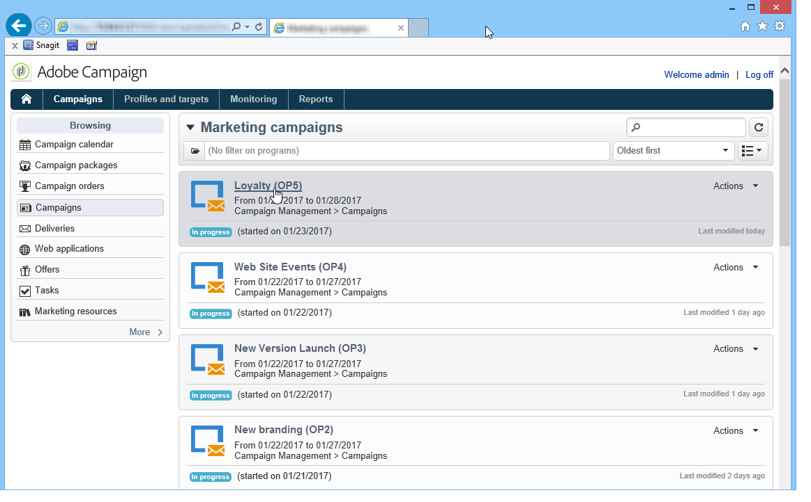

# 마케팅 캠페인 액세스{#accessing-marketing-campaigns}

Adobe Campaign을 사용하면 마케팅 캠페인을 생성, 구성, 실행 및 분석할 수 있습니다. 모든 마케팅 캠페인은 통합 제어 센터에서 관리할 수 있습니다.

## Workspace 기본 사항 {#workspace-basics}

### 홈페이지 {#home-page}

Adobe Campaign에 연결하면 홈 페이지가 표시됩니다.

탐색 막대의 링크를 클릭하여 다양한 기능에 액세스합니다.

캠페인 요소는에서 찾을 수 있습니다. **[!UICONTROL Campaigns]** 탭: 여기에서 마케팅 프로그램 및 캠페인과 해당 하위 세트에 대한 개요를 볼 수 있습니다. 마케팅 프로그램은 게재, 작업, 연결된 리소스 등으로 구성되는 캠페인으로 구성됩니다. Campaign을 사용한 마케팅 캠페인 관리의 맥락에서 게재, 예산, 검토자 및 연결된 문서에 관한 정보는 캠페인에서 찾을 수 있습니다.

다음 **[!UICONTROL Browsing]** 의 블록 **[!UICONTROL Campaigns]** 탭은 인스턴스에 설치된 모듈에 따라 다양한 항목을 제공합니다. 예를 들어 다음 항목에 액세스할 수 있습니다.

* **캠페인 캘린더**: 계획, 마케팅 프로그램, 게재 및 캠페인의 캘린더. 을(를) 참조하십시오 [캠페인 캘린더](#campaign-calendar).
* **캠페인**: 모든 마케팅 프로그램에 포함된 캠페인에 액세스합니다.
* **게재**: 캠페인에 연결된 게재에 액세스합니다.
* **웹 애플리케이션**: 웹 애플리케이션(양식, 랜딩 페이지 등)에 대한 액세스

>[!NOTE]
>
>전체 Adobe Campaign 인체공학, 권한 및 프로필 관리 기능에 대한 자세한 내용은 을 참조하십시오. [이 섹션](../../platform/using/adobe-campaign-workspace.md).
>
>채널 및 게재와 관련된 모든 기능이에 자세히 설명되어 있습니다. [이 섹션](../../delivery/using/steps-about-delivery-creation-steps.md).

### 캠페인 캘린더 {#campaign-calendar}

각 캠페인은 프로그램에 속하며, 프로그램에 속하면 계획에 속합니다. 계획, 프로그램 및 캠페인은 **[!UICONTROL Campaign calendar]** 의 메뉴 **캠페인** 탭.

계획, 프로그램, 캠페인 또는 게재를 편집하려면 달력에서 해당 이름을 클릭한 다음 을 클릭합니다. **[!UICONTROL Open...]**. 그런 다음 아래와 같이 새 탭에 표시됩니다.

캠페인 캘린더에 표시되는 정보를 필터링할 수 있습니다. 이렇게 하려면 **[!UICONTROL Filter]** 필터링 기준을 연결하고 선택합니다.

>[!NOTE]
>
>날짜를 필터링하면 시작 날짜가 지정된 날짜 이후이거나 종료 날짜가 지정된 날짜 이전인 모든 캠페인이 표시됩니다. 각 필드의 오른쪽에 있는 달력을 사용하여 날짜를 선택해야 합니다.

다음을 사용할 수도 있습니다 **[!UICONTROL Search]** 표시된 항목을 필터링할 필드입니다.

각 항목에 연결된 아이콘을 사용하면 완료, 진행 중, 편집 중 등의 해당 상태를 볼 수 있습니다.

### 마케팅 프로그램 탐색 {#browsing-in-a-marketing-program}

Campaign을 사용하면 다양한 마케팅 캠페인으로 구성된 프로그램 세트를 관리할 수 있습니다. 각 캠페인에는 게재 및 관련 프로세스와 리소스가 포함되어 있습니다.

#### 프로그램 탐색 {#browsing-a-program}

프로그램을 편집할 때 아래 설명된 탭을 사용하여 프로그램을 탐색하고 구성합니다.

* 다음 **예약** 탭에는 달력 헤더에서 클릭하는 탭에 따라 월, 주 또는 일의 프로그램 달력이 표시됩니다.

   필요한 경우 이 페이지를 통해 캠페인, 프로그램 또는 작업을 만들 수 있습니다.

   

* 다음 **편집** 탭에서는 이름, 시작 및 종료 일자, 예산, 링크된 문서 등 프로그램을 개인화할 수 있습니다.

   

#### 캠페인 찾아보기 {#browsing-campaigns}

캠페인은 캠페인 캘린더 **[!UICONTROL Schedule]** 프로그램의 탭 또는 캠페인 목록.

1. 캠페인 달력을 통해 표시할 캠페인을 선택한 다음 **[!UICONTROL Open]** 링크를 클릭합니다.

   

   캠페인은 아래와 같이 새 탭에서 편집됩니다.

   

1. 를 통해 **[!UICONTROL Schedule]** 프로그램의 탭이며, 편집 모드는 캠페인 달력을 통해서와 동일합니다.
1. 를 통해 **[!UICONTROL Campaigns]** 링크 **[!UICONTROL Campaigns]** 탭에서 편집할 캠페인의 이름을 클릭합니다.

   

### 캠페인 제어 {#controlling-a-campaign}

#### 대시보드 {#dashboard}

각 캠페인에 대해 작업, 리소스 및 게재는 대시보드라는 단일 화면에서 중앙 집중식으로 관리되므로 다른 사용자와 공동 작업을 통해 마케팅 작업을 관리할 수 있습니다.

캠페인의 대시보드는 제어 인터페이스로 사용됩니다. 게재, 추출 파일, 알림, 예산 등 주요 캠페인 생성 및 관리 단계에 직접 액세스합니다.

Adobe Campaign을 사용하면 예산, 타겟, 콘텐츠 등의 다양한 마케팅 및 커뮤니케이션 캠페인 단계를 만들고 승인하기 위한 협업 프로세스를 설정할 수 있습니다.

>[!NOTE]
>
>캠페인 템플릿 구성은에 나와 있습니다. [캠페인 템플릿](../../campaign/using/marketing-campaign-templates.md#campaign-templates).

#### 예약 {#schedule}

캠페인은 게재 세트를 중앙 집중화합니다. 각 캠페인에 대해 일정에서는 모든 구성 요소에 대한 전역 보기를 제공합니다. 이 보기를 통해 작업 및 게재를 표시하고 쉽게 액세스할 수 있습니다.

#### 포럼 {#forum}

각 캠페인에 대해 운영자는 전용 포럼을 통해 메시지를 교환할 수 있습니다.

자세한 내용은 다음을 참조하십시오. [토론 포럼](../../mrm/using/discussion-forums.md).

#### 보고서 {#reports}

다음 **[!UICONTROL Reports]** 링크를 통해 캠페인 보고서에 액세스할 수 있습니다.

>[!NOTE]
>
>보고서는 다음에 자세히 설명되어 있습니다. [이 섹션](../../reporting/using/about-adobe-campaign-reporting-tools.md).

#### 구성 {#configuration}

캠페인은 캠페인 템플릿을 통해 만들어집니다. 일부 옵션을 선택하고 다른 설정을 이미 저장한 재사용 가능한 템플릿을 구성할 수 있습니다. 각 캠페인에 대해 다음 기능이 제공됩니다.

* 문서 및 리소스 참조: 문서(개요, 보고서, 이미지 등)를 캠페인과 연결할 수 있습니다. 모든 문서 형식이 지원됩니다. 다음을 참조하십시오 [관련 문서 관리](../../campaign/using/marketing-campaign-deliveries.md#managing-associated-documents).
* 비용 정의: Adobe Campaign을 사용하면 각 캠페인에 대해 마케팅 캠페인을 생성할 때 사용할 수 있는 비용 입력 및 비용 계산 구조를 정의할 수 있습니다. 예를 들어 인쇄 비용, 외부 에이전시 사용, 객실 대여 등이 있습니다. 다음을 참조하십시오 [비용 범주 정의](../../campaign/using/providers--stocks-and-budgets.md#defining-cost-categories).
* 목표 정의: 구독자 수, 거래량 등 캠페인에 대한 수량화할 수 있는 목표를 정의할 수 있습니다. 이 정보는 나중에 캠페인 보고서에 사용됩니다.
* 시드 주소 관리(자세한 내용은 [이 섹션](../../delivery/using/about-seed-addresses.md)) 및 컨트롤 그룹( 참조 [컨트롤 그룹 정의](../../campaign/using/marketing-campaign-deliveries.md#defining-a-control-group)).
* 승인 관리: 승인할 처리를 선택하고 필요한 경우 검토 운영자 또는 운영자 그룹을 선택할 수 있습니다. 다음을 참조하십시오 [게재 확인 및 승인](../../campaign/using/marketing-campaign-approval.md#checking-and-approving-deliveries).

>[!NOTE]
>
>Campaign 구성에 액세스하여 변경하려면 다음을 클릭하십시오. **[!UICONTROL Advanced campaign parameters...]** 링크 **[!UICONTROL Edit]** 탭.

## 웹 인터페이스 사용 {#using-the-web-interface-}

인터넷 브라우저를 통해 Adobe Campaign 콘솔 화면에 액세스하여 모든 캠페인과 게재 및 데이터베이스의 프로필에 대한 보고서와 정보를 볼 수 있습니다. 이 액세스는 레코드 생성을 활성화하지 않습니다. 운영자 권한에 따라 데이터베이스의 데이터를 보거나 작업할 수 있습니다. 예를 들어 캠페인 콘텐츠 및 타겟팅을 승인하고, 게재를 다시 시작하거나 중지할 수 있습니다.

1. https://을 통해 평소대로 로그온하십시오.`<your instance>:<port>/view/home`.
1. 메뉴를 사용하여 개요에 액세스합니다.

   

캠페인 간 탐색 및 보기 외에도 다음 유형의 작업을 수행할 수 있습니다.

* 인스턴스에서 활동 모니터링
* 게재 콘텐츠 승인 또는 거부와 같은 유효성 검사 프로세스에 참여
* 다른 빠른 작업 수행(예: 워크플로우 일시 중지)
* 모든 보고 기능에 액세스
* 포럼 토론에 참여

이 표에는 브라우저의 캠페인에 대해 수행할 수 있는 작업이 요약되어 있습니다.

| 페이지  | 작업 |
| --- | --- |
| 캠페인, 게재, 오퍼 등 목록 | 목록 항목 삭제 |
| 캠페인 | 캠페인 취소 |
| 게재 | 게재 콘텐츠 및 타겟 승인 게재 콘텐츠 제출 게재 확인 게재 일시 중지 및 중지 |
| 웹 애플리케이션 | 웹 애플리케이션 만들기 애플리케이션 컨텐츠 및 속성 편집 애플리케이션 콘텐츠를 템플릿으로 저장 애플리케이션 게시 |
| 오퍼 | 오퍼 콘텐츠 및 자격 승인 온라인 오퍼 비활성화 |
| 작업 | 작업 완료 작업 취소 |
| 마케팅 리소스 | 리소스 승인 리소스 잠금 및 잠금 해제 |
| 캠페인 패키지 | 승인용 패키지 제출 패키지 승인 또는 거부 패키지 취소 |
| 캠페인 주문 | 주문 만들기 주문 수락 또는 거부 <!-- Je n'ai pas pu créer de campaign order pour vérifier cela. Peut-on accéder à ces fonctionnalités depuis l'accès web ? --> |
| 재고 | 스톡 라인 삭제 |
| 오퍼 시뮬레이션 | 시뮬레이션 시작 및 중지 |
| 타겟팅 워크플로우 | 워크플로우 시작, 일시 중지 및 중지 |
| 보고서 | 보고서 내역에 현재 데이터 저장 |
| 포럼 | 토론 추가 토론의 메시지에 회신 토론을 팔로우하고 구독을 취소합니다 |

### 승인

(예: 타겟 또는 게재 콘텐츠의) 승인은 웹 액세스를 통해 수행할 수 있습니다.

알림 메시지에 포함된 링크를 사용할 수도 있습니다. 자세한 내용은 다음을 참조하십시오. [게재 확인 및 승인](../../campaign/using/marketing-campaign-approval.md#checking-and-approving-deliveries).
