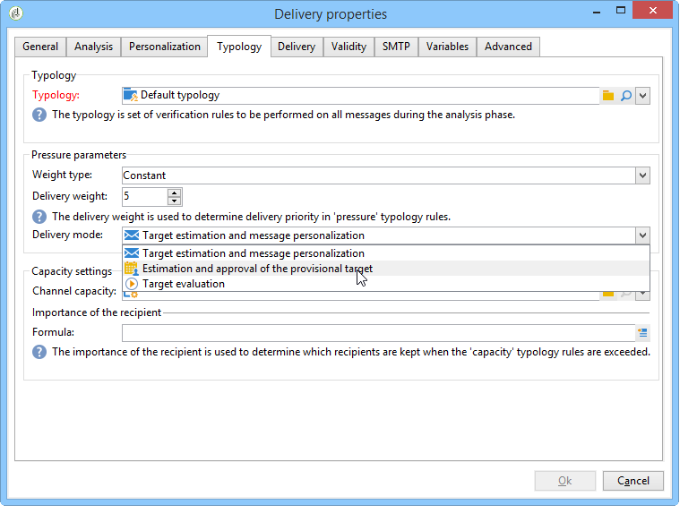
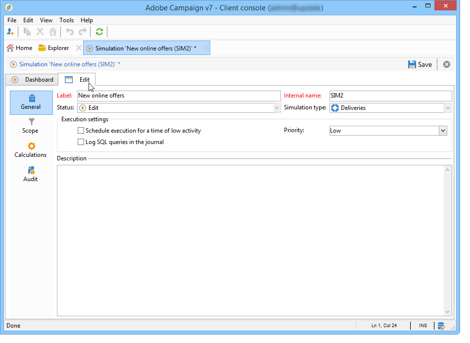
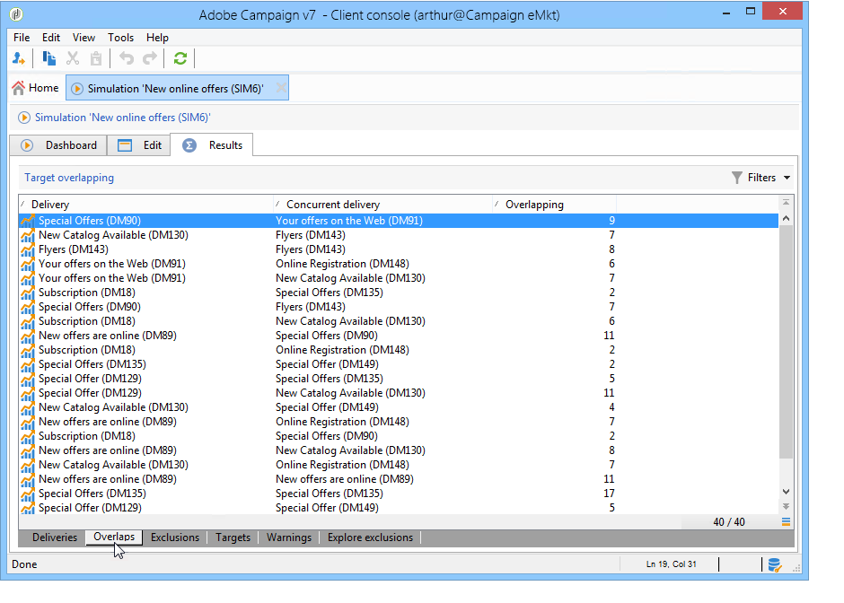

# 캠페인 시뮬레이션{#campaign-simulations}

## 시뮬레이션 정보 {#about-simulations}

캠페인 최적화를 사용하면 시뮬레이션을 사용하여 캠페인 계획의 효율성을 테스트할 수 있습니다. 이렇게 하면 캠페인의 잠재적 성공을 측정할 수 있습니다.생성된 매출, 적용된 유형 규칙을 기반으로 하는 타겟 볼륨 등

시뮬레이션을 사용하면 게재의 효과를 모니터링하고 비교할 수 있습니다.

>[!NOTE]
>
>테스트 모드에서 준비된 배달은 서로 영향을 주지 않습니다. 예를 들어, 분산 마케팅에서 캠페인을 평가할 때 또는 게재가 임시 달력에 예약되지 않은 경우 가능합니다.\
>즉, 압력 및 용량 규칙은 **[!UICONTROL Target estimation and message personalization]** 모드에서 전달에만 적용됩니다. 및 **[!UICONTROL Estimation and approval of the provisional target]** 모드 **[!UICONTROL Target evaluation]** 내 배달은 고려되지 않습니다.\
>배달 모드는 배달 속성의 **[!UICONTROL Typology]** 하위 탭에서 선택합니다.

## 시뮬레이션 설정 {#setting-up-a-simulation}

### 시뮬레이션 만들기 {#creating-a-simulation}

시뮬레이션을 만들려면 다음 단계를 적용합니다.

1. 우주로 **[!UICONTROL Campaigns]** 이동하고 섹션 내의 **[!UICONTROL More]** 링크를 클릭하고 **[!UICONTROL Create]** **[!UICONTROL Simulation]** 옵션을 선택합니다.

   

1. 템플릿과 시뮬레이션의 이름을 입력합니다. 아이콘을 **[!UICONTROL Save]** 클릭하여 시뮬레이션을 만듭니다.

   

1. 탭을 클릭하여 **[!UICONTROL Edit]** 구성합니다.

   

1. 이 **[!UICONTROL Scope]** 탭에서 이 시뮬레이션에 고려할 배달을 지정합니다. 이렇게 하려면 **[!UICONTROL Add]** 단추를 클릭하고 배달 선택 모드를 지정하여 고려합니다.

   

   각 배달을 하나씩 선택하거나 캠페인, 프로그램 또는 플랜별로 정렬할 수 있습니다.

   >[!NOTE]
   >
   >계획, 프로그램 또는 캠페인을 통해 배달을 선택하는 경우 Adobe Campaign은 시뮬레이션이 시작될 때마다 고려할 배달 목록을 자동으로 새로 고칠 수 있습니다. 이렇게 하려면 **[!UICONTROL Refresh the selection of deliveries each time the simulation is started]** 옵션을 선택합니다.
   >  
   >이렇게 하지 않으면 시뮬레이션을 만들 때 계획, 프로그램 또는 캠페인에서 사용할 수 없는 게재는 고려되지 않습니다.나중에 추가된 배달은 무시됩니다.

   

1. 시뮬레이션 범위에 포함할 요소를 선택합니다. 필요한 경우 Shift 및 Ctrl 키를 사용하여 여러 요소를 선택합니다.

   

   을 **[!UICONTROL Finish]** 클릭하여 선택 항목을 승인합니다.

   선택한 게재와 계획, 프로그램 또는 캠페인에 속한 전달을 수동으로 결합할 수 있습니다.

   

   필요한 경우 **[!UICONTROL Edit the dynamic condition...]** 링크를 통해 동적 조건을 사용할 수 있습니다

   이 구성을 **[!UICONTROL Save]** 승인하려면 클릭하십시오.

   >[!CAUTION]
   >
   >타겟이 계산된 게재만 시뮬레이션을 계산할 때 고려됩니다(상태:Target **ready** 또는 **Ready to deliver**).

1. 이 **[!UICONTROL Calculations]** 탭에서 수신자 스키마와 같은 분석 차원을 선택합니다.

   

1. 그런 다음 표현식을 추가할 수 있습니다.

   

### 실행 설정 {#execution-settings}

시뮬레이션의 **[!UICONTROL General]** 탭에서 실행 설정을 입력할 수 있습니다.

* 이 **[!UICONTROL Schedule execution for down-time]** 옵션은 선택한 우선 순위 수준을 기준으로 통화 빈도가 낮은 기간으로 시뮬레이션 시작을 정의합니다. 시뮬레이션은 중요한 데이터베이스 리소스를 사용하므로 긴급한 시뮬레이션은 밤 에 실행되도록 예약해야 합니다.
* 시뮬레이션에 **[!UICONTROL Priority]** 적용된 수준이 트리거를 지연합니다.
* **[!UICONTROL Save SQL queries in the log]**. SQL 로그를 사용하면 시뮬레이션이 오류로 끝나는 경우 진단할 수 있습니다. 또한 시뮬레이션이 너무 느린 이유를 알 수 있습니다. 이러한 메시지는 **[!UICONTROL SQL logs]** 탭의 **[!UICONTROL Audit]** 하위 탭에서 시뮬레이션을 수행한 후에 표시됩니다.

## 시뮬레이션 실행 {#executing-a-simulation}

### 시뮬레이션 시작 {#starting-a-simulation}

시뮬레이션 범위가 정의되면 실행할 수 있습니다.

이렇게 하려면 시뮬레이션 대시보드를 열고 을 클릭합니다 **[!UICONTROL Start simulation]**.

실행이 완료되면 시뮬레이션을 열고 **[!UICONTROL Results]** 탭을 클릭하여 각 게재에 대해 계산된 대상을 봅니다.

1. 하위 **[!UICONTROL Deliveries]** 탭에는 시뮬레이션에서 고려한 모든 배달이 나열됩니다. 여기에는 두 가지 사항이 표시됩니다.

   * 배달에서 **[!UICONTROL Initial count]** 예상 중에 계산된 대상
   * 시뮬레이션을 **[!UICONTROL Final count]** 완료한 받는 사람 수입니다.

      초기 카운트와 최종 카운트의 차이는 시뮬레이션 전에 구성된 다양한 규칙 또는 필터의 적용을 반영합니다.

      이 계산에 대한 자세한 내용을 보려면 **[!UICONTROL Exclusions]** 하위 탭을 편집합니다.

1. 하위 **[!UICONTROL Exclusions]** 탭에서는 제외 분류를 볼 수 있습니다.

   

1. 하위 **[!UICONTROL Alerts]** 탭은 시뮬레이션 중에 생성된 모든 경고 메시지를 그룹화합니다. 용량 과부하(타깃팅된 받는 사람 수가 설정된 용량을 초과하는 경우)의 경우 경고 메시지를 보낼 수 있습니다.
1. 하위 **[!UICONTROL Exploration of the exclusions]** 탭을 사용하여 결과 분석 테이블을 만들 수 있습니다. 사용자는 abscissa/ordinate 축에 변수를 표시해야 합니다.

   분석 테이블 생성 예는 탐색 결과의 [끝을](#exploring-results)참조하십시오.

### 결과 보기 {#viewing-results}

#### 감사 {#audit}

이 **[!UICONTROL Audit]** 탭에서는 시뮬레이션 실행을 모니터링할 수 있습니다. 이 **[!UICONTROL SQL Logs]** 하위 탭은 전문 사용자에게 유용합니다. SQL 형식으로 실행 로그를 나열합니다. 이러한 로그는 시뮬레이션 실행 전 탭에서 **[!UICONTROL Save SQL queries in the log]** 옵션을 선택한 경우에만 표시됩니다 **[!UICONTROL General]** .

#### 결과 탐색 {#exploring-results}

하위 **[!UICONTROL Exploration of the exclusions]** 탭에서는 시뮬레이션에서 생성된 데이터를 분석할 수 있습니다.

설명 분석은 [이 섹션에](../../reporting/using/about-adobe-campaign-reporting-tools.md)자세히 설명되어 있습니다.

## 시뮬레이션 결과 {#results-of-a-simulation}

시뮬레이션 결과에 대한 첫 번째 개요를 **[!UICONTROL Log]** 및 **[!UICONTROL Results]** 탭의 표시기에 제공합니다. 보다 자세한 결과 보기를 보려면 **[!UICONTROL Reports]** 탭을 엽니다.

### 보고서 {#reports}

시뮬레이션 결과를 분석하려면 보고서를 편집합니다.그들에게는 배열과 명의가 있다.

기본적으로 다음 보고서가 제공됩니다.

* **[!UICONTROL Detail of simulation exclusions]** :이 보고서에서는 모든 관련 배달에 대한 제외 원인 상세 차트를 제공합니다.
* **[!UICONTROL Simulation summary]** :이 보고서는 다양한 게재 전체에서 시뮬레이션에서 제외된 모집단을 보여줍니다.
* **[!UICONTROL Summary of exclusions linked to the simulation]** :이 보고서는 적용된 유형 규칙 및 규칙당 제외 비율을 보여주는 차트와 함께 시뮬레이션으로 인한 예외 차트를 보여줍니다.

>[!NOTE]
>
>새 보고서를 만들어 제공된 보고서에 추가할 수 있습니다. For more on this, refer to [this section](../../reporting/using/about-adobe-campaign-reporting-tools.md).

보고서에 액세스하려면 대시보드를 통해 타깃팅된 시뮬레이션의 **[!UICONTROL Reports]** 링크를 클릭합니다.

시뮬레이션 대시보드에서 액세스할 수 있는 **[!UICONTROL Reports]** 링크를 사용하여 보고서를 편집할 수도 있습니다.

### 시뮬레이션 비교 {#comparing-simulations-}

시뮬레이션이 실행될 때마다 이전 결과가 바뀝니다.한 실행의 결과를 표시하고 다른 실행과 비교할 수 없습니다.

결과를 비교하려면 보고서를 사용해야 합니다. 실제로 Adobe Campaign을 사용하면 보고서 내역을 저장하여 나중에 다시 볼 수 있습니다. 이 작업 내역은 시뮬레이션의 라이프사이클 동안 저장됩니다.

**예:**

1. A의 유형이 적용되는 전달에 **대한** 시뮬레이션을 만듭니다.
1. 탭에서 사용 가능한 보고서(예: **[!UICONTROL Reports]** **[!UICONTROL Detail of simulation exclusions]** 예:
1. 보고서의 오른쪽 상단에서 아이콘을 클릭하여 새 내역을 만듭니다.

   

1. 시뮬레이션을 닫고 유형 A의 구성을 **변경합니다**.
1. 시뮬레이션을 다시 실행하고 내역이 생성된 보고서에 표시된 시뮬레이션과 결과를 비교합니다.

   

   필요한 만큼 보고서 내역을 저장할 수 있습니다.

### 보고 축 {#reporting-axes}

이 **[!UICONTROL Calculations]** 탭에서는 타겟에서 보고 축을 정의할 수 있습니다. 결과 분석 중에 보조 축이 사용됩니다(결과 [탐색](#exploring-results)참조).

>[!NOTE]
>
>각 시뮬레이션에 대해 개별적으로 정의하지 않고 시뮬레이션 템플릿에서 계산 축을 정의하는 것이 좋습니다.\
>시뮬레이션 템플릿은 Adobe Campaign 트리의 **[!UICONTROL Resources > Templates > Simulation templates]** 노드에 저장됩니다.

**예:**

아래 예에서는 수신자의 상태(&quot;고객&quot;, &quot;잠재 고객&quot; 또는 없음)를 기반으로 추가 보고 축을 생성하려고 합니다.

1. 보고 축을 정의하려면 **[!UICONTROL Analysis dimension]** 필드에서 처리할 정보가 포함된 테이블을 선택합니다. 이 정보는 필수입니다.
1. 여기에서 수신자 테이블의 세그먼트 필드를 선택합니다.

   

1. 다음 옵션을 사용할 수 있습니다.

   * **[!UICONTROL Generate target overlap statistics]** 시뮬레이션 보고서에서 모든 중복 통계를 복구할 수 있습니다. 중복은 한 시뮬레이션 내에서 두 개 이상의 게재에서 대상화된 수신자입니다.

      >[!CAUTION]
      >
      >이 옵션을 선택하면 시뮬레이션 실행 시간이 크게 늘어납니다.

   * **[!UICONTROL Keep the simulation work table]** 시뮬레이션 추적을 유지할 수 있습니다.

      >[!CAUTION]
      >
      >이러한 테이블을 자동으로 저장하려면 상당한 스토리지 용량이 필요합니다.데이터베이스가 충분히 큰지 확인하십시오.

시뮬레이션 결과가 표시되면 선택한 표현식에 대한 정보가 **[!UICONTROL Overlaps]** 하위 탭에 표시됩니다.

배달 타겟이 겹쳐서 둘 이상의 시뮬레이션 게재에서 대상 받는 사람을 나타냅니다.

>[!NOTE]
>
>이 하위 탭은 **[!UICONTROL Generate target recovery statistics]** 옵션이 활성화된 경우에만 표시됩니다.

보고 축에 대한 정보는 **[!UICONTROL Exploring exclusions]** 하위 탭에서 생성된 제외 분석 보고서에서 처리할 수 있습니다. 자세한 내용은 결과 [탐색을 참조하십시오](#exploring-results).
