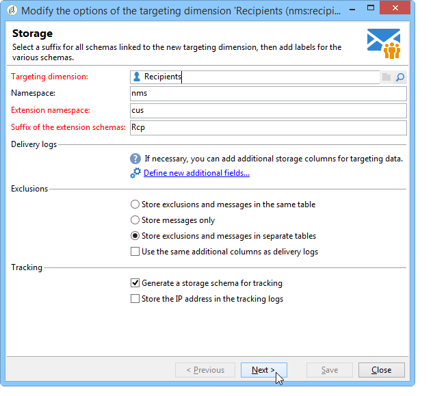

# 구성{#configuration}

이 섹션은 응답 관리 구성을 담당하는 사람을 대상으로 합니다. 이 프로세스에서는 스키마 확장, 워크플로우 정의 및 SQL 프로그래밍에 대한 특정 양의 지식을 가정합니다.

이렇게 하면 개인 테이블을 사용하여 Adobe Campaign 외부에 있는 거래 테이블의 특정 특성에 표준 데이터 모델을 적용하는 방법을 이해할 수 있습니다. 이 개인 테이블은 Adobe Campaign에서 사용 가능한 개인 테이블을 일치시키거나 다른 표를 사용할 수 있습니다

측정 가설이 작업 프로세스 워크플로우( **[!UICONTROL operationMgt]** )에 의해 실행됩니다. 각 가설이 실행 상태(편집 중, 대기 중, 완료, 실패 등)로 비동기식으로 실행되는 별도의 프로세스를 나타냅니다. 우선 순위 제한, 동시 프로세스 수 제한, 낮은 활동 페이지 및 빈도로 자동 실행을 관리하는 스케줄러에 의해 제어됩니다.

## 스키마 구성 {#configuring-schemas}

>[!CAUTION]
>
>응용 프로그램의 표준 스키마를 수정하지 말고 스키마 확장 메커니즘을 사용하십시오. 그렇지 않으면, 수정된 스키마가 향후 애플리케이션 업그레이드 시 업데이트되지 않습니다. 이로 인해 Adobe Campaign을 사용하는 동안 오류가 발생할 수 있습니다.

애플리케이션 통합은 응답 모듈을 사용하기 전에 필수 사항으로, 측정할 다양한 테이블(트랜잭션, 트랜잭션 세부 사항)과 배달, 오퍼 및 개인과의 관계를 정의합니다.

### 표준 스키마 {#standard-schemas}

기본 스키마에는 개별, 가설 및 트랜잭션 테이블 간의 관계, 즉 반응 로그 테이블이 포함되어 **[!UICONTROL nms:remaMatch]** 있습니다. 이 스키마는 응답 로그의 최종 대상 테이블에 대한 상속 스키마로 사용됩니다.

이 **[!UICONTROL nms:remaMatchRcp]** 스키마는 표준으로 제공되므로 Adobe Campaign 수신자의 반응 로그 저장( **[!UICONTROL nms:recipient]** ). 사용하려면 거래 테이블(구매 포함)에 매핑하도록 확장해야 합니다.

### 트랜잭션 테이블 및 트랜잭션 세부 정보 {#transaction-tables-and-transaction-details}

트랜잭션 테이블에는 개인 사용자를 위한 직접 링크가 포함되어야 합니다.

트랜잭션 세부 사항이 포함된 테이블을 추가할 수도 있습니다. 이것은 개인과 직접적으로 연결되어 있지 않습니다.

예를 들어 입고를 받는 경우 트랜잭션 테이블이 담당자(입고 테이블)에 연결되고 입고 라인 테이블이 입고 테이블(상세내역 테이블)에만 연결됩니다. 그런 다음 입고 라인 테이블이 입고 테이블에 연결된 레벨에서 가설을 직접 구성할 수 있습니다.

>[!NOTE]
>
>가설을 통해 예상되는 동작을 설명하는 영수증 식별자를 유지하려면 nms:remaMatchRcp 테이블 템플릿을 확장하여 식별자를 추가할 수 있습니다. 이 경우 ROI 계산은 이러한 필드에 연결되어 있지 않습니다.

이벤트 날짜를 추가하는 것이 좋습니다.

다음 스키마는 구성이 완료되면 다른 테이블 간의 조인을 보여줍니다.


### Adobe Campaign 수신자와의 응답 관리 {#response-management-with-adobe-campaign-recipients}

이 예에서는 Adobe Campaign 수신자 테이블( **[!UICONTROL nms:recipient]** )을 사용하여 응답 관리 모듈에 구매 테이블을 통합합니다.

수신자의 응답 로그 테이블이 확장되어 구매 테이블 스키마에 대한 링크를 추가합니다. **[!UICONTROL nms:remaMatchRcp]** 다음 예에서는 구매 테이블을 **demo:purchase**&#x200B;라고 합니다.

1. Adobe Campaign 탐색기를 통해 **[!UICONTROL Administration]** > **[!UICONTROL Campaign management]** > **[!UICONTROL Target mappings]**&#x200B;을 선택합니다.
1. 수신자를 마우스 오른쪽 단추로 **클릭한** 다음 **[!UICONTROL Actions]** 을 선택합니다 **[!UICONTROL Modify the options of the targeting dimensions]**.

   

1. 다음 창에서 **[!UICONTROL Extension namespace]** 를 개인화한 다음 을 클릭합니다 **[!UICONTROL Next]**.

   

1. 범주에서 **[!UICONTROL Response management]** **[!UICONTROL Generate a storage schema for reactions]** 상자가 선택되어 있는지 확인합니다.

   그런 다음 을 클릭하여 관련 트랜잭션 테이블을 **[!UICONTROL Define additional fields...]** 선택하고 nms:remaMatchRcp 스키마 확장명에 원하는 필드를 추가합니다.

   

생성된 스키마는 다음과 같습니다.

```
<srcSchema _cs="Reactions (Recipients) (cus)" entitySchema="xtk:srcSchema" extendedSchema="nms:remaMatchRcp" 
img="nms:remaMatch.png" implements="xtk:persist" label="Reactions (Recipients)" mappingType="sql"
name="remaMatchRcp" namespace="cus">  
 <element label="Reactions (Recipients)" name="remaMatchRcp">    
  <key internal="true" name="match">      
   <keyfield xlink="hypothesis"/>      
   <keyfield xlink="broadLog"/>      
   <keyfield xlink="proposition"/>    
  </key>    
  <attribute label="Quantity" name="quantity" type="long"/>    
  <element name="purchase" target="demo:purchase" type="link"/>    
  <element name="hypothesis" revLabel="Reactions (Recipients)" revLink="remaMatchRcp"/>    
  <element applicableIf="HasPackage('nms:coreInteraction')" label="Proposition" name="proposition" target="nms:propositionRcp" type="link"/>   
  <element desc="Message (Delivery log)" label="Message" name="broadLog" target="nms:broadLogRcp" type="link"/>    
  <element label="Respondent" name="responder" target="nms:recipient" type="link"/>  
 </element>  
 <createdBy _cs="Administrator (admin)"/>  
 <modifiedBy _cs="Administrator (admin)"/>
</srcSchema>
```

### 개인화된 수신자 테이블을 통한 응답 관리 {#response-management-with-a-personalized-recipient-table}

이 예에서는 Adobe Campaign에서 사용할 수 있는 수신자 테이블 이외의 개인 테이블을 사용하여 응답 관리 모듈에 구매 테이블을 통합합니다.

* 스키마에서 파생된 새 응답 로그 스키마 **[!UICONTROL nms:remaMatch]** 만들기.

   개인 테이블은 Adobe Campaign 받는 사람 테이블과 다르므로 **[!UICONTROL nms:remaMatch]** 스키마를 기반으로 새 응답 로그 스키마를 만들어야 합니다. 그런 다음 배달 로그 및 구매 테이블에 대한 링크가 포함된 링크를 완료합니다.

   다음 예에서는 **demo:broadLogPers 스키마와** demo:purchase **** 트랜잭션 테이블을 사용합니다.

   ```
   <srcSchema desc="Linking of a recipient transaction to a hypothesis"    
   img="nms:remaMatch.png" label="Responses on persons" labelSingular="Responses on a person" name="remaMatchPers" namespace="nms">
     <element name="remaMatchPers" template="nms:remaMatch">
       <key internal="true" name="match">
         <keyfield xlink="hypothesis"/>
        <keyfield xlink="purchase"/>
       </key>
   
       <element name="hypothesis" revLabel="Response logs for persons" revLink="remaMatchPers"/>
       <element applicableIf="HasPackage('nms:interaction')" label="Proposition" name="proposition"
                target="demo:propositionPers" type="link"/>
       <element label="Delivery log" name="broadLog" target="demo:broadLogPers" type="link"/>
     </element>
   </srcSchema>
   ```

* 스키마에서 가설 양식 **[!UICONTROL nms:remaHypothesis]** 수정.

   기본적으로 응답 로그 목록은 수신자 로그에 표시됩니다. 따라서 이전 단계에서 생성된 새 응답 로그를 보려면 가설 양식을 수정해야 합니다.

   예:

   ```
    <container type="visibleGroup" visibleIf="[context/@remaMatchStorage]= 'demo:remaMatchPers'">
                 <input hideEditButtons="true" img="nms:remaMatch.png" nolabel="true" refresh="true"
                  toolbarCaption="Responses generated by the hypothesis" type="linklist"
                  xpath="remaMatchPers">
             <input xpath="[.]"/>
             <input xpath="@controlGroup"/>
           </input>
      </container> 
   ```

## 지표 관리 {#managing-indicators}

응답 관리자 모듈에는 사전 정의된 지표 목록이 포함되어 있습니다. 하지만 다른 개인화된 측정 지표를 추가할 수 있습니다.

이렇게 하려면 각 새 표시기에 대해 두 필드를 삽입하여 가설 테이블을 확장해야 합니다.

* 타겟 인구에 대한 첫 번째는
* 컨트롤 그룹의 두 번째 매개 변수입니다.

예:

```
<srcSchema entitySchema="xtk:srcSchema" extendedSchema="nms:remaHypothesis" label="Measurement hypothesis" 
md5="1D4DED54FF8EC2432AED6736EDE6F547" name="remaHypothesis" namespace="demo" xtkschema="xtk:srcSchema">  
    <element name="remaHypothesis">    
        <element name="indicators">      
            <!-- Quantity -->      
            <attribute label="Total contacted" name="contactReactedTotalQuantity" type="long"/>
            <attribute label="Total number of people in the control group" name="proofReactedTotalquantity" type="long"/> 
        </element> 
    </element>
</srcSchema>
```

