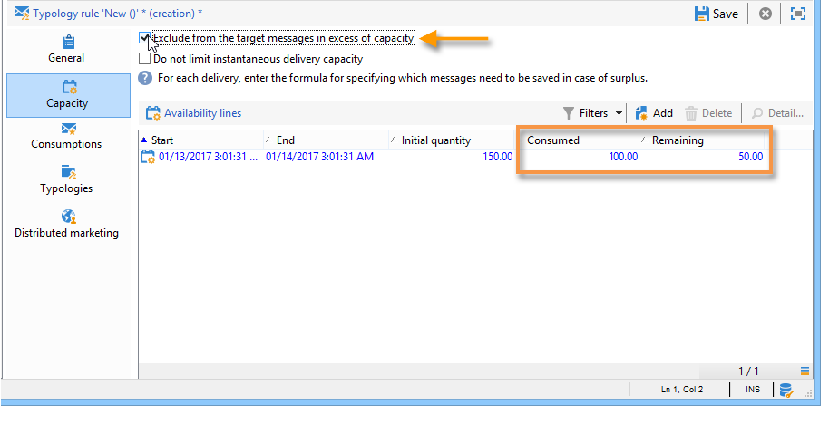

# 일관성 규칙{#consistency-rules}

## 일관성 규칙 정보 {#about-consistency-rules}

Adobe Campaign은 캠페인 유형 분석에 포함된 규칙 세트를 사용하여 일관된 커뮤니케이션을 보장합니다. 양, 자연, 연관성 등 수신자에게 보내는 전달 내용을 제어하는 것이 목표입니다.

**예를** 들어, 메시지 배달로 인해 관련 플랫폼을 오버로드하지 않아도 됩니다. 예를 들어, 다운로드 링크가 포함된 특별 오퍼는 서버 채도를 방지하기 위해 한 번에 너무 많은 사람에게 전송해서는 안 됩니다.전화 캠페인은 콜 센터 등의 처리 능력을 초과할 수 없습니다. 자세한 내용은 [용량 제어](#controlling-capacity)를 참조하십시오.

## 용량 제어 {#controlling-capacity}

메시지를 전달하기 전에 조직에서 배달(물리적 인프라), 배달이 생성할 수 있는 응답(인바운드 메시지) 및 가입자에게 할 통화 수(콜 센터 처리 용량) 등을 확인해야 합니다.

이렇게 하려면 **[!UICONTROL Capacity]** 분류 규칙을 만들어야 합니다.

다음 예에서는 전화 충성도 캠페인에 대한 유형 지정 규칙을 만듭니다. 메시지 수는 하루에 20개(예: 콜센터의 일일 처리 용량)로 제한합니다. 규칙이 두 개 배달에 적용되면 로그를 통해 소비를 모니터링할 수 있습니다.

새 용량 규칙을 디자인하려면 아래 단계를 따르십시오.

1. **[!UICONTROL Administration > Campaign management > Typology management > Typology rules]** 노드에서 **[!UICONTROL New]**&#x200B;을 클릭합니다.
1. **[!UICONTROL Capacity]** 규칙 유형을 선택합니다.

   

1. **[!UICONTROL Capacity]** 탭에서 가용성 라인을 만듭니다.이 예에서는 호출을 수행할 수 있는 기간입니다. 24시간 기간을 선택하고 초기 수량에 150을 입력합니다. 즉, 콜 센터는 하루에 150개의 호출을 처리할 수 있습니다.

   

   >[!NOTE]
   >
   >가용성 라인은 정보 목적으로만 사용됩니다. 용량 제한에 도달할 때 메시지를 제외해야 하는 경우 [이 섹션](#exclude-messages-when-capacity-limit-reached)을 참조하십시오.

1. 이 규칙을 유형 분석에 연결한 다음, 유형을 배달에 참조하여 이 용량 규칙을 적용합니다. 이 작업에 대한 자세한 정보는 [이 섹션](../../campaign/using/applying-rules.md#applying-a-typology-to-a-delivery)을 참조하십시오.
1. 규칙 **[!UICONTROL Consumptions]** 및 **[!UICONTROL Capacity]** 탭에서 소비를 모니터링할 수 있습니다.

   전달에서 규칙을 사용할 때 **[!UICONTROL Consumed]** 및 **[!UICONTROL Remaining]** 열은 아래와 같이 로드 정보를 제공합니다.

   

   이 작업에 대한 자세한 정보는 [이 섹션](#monitoring-consumption)을 참조하십시오.

## 최대 로드 {#defining-the-maximum-load} 정의

최대 로드를 정의하려면 가용 라인을 정의해야 합니다. 이렇게 하려면 다음 두 가지 옵션을 사용할 수 있습니다.하나 이상의 가용성 라인을 수동으로 만들거나([가용성 라인 하나씩 추가 참조) 가용성 범위를 만들 수 있습니다. ](#adding-availability-lines-one-by-one) 이러한 기간의 빈도는 자동화할 수 있습니다([가용성 라인 집합 추가](#add-a-set-of-availability-lines) 참조).

### 가용 라인을 하나 하나씩 추가 {#adding-availability-lines-one-by-one}

가용 라인을 만들려면 **[!UICONTROL Add]** 단추를 클릭하고 **[!UICONTROL Add an availability line]**&#x200B;을 선택합니다. 가용 기간 및 사용 가능한 로드를 입력합니다.

처리 능력에 맞게 필요한 만큼 라인을 추가합니다.

### {#add-a-set-of-availability-lines} 가용성 라인 집합 추가

지정된 시간에 대한 가용 기간을 정의하려면 **[!UICONTROL Add]** 단추를 클릭하고 **[!UICONTROL Add a set of availability lines]** 옵션을 선택합니다. 각 기간의 지속 시간과 만들 기간 수를 나타냅니다.

페이지 생성 빈도를 자동화하려면 **[!UICONTROL Change]** 단추를 클릭하고 기간 일정을 정의합니다.

예를 들어 오전 9시에서 오후 5시 사이의 시간당 10회의 비율로 모든 근무일에 대한 가용 기간을 생성하는 일정을 정의하겠습니다. 이렇게 하려면 다음 단계를 적용합니다.

1. 주기 유형과 유효 기간 일 및 시간을 선택합니다.

   

1. 유효 일자를 나타냅니다.

   

1. 승인하기 전에 일정을 확인하십시오.

   

**[!UICONTROL Forecasting]** 작업 과정은 일치하는 모든 라인을 자동으로 만듭니다.

>[!NOTE]
>
>파일 가져오기를 통해 가용 라인을 만드는 것이 좋습니다. 이 탭에서는 소비 라인을 보고 확인할 수 있습니다.

## 용량 제한이 {#exclude-messages-when-capacity-limit-reached}에 도달하면 메시지 제외

가용성 라인은 정보 목적으로만 사용됩니다. 초과 메시지를 제외하려면 **[!UICONTROL Exclude from the target messages in excess of capacity]** 옵션을 선택합니다. 이렇게 하면 용량이 초과되지 않습니다. 이전 예와 동일한 모집단의 경우 소비 및 남은 생산량은 초기 수량을 초과할 수 없습니다.

처리할 메시지 수는 정의된 가용성 범위에 걸쳐 균등하게 분류됩니다. 이것은 일 당 최대 호출 수가 제한되어 있으므로 콜 센터에 특히 유용합니다. 이메일 배달의 경우 **[!UICONTROL Do not limit instantaneous delivery capacity]** 옵션을 사용하면 이 가용성 범위를 무시하고 동시에 이메일을 보낼 수 있습니다.

>[!NOTE]
>
>오버로드의 경우, 전달 속성에 정의된 공식에 따라 저장된 메시지가 선택됩니다.

## 소비 모니터링 {#monitoring-consumption}

기본적으로 용량 규칙은 표시 용도로만 사용됩니다. 정의된 로드가 초과되지 않도록 하려면 **[!UICONTROL Exclude messages in excess of capacity from the target]** 옵션을 선택합니다. 이 경우, 초과된 메시지는 이 유형 규칙을 사용하여 게재에서 자동으로 제외됩니다.

소비를 모니터링하려면 Typelics 규칙에서 **[!UICONTROL Capacity]** 탭의 **[!UICONTROL Consumed]** 열에 표시된 값을 봅니다.

소비 라인을 보려면 규칙에서 **[!UICONTROL Consumptions]** 탭을 클릭합니다.
