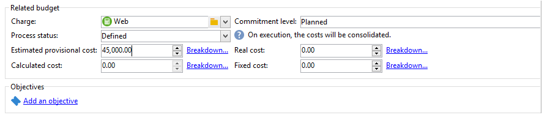
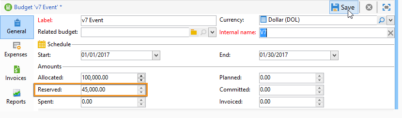
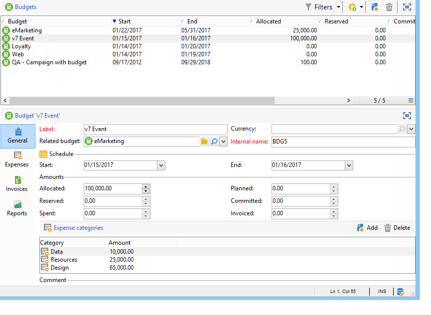
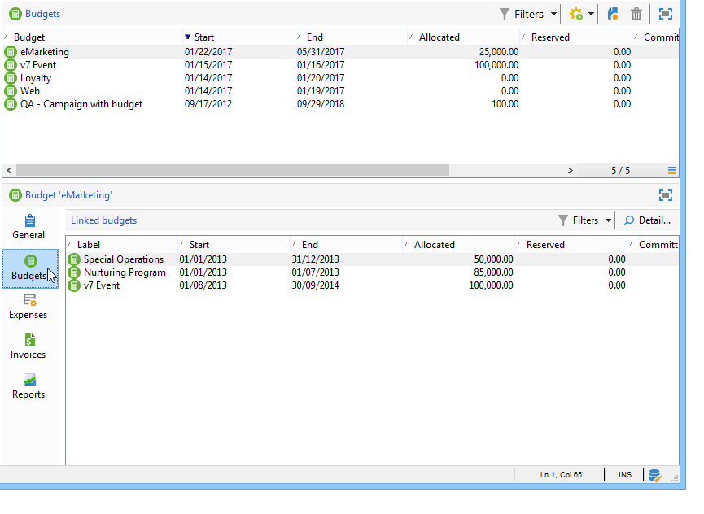
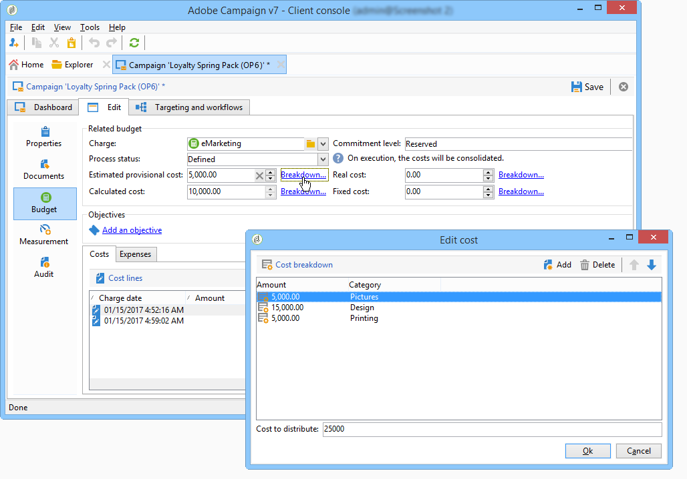
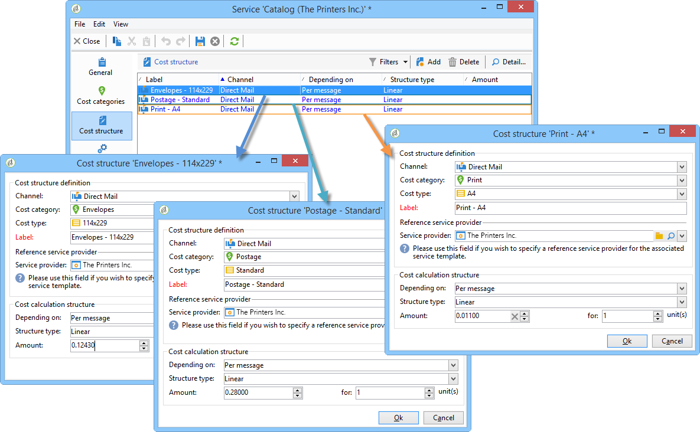
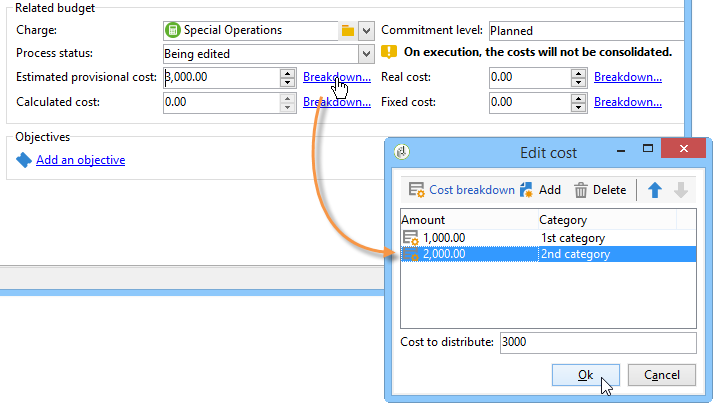
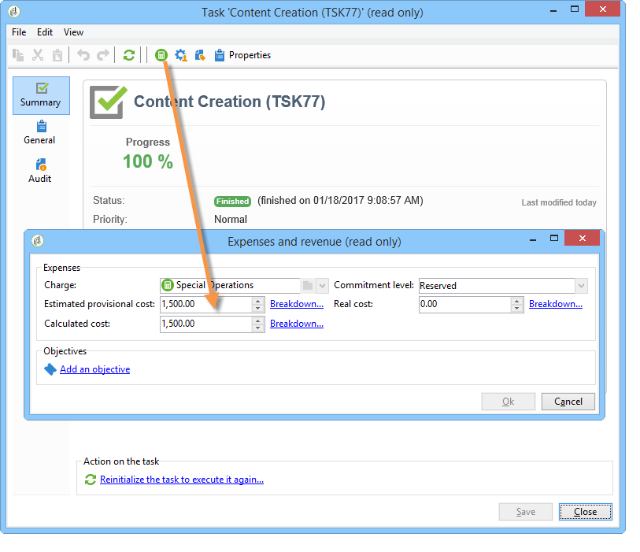
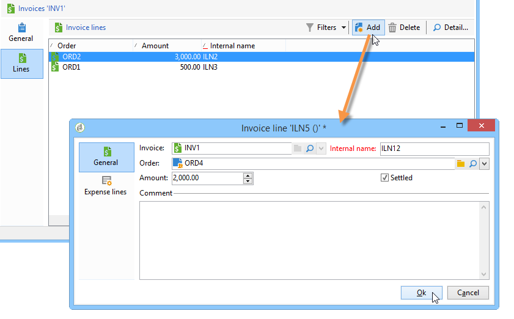

# 비용 제어{#controlling-costs}

## 비용 제어 정보 {#about-cost-control}

Adobe Campaign을 사용하면 예약, 약정 및 송장 마케팅 비용을 관리하고 마케팅 리소스 관리 모듈을 사용하여 범주별로 분류할 수 있습니다.

캠페인의 다양한 프로세스에 대해 커밋된 비용은 마케팅 부서에서 미리 정의한 예산으로 청구됩니다. 이 금액은 몇 가지 카테고리로 분류하여 보다 읽기 쉽게 만들고 마케팅 투자에 대한 보다 자세한 보고를 제공할 수 있습니다.

예산 관리 및 추적은 Adobe Campaign 트리의 전용 노드에 중앙에서 수행됩니다. 이렇게 하면 동일한 뷰 및 모든 예산에 대해 할당된 금액, 예약, 약정 및 지출 금액을 모니터링할 수 있습니다.

MRM 파섹

1. 예산 정의

   자세한 내용은 예산 [만들기를](#creating-a-budget)참조하십시오.

1. 원가 계산 방법 정의

   비용 구조는 서비스 제공업체에 대해 정의됩니다. 서비스 [공급자 및 해당 비용 범주](../../campaign/using/providers--stocks-and-budgets.md#creating-a-service-provider-and-its-cost-categories)만들기를 참조하십시오.

1. 캠페인 비용 정의(배달/작업)

   게재 및 작업에 의해 발생하는 비용은 캠페인 템플릿에 대해 개별적으로 또는 전체적으로 입력합니다. 비용 [및 주식](../../campaign/using/marketing-campaign-deliveries.md#calculation-of-costs-and-stocks)계산을 참조하십시오.

1. 통합

   작업, 배달 및 캠페인의 진행 상태에 따라 비용이 계산되어 해당 예산으로 전달됩니다.

   캠페인 만들기가 충분히 진전되면 캠페인 예산의 진행 상태를 다음으로 변경할 수 **[!UICONTROL Specified]**&#x200B;있습니다. 그런 다음 프로그램의 계산된 비용이 캠페인에 계산된 비용과 함께 자동으로 입력됩니다. 비용 [약정, 계산 및 비용을](#cost-commitment--calculation-and-charging)참조하십시오.

## 예산 생성 {#creating-a-budget}

예산은 **[!UICONTROL Campaign management > Budgets]** 노드를 통해 맵에 생성됩니다. 도구 모음의 **[!UICONTROL New]** 단추를 사용하여 예산을 만들 수 있습니다.

* 새 예산 추가

   아이콘을 **[!UICONTROL New]** 클릭하고 이름을 지정하고 예산을 저장합니다.

* 초기 금액 입력

   관련 필드에 할당된 금액을 표시합니다. 다른 금액은 자동으로 입력됩니다. 금액 [계산을](#calculating-amounts)참조하십시오.

* 유효 기간 정의

   시작 및 종료 날짜를 지정합니다. 이 정보는 설명만 합니다.

* 비용

   캠페인, 작업 등에 대해 이 예산에 할당된 비용이 있는 비용 범주를 만듭니다. 연결할 수 있습니다. 비용 [카테고리를](#expense-categories)참조하십시오.

   

>[!NOTE]
>
>관련 예산을 선택할 수 있습니다.
>
>자세한 내용은 예산을 [다른](#linking-a-budget-to-another)사용자에게 연결을 참조하십시오.

### 금액 계산 {#calculating-amounts}

각 예산은 예약 또는 수행된 후 다양한 캠페인, 전달 또는 관련 작업의 비용으로부터 감소되는 초기 금액으로 정의됩니다. 금액의 상태(계획, 예약, 약정, 지출 또는 송장)는 비용 유형과 캠페인, 납품 또는 작업에 정의된 약정 수준에 따라 달라집니다.

>[!NOTE]
>
>범주에 대해 입력한 금액은 **[!UICONTROL Allocated]** 필드에 정의된 예산 포락선과 일치해야 합니다.

캠페인의 경우 약정 수준에 따라 향후 조치를 위해 비용을 계획, 약정 또는 예약할 수 있습니다.

>[!CAUTION]
>
>캠페인이 만들어지면 실행 시 고려되는 비용에 대해 진행 상태를 **[!UICONTROL Budget]** 설정해야 **[!UICONTROL Defined]** 합니다. 상태가 **[!UICONTROL Being edited]**&#x200B;되면 비용은 통합되지 않습니다.
>   
>이 옵션은 예산에 부과되기 전에 미래 비용으로 비용을 예상하는 **[!UICONTROL Commitment level]** 것입니다. 캠페인, 작업 또는 게재 진행에 따라 더 높은 또는 낮은 약정 수준(1)을 지정할 수 있습니다. 예정, 2. 예약됨, 3. 커밋됨) 콤보 상자를 사용합니다.

예를 들어 웹 캠페인의 예상 비용은 45,000유로입니다.

캠페인의 경우 예산 생성 상태가 로 설정된 **[!UICONTROL Defined]**&#x200B;경우 캠페인의 실제 비용(또는 없는 경우 계산된 비용)이 예산 합계에 이월됩니다.

캠페인 예산의 약정 수준에 따라, 금액은 **[!UICONTROL Planned]****[!UICONTROL Reserved]** 또는 **[!UICONTROL Committed]** 필드에 입력됩니다.

약정 수준은 다음과 같이 수정할 수 있습니다.

* 를 **캠페인** 수준의 **[!UICONTROL Budget]** 창에서 **[!UICONTROL Edit]** 탭에 있습니다. 예산, 비용 및 비용이 구성되는 곳입니다.
* 을 **클릭합니다** **[!UICONTROL Expenses and revenues]** .

예산이 책정되면 **[!UICONTROL Reserved]**&#x200B;유료 예산에 대해 업데이트가 자동으로 수행됩니다.

작업 수준에서 절차는 동일합니다.

지출이 송장을 발생시키고 송장이 지급되면 그 금액은 **[!UICONTROL Invoiced]** 필드에 입력됩니다.

### 비용 범주 {#expense-categories}

이 금액은 데이터의 가독성을 높이고 마케팅 투자에 대한 자세한 보고를 위해 여러 비용 범주로 분배할 수 있습니다. 비용 범주는 트리의 **[!UICONTROL Budgets]** 노드를 통해 예산 생성 중에 정의됩니다.

범주를 추가하려면 창의 아래 섹션에 있는 **[!UICONTROL Add]** 단추를 클릭합니다.

기존 카테고리에서 카테고리를 선택하거나 필드에 직접 입력하여 새 카테고리를 정의할 수 있습니다. 입력을 확인하면 확인 메시지를 통해 기존 카테고리 목록에 이 카테고리를 추가하고 필요한 경우 자연과 연결할 수 있습니다. 이 정보는 예산 보고서에 사용됩니다.

### 예산을 다른 사용자에게 연결 {#linking-a-budget-to-another}

예산을 기본 예산에 연결할 수 있습니다. 이렇게 하려면 보조 예산 **[!UICONTROL related budget]** 필드에서 기본 예산을 선택합니다.

관련 예산 목록을 표시하기 위해 주 예산에 추가 탭이 추가됩니다.

이 정보는 예산 보고서에 전달됩니다.

## 비용 라인 추가 {#adding-expense-lines}

비용 라인은 예산에 자동으로 추가됩니다. 배달 분석 도중 및 작업이 완료되면 만들어집니다.

각 캠페인, 배달 또는 작업에 대해 생성된 비용은 비용이 청구되는 예산의 비용 라인으로 그룹화됩니다. 이러한 비용 라인은 관련 서비스 제공업체의 비용 라인에 따라 생성되며 관련 비용 구조를 통해 계산됩니다.

따라서 각 비용 라인에는 다음 정보가 포함됩니다.

* 캠페인과 관련된 게재 또는 작업
* 원가 구조 또는 예상 잠정 비용에서 계산된 금액
* 관련 배송 또는 작업의 실제 비용
* 해당 송장 라인(MRM만 해당)
* 비용 범주별로 계산된 비용 목록(비용 구조가 있는 경우)

위의 예에서, 편집된 비용 라인은 충성도 봄 팩 캠페인에 대한 **새 카드** 배달에 대해 계산된 **비용을** 포함합니다. 배달을 편집하면 이 **[!UICONTROL Direct Mail]** 탭에서는 비용 라인이 계산되는 방식을 확인할 수 있습니다.

이 배달에 대한 비용 계산은 해당 서비스 제공자에 대해 선택한 비용 범주를 기반으로 합니다.

선택한 원가 범주에 따라 해당 원가 구조가 비용 라인을 계산하기 위해 적용됩니다. 이 예에서, 관련 서비스 제공업체의 경우 비용 구조는 다음과 같습니다.

>[!NOTE]
>
>비용 카테고리 및 구조는 서비스 [제공업체 및 비용 카테고리](../../campaign/using/providers--stocks-and-budgets.md#creating-a-service-provider-and-its-cost-categories)만들기에서 제공됩니다.

## 비용 약정, 계산 및 부과 {#cost-commitment--calculation-and-charging}

비용은 납품 및 작업에 대해 커밋할 수 있습니다. 관련된 프로세스의 진행 상태에 따라 비용 상태가 업데이트됩니다.

### 비용 계산 프로세스 {#cost-calculation-process}

비용은 다음 세 가지 범주로 구분됩니다.

1. 예상 잠정 비용

   예상 임시 비용은 캠페인의 프로세스에 대한 예상 비용입니다. 편집 중인 경우 입력 금액이 통합되지 않습니다. 계산에서 계산될 금액에 대한 **[!UICONTROL Specified]** 상태가 있어야 합니다.

   이 금액은 수동으로 입력되며 여러 비용 범주로 분류할 수 있습니다. 비용을 줄이려면 **[!UICONTROL Breakdown...]** 링크를 클릭한 다음 **[!UICONTROL Add]** 단추를 클릭하여 새 금액을 정의합니다.

   

   비용 범주별 원가 분류를 나중에 관련 예산 및 예산 보고서에서 볼 수 있도록 각 원가를 카테고리와 연관시킬 수 있습니다.

1. 계산된 비용

   계산된 비용은 해당 요소(캠페인, 배달, 작업 등)에 따라 달라집니다. 및 해당 상태(편집 중, 진행 중, 완료)를 나타냅니다. 어떤 경우든, 실제 비용이 지정된 경우, 계산된 비용은 이 금액을 사용합니다.

   실제 비용이 제공되지 않으면 다음 규칙이 적용됩니다.

   * 편집되는 캠페인의 경우 계산된 비용은 캠페인의 예상 잠정적인 비용이거나 이 비용이 정의되지 않은 경우 계산된 비용은 캠페인의 게재와 작업의 모든 잠정적인 비용의 합계가 됩니다. 캠페인이 완료되면 캠페인의 계산된 비용은 모든 계산된 비용의 합계가 됩니다.
   * 아직 분석되지 않은 게재의 경우 계산된 비용은 예상 잠정적인 비용입니다. 분석이 이미 수행된 경우, 계산된 비용은 서비스에서 계산된 모든 비용의 합계가 비용 구조 및 타깃팅된 수신자 수가 됩니다.
   * 진행 중인 작업의 경우 계산된 비용은 예상 잠정 비용을 사용합니다. 작업이 완료되면 계산된 비용은 서비스 공급자 비용 구조에서 계산된 모든 비용과 완료된 일 수의 합계가 됩니다.
   * 마케팅 계획의 경우 프로그램에 대해 계산된 비용은 캠페인에 대해 계산된 비용의 합계입니다. 이러한 비용이 지정되지 않은 경우 계산된 비용은 예상 잠정 비용을 사용합니다.
   >[!NOTE]
   >
   >이 **[!UICONTROL Breakdown]** 링크를 사용하면 계산의 세부 사항과 마지막 원가 계산 일자를 볼 수 있습니다.

1. 실제 비용

   실제 비용은 수동으로 입력되며 필요한 경우 다른 비용 범주로 분류됩니다.

### 계산 및 청구 {#calculation-and-charging}

비용은 비용 구조를 통해 계산되며 관련 캠페인, 배달 또는 작업에서 선택한 예산에 청구됩니다.

예산 승인을 통해 캠페인에 커밋된 금액에 대해 검사를 수행할 수 있습니다. 다른 승인을 설정하기 위해 캠페인에 체크포인트 스타일 추가 작업을 만들 수 있습니다. 작업 [유형을 참조하십시오](../../campaign/using/creating-and-managing-tasks.md#types-of-task).

### 예 {#example}

다음 항목으로 캠페인을 만듭니다.

* 서비스 제공업체의 비용 구조를 사용한 다이렉트 메일 전달
* 고정된 비용으로 작업 수행
* 일별 비용이 포함된 작업

#### 단계 1 - 예산 생성 {#step-1---creating-the-budget}

노드를 통해 새 예산을 **[!UICONTROL Campaign management > Budgets]** 만듭니다.

섹션의 **[!UICONTROL Allocated]** 필드에 10,000유로의 예산을 **[!UICONTROL Amounts]** 정의합니다. 창의 하단 섹션에 두 개의 비용 범주를 추가합니다.

#### 2단계 - 서비스 공급자 구성 및 비용 구조 정의 {#step-2---configuring-the-service-provider-and-defining-the-cost-structures}

노드의 비용 구조를 사용하여 서비스 제공업체 및 서비스 템플릿을 **[!UICONTROL Administration > Campaigns]** 만듭니다.

자세한 내용은 서비스 [공급자 만들기 및 해당 비용 범주를](../../campaign/using/providers--stocks-and-budgets.md#creating-a-service-provider-and-its-cost-categories)참조하십시오.

* DM 게재의 경우 비용 범주( **[!UICONTROL Envelopes]** 유형 114x229 및 162x229) **[!UICONTROL Postage]** 및 **[!UICONTROL Print]** (유형 A3 및 A4)를 만듭니다. 그런 다음 다음과 같은 비용 구조를 만듭니다.

   

   계산이 고정되고 금액이 비어 있는 고정 원가(원가 범주에 포함)를 추가하고 각 납품에 대해 개별적으로 지정합니다.

   

* 작업의 경우 다음 두 가지 비용 범주를 만듭니다.

   1. **[!UICONTROL Room reservation]** (작은 방 및 큰 방), **고정된** 가격대의 300유로 및 500유로:

      

   1. **[!UICONTROL Creation]** (**컨텐트 템플릿** 유형), **일일** 비용 구조가 300유로인 경우:

      

#### 단계 3 - 캠페인에서 예산 부과 {#step-3---charging-the-budget-in-the-campaign}

캠페인을 만들고 1단계에서 만든 예산을 선택합니다.

>[!NOTE]
>
>기본적으로 프로그램에 대해 선택한 예산은 프로그램의 모든 캠페인에 적용됩니다.

예상 잠정 비용(분류 포함)을 지정합니다.

을 **[!UICONTROL Ok]** 클릭한 다음 **[!UICONTROL Save]** 이 정보를 확인합니다. 그런 다음 캠페인의 계산된 비용이 예상 임시 비용으로 업데이트됩니다.

#### 4단계 - DM 배달 만들기 {#step-4---creating-the-direct-mail-delivery}

캠페인에 대한 워크플로우를 만들고 쿼리 활동을 배치하여 대상을 선택합니다(경고, 수신자 우편 주소를 지정해야 함).

DM 배달을 만들고 2단계에서 만든 서비스 공급자를 선택합니다.비용 범주는 자동으로 표시됩니다.

둘러싸기 비용을 대체하고 고정 비용을 추가합니다. 또한 이러한 비용과 관련된 카테고리를 선택합니다.

>[!NOTE]
>
>비용 범주 중 하나를 사용하지 않으면 비용이 발생하지 않습니다.

방금 만든 워크플로우를 시작하여 분석을 실행하고 비용을 계산합니다.

이 캠페인에 대한 예산 승인이 활성화되면 대시보드에서 예산을 승인합니다. 비용 범주의 승인을 확인할 수 있습니다.

게재와 관련된 비용 라인이 캠페인의 **[!UICONTROL Edit > Budget]** 탭에 추가됩니다. 계산 세부 사항을 보려면 편집합니다.

납품에 대해 계산된 비용은 다음 정보로 업데이트됩니다.

계산된 원가를 편집할 때 원가 분류와 원가 계산의 상태 및 일자를 확인할 수 있습니다.

#### 5단계 - 작업 만들기 {#step-5---creating-tasks}

이 캠페인에 앞서 비용 구조를 만든 두 가지 작업을 추가합니다(2단계 - 서비스 [공급자 구성 및 비용 구조](#step-2---configuring-the-service-provider-and-defining-the-cost-structures)정의 참조). 이렇게 하려면 캠페인 대시보드에서 **[!UICONTROL Add a task]** 단추를 클릭합니다. 작업의 이름을 지정하고 을 클릭합니다 **[!UICONTROL Save]**.

그런 다음 작업이 작업 목록에 추가됩니다. 편집하려면 편집해야 합니다.

탭에서 서비스와 해당 비용 범주를 선택합니다. **[!UICONTROL Properties]**

그런 다음 작업의 **[!UICONTROL Expenses and revenue]** 아이콘을 클릭하고 예상 잠정 비용을 지정합니다.

작업이 저장되면 계산된 비용이 예상 임시 비용에 대해 입력된 값으로 지정됩니다.

작업이 완료되면(상태 **[!UICONTROL Finished]** ) 계산된 비용이 비용 구조에 입력된 대로 큰 회의실의 비용으로 자동 업데이트됩니다. 이 비용은 분류에서 이 카테고리에 표시됩니다.

그런 다음 동일한 절차에 따라 두 번째 작업을 만듭니다.5일 동안 예약되었으며 이전에 만든 비용 구조와 관련되어 있습니다.

작업이 완료되면 계산된 비용이 관련 비용 구조의 값으로 지정됩니다. 예를 들어 1500유로(예: 5일 x 300유로).

#### 6단계 - 캠페인 예산 상태 업데이트 {#step-6---update-the-campaign-budget-status}

캠페인이 구성되면 캠페인을 로 설정하여 상태를 업데이트할 수 **[!UICONTROL Specified]**&#x200B;있습니다. 그런 다음 캠페인의 계산된 비용은 게재의 계산된 비용과 캠페인의 작업의 합계를 나타냅니다.

#### 예산 승인 {#budget-approval}

승인이 활성화되면, 특별 링크를 통해 캠페인 대시보드에서 예산을 승인할 수 있습니다. 이 링크는 타깃팅 워크플로우가 실행되었고 다이렉트 메일 배달을 승인해야 할 때 표시됩니다.

그런 다음 링크를 클릭하여 승인을 부여하거나 거부할 수 있으며, 이 캠페인에 대해 알림이 활성화된 경우 알림 이메일의 링크를 사용할 수 있습니다.

예산이 승인되고 배달이 완료되면 비용은 특수 기술 워크플로우를 통해 자동으로 업로드됩니다.

## 주문 및 송장 {#orders-and-invoices}

MRM의 경우 서비스 제공업체와 주문을 저장하고 송장을 발행할 수 있습니다. 이러한 주문 및 송장의 전체 라이프 사이클은 Adobe Campaign 인터페이스를 통해 관리할 수 있습니다.

### 주문 작성 {#order-creation}

서비스 공급자를 사용하여 새 주문을 저장하려면 트리의 **[!UICONTROL MRM > Orders]** 노드를 클릭한 다음 **[!UICONTROL New]** 단추를 클릭합니다.

주문 번호, 해당 서비스 제공업체 및 주문의 총 금액을 지정합니다.

### 송장 발행 및 추적 {#issuing-and-tracking-invoices}

각 서비스 제공자에 대해 송장을 저장하고 해당 상태와 청구 예산을 정의할 수 있습니다.

송장이 만들어지고 Adobe Campaign 트리의 **[!UICONTROL MRM > Invoices]** 노드에 저장됩니다.

송장은 합계가 자동으로 금액을 계산할 수 있는 송장 라인으로 구성됩니다. 이러한 줄은 **[!UICONTROL Invoice lines]** 탭에서 수동으로 생성됩니다. 정보를 주문에 업로드하는 주문과 연결될 수 있습니다.

각 서비스 공급자의 송장은 프로필의 **[!UICONTROL Invoices]** 탭에 표시됩니다.

이 **[!UICONTROL Details]** 탭에서는 송장의 컨텐트를 표시할 수 있습니다.

아이콘을 **[!UICONTROL Add]** 클릭하여 새 송장을 생성합니다.
