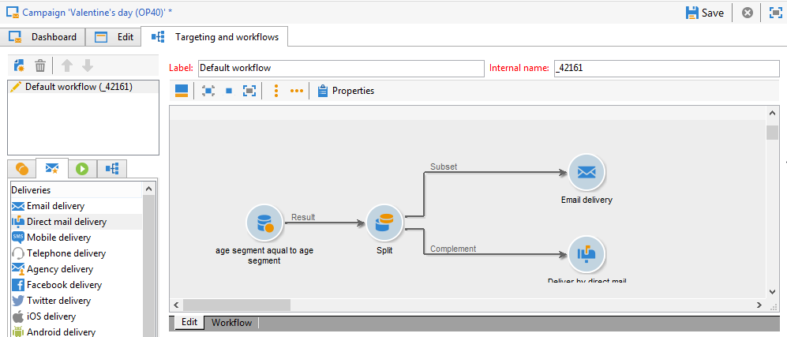
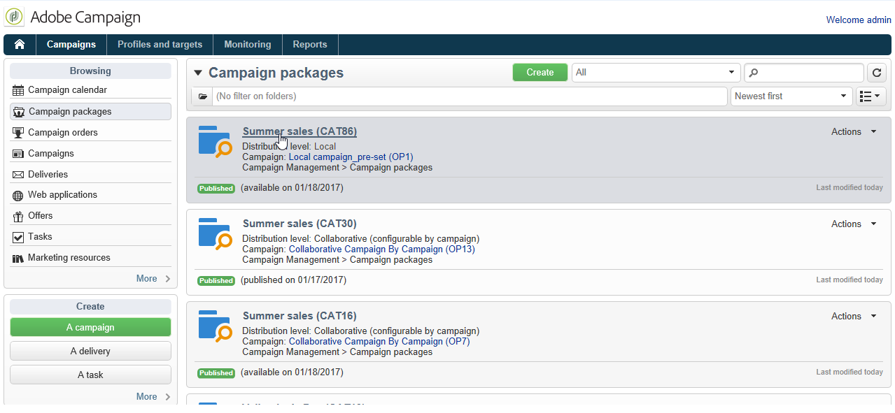

# 로컬 캠페인 만들기{#creating-a-local-campaign}

로컬 캠페인은 **[!UICONTROL campaign packages]** 특정 실행 일정이 ****&#x200B;있는 목록에서 참조하는 템플릿에서 만든 인스턴스입니다. 이 캠페인의 목표는 중앙 엔티티에 의해 설정 및 구성된 캠페인 템플릿을 사용하여 로컬 커뮤니케이션 요구 사항을 충족하는 것입니다. 로컬 작업을 구현하는 기본 단계는 다음과 같습니다.

**중앙 엔티티의 경우**

1. 로컬 캠페인 템플릿 만들기를 참조하십시오.
1. 템플릿에서 캠페인 패키지 만들기를 참조하십시오.
1. 캠페인 패키지 게시를 참조하십시오.
1. 주문 승인.

**로컬 엔티티의 경우**

1. 캠페인 순서를 지정합니다.
1. 캠페인 실행을 참조하십시오.

## 로컬 캠페인 템플릿 만들기 {#creating-a-local-campaign-template}

캠페인 패키지를 만들려면 먼저 **노드를 통해 캠페인 템플릿을** **[!UICONTROL Resources > Templates]** 만들어야 합니다.

새 로컬 템플릿을 만들려면 기본 **[!UICONTROL Local campaign (opLocal)]** 템플릿을 복제합니다.

캠페인 템플릿의 이름을 지정하고 사용 가능한 필드를 완료합니다.

캠페인 창에서 **[!UICONTROL Edit]** 탭을 클릭한 다음 **[!UICONTROL Advanced campaign settings...]** 링크를 클릭합니다.

### 웹 인터페이스 {#web-interface}

분산 **마케팅** 탭에서 웹 인터페이스 유형을 선택하고 로컬 엔티티가 주문을 할 때 입력할 기본값 및 매개 변수를 지정할 수 있습니다.

웹 인터페이스는 캠페인을 정렬할 때 로컬 엔티티가 입력할 양식에 해당합니다.

템플릿에서 만든 캠페인에 적용할 웹 인터페이스 유형을 선택합니다.

사용 가능한 웹 인터페이스에는 다음 네 가지 유형이 있습니다.

* **[!UICONTROL By brief]** :로컬 엔터티는 캠페인 구성을 설명하는 설명을 제공해야 합니다. 주문이 승인되면 중앙 엔티티는 전체 캠페인을 구성하고 실행합니다.

   

* **[!UICONTROL By form]** :로컬 엔티티는 사용된 템플릿에 따라 컨텐츠, 대상, 최대 크기, 개인화 필드를 사용하여 작성 및 추출 날짜를 편집할 수 있는 웹 양식에 액세스할 수 있습니다. 로컬 엔티티는 대상을 평가하고 이 웹 양식에서 컨텐츠를 미리 볼 수 있습니다.

   

   제공된 양식은 웹 응용 프로그램에 지정되며, 템플릿 **[!UICONTROL Web Interface]** 링크의 **[!UICONTROL Advanced campaign settings...]** 필드에서 드롭다운 목록에서 선택해야 합니다. 로컬 [캠페인 만들기(양식별)를 참조하십시오](../../campaign/using/examples.md#creating-a-local-campaign--by-form-).

   >[!NOTE]
   >
   >이 예제에서 사용되는 웹 응용 프로그램은 예입니다. 양식을 사용하려면 특정 웹 앱을 만들어야 합니다. API를 [참조하십시오](../../configuration/using/about-web-services.md).

   

* **[!UICONTROL By external form]** :로컬 엔티티는 엑스트라넷의 캠페인 매개 변수에 액세스할 수 있습니다(Adobe Campaign이 아님). 이러한 매개 변수는 **로컬 캠페인(양식)의 매개 변수와 동일합니다**.
* **[!UICONTROL Pre-set]** :로컬 엔티티는 기본 양식을 사용하여 캠페인을 현지화하지 않고 요청합니다.

   

### 기본값 {#default-values}

로컬 엔티티별로 **[!UICONTROL Default values]** 작성할 항목을 선택합니다. 예:

* 연락처 및 추출 날짜,
* 타겟 특성(연령 세그먼트 등)

및 **[!UICONTROL Parent marketing program]** 필드를 **[!UICONTROL Charge]** 완료합니다.

### 승인 {#approvals}

링크에서 최대 검토자 수를 지정할 수 **[!UICONTROL Advanced parameters for campaign entry]** 있습니다.

캠페인을 주문하면 로컬 엔티티가 검토자를 입력합니다.

캠페인에 대한 검토자의 이름을 지정하지 않으려면 0을 입력합니다.

### 문서 {#documents}

로컬 엔티티 연산자가 문서(텍스트 파일, 스프레드시트, 이미지, 캠페인 설명 등)를 연결하도록 허용할 수 있습니다. 를 로컬 캠페인으로 설정하는 것이 좋습니다. 이 **[!UICONTROL Advanced parameters for campaign entry...]** 링크를 사용하면 문서 수를 제한할 수 있습니다. 이렇게 하려면 **[!UICONTROL Number of documents]** 필드에 허용되는 최대 수를 입력하십시오.

캠페인 패키지의 순서를 지정할 때 양식은 템플릿의 해당 필드에 지정된 만큼 많은 문서를 연결하는 것을 제안합니다.

문서 업로드 필드를 표시하지 않으려면 **[!UICONTROL 0]** **[!UICONTROL Number of documents]** 필드에 입력합니다.

>[!NOTE]
>
>을 **[!UICONTROL Advanced parameters for campaign entry]** 선택하면 비활성화할 수 **[!UICONTROL Do not display the page used to enter the campaign parameters]**&#x200B;있습니다.

### 워크플로우 {#workflow}

탭에서 에 **[!UICONTROL Targeting and workflows]** 지정된 항목을 수집하고 **[!UICONTROL Default values]** **[!UICONTROL Advanced campaign settings...]** 배달을 만드는 캠페인 워크플로우를 만듭니다.

활동을 두 번 클릭하여 지정된 **[!UICONTROL Query]** 내용에 따라 구성합니다 **[!UICONTROL Default values]**.

### 게재 {#delivery}

탭에서 **[!UICONTROL Audit]** 아이콘을 클릭하여 선택한 배달에 **[!UICONTROL Detail...]** **[!UICONTROL Scheduling]** 대한 아이콘을 봅니다.

이 **[!UICONTROL Scheduling]** 아이콘을 사용하여 게재 연락처 및 실행 날짜를 구성할 수 있습니다.

필요한 경우 배달을 최대 크기로 구성합니다.

게재의 HTML을 찾습니다. 예를 들어 에서 **[!UICONTROL Delivery > Current order > Additional fields]**&#x200B;이 **[!UICONTROL Age segment]** 필드를 사용하여 대상의 나이에 따라 배달을 찾습니다.

캠페인 템플릿을 저장합니다. 이제 캠페인 **공간의 캠페인 패키지** 보기에서 **단추를 클릭하여** 사용할 **[!UICONTROL Create]** 수있습니다.

>[!NOTE]
>
>캠페인 템플릿과 일반 구성은 캠페인 템플릿에서 [자세히 설명합니다](../../campaign/using/marketing-campaign-templates.md#campaign-templates).

## 캠페인 패키지 만들기 {#creating-the-campaign-package}

캠페인 템플릿을 로컬 엔티티에서 사용할 수 있게 하려면 목록에 추가해야 합니다. 이를 위해 중앙기관은 새로운 패키지를 만들어야 합니다.

다음 단계를 적용합니다.

1. 캠페인 페이지의 **[!UICONTROL Navigation]** 섹션에서 **** 링크를 클릭합니다 **[!UICONTROL Campaign packages]** .
1. 단추를 **[!UICONTROL Create]** 클릭합니다.

   

1. 창 위의 섹션에서는 [이전에](#creating-a-local-campaign-template) 지정한 캠페인 패키지 템플릿을 선택할 수 있습니다.

   기본적으로 템플릿은 로컬 캠페인에 사용됩니다 **[!UICONTROL New local campaign package (localEmpty)]** .

1. 캠페인 패키지의 레이블, 폴더 및 실행 일정을 지정합니다.

### 날짜 {#dates}

시작 및 종료 날짜는 캠페인 패키지 목록에서 캠페인의 가시성 기간을 정의합니다.

가용 일자는 캠페인을 로컬 개체(주문)에 사용할 수 있게 되는 날짜입니다.

>[!CAUTION]
>
>로컬 엔티티가 기한 전에 캠페인을 예약하지 않으면 캠페인을 사용할 수 없습니다.

이 정보는 아래와 같이 지역 기관에 발송된 알림 메시지에서 찾을 수 있습니다.

### 대상자 {#audience}

로컬 캠페인의 경우 중앙 엔티티는 을 선택하여 관련된 로컬 엔티티를 지정할 수 **[!UICONTROL Limit the package to a set of local entities]**&#x200B;있습니다.

### 추가 설정 {#additional-settings}

패키지가 저장되면 중앙 엔티티는 **[!UICONTROL Edit]** 탭에서 편집할 수 있습니다.

탭에서 중앙 엔티티는 다음을 수행할 수 **[!UICONTROL General]** 있습니다.

* 링크에서 캠페인 패키지 검토자를 **[!UICONTROL Approval parameters...]** 구성합니다.
* 실행 일정을 검토하고
* 로컬 엔티티를 추가하거나 삭제합니다.

>[!NOTE]
>
>기본적으로 각 엔티티는 **로컬 캠페인을** 한 번만 주문할 수 있습니다.
>   
>캠페인 패키지에서 여러 로컬 캠페인을 만들 수 있도록 하려면 **[!UICONTROL Enable multiple creation]** 옵션을 선택합니다.

### 알림 {#notifications}

캠페인을 사용할 수 있게 되거나 등록 마감일에 도달하면 로컬 알림 그룹의 운영자에게 메시지가 전송됩니다. 자세한 내용은 조직 [엔티티를](../../campaign/using/about-distributed-marketing.md#organizational-entities)참조하십시오.

## 캠페인 순서 지정 {#ordering-a-campaign}

캠페인 패키지는 승인된 후 구현 기간이 시작되면 로컬 엔티티에서 액세스할 수 있게 됩니다. 로컬 엔티티는 새로운 캠페인 패키지를 사용할 수 있음을 알리는 이메일을 수신합니다(가용 일자에 도달하는 즉시).

>[!NOTE]
>
>캠페인 패키지를 만들 때 일부 로컬 개체가 지정된 경우 알림을 받을 유일한 로컬 개체가 됩니다. 로컬 엔티티를 지정하지 않은 경우 모든 로컬 엔티티가 알림을 받게 됩니다.

중앙 엔티티에서 제공하는 캠페인을 사용하려면 로컬 엔티티가 캠페인을 주문해야 합니다.

캠페인을 주문하려면

1. 알림 메시지 **[!UICONTROL Order campaign]** 또는 Adobe Campaign의 해당 단추를 클릭합니다.

   ID와 암호를 입력하여 캠페인을 요청합니다. 인터페이스는 웹 애플리케이션에 정의된 페이지 세트로 구성됩니다.

   >[!NOTE]
   >
   >웹 애플리케이션은 웹 기능 [안내서에 자세히 설명되어](../../web/using/about-web-applications.md) 있습니다.

1. 첫 번째 페이지(레이블 및 주석 순서 지정)에 필요한 정보를 입력하고 **[!UICONTROL Next]**&#x200B;클릭합니다.

   

   사용 가능한 매개 변수를 작성하고 주문을 승인합니다.

   이 주문을 승인하기 위해 로컬 엔티티가 속한 조직 엔티티의 관리자에게 알림이 전송됩니다.

   

1. 정보는 로컬 및 중앙 엔티티로 반환됩니다. 로컬 엔티티는 자체 주문만 볼 수 있지만, 중앙 엔티티는 아래와 같이 로컬 엔티티의 모든 주문을 볼 수 있습니다.

   

   연산자는 주문 세부 사항을 표시할 수 있습니다.

   

   이 **[!UICONTROL Edit]** 탭에는 캠페인을 정렬할 때 로컬 엔티티가 입력한 정보가 포함되어 있습니다.

   

1. 그 명령은 중앙 실체가 승인해야만 완성된다.

   

   자세한 내용은 승인 프로세스 [섹션을](#approval-process) 참조하십시오.

1. 그런 다음 캠페인을 사용할 수 있다는 알림을 로컬 연산자에게 보냅니다.캠페인 가용성은 캠페인 우주 내의 캠페인 패키지 목록에서 찾을 **수 있습니다** . 그런 다음 캠페인을 사용할 수 있습니다. 자세한 내용은 캠페인 [액세스를](../../campaign/using/accessing-campaigns.md)참조하십시오.

   이 **[!UICONTROL Start targeting with order approval]** 옵션을 사용하면 주문이 승인되는 즉시 로컬 엔티티가 캠페인을 실행할 수 있습니다.

   

## 주문 승인 {#approving-an-order}

캠페인 순서를 확인하려면 중앙 엔티티가 승인해야 합니다.

캠페인 **[!UICONTROL Campaign orders]** 공간을 통해 액세스되는 **개요를** 사용하면 캠페인 주문의 상태를 보고 승인할 수 있습니다.

>[!NOTE]
>
>로컬 개체는 승인될 때까지 주문을 변경할 수 있습니다.

### 승인 프로세스 {#approval-process}

#### 이메일 알림 {#email-notification}

캠페인이 로컬 엔티티로 주문되면 검토자에게 아래와 같이 이메일로 알림이 발송됩니다.

>[!NOTE]
>
>검토자 선택은 검토자 [섹션에](#reviewers) 표시됩니다. 그들은 그 주문을 수락하거나 거부할 수 있다.

#### Adobe Campaign 콘솔을 통한 승인 {#approving-via-the-adobe-campaign-console}

주문은 콘솔을 통해 캠페인 주문 개요에서 승인할 수도 있습니다. 주문을 승인하려면 주문을 선택하고 을 **[!UICONTROL Approve the order]**&#x200B;클릭합니다.

>[!NOTE]
>
>캠페인은 여전히 편집하고 캠페인 가용 날짜까지 다시 구성할 수 있습니다. 로컬 엔티티는 **[!UICONTROL Cancel]** 단추를 클릭하여 캠페인을 거부할 수도 있습니다.

#### 캠페인 만들기 {#creating-a-campaign}

캠페인 주문이 승인되면 로컬 엔티티에서 구성하고 실행할 수 있습니다.

자세한 내용은 캠페인 [액세스를](../../campaign/using/accessing-campaigns.md)참조하십시오.

### 승인 거부 {#rejecting-an-approval}

승인 담당자는 주문 또는 캠페인 패키지를 거부할 수 있습니다.

검토자가 주문을 거부하면 관련 알림이 해당 지역 엔티티에 자동으로 전송됩니다.승인을 거부한 연산자가 입력한 댓글이 표시됩니다.

정보는 캠페인 패키지 목록 페이지 또는 캠페인 주문 페이지에 표시됩니다. Adobe Campaign 콘솔에 액세스할 수 있는 경우 로컬 엔티티에 이러한 거부에 대한 알림이 표시됩니다.

캠페인 패키지의 **[!UICONTROL Edit]** 탭에서 관련 댓글을 볼 수 있습니다.

### 검토자 {#reviewers}

승인이 필요할 때마다 검토자는 이메일로 알림을 받습니다.

각 로컬 엔티티에 대해 검토자가 캠페인 주문 승인 및 캠페인 승인을 위해 선택됩니다. 로컬 검토자 선택에 대한 자세한 내용은 조직 [엔티티를](../../campaign/using/about-distributed-marketing.md#organizational-entities)참조하십시오.

>[!NOTE]
>
>이러한 선택이 가능하려면 주문 승인이 아직 유효하지 않아야 합니다.

### 주문 취소 {#canceling-an-order}

중앙 기관은 주문 대시보드에 있는 **[!UICONTROL Delete]** 버튼을 사용하여 주문을 취소할 수 있습니다.

이렇게 하면 **[!UICONTROL Campaign orders]** 보기에서 캠페인이 취소됩니다.
