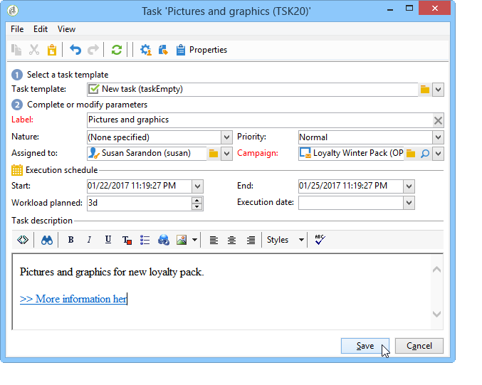
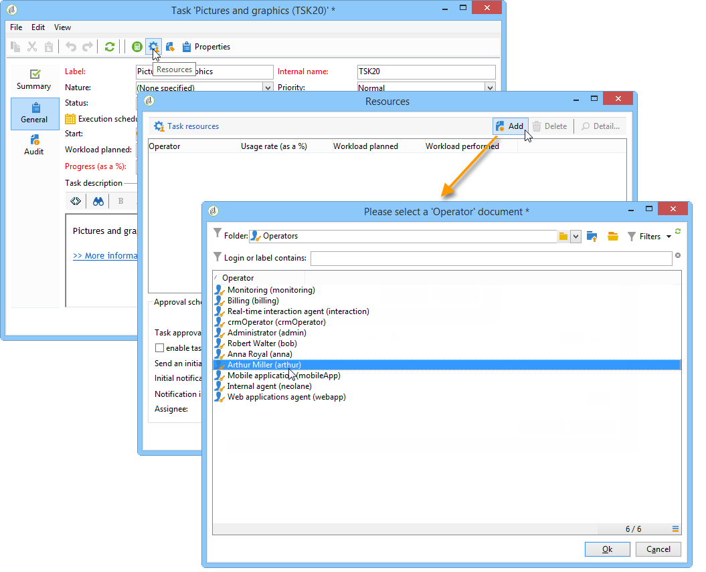
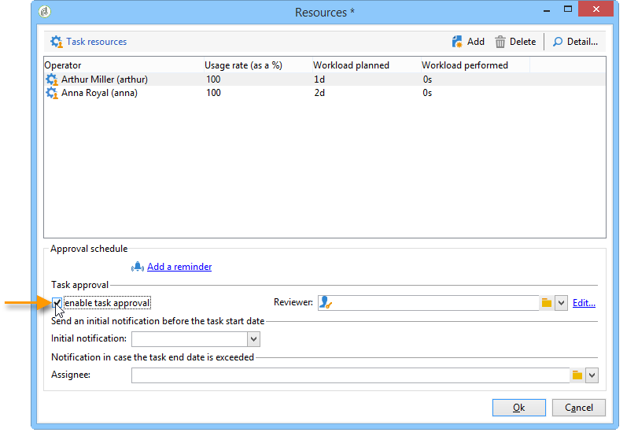

# 작업 만들기 및 관리{#creating-and-managing-tasks}

## 작업 정보 {#about-tasks}

Adobe Campaign을 사용하면 작업을 만들고 애플리케이션 내에서 직접 전체 라이프 사이클을 관리할 수 있습니다. 프로그램 및 캠페인 구현은 Adobe Campaign 운영자나 외부 서비스 제공업체에 할당된 작업으로 분류할 수 있습니다. 이 작업 모드를 사용하면 모든 프로그램 참가자 및 외부 참가자를 포함하는 개방형 공동 작업 환경을 만들 수 있습니다.

작업 목록이나 캠페인 대시보드에서 작업을 만들고, 보고, 모니터링할 수 있습니다. 또한 마케팅 계획, 프로그램 및 캠페인의 일정에서 보고 추적할 수 있습니다.

작업은 캠페인에 연결되어 있고, 관련된 작업과 같은 종속성을 가질 수 있습니다. 각 작업에는 상태, 우선 순위, 예상 로드 및 관련 비용이 있습니다.

모든 작업은 캠페인 우주를 통해 액세스할 수 있는 목록에 **그룹화됩니다** . 자세한 내용은 작업 [액세스를](#accessing-tasks)참조하십시오.

프로그램 일정에 따라 표시할 수 있습니다.

## 작업 액세스 {#accessing-tasks}

### 작업 표시 {#displaying-tasks}

작업은 **[!UICONTROL Campaigns]** 우주를 통해 액세스할 수 있는 작업 목록에 표시됩니다.

연결된 연산자의 모든 작업을 볼 수 있습니다.

자세한 내용은 작업의 [실행](#execution-status-of-a-task) 상태 및 작업의 [진행 상태를](#progress-status-of-a-task)참조하십시오.

### 작업 필터링 {#filtering-tasks}

이 보기를 표시할 때 표시만 하도록 자동으로 필터링됩니다 **[!UICONTROL operator tasks]**. 창의 상단 섹션에 있는 필드를 사용하여 작업을 필터링할 수도 있습니다.

### 작업 편집 {#editing-tasks}

작업을 클릭하여 편집합니다.

## 새 작업 만들기 {#creating-a-new-task}

작업을 만들려면 캠페인 우주에서 **[!UICONTROL Tasks]** 링크를 클릭하고 **[!UICONTROL Create]**&#x200B;선택합니다.

작업의 이름을 최소한 입력하고 연결된 캠페인을 선택합니다. 시작 및 종료 날짜도 지정해야 합니다. 이 세 가지 정보는 의무적이다.

을 **[!UICONTROL Save]** 클릭하여 작업을 만듭니다.

캠페인의 대시보드를 통해 작업을 만들 수도 있습니다.이 경우 캠페인이 만들어진 캠페인에 자동으로 연결됩니다.

작업이 만들어지면 캠페인 일정과 작업 목록에 추가됩니다. 작업을 편집하려면 일정에서 작업을 선택하거나 작업 개요에서 해당 이름을 클릭한 다음 **[!UICONTROL Open]** 링크를 클릭합니다.

구성하려면 다음을 지정해야 합니다.

* 관리자 및 참가자:관리자 [및 참가자를](#manager-and-participants)참조하십시오.
* 작성 일정:실행 [일정을](#execution-schedule)참조하십시오.
* 약정된 비용:비용 [및 매출을](#expenses-and-revenues)참조하십시오.

또한 광고 검토자(검토자 참조) [와](#reviewers)참조된 문서(참조된 문서 [참조](#documents-referenced))도가능합니다.

작업 라이프 사이클은 라이프 사이클에서 [제공됩니다](#life-cycle).

### 관리자 및 참가자 {#manager-and-participants}

작업을 담당하는 작업자만 작업을 닫을 수 있습니다.

기본적으로 Adobe Campaign 운영자가 작업을 만들면 작업이 자동으로 할당됩니다. 다른 연산자를 선택하려면 **[!UICONTROL Assigned to]** 필드를 사용합니다.

>[!NOTE]
>
>연산자 관리는 [이 섹션에](../../platform/using/access-management.md)있습니다.

작업 수행과 관련된 연산자를 지정할 수 있습니다. 이러한 연산자는 작업을 닫을 권한이 없습니다. 사용자는 자신에게 할당된 작업만 승인할 수 있습니다.

작업 도구 모음의 아이콘을 사용하여 **[!UICONTROL Resources]** 선택됩니다. 관련 연산자를 **[!UICONTROL Add]** 클릭하고 선택합니다.

을 **[!UICONTROL Ok]** 클릭한 다음 사용 비율을 입력합니다.이는 작업 실행 기간 동안 연산자에 할당된 로드를 나타냅니다. 이 비율은 표시 전용이며 백분율로 표시됩니다.

예를 들어 실행 일정이 10일에 설정된 작업의 경우 사용 비율이 50%인 작업자는 10일 동안 작업 시간의 절반을 이 작업에 사용합니다.

각 연산자에 대해 예약된 작업 로드와 실제 작업 로드를 입력할 수 있습니다. 이러한 기간은 정보 용도로만 사용됩니다.

미리 알림을 구성할 수 있으며, 이 미리 알림은 종료 날짜 전에 작업에 관련된 모든 연산자에게 자동으로 전송됩니다.

아이콘을 통해 Adobe Campaign 운영자 프로필을 볼 수 **[!UICONTROL Edit link]** 있습니다.

연산자 대시보드를 사용하여 작업 로드(진행 중인 다른 작업)를 확인할 수 있습니다.

### 검토자 {#reviewers}

참가자 외에도, 담당자에 의해 마감되면 작업을 검토할 연산자를 정의할 수 있습니다. 이렇게 하려면 창의 왼쪽 아래에 있는 **[!UICONTROL Enable task approval]** 옵션을 **[!UICONTROL Resources]** 클릭합니다. 개별 연산자, 연산자 그룹 또는 연산자 목록이 될 수 있습니다.

연산자 목록을 지정하려면 아래 표시된 대로 첫 번째 검토자의 오른쪽에 있는 **[!UICONTROL Edit...]** 링크를 클릭하고 필요한 만큼 연산자를 추가합니다.

검토자 구성 창의 하단 섹션에서 작업에 대한 승인 일정을 정의할 수 있습니다. 기본적으로 검토자는 제출 날짜로부터 3일 이내에 작업을 승인해야 합니다. 미리 알림을 구성할 수 있으며, 이 미리 알림은 승인 기한 전에 관련 운영자에게 자동으로 전송됩니다.

다른 연산자가 이미 이 작업을 수행하도록 지정된 경우라도 작업을 담당하는 사람이 승인 작업을 직접 할당할 수 있습니다. 검토자가 정의되지 않은 경우, 알림 메시지가 작업 담당자에게 전송됩니다. 권한이 있는 다른 모든 Adobe Campaign 운영자도 작업을 승인할 수 **[!UICONTROL Administrator]** 있습니다. 그러나 알림을 받지 않습니다.

### 참조된 문서 {#documents-referenced}

작업에 문서 및 마케팅 리소스를 추가할 수 있습니다(자세한 내용은 마케팅 리소스 [관리를](../../campaign/using/managing-marketing-resources.md)참조하십시오). 이렇게 하려면 작업을 열고 작업 도구 모음에서 **[!UICONTROL Documents]** 아이콘을 클릭합니다.

을 클릭하고 작업에 추가할 문서를 **[!UICONTROL Add]** 선택합니다. 마케팅 리소스에 동일한 프로세스 적용

참조된 문서는 작업과 관련된 운영자에게 전송된 알림뿐만 아니라 작업 대시보드에도 나타납니다.

### 실행 일정 {#execution-schedule}

작업의 유효 기간은 **[!UICONTROL Start]** 및 **[!UICONTROL End]** 필드에 표시됩니다. 예약된 부드는 기간 동안 수행할 작업 로드를 나타냅니다. 이것은 일 또는 시간 단위로 표현된다.

>[!NOTE]
>
>작업의 라이프 사이클은 라이프 사이클에서 [제공됩니다](#life-cycle).

일 및 시간 단위로 표시되는 **[!UICONTROL Workload performed]** 필드에서는 예약된 작업 로드와 관련하여 작업 진행 상황을 수동으로 업데이트할 수 있습니다.

작업 **[!UICONTROL Progress status]** 중 백분율로 표현되는 작업은 관련 연산자가 수행한 작업을 기반으로 자동으로 업데이트됩니다. 수동으로 입력할 수 있습니다.

이 정보는 작업 대시보드에서 볼 수 있습니다.

캠페인 탭에도 표시됩니다.

작업 실행 일정 종료 날짜에 도달했지만 작업이 완료되지 않으면 작업이 **[!UICONTROL Late]**&#x200B;완료됩니다. 경고 연산자에도 경고 메시지가 표시됩니다.

자세한 내용은 작업의 [진행 상태를](#progress-status-of-a-task)참조하십시오.

### 비용 및 수입 {#expenses-and-revenues}

각 태스크에 대한 관련 비용을 정의하고 매출을 예측할 수 있습니다. 작업이 첨부된 캠페인에 대해 계산된 다음 통합됩니다.

이 정보를 지정하려면 작업 도구 모음에서 **[!UICONTROL Expenses and revenue]** 아이콘을 클릭합니다.

기본적으로 부과된 예산은 작업이 첨부된 캠페인의 예산입니다. 작업 세부 정보에 표시됩니다.

>[!NOTE]
>
>비용 및 예산에 대한 자세한 내용은 비용 [약정, 계산 및 비용을](../../campaign/using/controlling-costs.md#cost-commitment--calculation-and-charging)참조하십시오.

이 창에서는 도달할 목표를 정의할 수도 있습니다. 목표는 태스크에 대한 예측 수익 관점에서 표시됩니다.

### 서비스 제공업체 {#service-providers}

외부 서비스 제공업체는 작업 관리에 관여할 수 있습니다.

이렇게 하려면 작업 속성을 편집하고 관련 서비스 공급자를 선택합니다. 서비스 제공자와 연관된 비용 범주는 창의 중앙 섹션에 자동으로 나열됩니다.

자세한 내용은 서비스 [공급자 만들기 및 해당 비용 범주를](../../campaign/using/providers--stocks-and-budgets.md#creating-a-service-provider-and-its-cost-categories)참조하십시오.

작업 실행과 관련된 비용 범주를 선택합니다. 이렇게 하려면 비용 유형을 선택하고 필요한 경우 추가 비용을 추가합니다.

>[!NOTE]
>
>예산 및 비용 관리 방법은 비용 [관리에](../../campaign/using/controlling-costs.md)설명되어 있습니다.

서비스 공급자를 선택하면 작업 대시보드에 표시됩니다.

### 지연 작업 {#late-tasks}

상태가 다음으로 변경되지 않고 종료 날짜에 도달하면 작업이 지연됩니다 **[!UICONTROL Finished]**. 기본적으로 작업이 늦으면 연산자가 경고가 표시되지 않습니다. 알림 이메일의 배달을 구성할 수 있습니다.모든 연산자는 작업에 참여하지 않더라도 알림을 받을 수 있습니다.

상자로 이동하여 **[!UICONTROL Resources]** 필드에 연산자를 추가합니다 **[!UICONTROL Assignation]** . 여러 사람에게 알리려면 연산자 그룹을 선택합니다.

### 초기 알림 {#initial-notifications}

나중에 시작 날짜를 사용하여 작업을 만들거나 수정할 때 Adobe Campaign은 작업 담당자에게 이메일을 보내 시작 시기를 알려줍니다.

하지만, 만들고 있는 작업이 오래 걸리는 경우 작업이 시작되기 전에 알림을 보내도록 예약하는 것이 좋습니다. 예를 들어, 작업이 1개월 후에 시작되는 경우 작업이 시작되기 1주일 전에 담당자에게 알릴 수 있습니다.

알림을 예약하려면 **[!UICONTROL Resources]** 상자로 이동하여 **[!UICONTROL Initial notification]** 필드를 사용합니다.

* 캠페인 내 작업의 경우 특정 날짜 및 시간을 선택합니다.
* 캠페인 템플릿 내의 작업의 경우, 알림 시간은 작업 시작 전 남은 시간으로 표시됩니다(예를 들어, **[!UICONTROL Initial notification]** 필드에 2d를 입력하면 작업 시작 날짜 2일 전에 이메일이 전송됩니다).

알림을 예약한 경우 작업을 저장할 때 Adobe Campaign은 알림을 즉시 전송하라는 메시지를 표시합니다. 전송하기로 결정해도 예약된 알림이 바뀌지 않습니다.

### 프로그램에 연결된 작업 {#task-linked-to-a-program}

프로그램에서 직접 작업을 만들어 특정 캠페인이 아닌 전체 조직과 관련된 작업을 관리할 수 있습니다(예: 프로그램 내에서 예정된 캠페인의 주제를 논의하기 위한 회의). 작업이 프로그램 일정에 나타납니다.

프로그램에 직접 연결된 작업을 만들려면

1. 프로그램 일정을 엽니다.홈 페이지에서 로 이동합니다 **[!UICONTROL Campaigns > Browse > Other choices > Programs]**. 창의 오른쪽 섹션에서 전체 프로그램 일정이 열립니다.
1. 일정에서 원하는 프로그램을 클릭합니다.그 안에 프로그램이 들어 있다.
1. 이 창에서 을 클릭합니다 **[!UICONTROL Open]**. 프로그램 일정이 열립니다.
1. 오른쪽에 있는 예약 위의 **[!UICONTROL Add]** 단추를 클릭한 다음 을 클릭합니다 **[!UICONTROL Add a task]**.

### 운영자 가용성 {#operator-availability}

작업 대시보드에서 연산자 이름 옆에 있는 아이콘은 해당 작업이 다루는 기간 동안 이미 다른 작업 또는 이벤트에서 작업 중임을 나타냅니다. (운영자가 담당하거나 관여하는 작업:필드 **[!UICONTROL Assigned to]** 또는 작업 **[!UICONTROL Resources]** 상자에 나타납니다.)

### 워크플로우의 작업 {#task-in-a-workflow}

캠페인 워크플로우에서 **[!UICONTROL Task]** 요소를 사용하면 작업이 승인되었는지 여부에 따라 두 가지 시나리오를 정의할 수 있습니다.

캠페인 워크플로우에서 **[!UICONTROL Task]** 활동은 **[!UICONTROL Flow control]** 탭에 있습니다.

## 작업 유형 {#types-of-task}

캠페인을 통해 작업을 만들 때 특정 작업을 만들 수 있습니다. 작업 유형은 선택한 템플릿에 정의되어 있습니다.

다음 작업을 예약할 수 있습니다.

* **[!UICONTROL Control task]**, refer [the Control tasks](#control-tasks),
* **[!UICONTROL Marketing resource creation task]**, 그룹화 [작업](#grouping-task),
* **[!UICONTROL Grouping task]**, 그룹화 [작업](#grouping-task),
* **[!UICONTROL Notification task]**&#x200B;을 참조하십시오 .

>[!NOTE]
>
>**[!UICONTROL Control task]** 및 **[!UICONTROL Grouping]** 작업은 캠페인 대시보드를 **통해서만** 만들 수 있습니다.\
>오퍼가 할당된 연산자의 작업 맵에 표시됩니다. 작업 [액세스를](#accessing-tasks)참조하십시오.

### 작업 제어 {#control-tasks}

A **[!UICONTROL Control task]** 는 배달 승인에 연결됩니다.타깃팅 승인, 컨텐츠, 추출 파일, 예산 또는 증명

작업이 만들어지면 작업이 캠페인 대시보드에 추가됩니다.

그런 다음 편집하고 매개 변수를 지정할 수 있습니다.

### 마케팅 리소스 생성 작업 {#marketing-resource-creation-task}

마케팅 리소스 생성 작업은 마케팅 리소스의 생성 및 게시를 관리하는 데 사용할 수 있습니다. 자원 자체를 통해서가 아니라 작업을 통해 자원을 관리하는 경우 다음을 수행할 수 있습니다.

* 캠페인을 통해 리소스 생성 프로세스를 제어합니다.
* 스케줄에서 리소스 생성 프로세스를 봅니다.
* 리소스 생성 프로세스(미리 알림, 알림)를 관리합니다.
* 리소스 생성에 연결된 비용을 계산하고 제어합니다.
* 작업을 통해 리소스를 승인 및 게시합니다(관련 옵션이 활성화된 경우).

#### 작업과 연결된 리소스 간의 상호 작용 {#interaction-between-the-task-and-its-linked-resource}

마케팅 리소스 생성 작업은 연결된 리소스와 상호 작용합니다. 이는 다음을 의미합니다.

* 리소스 생성 일정 및 연결된 비용은 작업을 통해 관리됩니다.
* 연산자는 일반(다운로드 또는 업로드, 잠금 및 잠금 해제)과 같은 리소스에서 작업할 수 있습니다.이는 작업에 영향을 주지 않습니다.
* 자원 승인 및 게시는 작업을 통해 수행할 수 있습니다.이 **[!UICONTROL Publish the marketing resource]** 옵션이 활성화되어 있으면 작업이 완료되면 리소스가 승인되고 자동으로 게시됩니다. 옵션이 활성화되지 않으면 작업과 리소스가 상호 작용하지 않습니다.한 사람만을 연기한다고 다른 사람에게는 영향을 주지 않는다.

   연결된 일련의 작업을 사용하여 전체 승인 주기를 정의할 수 있습니다. 마지막 작업에 대해서만 **[!UICONTROL Publish the marketing resource]** 옵션을 선택합니다.리소스를 게시하려면 모든 작업을 완료해야 합니다. 또한 하위 마케팅 리소스 작업을 만들면 하위 작업에서 리소스가 자동으로 선택됩니다.

   * **리소스를**&#x200B;통해:승인을 위해 리소스를 제출하거나 승인하면 이러한 작업은 작업에 영향을 주지 않습니다.
   * **작업을**&#x200B;통해:작업에서 이 **[!UICONTROL Publish the marketing resource]** 옵션을 선택하면 작업이 완료되면 리소스가 승인되고 자동으로 게시됩니다(위 참조). 옵션을 선택하지 않으면 작업과 리소스가 상호 작용하지 않습니다.한 사람만을 연기한다고 다른 사람에게는 영향을 주지 않는다.

#### 마케팅 리소스 생성 작업 구성 {#configuring-a-marketing-resource-creation-task}

작업을 검토하는 사람은 리소스에 정의된 컨텐츠를 검토하는 사람이 필요하지 않습니다. 그러나 이 **[!UICONTROL Publish the marketing resource]** 옵션을 선택하면(아래 참조) 작업을 완료하면 자동으로 리소스가 승인됩니다(또는 검토자가 정의되지 않은 경우 작업 관리자).

필드에서 **[!UICONTROL Marketing resource]** 이 작업을 통해 관리할 리소스를 정의합니다. 다음 작업을 수행할 수 있습니다.

* 기존 리소스를 선택합니다.드롭다운 목록은 상태를 가진 모든 리소스를 제공합니다 **[!UICONTROL Being edited]**.
* 리소스 만들기:아이콘을 **[!UICONTROL Select the link]** 클릭한 다음 **[!UICONTROL Create]** 아이콘을 클릭합니다.

이 **[!UICONTROL Publish the marketing resource]** 옵션을 사용하여 리소스 게시를 자동화할 수 있습니다.작업이 **[!UICONTROL Finished]**&#x200B;완료되면 승인 또는 승인을 위해 제출되지 않았더라도 리소스 상태가 자동으로 **[!UICONTROL Published]**&#x200B;전환됩니다. 예를 들어 작업을 완료하는 검토자가 리소스에 정의된 컨텐츠 검토자가 아닌 경우 등이 포함됩니다.

이 **[!UICONTROL Publish the resource]** 단추를 사용할 수 있으며 리소스 게시 검토자는 게시할 준비가 되었음을 알리는 알림 이메일을 수신합니다. 이 **[!UICONTROL Edit > Tracking]** 탭에서 작업 검토자의 검토 및 게시를 볼 수 있습니다. 리소스 사후 처리 워크플로우가 정의된 경우 지금 실행됩니다.

### 그룹화 작업 {#grouping-task}

이 **[!UICONTROL Grouping task]** 유형 작업을 사용하면 여러 작업을 그룹화하고 진행 상황과 승인을 동기화할 수 있습니다.

그룹 작업에는 연결된 비용이나 리소스가 없습니다.

그룹화 작업에 그룹화된 모든 작업은 자체 대시보드에서 볼 수 있습니다. 이렇게 하면 작업 목록을 필터링하여 관심 있는 작업만 표시할 수 있습니다.

그룹 작업에는 그룹화된 작업을 쉽게 만들 수 있는 링크가 있습니다.

그룹 작업을 기반으로 그룹화된 작업을 만들려면 캠페인 대시보드로 이동하고 그룹 작업의 이름을 클릭하여 설명을 표시한 다음 을 **[!UICONTROL Add a task]**&#x200B;클릭합니다.

하지만 그룹 작업에 연결할 작업을 이미 만든 경우 **[!UICONTROL Linked to]** 상자의 **[!UICONTROL Properties]** 필드를 통해 작업을 수행할 수 있습니다.

### 알림 작업 {#notification-task}

알림 작업을 통해 운영자, 연산자 그룹, 서비스 공급자 등에 대한 이메일 배달 일정을 예약할 수 있습니다. 이를 통해 캠페인이 곧 완료된다는 사실을 다른 사람에게 알리거나, 관리자가 준비할 수 있도록 캠페인 시작 전에 문서를 보내도록 미리 알림을 예약할 수 있습니다. 즉, 캠페인 또는 프로그램 내에서 커뮤니케이션을 추적하고 수행되는 작업을 자세히 볼 수 있습니다.

#### 라이프 사이클 {#life-cycle}

알림 작업은 승인이 필요하지 않습니다. 이것은 그들의 라이프 사이클이 표준 작업의 주기보다 더 단순하다는 것을 의미한다:

알림 작업의 상태는 다음과 같습니다.

* **[!UICONTROL Scheduled]** 이메일을 보낼 때까지
* **[!UICONTROL In progress]** 이메일 전송 후 종료 날짜가 될 때까지
* **[!UICONTROL Finished]** 종료 날짜에 도달하면

#### 구성 {#configuration}

생성하는 동안 작업에 다음 요소를 입력해야 합니다.

* **[!UICONTROL Assigned to]** :이메일을 받을 연산자 또는 연산자 그룹입니다. 이메일을 전송한 후 작업을 다시 할당하면 새 작업자에게 이메일이 전송되지 않습니다. 이렇게 하려면 작업을 다시 초기화하고 시작 날짜를 변경해야 합니다.
* **작업 시작 날짜**:알림 이메일을 보낼 날짜입니다. 이 날짜는 작업 기록 시 향후에 발생해야 합니다.
* **작업 종료 날짜**:작업 상태가 변경되는 날짜입니다 **[!UICONTROL Finished]**. 기본적으로 종료 날짜는 시작 날짜와 동일합니다. 그러나 작업에 기간을 할당하면 필요한 경우 작업자가 일정에 따라 수행해야 하는 시간을 표시할 수 있습니다.
* **[!UICONTROL Description]** :여기에 입력한 텍스트가 알림 이메일 본문에 표시됩니다.

   

작업 및 알림 이메일에 첨부 파일을 추가할 수 있습니다. 이렇게 하려면 오른쪽 상단의 도구 모음에서 **[!UICONTROL Documents]** 아이콘을 클릭합니다.

## 라이프 사이클 {#life-cycle-1}

### 작업 간 링크 {#links-between-tasks}

각 작업의 **[!UICONTROL Properties]** 단추를 사용하여 캠페인의 작업 간 링크를 정의할 수 있습니다. 그룹 작업을 사용하여 작업을 하위 작업으로 분할하거나(연결된 작업 참조) [작업](#linked-tasks)간 종속성을 정의할 수 있습니다(작업 [그룹화 참조](#grouping-tasks)).

#### 연결된 작업 {#linked-tasks}

이 **[!UICONTROL Linked task]** 필드를 사용하여 작업을 그룹화 작업과 연결합니다. 작업 [유형을 참조하십시오](#types-of-task).

다음 예에서는 타깃팅 승인이 네 개의 하위 작업으로 분류됩니다.

각 하위 작업은 기본 작업에 연결된 표준 작업입니다.

#### 그룹 작업 {#grouping-tasks}

이 **[!UICONTROL Grouped to]** 필드를 사용하여 다른 작업의 실행에 따라 작업의 실행이 달라지도록 합니다.

작업 간의 종속성은 캠페인 대시보드의 화살표로 표시됩니다.

그룹화된 작업의 경우 Adobe Campaign은 상위 작업의 종료 날짜를 시작 날짜로 하위 작업에 자동으로 할당합니다. 예를 들어, 초대 **만들기** 작업이 10월 15일 오후 3시 30분에 끝나는 경우 초대 **이메일** 하위 작업 보내기는 10월 15일 오후 3시 30분에 시작됩니다.

또한 상위 작업의 끝을 연기하면 하위 작업 중 일부가 영향을 받을 수 있습니다.상태는 **[!UICONTROL Scheduled]** 이며 시작 날짜가 상위 작업의 새 종료 날짜 이전인 하위 작업입니다. 작업 기간은 동일하게 유지됩니다. 하위 작업의 시작 날짜가 상위 작업의 새 종료 날짜보다 늦은 경우 하위 작업은 영향을 받지 않습니다.

**예**

10월 9일 오후 5시에 종료될 예정인 상위 작업에는 두 개의 하위 작업 A와 작업 B가 있습니다.작업 A는 10월 10일 오후 2시에 시작되며 작업 B는 10월 12일 오전 8시에 시작할 예정입니다.

상위 작업을 연기합니다.이제 10월 11일 오후 1시에 종료됩니다. 작업 A만 연기되고 10월 11일 오후 1시에 시작됩니다.

### 작업의 실행 상태 {#execution-status-of-a-task}

작업 상태는 작업 맵에서 볼 수 있습니다. 작업의 실행 상태는 연산자 작업에 따라 자동으로 업데이트됩니다.

작업은 다음 작업을 수행할 수 있습니다. **[!UICONTROL Scheduled]****[!UICONTROL In progress]**, **[!UICONTROL Finished]****[!UICONTROL Canceled]**, **[!UICONTROL Pending approval]** 또는 **[!UICONTROL Rejected]**&#x200B;를 선택합니다.

* 작업이 만들어지면 시작 날짜가 미래 **[!UICONTROL Scheduled]** 날짜인 것입니다. 시작 날짜가 될 때까지 이 상태를 유지합니다.
* 작업이 시작되면 작업이 **[!UICONTROL In progress]**&#x200B;시작됩니다. 작업 담당자가 작업을 닫으면 으로 변경됩니다 **[!UICONTROL Finished]**.
* 검토자가 정의된 경우 검토자가 검토자를 닫고 검토자가 승인하기 전까지 검토자가 작업을 **[!UICONTROL Pending approval]** 종료합니다. 검토자가 거부하면 작업이 **[!UICONTROL Rejected]**&#x200B;수행됩니다.
* 대시보드 또는 단추를 클릭하여 작업을 담당하는 사람이 작업을 취소할 **[!UICONTROL Task map]** 수 **[!UICONTROL Cancel]** 있습니다.
* 작업을 예약하려면 나중에 시작 날짜를 입력합니다. 그런 다음 작업 수행과 관련된 Adobe Campaign 운영자에게 첫 번째 알림을 보낼 수 있습니다. 전체 [작업 수명 주기를](#complete-task-life-cycle)참조하십시오.

>[!NOTE]
>
>* 작업 상태는 자동으로 업데이트됩니다.
>* 유효 기간이 끝났더라도 닫히지 않은 작업은 진행 중인 작업 목록에 계속 나타납니다. 경고는 작업 지연을 연산자에게 알립니다.
>

### 작업의 진행 상태 {#progress-status-of-a-task}

실행 상태 외에 작업을 진행 상태와 연결할 수 있습니다. **[!UICONTROL Late]****[!UICONTROL To approve]****[!UICONTROL To do today]** 또는 **[!UICONTROL To do this week]**&#x200B;를 참조하십시오. 이 정보는 작업 일정에 따라 자동으로 입력됩니다.

프로세스 또는 진행 상태별로 작업 목록을 필터링할 수 있습니다.

자세한 내용은 작업 [액세스를](#accessing-tasks)참조하십시오.

### 전체 작업 수명 주기 {#complete-task-life-cycle}

다음은 담당자가 참가자 및 검토자를 정의한 전체 작업 수명 주기의 단계입니다.

1. 담당자가 작업을 만들고 다양한 필드에 입력합니다. 자세한 내용은 새 [작업](#creating-a-new-task)만들기를 참조하십시오.

   나중에 **** 예약된 작업을 만들고 편집할 때(작업 시작 날짜에 도달하지 않은 경우) 참가자 및 관리자에게 새 작업이 예약되었음을 알리는 알림을 보낼 수 있습니다.

   

   이 첫 번째 알림을 전송하려면 을 클릭합니다 **[!UICONTROL Yes]**. 이 알림은 다음 작업에 대해 알려주고 컨텐츠에 대한 세부 사항과 마감일까지 남은 일 수를 포함합니다.

   작업을 만들고 나중에 예약하면 작업의 상태가 **[!UICONTROL Scheduled]**&#x200B;됩니다.

1. 작업 시작 날짜에 담당자와 참가자는 작업이 시작되었음을 알리는 알림을 받습니다. 상태가 로 변경됩니다 **[!UICONTROL In progress]**.
1. 참가자에게 할당된 섹션을 완료한 후 참가자는 다음 중 하나를 사용하여 작업을 승인할 수 있습니다.

   * 를 참조하십시오.
   * 작업 대시보드에서 콘솔 또는 웹 인터페이스를 통해

      

1. 참가자가 작업을 승인할 때마다 작업의 진행 상태가 업데이트됩니다.

   

1. 검토자는 운영자가 자신에게 할당된 섹션을 완료했음을 알려주는 알림 이메일을 수신하게 됩니다.

   작업 대시보드의 진행 상태를 따를 수 있습니다.

   

1. 작업을 담당하는 사람이 완료 여부를 결정하면 작업이 시작될 때 보낸 알림 이메일의 링크, 콘솔 또는 인터페이스를 사용하여 작업을 닫을 수 있습니다.

   

   >[!NOTE]
   >
   >승인이 없어도 작업을 담당하는 사람은 언제든지 작업을 닫을 수 있습니다. 진행 상태는 자동으로 100%로 변경됩니다.

1. 작업 상태가 로 변경되고 **[!UICONTROL To approve]**&#x200B;검토자에게 알림이 전송됩니다.

   알림 이메일, 콘솔 또는 웹 인터페이스를 통해 작업을 승인합니다.

   캠페인 대시보드를 통해 수행할 수 있습니다.

   

   작업 승인 단추를 사용할 수도 있습니다.

   

   >[!NOTE]
   >
   >작업 상태는 작업 **[!UICONTROL To approve]** 창의 **[!UICONTROL Enable task validation]** **[!UICONTROL Resources]** 옵션을 활성화한 경우에만 변경됩니다.\
   >검토자가 작업을 거부하면 검토자의 상태가 **[!UICONTROL Rejected]**&#x200B;변경되고 작업 라이프 사이클이 다시 자동으로 시작됩니다.

1. 작업 상태가 로 변경됩니다 **[!UICONTROL Finished]**. 알림은 관련된 모든 사람에게 전송됩니다.

   >[!NOTE]
   >
   >작업이 완료되면 담당 담당자가 해당 작업의 라이프 사이클을 다시 초기화할 수 있습니다. 이렇게 하려면 작업을 열고 대시보드 아래쪽에 있는 **[!UICONTROL Reset task to execute it again...]** 링크를 클릭합니다.

