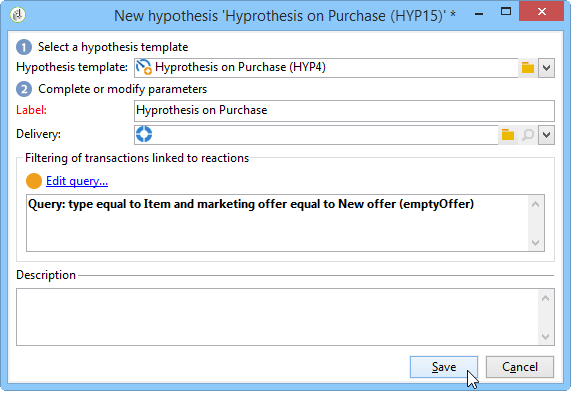

# 가설 만들기{#creating-hypotheses}

가설을 만들거나 캠페인 제안이나 전달에 연결할 수 있는 여러 가지 방법이 있습니다.

* 기존 템플릿을 기반으로 새 가설을 만들고 기존 게재에 연결하여 **[!UICONTROL Measurement hypotheses]** 폴더를 통해 추가합니다.
* 캠페인의 **[!UICONTROL Edit]** > **[!UICONTROL Measurement]** 탭을 통해
* 캠페인에서 만든 게재의 **[!UICONTROL Measurement]** 옵션을 통해.

마케팅 캠페인을 실행하고 수신자가 배달을 받은 경우에만 가설을 계산할 수 있습니다. 이 가설이 제안 제안을 기반으로 하는 경우 후자는 최소한 제시되어야 하며 여전히 활동적입니다. 오퍼 및 전달 가설이 **[!UICONTROL Measurement hypotheses]** 폴더를 통해 만들어지며 가설 템플릿을 기반으로 합니다. 하지만 캠페인이 시작되기 전에 게재 또는 캠페인에서 직접 가설을 참조할 수 있습니다. 이 경우 마케팅 캠페인이 실행되면 가설 템플릿 실행 설정을 참조하십시오.

## 신속하게 가설 작성 {#creating-a-hypothesis-on-the-fly-on-a-delivery}

기존 게재에 가설을 만들려면 다음 프로세스를 적용합니다.

>[!NOTE]
>
>이 작업은 보류 중인 배달에만 가능합니다.

1. Adobe Campaign 트리에서 로 **[!UICONTROL Campaign management > Measurement hypotheses]**&#x200B;이동합니다.
1. 버튼을 클릭하거나 **[!UICONTROL New]** 가설 목록을 마우스 오른쪽 버튼으로 클릭한 다음 드롭다운 목록에서 **[!UICONTROL New]** 선택합니다.

   

1. 가설 창에서 이전에 만든 템플릿을 선택합니다(가설 템플릿 [참조](../../campaign/using/hypothesis-templates.md)).

   

   선택한 모델에서 정의된 가설 컨텍스트가 창에 표시됩니다.

   >[!NOTE]
   >
   >템플릿에 정의되어 있지만 이 단계에서 볼 수 없는 설정은 메모리에 보관되어 진행 중인 가설을 재할당합니다.

   

1. 가설을 만들 전달을 선택합니다.

   

1. 가설을 원하는 대로 **[!UICONTROL General]**&#x200B;및 **[!UICONTROL Transactions]** 탭을 편집하여 가설을 개인화할 수 **[!UICONTROL Scope]** 있습니다. 자세한 내용은 가설 모델 [만들기를 참조하십시오](../../campaign/using/hypothesis-templates.md#creating-a-hypothesis-model).
1. 을 클릭하여 가설을 **[!UICONTROL Start]**&#x200B;시작합니다.

   측정을 수행하도록 워크플로우가 자동으로 생성됩니다. 가설 구성에 따라 이름이 자동으로 정의됩니다.

   >[!CAUTION]
   >
   >이 **[!UICONTROL Keep execution workflow]** 상자를 선택하면 액세스할 수 있습니다.\
   >이 옵션은 가설을 실행하는 동안 오류가 발생하는 경우 디버깅용으로만 활성화해야 합니다. 자동으로 생성된 워크플로우는 Adobe Campaign 탐색기의 **[!UICONTROL Administration]** > **[!UICONTROL Production]** > **[!UICONTROL Objects created automatically]** > **[!UICONTROL Campaign workflows]** 폴더에 저장됩니다.
   > 
   >또한 자동으로 생성된 워크플로우는 수정되지 않아야 합니다. 최종 수정은 추후 계산을 위해 다른 곳에서 고려되지 않을 것이다.
   >
   >이 옵션을 선택한 경우 워크플로우를 실행한 후 삭제합니다.

   

   계산이 완료되면 측정 지표가 자동으로 업데이트됩니다.

   

1. 필요한 경우 설정을 변경하고 가설을 다시 시작합니다.

## 캠페인 전달의 가설 참조 {#referencing-a-hypothesis-in-a-campaign-delivery}

시작하기 전에 마케팅 캠페인에서 가설을 참조할 수 있습니다. 이 경우 가설 템플릿에 정의된 실행 설정에 따라 게시가 전송되면 가설이 자동으로 시작됩니다. 게재에서 가설을 만들려면 다음 프로세스를 적용합니다.

1. 필요에 따라 가설 모델 만들기에 설명된 대로 하나 이상의 **[!UICONTROL Delivery]** 문자 [템플릿을 만들 수 있습니다](../../campaign/using/hypothesis-templates.md#creating-a-hypothesis-model)
1. 마케팅 캠페인 및 타깃팅 워크플로우를 만듭니다.
1. 배달 창에서 **[!UICONTROL Delivery measurement]** 아이콘을 클릭합니다.
1. 가설 템플릿을 선택합니다(모델에 구성된 쿼리가 가설 창에 표시됨).

   가설이 완료되면 모델에 구성된 날짜를 기준으로 캠페인이 완료되면 자동으로 계산됩니다(가설 템플릿 [실행 설정](../../campaign/using/hypothesis-templates.md#hypothesis-template-execution-settings)참조).

   

## 캠페인에 대한 게재에 기본 가설 추가 {#adding-a-default-hypothesis-to-deliveries-for-a-campaign}

캠페인 수준에서 가설을 직접 참조할 수 있습니다. 이 경우 가설이 캠페인에 생성된 모든 게재에 자동으로 연결됩니다. 이렇게 하려면:

1. 캠페인의 **[!UICONTROL Edit]** 탭으로 이동합니다.
1. 측정 섹션에서 **[!UICONTROL Default hypotheses]** 탭을 클릭합니다.

   

1. 가설 템플릿을 **[!UICONTROL Add]** 클릭하고 선택합니다.

   

   이제 이 템플릿을 기반으로 한 가설이 캠페인에 대한 새 게재 각각에 기본적으로 참조됩니다.

   

가설 결과는 가설 **[!UICONTROL General]** 및 **[!UICONTROL Reactions]** 탭에서 볼 수 있습니다(가설 추적 [참조](../../campaign/using/hypothesis-tracking.md))

자세한 내용은 예를 [참조하십시오.게재와](#example--creating-a-hypothesis-linked-to-a-delivery)연결된 가설 만들기.

## 오퍼에 가설 만들기 {#creating-a-hypothesis-on-an-offer}

오퍼 제안에서 가설을 만드는 것은 즉시 전달 가설을 작성하는 것과 비슷합니다. 이 가설이 유효한 한 실행될 수 있습니다. 계산 기간은 제안 날짜를 기반으로 합니다. 가설을 통해 수신자를 구매에 연결할 수 있으면, 수락될 가능성이 있는 오퍼 제안의 상태가 자동으로 변경될 수 있습니다(자세한 내용은 거래 참조 ).

1. 가설 모델 **[!UICONTROL Offer]** 만들기에 설명된 대로 하나 이상의 [유형 모델을](../../campaign/using/hypothesis-templates.md#creating-a-hypothesis-model)만듭니다.
1. 노드로 **[!UICONTROL Campaign management > Measurement hypotheses]** 이동합니다.
1. 이전에 만든 모델을 선택하여 **[!UICONTROL Offers]** 문자 가설을 만듭니다.

   

   모델에서 생성된 쿼리가 창에 나타납니다.

   

1. 가설을 만들 오퍼를 선택합니다.

   

1. 필요한 경우 쿼리를 수정합니다.
1. 을 **[!UICONTROL Start]** 클릭하여 가설을 실행합니다.
1. 가설 결과는 **[!UICONTROL General]** 및 **[!UICONTROL Reactions]** 탭에서 볼 수 있습니다(가설 추적 [참조](../../campaign/using/hypothesis-tracking.md)).

   오퍼에 대한 가설이 **[!UICONTROL Measurement]** 탭에서 참조됩니다.

   

   가설 템플릿에서 옵션이 활성화된 경우, 오퍼 제안의 상태가 자동으로 변경되므로 캠페인이 미치는 영향에 대한 피드백을 제공할 수 **[!UICONTROL Update offer proposition status]** 있습니다 .

## 예:게재에 연결된 가설 만들기 {#example--creating-a-hypothesis-linked-to-a-delivery}

이 예에서는 게재와 연결된 가설을 만듭니다. 이 가설은 이전에 만든 모델을 기반으로 합니다(예 [참조:게재](../../campaign/using/hypothesis-templates.md#example--creating-a-hypothesis-template-on-a-delivery)시 가설 템플릿 만들기). 그런 다음 모델에서 상속된 쿼리를 수정하여 구매 테이블의 특정 아티클에 가설을 적용합니다.

1. 캠페인 및 게재 만들기(자세한 내용은 캠페인 [만들기를](../../campaign/using/setting-up-marketing-campaigns.md#creating-a-campaign)참조하십시오).

   이 예에서는 DM 유형 배달을 사용합니다.

1. 시드 주소 구성:이전에 만든 가설 템플릿은 반응 결과에서 제어 그룹을 고려하도록 구성되었습니다.

   

   >[!NOTE]
   >
   >자세한 내용은 제어 그룹 [정의를](../../campaign/using/marketing-campaign-deliveries.md#defining-a-control-group)참조하십시오.

1. 아이콘을 **[!UICONTROL Direct mail delivery]** 열고 **[!UICONTROL Delivery measurement]** 아이콘을 클릭한 다음 을 클릭합니다 **[!UICONTROL Add]**.

   

1. 드롭다운 목록에서 이전에 만든 가설 템플릿을 선택합니다.

   

   모델에서 생성된 쿼리가 표시됩니다.

   

1. 가설에 영향을 줄 제품을 입력하여 쿼리를 **[!UICONTROL Edit query...]** 클릭하고 수정합니다.

   

   가설이 캠페인의 **[!UICONTROL Edit]** > **[!UICONTROL Measurement]** 탭에서 게재와 연결되어 있는지 확인할 수 있습니다.

   

1. 타깃팅 워크플로우를 실행하고 캠페인이 완료될 때까지 필요한 검사를 실행합니다(이 방법에 대한 자세한 내용은 [게재](../../campaign/using/marketing-campaign-deliveries.md#starting-a-delivery)시작을 참조하십시오).

   

1. Adobe Campaign 트리에서 **[!UICONTROL Campaign management > Measurement hypotheses]** 노드로 이동하여 가설을 통해 계산된 지표를 확인합니다.

   

