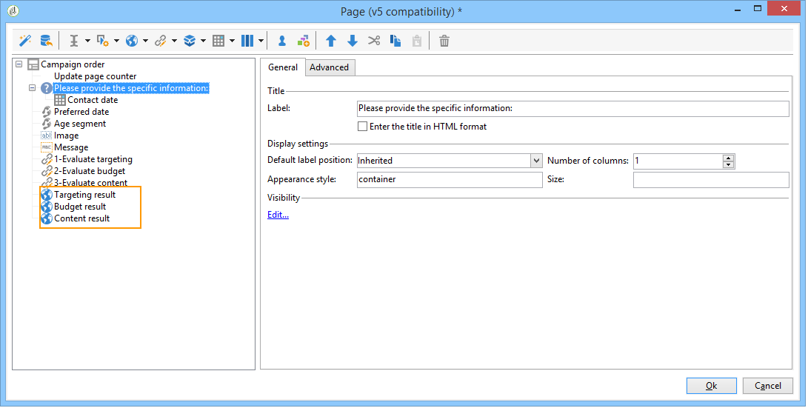
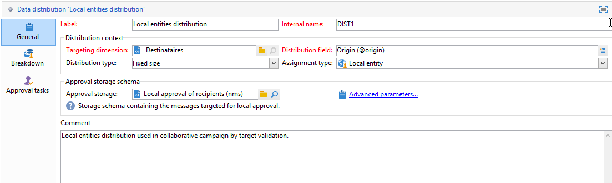

# 예{#examples}

## 로컬 캠페인 만들기(양식별) {#creating-a-local-campaign--by-form-}

By **양식** 유형 웹 인터페이스는 웹 애플리케이션을 **사용하는**&#x200B;것과 관련됩니다. 구성에 따라 이 웹 응용 프로그램에는 정의된 맞춤형 요소의 모든 유형이 포함될 수 있습니다. 예를 들어 타겟, 예산, 컨텐츠 등을 평가하는 링크를 제안할 수 있습니다. 전용 API를 통해

>[!NOTE]
>
>API는 계약에 따라 액세스 권한이 부여된 전용 문서에 자세히 설명되어 있습니다. API를 [참조하십시오](../../configuration/using/about-web-services.md).
>
>이 예제에서 사용되는 웹 응용 프로그램은 Adobe Campaign과 함께 즉시 사용 가능한 웹 앱이 아닙니다. 캠페인에서 양식을 사용하려면 전용 웹 응용 프로그램을 만들어야 합니다.

캠페인 템플릿을 만들 때 **[!UICONTROL Zoom]** 링크의 **[!UICONTROL Web interface]** **[!UICONTROL Advanced campaign settings...]** 옵션 내에 있는 아이콘을 클릭하여 웹 애플리케이션의 세부 정보에 액세스합니다.


>[!NOTE]
>
>웹 애플리케이션 매개 변수는 캠페인 템플릿에서만 사용할 수 있습니다.

탭에서 캠페인 **[!UICONTROL Edit]** 주문 **** 활동을 선택하고 열어 해당 컨텐츠에 액세스합니다.


이 예에서는 캠페인 **주문** 활동에 다음이 포함됩니다.

* 주문 중에 로컬 엔티티가 입력할 필드,

   

* 로컬 엔티티가 캠페인을 평가할 수 있도록 해주는 링크(예: 대상, 예산, 컨텐츠 등),

   

* 이러한 평가의 결과를 계산하고 표시할 수 있는 스크립트입니다.

   

이 예에서는 다음 API가 사용됩니다.

* 타겟 평가를 위해

   ```
   var res = nms.localOrder.EvaluateTarget(ctx.localOrder);
   ```

* 예산 평가를 위해

   ```
   var res = nms.localOrder.EvaluateDeliveryBudget(ctx.@deliveryId, NL.XTK.parseNumber(ctx.@compt));
   ```

* 컨텐츠 평가를 위해

   ```
   var res = nms.localOrder.EvaluateContent(ctx.localOrder, ctx.@deliveryId, "html", resSeed.@id);
   ```

## 협업 캠페인 만들기(타겟 승인별) {#creating-a-collaborative-campaign--by-target-approval-}

### 소개 {#introduction}

여러분은 온라인 스토어와 여러 개의 부티크가 있는 대형 의류 브랜드의 마케팅 매니저입니다. 봄이 왔으니, 우수 고객에게 카탈로그의 모든 옷을 50% 할인된 특가 상품을 만들기로 결심하셨을 것입니다.

이 할인 혜택은 연초부터 300달러 이상을 지출한 미국 내 우량 고객을 대상으로 마련되었습니다.

따라서 Distributed Marketing을 사용하여 공동 작업 캠페인(타겟 승인 기준)을 만듭니다. 이 캠페인을 사용하면 특별 오퍼가 포함된 이메일 배달을 받을 스토어의 가장 적합한 클라이언트(지역별 그룹핑)를 선택할 수 있습니다.

이 예제의 첫 번째 부분에서는 캠페인 만들기 알림을 받는 로컬 엔티티와 이를 사용하여 캠페인을 평가하고 순서를 지정하는 방법을 보여 줍니다.

이 예제의 두 번째 부분에서는 캠페인을 만드는 방법을 설명합니다.

단계는 다음과 같습니다.

**로컬 엔티티의 경우**

1. 캠페인 만들기 알림을 사용하여 중앙 엔티티에서 선택한 연락처 목록에 액세스합니다.
1. 연락처를 선택하고 참여를 승인합니다.

**중앙 엔티티의 경우:**

1. 활동을 **[!UICONTROL Data distribution]** 만듭니다.
1. 공동 작업 캠페인을 만듭니다.
1. 캠페인을 게시합니다.

### 로컬 엔티티 면 {#local-entity-side}

1. 캠페인에 참여하도록 선택한 로컬 엔티티는 이메일 알림을 받게 됩니다.

   

1. 링크를 클릭하면 로컬 엔티티에는 캠페인에 대해 선택한 클라이언트 목록에 대한 액세스(웹 브라우저를 통해)가 부여됩니다. **[!UICONTROL Access your contact list and approve targeting]**

   

1. 연초부터 유사한 오퍼를 위해 이미 연락되었기 때문에 로컬 엔티티는 목록에서 특정 연락처를 확인하지 않습니다.

   

검사가 승인되면 캠페인은 자동으로 시작할 수 있습니다.

### 중앙 엔티티 면 {#central-entity-side}

#### 데이터 배포 활동 만들기 {#creating-a-data-distribution-activity}

1. 공동 작업 캠페인을 설정하려면(타겟 승인별) 먼저 캠페인을 만들어야 합니다 **[!UICONTROL Data distribution activity]**. 노드의 **[!UICONTROL New]** 아이콘을 **[!UICONTROL Resources > Campaign management > Data distribution]** 클릭합니다.

   

1. 탭에서 다음을 **[!UICONTROL General]** 지정해야 합니다.

   * 를 **[!UICONTROL Targeting dimension]**&#x200B;참조하십시오. 여기에서 **데이터 배포는** 수신자에게 **수행됩니다**.
   * 를 **[!UICONTROL Distribution type]**&#x200B;참조하십시오. 고정 크기 **또는** 크기를 **백분율로**&#x200B;선택할 수 있습니다.
   * 를 **[!UICONTROL Assignment type]**&#x200B;참조하십시오. 로컬 **엔티티** 옵션을 선택합니다.
   * 를 **[!UICONTROL Distribution type]**&#x200B;참조하십시오. 이 필드는 연락처와 로컬 엔티티 사이의 관계를 식별할 수 있는 수신자 테이블에 있는 **[!UICONTROL Origin (@origin)]** 필드입니다.
   * 필드를 **[!UICONTROL Approval storage]** 참조하십시오. 수신자의 **로컬 승인** 옵션을 선택합니다.

1. 탭에서 다음을 **[!UICONTROL Breakdown]** 지정합니다.

   * 이 **[!UICONTROL Distribution field value]**&#x200B;값은 향후 캠페인에 관련된 로컬 개체에 해당합니다.
   * 로컬 엔티티입니다 **[!UICONTROL label]**.
   * (고정 또는 백분율) **[!UICONTROL Size]** 을 나타냅니다. 기본값 **0은** 로컬 엔티티에 연결된 모든 수신자를 선택하는 것을 포함합니다.
   

1. 새로운 데이터 배포를 저장합니다.

#### 협업 캠페인 만들기 {#creating-a-collaborative-campaign}

1. 노드에서 새 **[!UICONTROL Campaign management > Campaign]** 노드를 만듭니다 **[!UICONTROL collaborative campaign (by target approval)]**.
1. 탭에서 캠페인에 대한 워크플로우를 **[!UICONTROL Targeting and workflows]** 만듭니다. 여기에는 활동에 **의해** 정의된 분할 **[!UICONTROL Record count limitation]** 활동이 **[!UICONTROL Data distribution]** 포함되어야 합니다.

   

1. 지정할 수 있는 **[!UICONTROL Local approval]** 작업을 추가합니다.

   * 알림에서 로컬 엔티티로 전송될 메시지 컨텐츠,
   * 승인 알림
   * 캠페인의 예상 처리.
   

1. 기록을 저장합니다.

#### 캠페인 게시 {#publishing-the-campaign}

이제 캠페인 **우주에서 캠페인 패키지를** 추가할 수 **있습니다** .

1. 원하는 컨텐츠를 **[!UICONTROL Reference campaign]**&#x200B;선택하십시오. 패키지의 **[!UICONTROL Edit]** 탭에서 캠페인에 사용할 **[!UICONTROL Approval mode]** 항목을 선택할 수 있습니다.

   * 수동 **** 모드에서 로컬 엔티티가 중앙 엔티티의 초대를 수락하면 캠페인에 참여합니다. 사전 선택된 연락처가 원하는 경우 삭제할 수 있으며 관리자의 승인이 캠페인 참여를 확인하는 데 필요합니다.
   * 자동 **** 모드에서 로컬 엔티티는 캠페인에서 자신의 등록을 취소하지 않는 한 캠페인에 참여해야 합니다. 승인 없이 연락처를 삭제할 수 있습니다.
   

1. 탭에서 캠페인에 대한 설명과 로컬 엔티티로 전송할 문서를 추가할 수 있습니다. **[!UICONTROL Description]**

   

1. 캠페인 패키지를 승인한 후 워크플로우를 시작하여 패키지를 게시하고 패키지 목록의 모든 로컬 엔티티에서 사용할 수 있도록 합니다.

   

## 협업 캠페인 만들기(양식별) {#creating-a-collaborative-campaign--by-form-}

### 소개 {#introduction-1}

여러분은 온라인 스토어와 여러 개의 부티크가 있는 대형 화장품 브랜드의 마케팅 매니저입니다. 겨울 재고를 언로드하고 새 재고를 위한 공간을 확보하려면 다음 두 가지 클라이언트 카테고리를 대상으로 하는 특별 오퍼를 만듭니다.나이 들어가는 민감한 피부관리 제품을 제공할 30대 이상, 그리고 보다 기본적인 피부 관리 제품을 제공할 30대 이하.

따라서 Distributed Marketing을 사용하여 연령 범위별로 서로 다른 저장소에서 클라이언트를 선택할 수 있도록 해주는 양식별 협업 캠페인을 만듭니다. 이러한 고객은 연령 범위에 따라 개인화된 특별 프로모션을 통해 이메일을 수신하게 됩니다.

이 예제의 첫 번째 부분에서는 캠페인 만들기 알림을 받는 로컬 엔티티와 이를 사용하여 캠페인을 평가하고 순서를 지정하는 방법을 보여 줍니다.

이 예제의 두 번째 부분에서는 캠페인을 만드는 방법을 설명합니다.

단계는 다음과 같습니다.

**로컬 엔티티의 경우**

1. 캠페인 만들기 알림을 사용하여 온라인 양식에 액세스합니다.
1. 캠페인(타겟, 컨텐츠, 전달 볼륨)을 개인화합니다.
1. 이러한 필드를 확인하고 필요한 경우 변경합니다.
1. 기여도 승인
1. 로컬 엔티티(또는 중앙 엔티티)의 관리자가 사용자의 구성 및 참여를 승인합니다.

**중앙 엔티티의 경우:**

1. 공동 작업 캠페인을 만듭니다.
1. 로컬 캠페인에 대해 **[!UICONTROL Advanced campaign settings...]** 원하는 대로 구성합니다.
1. 로컬 캠페인에서처럼 캠페인 워크플로우와 배달을 구성합니다.
1. 웹 양식을 업데이트합니다.
1. 캠페인 패키지를 만들고 게시합니다.

### 로컬 엔티티 면 {#local-entity-side-1}

1. 캠페인에 참여하도록 선택한 로컬 엔티티는 캠페인에 참여한다는 내용의 이메일 알림을 받습니다.

   

1. 로컬 엔티티는 맞춤형 양식을 작성한 다음 다음을 수행합니다.

   * 타겟과 예산을 평가하고
   * 전달 내용 미리 보기,
   * 참여 승인

      

1. 주문 유효성 확인을 담당하는 연산자가 해당 참가자를 승인합니다.

   

### 중앙 엔티티 면 {#central-entity-side-1}

1. 양식별 협업 캠페인을 구현하려면 협업 캠페인( **양식별)** 템플릿을 사용하여 캠페인을 만들어야 합니다.

   

1. 캠페인의 **[!UICONTROL Edit]** 탭에서 링크를 클릭하여 **[!UICONTROL Advanced campaign settings...]** 링크를 로컬 캠페인으로 구성합니다. 로컬 [캠페인 만들기(양식별)를 참조하십시오](#creating-a-local-campaign--by-form-).

   

1. 캠페인 워크플로우와 웹 양식을 구성합니다. 로컬 [캠페인 만들기(양식별)를 참조하십시오](#creating-a-local-campaign--by-form-).
1. 실행 일정 및 관련 로컬 엔티티를 지정하여 캠페인 패키지를 만듭니다.

   

1. 탭에서 승인 모드를 선택하여 패키지 구성을 **[!UICONTROL Edit]** 완료합니다.

   

1. 이 **[!UICONTROL Description]** 탭에서 캠페인 패키지 설명, 패키지가 게시될 때 로컬 엔티티에 전송될 알림 메시지를 입력하고 캠페인 패키지에 정보를 제공하는 문서를 첨부할 수 있습니다.

   

1. 패키지를 승인하여 게시합니다.

   

