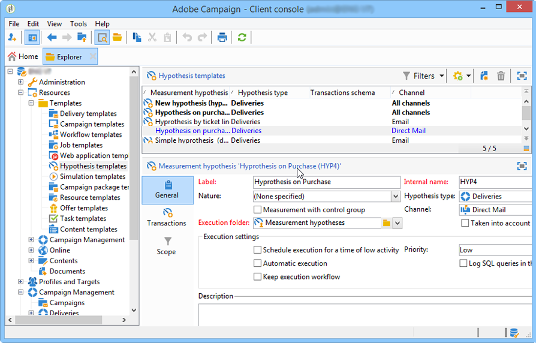

# 가설 틀{#hypothesis-templates}

## 가설 모델 만들기 {#creating-a-hypothesis-model}

가설 템플릿을 구성하면 전달 또는 오퍼에 대해 반응 측정 컨텍스트를 정의할 수 있습니다. 여기에서 개인, 가설 및 거래 테이블 간의 관계를 정의하는 테이블을 비롯하여 다양한 측정 테이블이 참조됩니다.

가설 템플릿을 만들려면 다음 단계를 수행하십시오.

1. Adobe Campaign 탐색기에서 을 클릭합니다 **[!UICONTROL Resources>Templates>Hypothesis templates]**.

   

1. 템플릿 목록을 **[!UICONTROL New]** 클릭하거나 마우스 오른쪽 단추로 클릭하고 드롭다운 목록에서 **[!UICONTROL New]** 선택합니다.
1. 가설 레이블을 입력합니다.
1. 템플릿을 오퍼에 대한 가설이나 오퍼를 통해 배달할 것인지 여부를 **[!UICONTROL Hypothesis type]**&#x200B;지정합니다.
1. 형식 템플릿의 경우, 컨트롤 그룹과 함께 측정을 수행할지 아니면 제어 그룹을 사용하지 않는지를 지정합니다(자세한 내용은 가설 템플릿의 **[!UICONTROL Delivery]** 속성 참조).
1. 템플릿 **[!UICONTROL Delivery]** 유형의 경우, 특정 채널을 선택하거나 **[!UICONTROL Channel]** 드롭다운 목록을 사용하여 Adobe Campaign에서 사용 가능한 모든 채널에 템플릿을 적용할 수 있습니다(가설 템플릿의 [속성 참조](#properties-of-a-hypothesis-template)).
1. 만들 **[!UICONTROL Execution folder]** 가설을 선택하고 이 템플릿에서 만들 가설을 자동으로 실행합니다.
1. 실행 설정을 선택합니다(자세한 내용은 [가설 템플릿 실행 설정을](#hypothesis-template-execution-settings)참조하십시오).
1. 가설 계산 기간을 지정합니다(자세한 내용은 가설 템플릿 [실행 설정을](#hypothesis-template-execution-settings)참조하십시오).

   >[!CAUTION]
   >
   >이 기간은 연락처 날짜로부터 결정됩니다.

1. 이 **[!UICONTROL Transactions]** 탭에서 가설 계산에 필요한 테이블 및 필드를 지정합니다(자세한 내용은 트랜잭션을 [참조하십시오](#transactions)).
1. 템플릿이 **[!UICONTROL Offer]** 유형 가설을 위해 구성된 경우 **[!UICONTROL Update offer proposition status]** 옵션을 활성화할 수 있습니다.이 경우 변경할 제안 제안의 상태를 선택합니다.
1. 가설 애플리케이션의 범위를 지정합니다(자세한 내용은 가설 [경계선을](#hypothesis-perimeter)참조하십시오).
1. 필요한 경우 스크립트를 사용하여 필터링을 완료합니다(자세한 내용은 [가설 경계](#hypothesis-perimeter)참조).

### 가설 템플릿의 속성 {#properties-of-a-hypothesis-template}

템플릿의 **[!UICONTROL General]** 탭에서는 일반 템플릿 옵션을 지정할 수 있습니다. 사용 가능한 필드는 다음과 같습니다.

* **[!UICONTROL Hypothesis type]**:템플릿을 배달 또는 오퍼에 대한 가설을 사용할 것인지 여부를 결정할 수 있습니다.

   게재와 오퍼 모두에 적용되는 가설을 만들 수도 있습니다.

   >[!NOTE]
   >
   >템플릿이 오퍼에 적용되는 경우, 이 **[!UICONTROL Update offer proposition status]** 옵션은 **[!UICONTROL Transactions]** 탭에서 사용할 수 있습니다.

* **[!UICONTROL Measurement with control group]**:게재 또는 캠페인에 대해 제어 그룹이 정의되었는지 여부를 표시하고 측정 지표에 포함할 수 있습니다. 배달을 받지 않는 제어 그룹을 사용하면 배달을 받은 대상 모집단과 비교하여 게재 후의 캠페인 효과를 측정할 수 있습니다.

   >[!NOTE]
   >
   >제어 그룹을 고려하도록 템플릿이 구성되었지만 가설이 관련된 그룹이 전달에 정의되어 있지 않으면 결과가 타깃팅된 수신자만을 기반으로 합니다.

   제어 그룹 정의 및 구성에 대한 자세한 내용은 제어 [그룹](../../campaign/using/marketing-campaign-deliveries.md#defining-a-control-group)정의를 참조하십시오.

* **[!UICONTROL Channel]**:드롭다운 목록에서 선택하여 특정 채널을 선택하거나 Adobe Campaign 콘솔의 모든 채널에서 가설 템플릿을 사용할 수 **[!UICONTROL All channels]** 있도록 할 수 있습니다. 특정 채널에 대한 템플릿을 구성하는 경우 가설을 만들 때 채널당 전달을 자동으로 필터링할 수 [있습니다(가설 만들기 참조](../../campaign/using/creating-hypotheses.md)).

   

* **[!UICONTROL Execution folder]**:가설을 위한 실행 폴더를 지정할 수 있습니다.
* **[!UICONTROL Taken into account in campaign ROI calculation]**:관련 캠페인에 대한 ROI 계산에 가설 결과를 고려합니다.

### 가설 템플릿 실행 설정 {#hypothesis-template-execution-settings}

템플릿의 **[!UICONTROL General]** 탭에서는 가설 실행 매개 변수를 지정할 수도 있습니다. 사용 가능한 옵션은 다음과 같습니다.

* **[!UICONTROL Schedule execution for a time of low activity]**:adobe Campaign 성과를 최적화하기 위해 가설 시작을 예약할 수 있습니다. 이 옵션을 선택하면 캠페인의 처리 워크플로우가 중단 시간 동안 가설을 계산합니다.

   

* **[!UICONTROL Priority]**:동시 실행이 있는 경우 가설 계산 순서를 도출하기 위해 가설을 적용하는 수준.

   

* **[!UICONTROL Automatic execution]**:필요한 경우 가설 재계산을 예약할 수 있습니다(예를 들어 게시가 끝날 때까지 지표를 정기적으로 업데이트하려면).

   

   일정을 지정하려면 다음 프로세스를 적용합니다.

   1. 링크를 클릭한 다음 **[!UICONTROL Frequency of execution...]** **[!UICONTROL Change...]** 단추를 클릭합니다.

      

   1. 빈도, 관련 이벤트 및 유효 기간을 구성합니다.

      

   1. 예약을 **[!UICONTROL Finish]** 저장하려면 을 클릭합니다.

      

* **[!UICONTROL Log SQL queries in journal]**:이 함수는 전문가 사용자를 위해 예약되어 있습니다. 측정 가설 감사에 탭을 추가하여 SQL 쿼리를 표시할 수 있습니다. 이렇게 하면 시뮬레이션이 오류와 함께 끝날 경우 가능한 오류 감지 기능이 활성화됩니다.
* **[!UICONTROL Keep execution workflow]**:가설 계산을 시작할 때 자동으로 생성된 워크플로우를 유지할 수 있습니다. 이 옵션을 선택한 템플릿에서 만든 가설에서 생성된 워크플로우를 따라 수행할 수 있습니다.

   >[!CAUTION]
   >
   >이 옵션은 가설을 실행하는 동안 오류가 발생하는 경우 디버깅용으로만 활성화해야 합니다.\
   >또한 자동으로 생성된 워크플로우는 수정되지 않아야 합니다. 최종 수정은 추후 계산을 위해 다른 곳에서 고려되지 않을 것이다.\
   >이 옵션을 선택한 경우 워크플로우를 실행한 후 삭제합니다.

### 거래 {#transactions}

이 탭에는 거래의 관점에서 수신자 반응 내역을 저장할 수 있는 다양한 필드와 테이블이 포함되어 있습니다. 응답 관리 [전용](../../configuration/using/about-schema-reference.md) 테이블에 대한 자세한 내용은 구성 안내서를 참조하십시오.

* **[!UICONTROL Schema (reaction log storage)]**:수신자 반응 테이블을 선택합니다. Adobe Campaign의 기본 테이블은 NmsRemaMatchRcp **입니다**.
* **[!UICONTROL Transaction schema]**:거래 또는 구매 테이블 등 가설이 신경 쓸 테이블을 선택합니다.
* **[!UICONTROL Querying schema]**:가설을 필터링하기 위한 기준을 선택합니다.
* **[!UICONTROL Link to individuals]**:개인 및 트랜잭션 스키마로 사용된 테이블 간의 링크를 선택합니다.
* **[!UICONTROL Link to the household]**:가설을 포함하여 가정의 모든 구성원을 포함하려면 거래 스키마에서 가문에 대한 링크를 선택합니다. 이 필드는 선택 사항입니다.
* **[!UICONTROL Transaction date]**:이 필드는 선택 사항이지만 가설 계산을 위한 범위를 정의할 수 있으므로 권장됩니다.
* **[!UICONTROL Measurement period]**:가설을 실행하고 구매 라인이 복구되는 시작 및 종료 날짜를 구성할 수 있습니다.

   가설이 게재와 연결되면, 직접 메일 전달을 위한 연락처 날짜 이후 또는 이메일 또는 SMS 전달을 위한 배달 날짜 이후 며칠 후에 자동으로 측정됩니다.

   

   가설이 즉시 실행된다면, 즉시 그것을 자극할 수 밖에 없다. 그렇지 않으면 가설 생성 날짜를 기반으로 구성된 계산 날짜의 구성된 종료 날짜를 기반으로 자동으로 트리거됩니다( [전달을](../../campaign/using/creating-hypotheses.md#creating-a-hypothesis-on-the-fly-on-a-delivery)통해 가설 만들기 참조).

* **[!UICONTROL Transaction/Margin amount]**:이러한 필드는 선택 사항이며 자동 이직률 표시기를 계산할 수 [있습니다](../../campaign/using/hypothesis-tracking.md#indicators).
* **[!UICONTROL Unit amount]**:매출을 계산하기 위한 금액을 설정할 수 [있습니다](../../campaign/using/hypothesis-tracking.md#indicators).

   

* **[!UICONTROL Additional measures and data]**:여러 테이블의 필드에서 추가 보고 측정값이나 축을 지정할 수 있습니다.
* **[!UICONTROL Update offer proposition status]**:오퍼 수신자가 가설을 통해 식별되는 경우 오퍼 제안의 상태를 변경할 수 있습니다.

   

### 가설 경계 {#hypothesis-perimeter}

거래 테이블 및 가설이 관련된 필드를 정의했으면 필터를 사용하여 타깃팅된 거래 및 제공을 지정하여 가설을 세부적으로 조정할 수 있습니다. JavaScript 스크립트를 사용하여 트랜잭션 테이블에서 참조된 제품을 명시적으로 지정할 수도 있습니다.

* **트랜잭션**&#x200B;필터링:탭에서 가설을 필터링할 수 **[!UICONTROL Scope]** 있습니다. 이렇게 하려면:

   1. 링크를 **[!UICONTROL Edit query]** 클릭합니다.

      

   1. 필터링 조건을 지정합니다.

      

   1. 가설에 영향을 줄 거래를 선택합니다.

      

* **받는 사람**&#x200B;필터링:이 **[!UICONTROL Scope]** 탭에서 메시지와 연결된 정보(배달, 수신자, 이메일 주소, 서비스 등)로 가설을 제한할 수 있습니다.

   1. 링크를 **[!UICONTROL Add a filter]** 클릭한 다음 **[!UICONTROL Edit query]**&#x200B;을 클릭합니다.

      

   1. 필터링 조건을 지정합니다.

      

   1. 쿼리를 **[!UICONTROL Finish]** 저장하려면 을 클릭합니다.

      

* **스크립트**:javascript 스크립트를 사용하여 가설 설정을 실행하는 동안 동적으로 오버로드를 처리할 수 있습니다.

   이렇게 하려면 **[!UICONTROL Advanced settings]** 링크를 클릭한 다음 원하는 스크립트를 입력합니다.

   >[!NOTE]
   >
   >이 옵션은 전문가 사용자용입니다.

   

## 예:전달에 가설 템플릿 만들기 {#example--creating-a-hypothesis-template-on-a-delivery}

이 예에서는 직접 메일 유형 배달에 대한 가설 템플릿을 만듭니다. 가설을 기반으로&#x200B;**하는 거래 테이블** (예: 구매)에는 아티클 또는 제품에 연결된 구매 라인이 포함됩니다. 구매 테이블에서 아티클 또는 제품에 대한 가설을 작성할 수 있도록 모델을 구성하려고 합니다.

1. Adobe Campaign 탐색기에서 **[!UICONTROL Resources > Templates > Hypothesis templates]** 노드로 이동합니다.
1. 아이콘을 **[!UICONTROL New]** 클릭하여 템플릿을 만듭니다.

   

1. 템플릿 레이블을 변경합니다.

   

1. 가설 **[!UICONTROL Deliveries]** 유형으로 선택합니다.
1. 관련 상자를 선택하여 배달에 제어 그룹이 포함될 수 있도록 지정합니다.
1. 채널을 **[!UICONTROL Direct mail]** 선택합니다.

   >[!NOTE]
   >
   >템플릿은 DM 게재에만 적용되므로 이 모델을 사용하여 만든 가설은 다른 배달 유형에 연결되지 않을 수 있습니다.

1. 탭에서 수신자 **[!UICONTROL Transactions]** 반응 표를 선택합니다.

   

1. 필드에서 **[!UICONTROL Transactions schema]** 구매 테이블을 선택합니다.

   

1. 필드에서 구매 라인을 **[!UICONTROL Querying schema]** 선택합니다.

   

1. 구매 테이블에 연결된 수신자를 선택합니다.

   

1. 구매 날짜에 연결된 필드를 선택합니다.

   이를 통해 가설을 위한 시간대를 정의할 수 있습니다. 이 단계는 필수는 아니지만 권장됩니다.

   

1. 5-25일 동안 계산 기간을 구성합니다.

   

1. 탭에서 **[!UICONTROL Scope]** 을 클릭하여 **[!UICONTROL Edit query]** 가설 필터를 만듭니다.

   

   이렇게 만들어진 템플릿을 사용하면 구매 테이블의 제품 또는 문서에 대한 가설을 실행할 수 있습니다.

1. 아이콘을 **[!UICONTROL Save]** 클릭하여 템플릿을 기록합니다.

