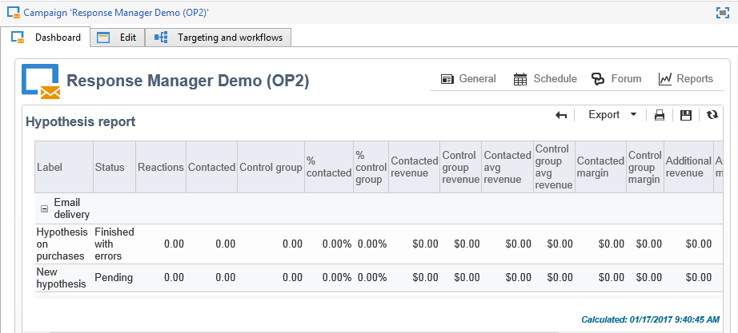

# 가설 추적{#hypothesis-tracking}

가설 계산의 결과는 Adobe Campaign 플랫폼의 다양한 수준에서 사용할 수 있습니다.가설을 통해 계산된 지표 및 타겟 모집단 반응은 실제 가설을 통해서도 볼 수 있고 캠페인 및 전달을 통해 제공되는 가설 보고서에서도 볼 수 있습니다.

## 가설 결과 {#hypothesis-results}

### 지표 {#indicators}

가설이 계산되면 몇 가지 측정 표시기가 자동으로 업데이트됩니다. 이러한 내용은 가설 **[!UICONTROL General]** 탭에 있습니다.

이러한 지표는 다음과 같습니다.

* **응답자 연락처**&#x200B;수:가설에 일치하는 접촉된 개인의 수.
* **응답률**:배달 중 연락한 총 응답자 수/응답자 수.
* **응답자 제어 그룹 연락처**&#x200B;수:가설을 일치시키는 제어 그룹 수입니다.
* **제어 그룹의**&#x200B;응답률:응답자 컨트롤 그룹 수/배달 제어 그룹의 총 수입니다.
* **반응**&#x200B;수:개인, 가설 및 거래 테이블 간의 관계를 포함하는 테이블의 레코드 수

전체 지표 목록을 보려면 **[!UICONTROL Display the list]** 링크를 클릭합니다.

다음 정보는 표시기에서 제공합니다.

* **방문한**&#x200B;모집단의 총 매출액:연락된 개인 수에 대한 총 금액.
* **제어 그룹의**&#x200B;총 매출:제어 그룹 수에 대한 합계 금액.
* **연락처당 평균 매출**:총 금액/접촉됨.
* **제어 그룹의**&#x200B;평균 매출:합계 금액/제어 그룹.
* **연락처당 총 여백**:총 방문자 수
* **제어 그룹의**&#x200B;총 여백:컨트롤 그룹에 대한 총 여백.
* **연락처당 평균 여백**:총 여백/접촉됨.
* **제어 그룹의**&#x200B;평균 여백:전체 여백/제어 그룹
* **추가 매출**:(접촉의 평균 수익 - 제어 그룹의 평균 매출)*접촉된 수
* **추가 여백**:(접촉된 평균 마진 - 제어 그룹의 평균 마진) / 연락 횟수
* **연락처당 평균 비용**:계산된 배달 비용/연락처 수
* **ROI**:배달의 계산된 비용 / 연락처당 총 마진 수
* **효과적인 ROI**:계산된 배달 비용/추가 마진.
* **중요도**:은 캠페인 중요도에 따라 0~3의 값을 포함합니다.

### 반응 {#reactions}

이 **[!UICONTROL Reactions]** 탭을 통해 가설에 대한 수신자의 반응을 볼 수 있습니다.

1. 가설 계산이 완료되면 Adobe Campaign 트리의 **[!UICONTROL Campaign management > Measurement hypotheses]** 노드로 이동합니다.
1. 원하는 가설을 선택하고 **[!UICONTROL Reactions]** 탭을 클릭하여 마케팅 캠페인 다음에 구매할 가능성이 있는 받는 사람 목록을 봅니다.

   

## 보고서 {#reports}

캠페인 및 전달에 대해 수행된 가설을 **[!UICONTROL Hypothesis report]** 볼 수 있습니다. 이 보고서에는 가설을 통해 계산된 지표가 포함되어 있습니다(자세한 내용은 지표 [참조](#indicators)).

* **캠페인 수준에서**:관련 캠페인의 **[!UICONTROL Reports]** 링크를 클릭하고 **[!UICONTROL Hypothesis report]** 이 보고서에는 각 게재에 대해 계산된 가설 및 캠페인 배달 목록이 포함되어 있습니다.

   

* **배달 수준**:보고서에 액세스하려면 관련 배달을 열고 **[!UICONTROL Reports]** 탭에서 을 **[!UICONTROL Summary]** **[!UICONTROL Hypothesis report]**&#x200B;클릭한 다음 동일한 전달을 위해 여러 가지 가설이 계산되면, 보고서에 모든 가설이 포함됩니다.

   
