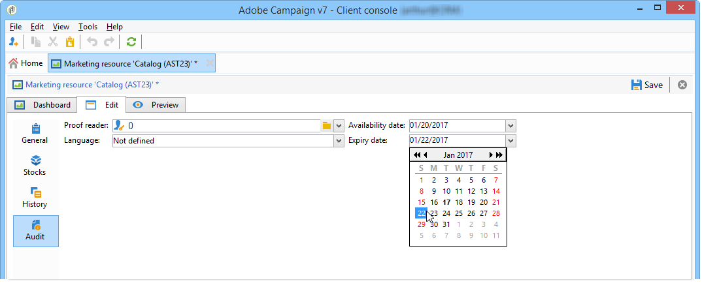
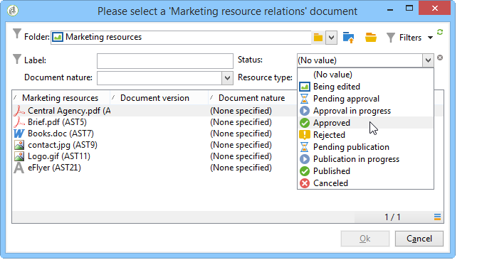

# 마케팅 리소스 관리{#managing-marketing-resources}

Adobe Campaign을 사용하면 캠페인 라이프사이클과 관련된 마케팅 리소스를 관리하고 추적할 수 있습니다. 이러한 마케팅 리소스는 브로셔, 시각 자료 또는 여러 운영업체가 참여하는 기타 커뮤니케이션 매체일 수 있습니다.

Adobe Campaign을 통해 관리되는 각 마케팅 리소스의 상태 및 내역을 언제든지 추적하고 현재 버전을 볼 수 있습니다.

## 마케팅 리소스 추가 {#adding-a-marketing-resource}

마케팅 리소스는 캠페인 공간을 통해 액세스합니다.

리소스를 추가하려면 **[!UICONTROL Create]** 단추를 클릭합니다.

Adobe Campaign 서버에서 리소스를 사용할 수 있게 하려면 편집기에서 리소스를 드래그하여 놓아 원하는 리소스를 추가해야 합니다. 링크를 클릭할 수도 **[!UICONTROL Upload file to server...]** 있습니다.

확인 메시지를 통해 업로드를 시작할 수 있습니다.

업로드가 완료되면 리소스가 사용 가능한 리소스 목록에 추가됩니다. Adobe Campaign 운영자가 액세스할 수 있습니다. 사용자는 **[!UICONTROL Preview]** 탭을 통해 파일을 보거나 복사본을 만들어 수정하거나 서버에서 파일을 업데이트할 수 있습니다( **[!UICONTROL Edit]** 탭 사용).

이 리소스를 모니터링, 추적 및 승인하는 작업을 담당하는 연산자 또는 그룹을 선택하려면 이 **[!UICONTROL General]** 탭을 클릭합니다. 검토자 선택은 **[!UICONTROL Advanced parameters]** 링크를 통해 수행됩니다.

* 리소스가 할당된 연산자는 리소스를 추적할 책임이 있습니다.
* 승인 운영자는 마케팅 리소스를 승인해야 합니다. 리소스 유효성 검사 프로세스가 실행되면 알림을 받게 됩니다.

   검토자가 선택되지 않은 경우 리소스가 승인을 **[!UICONTROL cannot be]** 받아야 합니다.

* 필요한 경우 교정을 지정할 수도 있습니다.

자원에 대한 가용 일자를 지정할 수 있습니다. 이 날짜 이후에는 **[!UICONTROL Late]** 상태가 표시됩니다.

## 리소스 공동 작업 {#collaborative-work-on-resources}

마케팅 리소스를 수정 및 업데이트할 수 있으며, 필요한 경우 다른 Adobe Campaign 운영자에게 알릴 수 있습니다. 다음 작업을 수행할 수 있습니다.

* 리소스를 수정하려면 로컬로 다운로드하십시오.
* 서버에서 파일을 업데이트하여 다른 연산자가 파일에 액세스할 수 있도록 합니다.
* 다른 연산자의 변경을 금지하려면 리소스를 잠급니다.

>[!NOTE]
>
>이 **[!UICONTROL History]** 탭에는 리소스에 대한 다운로드 및 업데이트 로그가 포함되어 있습니다. 이 **[!UICONTROL Details]** 단추를 사용하면 선택한 버전을 볼 수 있습니다.

### 리소스 잠금/잠금 해제 {#locking-unlocking-a-resource}

리소스가 만들어지면 마케팅 리소스 대시보드에서 리소스를 사용할 수 있으며 연산자는 이러한 리소스를 편집하고 수정할 수 있습니다.

연산자가 리소스에서 작업하려는 경우 작업을 시작하기 전에 잠그고 다른 연산자가 동시에 리소스를 수정하지 못하도록 하는 것이 좋습니다. 그런 다음 리소스가 예약됩니다.액세스 가능한 상태로 유지되지만 다른 연산자가 서버에 게시하거나 업데이트할 수 없습니다.

특수 메시지는 액세스를 시도하는 모든 운영자에게 알립니다.

이 **[!UICONTROL Tracking]** 탭에는 리소스를 잠근 연산자의 이름과 계획된 업데이트 날짜가 표시됩니다.

리소스를 잠그려면 리소스 대시보드의 **[!UICONTROL Lock]** 단추를 클릭한 다음 리소스를 클릭해야 합니다.

자원의 **[!UICONTROL Tracking]** 탭에서 계획된 반품 일자를 표시할 수 있습니다.

이 정보를 사용하면 다른 Adobe Campaign 운영자에게 리소스의 잠금을 해제할 날짜를 알려줍니다.

리소스가 업데이트되면 자동으로 잠금 해제되어 모든 연산자가 다시 사용할 수 있게 됩니다.

필요한 경우 대시보드에서 수동으로 잠금을 해제할 수도 있습니다.

>[!NOTE]
>
>리소스를 잠근 연산자와 관리자 권한이 있는 연산자만 리소스의 잠금을 해제할 수 있습니다.

### 토론 포럼 {#discussion-forums}

각 리소스에 대해 참가자가 정보를 교환할 수 있는 **[!UICONTROL Forum]** 탭입니다.

[토론 포럼은](../../campaign/using/discussion-forums.md) Adobe Campaign에서 토론 포럼이 작동하는 방식을 설명합니다.

## 마케팅 리소스의 라이프사이클 {#life-cycle-of-a-marketing-resource}

리소스가 만들어지면 Adobe Campaign 연산자가 리소스를 디자인, 교정, 승인 및 게시하도록 지정됩니다. 이러한 캠페인에 대해 기간을 결정할 수 있습니다.

이 **[!UICONTROL Tracking]** 탭에서는 리소스에서 수행되는 작업을 모니터링할 수 있습니다.승인, 승인 참조, 관련 주석 또는 발행물

이 **[!UICONTROL History]** 탭에는 이 리소스에 대해 수행된 파일 전송이 표시됩니다.

### 승인 프로세스 {#approval-process}

예상 가용 일자가 **[!UICONTROL Tracking]** 탭에 지정된 경우 리소스 세부 정보에 표시됩니다. 이 날짜에 도달하면 리소스 대시보드의 **[!UICONTROL Submit for approval]** 단추를 사용하여 승인 프로세스를 실행할 수 있습니다. 그런 다음 리소스 상태가 로 **[!UICONTROL Approval in progress]**&#x200B;변경됩니다.

대시보드의 **[!UICONTROL Approve resource]** 단추를 통해 리소스를 승인할 수 있습니다.

그러면 공인 운영자가 승인을 수락하거나 거부할 수 있습니다. 다음 중 하나를 수행할 수 있습니다.를 통해(알림 메시지의 링크를 클릭하여) 또는 콘솔을 통해( **[!UICONTROL Approve]** ) 단추를 클릭합니다.

승인 창에서 주석을 입력할 수 있습니다.

이 **[!UICONTROL Tracking]** 탭에서는 모든 연산자가 승인 프로세스의 다양한 단계를 추적할 수 있습니다.

>[!NOTE]
>
>각 마케팅 리소스에 대해 지정된 검토자 외에도 관리자 권한이 있는 연산자 및 리소스 관리자가 마케팅 리소스를 승인할 수 있습니다.

### 리소스 게시 {#publishing-a-resource}

승인되면 마케팅 리소스가 게시되어야 합니다. 게시 프로세스는 회사 요구 사항에 따라 구체적으로 구현되어야 합니다. 즉, 엑스트라넷이나 다른 서버에 리소스를 게시할 수 있으며 특정 정보를 외부 서비스 제공업체 등에 보낼 수 있습니다.

리소스를 게시하려면 마케팅 리소스 대시보드의 편집 영역에 있는 **[!UICONTROL Publish]** 단추를 클릭합니다.

워크플로우를 통해 리소스 게시를 자동화할 수도 있습니다.

리소스를 게시하면 다른 작업에서 사용할 수 있게 됩니다. 게시 방법은 리소스의 특성에 따라 다릅니다.홍보 자료의 경우, 출판은 파일을 프린터로, 웹 에이전시용으로, 웹 사이트에 게시하는 것을 의미합니다.

Adobe Campaign을 게시하려면 적절한 워크플로우를 만들어 리소스에 연결해야 합니다. 이렇게 하려면 리소스의 **[!UICONTROL Advanced settings]** 상자를 연 다음 **[!UICONTROL Post-processing]** 필드에서 원하는 워크플로우를 선택합니다.

워크플로우가 실행됩니다.

* 검토자가 **[!UICONTROL Publish resource]** 링크를 클릭할 때(또는 검토자가 정의되지 않은 경우 리소스를 담당하는 사람)
* 리소스가 마케팅 리소스 생성 작업을 통해 관리되는 경우, 작업이 **[!UICONTROL Finished]**&#x200B;으로 설정될 때 **[!UICONTROL Publish the marketing resource]** 작업이 실행됩니다(마케팅 리소스 [생성 작업](../../campaign/using/creating-and-managing-tasks.md#marketing-resource-creation-task)참조)

워크플로우가 즉시 시작되지 않는 경우(예: 워크플로우가 중지되는 경우) 리소스 상태가 로 **[!UICONTROL Pending publication]**&#x200B;변경됩니다. 워크플로우가 시작되면 리소스 상태가 로 변경됩니다 **[!UICONTROL Published]**. 이 상태는 게시 프로세스에서 발생할 수 있는 오류를 고려하지 않습니다. 워크플로우가 제대로 실행되었는지 확인합니다.

## 캠페인에 리소스 연결 {#linking-a-resource-to-a-campaign}

### 마케팅 리소스 참조 {#referencing-a-marketing-resource}

캠페인 템플릿에서 이 기능을 선택한 경우 마케팅 리소스를 캠페인과 연결할 수 있습니다.

>[!NOTE]
>
>캠페인 템플릿을 만들고 구성하는 방법에 대한 자세한 내용은 캠페인 템플릿을 [참조하십시오](../../campaign/using/marketing-campaign-templates.md#campaign-templates).

캠페인 대시보드의 **[!UICONTROL Documents > Resources]** 탭을 클릭한 다음 아이콘을 클릭하여 관련 리소스를 **[!UICONTROL Add]** 선택합니다.

상태, 특성 또는 유형별로 리소스를 필터링하거나 개인화된 필터를 적용할 수 있습니다.

이 캠페인에 대해 참조된 마케팅 리소스 목록에 리소스를 **[!UICONTROL OK]** 추가하려면 을 클릭합니다.

이 **[!UICONTROL Details]** 단추를 사용하여 편집하고 볼 수 있습니다.

추가된 리소스가 대시보드에 표시됩니다. 여기에서 편집할 수도 있습니다.

### 전달 아웃라인에 마케팅 리소스 추가 {#adding-a-marketing-resource-to-a-delivery-outline}

마케팅 리소스는 전달 개요를 통해 게재와 연결할 수 있습니다.

>[!NOTE]
>
>배달 아웃라인에 대한 자세한 내용은 전달 개요를 [통해 연결된 리소스 연결 및 구조화를 참조하십시오](../../campaign/using/marketing-campaign-deliveries.md#associating-and-structuring-resources-linked-via-a-delivery-outline).

## Stock 관리 {#stock-management}

공급을 관리하고 재고가 부족한 경우 대시보드에 경고를 표시하기 위해 마케팅 리소스를 하나 이상의 주식과 연결할 수 있습니다.

>[!NOTE]
>
>Adobe Campaign의 스톡 관리에 대한 자세한 내용은 Stock [관리를](../../campaign/using/providers--stocks-and-budgets.md#stock-management)참조하십시오.

마케팅 리소스를 스톡과 연결하려면 스톡 맵을 편집하고 스톡 영역을 편집하거나 만듭니다. 스톡 라인을 추가하고 해당 마케팅 리소스를 선택합니다.

필요한 경우 리소스 오른쪽의 **[!UICONTROL Edit the link]** 아이콘(확대경)을 통해 선택한 리소스를 편집할 수 있습니다.

초기 재고 및 경고 스톡을 지정한 다음 저장합니다.

재고가 리소스 세부 정보에 표시됩니다.

재고가 부족하면 관련 담당자에게 경고가 전송됩니다.

## 고급 함수 {#advanced-functions}

마케팅 리소스 대시보드를 사용하여 일반적인 작업 유형을 수행할 수 있습니다.추가, 편집, 잠금/잠금 해제, 승인, 게시 다른 유형의 마케팅 리소스를 만들고 Adobe Campaign 트리를 통해 고급 기능에 액세스할 수 있습니다. 이렇게 하려면 Adobe Campaign 홈 **[!UICONTROL Explorer]** 페이지에서 을 클릭합니다.

기본적으로 마케팅 리소스는 트리의 **[!UICONTROL MRM > Marketing resources]** 노드에 저장됩니다.

이 보기에서 다음 리소스를 추가할 수 있습니다.

* 파일
* HTML
* 텍스트
* URL

