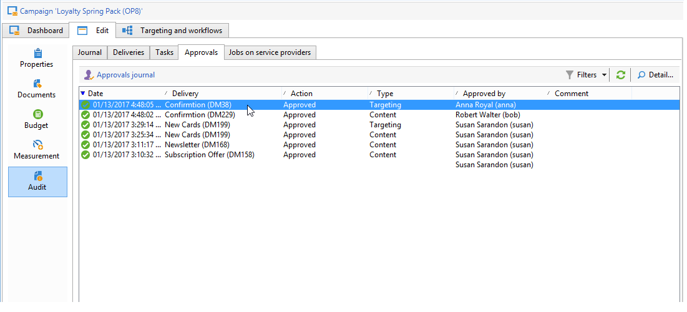
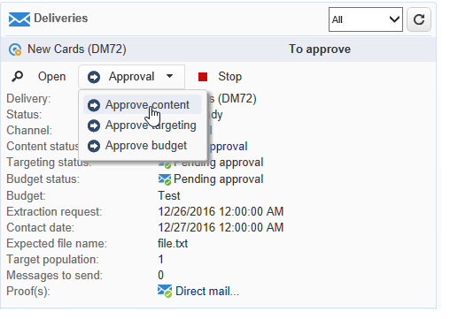
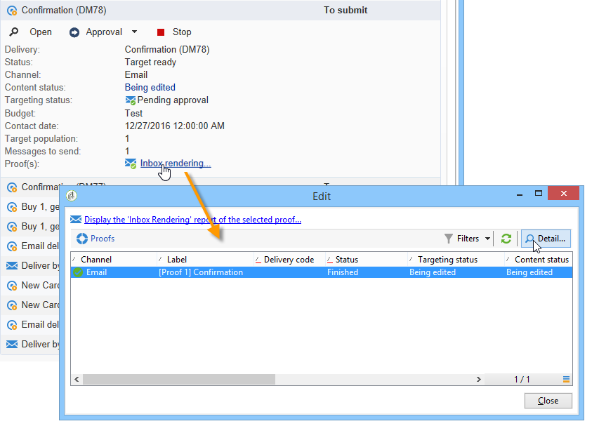
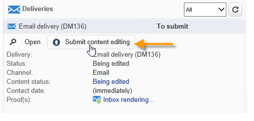
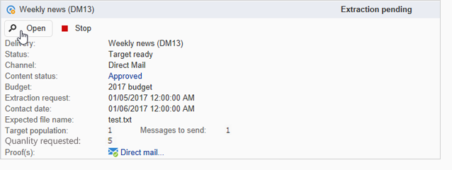

# 마케팅 캠페인 승인 {#approving-marketing-campaigns}

## 승인 프로세스 {#approval-process}

전달의 각 단계는 다양한 캠페인 프로세스를 완벽하게 모니터링하고 제어하기 위해 승인을 받을 수 있습니다.타깃팅, 컨텐츠, 예산, 추출 및 증명 전송

>[!NOTE]
>
>검토자가 승인할 적절한 권한이 있는지 확인해야 합니다. 또한 보안 영역이 올바르게 정의되었는지 확인하십시오.

알림 이메일은 지정된 검토자가 승인 요청을 통보하도록 Adobe Campaign 운영자에게 전송됩니다.

승인 절차는 납품 [확인 및 승인에 나와 있습니다](#checking-and-approving-deliveries).

>[!NOTE]
>
>배달 소유자만 배달을 시작할 수 있습니다. 다른 연산자(또는 연산자 그룹)가 배달을 시작할 수 있으려면 **[!UICONTROL Delivery start:]** 필드에서 검토자로 추가해야 합니다.\
>검토자 [선택을 참조하십시오](#selecting-reviewers).

### 운영 원칙 {#operating-principle-}

예를 들어 예산 승인을 위한 표준 이메일은 다음과 같습니다.

검토자 연산자는 해당 단계를 승인할지 여부를 선택할 수 있습니다.

운영자가 자신의 선택, 승인 또는 거부를 승인하면 배달 대시보드로 전달됩니다.

이 정보는 캠페인의 승인 로그에서도 사용할 수 있습니다(탭을 통해 액세스). **[!UICONTROL Edit > Tracking > Approvals]**

이러한 알림은 승인이 활성화된 각 프로세스에 영향을 받는 운영자에게 전송됩니다.

캠페인 템플릿, 각 캠페인에 대해 개별적으로 또는 게재에 대해 승인을 활성화할 수 있습니다.

승인이 필요한 모든 작업이 캠페인 템플릿( **[!UICONTROL Properties]** > **[!UICONTROL Advanced campaign settings...]** > **[!UICONTROL Approvals]** 탭)에서 승인 담당자와 마찬가지로 선택됩니다(이 옵션이 활성화되지 않은 경우 알림 수신됨). For more on this, refer to [Approving processes](#approving-processes).

이 템플릿을 사용하여 만든 각 캠페인에 대해 이러한 설정을 재정의하고 각 캠페인 전달에 대해 개별적으로 재정의할 수 있습니다.단추를 **[!UICONTROL Properties]** 클릭한 다음 **[!UICONTROL Approvals]** 탭을 클릭합니다.

다음 예에서 배달 컨텐츠는 승인이 필요하지 않습니다.

### 검토자 선택 {#selecting-reviewers}

각 승인 유형에 대해 전달의 드롭다운 목록에서 승인을 담당하는 연산자 또는 연산자 그룹이 선택됩니다. 링크를 사용하여 추가 연산자를 추가할 수 **[!UICONTROL Edit...]** 있습니다. 이 창에서는 승인 마감 시간을 편집할 수도 있습니다.

검토자가 지정되지 않은 경우 캠페인 관리자가 승인을 책임지며 알림을 받게 됩니다. 캠페인 관리자는 캠페인의 **[!UICONTROL Edit > Properties]** 탭에 지정됩니다.

>[!NOTE]
>
>권한이 있는 다른 모든 Adobe Campaign 운영자들도 **[!UICONTROL Administrator]** 일자리를 승인할 수 있지만, 그들은 알림을 받지 않습니다.\
>기본적으로, 승인 연산자가 정의된 경우 캠페인 관리자는 승인을 수행하거나 배달을 시작할 수 없습니다. 값을 **** 1로 **NmsCampaign_Activate_OwnerConfirmation** 옵션을 만들어 이 동작을 수정하고 캠페인 관리자에서 배달을 승인/시작할 수 있도록 허용할 수 있습니다.

### 승인 모드 {#approval-modes}

#### 대시보드를 통한 승인 {#approval-via-the-dashboard}

콘솔 또는 웹 인터페이스를 통해 작업을 승인하려면 캠페인 대시보드에서 해당 링크를 클릭합니다. 배달 추적 또는 배달 대시보드를 통해 작업을 승인할 수도 있습니다.

승인할 정보를 확인하고, 승인 수락 여부를 선택하고, 필요한 경우 주석을 입력합니다. 을 **[!UICONTROL Ok]** 클릭하여 저장합니다.

>[!NOTE]
>
>다른 연산자가 프로세스를 이미 승인한 경우 승인 링크를 사용할 수 없습니다.

#### 알림 메시지를 통한 승인 {#approval-via-notification-messages}

알림 메시지에 사용할 수 있는 링크를 클릭합니다(알림 참조 ). 아래와 같이 자신을 확인하라는 메시지가 나타납니다.

필요한 경우 주석 **[!UICONTROL Accept]** 을 선택하거나 **[!UICONTROL Reject]** 입력합니다.

**[!UICONTROL Validate]**&#x200B;을(를) 클릭합니다.

>[!NOTE]
>
>프로세스 중에 경고가 발생하면 알림에 경고가 표시됩니다.

#### 승인 추적 {#approval-tracking}

이 정보는 다음과 같은 여러 곳에서 사용할 수 있습니다.

* 캠페인 승인 로그에서 탭 **[!UICONTROL Approvals]** 의 하위 탭 **[!UICONTROL Edit > Tracking]** :

   

* 캠페인 배달 로그에서 탭의 **[!UICONTROL Deliveries]** 하위 탭 **[!UICONTROL Edit > Tracking]** :

   

* 각 게재의 승인 상태는 탭의 **[!UICONTROL Hide/show log]** 옵션을 클릭하여 볼 수 **[!UICONTROL Summary]** 있습니다.

   

* 이 정보는 각 전달의 **[!UICONTROL Tracking > Approvals]** 탭을 통해 액세스할 수도 있습니다.

   

>[!NOTE]
>
>운영자가 작업을 승인하거나 거부하면 다른 검토 작업자가 더 이상 승인 작업에 대해 작업을 수행하지 못합니다.

#### 자동 및 수동 승인 {#automatic-and-manual-approval}

타깃팅 워크플로우를 만들 때, 승인이 자동(기본 모드)인 경우, Adobe Campaign은 승인 링크를 표시하거나 승인이 필요한 즉시 알림을 전송합니다.

승인 모드(수동 또는 자동)를 선택하려면 캠페인 또는 캠페인 템플릿의 **[!UICONTROL Edit > Properties]** 탭을 클릭한 다음 을 클릭하고 마지막 탭 **[!UICONTROL Advanced campaign settings...]** 을 **[!UICONTROL Approvals]** 클릭합니다.

>[!NOTE]
>
>선택한 승인 모드는 캠페인의 모든 게재에 적용됩니다.

타깃팅 워크플로우를 구축할 때 수동 승인을 사용하면 승인 링크를 만들거나 알림을 자동으로 보내지 않을 수 있습니다. 그런 다음 캠페인 대시보드는 승인 프로세스를 수동으로 시작하는 **[!UICONTROL Submit targeting for approval]** 링크를 제공합니다.

확인 메시지를 사용하면 이 배달에 대해 선택된 작업에 대한 승인을 승인할 수 있습니다.

그러면 캠페인 대시보드(이 게재의 경우), 배달 대시보드 및 배달 추적에 승인 단추가 표시됩니다. 알림이 활성화되면 동시에 전송됩니다.

이 승인 활성화 방법을 사용하면 비논리적인 알림을 검토자에게 보내지 않고 타깃팅을 수행할 수 있습니다.

### 알림 {#notifications}

알림은 프로세스를 승인 대기 중임을 알리기 위해 검토자에게 전송되는 특정 이메일 메시지입니다. 연산자가 메시지의 링크를 클릭하면 인증 페이지가 표시되고, 로그인하면 연산자가 정보를 보고 작업을 승인하거나 거부할 수 있습니다. 승인 창에 주석을 입력할 수도 있습니다.

알림 이메일의 내용은 개인화할 수 있습니다. 알림 [컨텐츠를 참조하십시오](#notification-content).

#### 알림 활성화/비활성화 {#enabling-disabling-notification}

기본적으로 캠페인 템플릿, 캠페인 또는 게재에서 관련 작업의 승인이 활성화되면 알림 메시지가 전송됩니다. 그러나 콘솔에서 승인을 승인하기 위해 알림을 비활성화할 수는 있습니다.

이렇게 하려면 캠페인 또는 캠페인 템플릿의 승인 창( **[!UICONTROL Edit > Properties]** > **[!UICONTROL Advanced campaign settings...]** > **[!UICONTROL Approvals]** 탭)을 편집하고 **[!UICONTROL Do not enable notification sending]**&#x200B;선택합니다.

#### 알림 컨텐츠 {#notification-content}

알림 컨텐츠는 특정 템플릿에서 정의됩니다. **[!UICONTROL Notification of validations for the marketing campaign]**. 이 템플릿은 Adobe Campaign 트리의 **[!UICONTROL Administration > Campaign management > Technical delivery templates]** 폴더에 저장됩니다.

## 배달 확인 및 승인 {#checking-and-approving-deliveries}

Adobe Campaign을 사용하면 마케팅 캠페인의 주 단계에 대한 승인 프로세스를 협업 모드로 설정할 수 있습니다.

DM 전달의 경우 Adobe Campaign 연산자는 추출 파일을 라우터로 보내기 전에 볼 수 있으며, 필요한 경우 형식을 변경하고 추출을 다시 시작할 수 있습니다. 추출 [파일 승인을 참조하십시오](#approving-an-extraction-file).

각 캠페인에 대해 컨텐츠(컨텐츠 [승인 참조](#approving-content)) 및 비용을 승인할 수 있습니다. 승인이 필요한 Adobe Campaign 운영자는 전자 메일로 통보를 받을 수 있으며 콘솔 또는 웹 연결을 통해 승인을 수락하거나 거부할 수 있습니다. 프로세스 [승인을 참조하십시오](#approving-processes).

이러한 검증 단계가 완료되면 배달을 시작할 수 있습니다. 배달 [시작을 참조하십시오](../../campaign/using/marketing-campaign-deliveries.md#starting-a-delivery).

>[!NOTE]
>
>승인 모드 및 추적에 대한 자세한 내용은 승인 [프로세스를 참조하십시오](#approval-process).

### 프로세스 승인 {#approving-processes}

승인이 필요한 단계는 캠페인 대시보드에 나타납니다(웹 인터페이스의 콘솔을 통해). 배달 추적 테이블 및 배달 대시보드에도 나타납니다.

이 시점에서 캠페인 상태는 입니다 **[!UICONTROL To validate]**.

>[!NOTE]
>
>* 승인을 받을 프로세스를 선택하려면 캠페인 템플릿을 수정합니다. For more on this, refer to [Campaign templates](../../campaign/using/marketing-campaign-templates.md#campaign-templates).
   >
   >
* 승인 프로세스의 섹션 [을 참조하십시오](#approval-process).

>[!NOTE]
>
>타깃팅 워크플로우에서 메시지 준비 중에 구성 문제에 연결된 오류가 발생하면 **[!UICONTROL Restart message preparation]** 링크가 대시보드에 표시됩니다. 오류를 수정하고 이 링크를 클릭하여 타깃팅 단계를 무시하고 메시지 준비를 다시 시작합니다.

캠페인의 각 게재에 대해 다음 프로세스를 승인할 수 있습니다.

* **타깃팅, 컨텐츠 및 예산**

   작업 승인 설정 창 **[!UICONTROL Enable target approval]**&#x200B;에서 **[!UICONTROL Enable content approval]** 또는 **[!UICONTROL Enable budget approval]** 옵션을 선택하면 관련 배달에 대한 캠페인 대시보드에 관련 링크가 표시됩니다.

   >[!NOTE]
   >
   >예산 승인은 타깃팅 승인이 승인 설정 창에서 활성화된 경우에만 사용할 수 있습니다. 예산 승인에 대한 링크는 대상이 분석된 경우에만 표시됩니다. 또한 이 링크는 타겟 승인을 위한 링크와 함께 표시됩니다.

   승인 설정 창에서 **[!UICONTROL Assign content editing]** 또는 **[!UICONTROL External content approval]** 옵션을 선택하면 대시보드에 **[!UICONTROL Available content]** 및 **[!UICONTROL External content approval]** 링크가 표시됩니다.

   컨텐츠 승인을 사용하면 전송된 교정에 액세스할 수 있습니다.

* **추출 승인(DM 배달)**

   승인 설정 창 **[!UICONTROL Enable extraction approval]** 에서 선택한 경우 라우터에 알림을 보내기 전에 압축을 푼 파일을 승인해야 합니다.

   아래와 같이 캠페인 대시보드에서 링크를 사용할 수 있습니다. **[!UICONTROL Approve content]**

   

   추출 파일은 승인 상자를 통해 미리 본 다음 허용 또는 거부할 수 있습니다.

   

   >[!NOTE]
   >
   >추출 파일 미리 보기는 데이터 샘플만 다룹니다. 전체 출력 파일이 로드되지 않습니다.

* **연결된 배달 승인**

   이 **[!UICONTROL Enable individual approval of each associated delivery]** 옵션은 보조 게재와 연관된 하나의 기본 전달에 사용됩니다. 기본적으로 이 옵션은 선택되어 있지 않으므로 기본 배달의 전체 승인을 수행할 수 있습니다. 이 옵션을 선택하면 각 배달을 개별적으로 승인해야 합니다.

   

#### 승인할 프로세스 선택 {#choosing-the-processes-to-be-approved}

승인 단계는 캠페인과 연관된 템플릿과 함께 정의됩니다. 템플릿에서 승인할 요소를 선택하고 이러한 승인을 담당할 Adobe Campaign 연산자를 지정해야 합니다. For more on this, refer to [Campaign templates](../../campaign/using/marketing-campaign-templates.md#campaign-templates).

>[!NOTE]
>
>캠페인 또는 캠페인 템플릿에 대한 승인 구성은 이 캠페인에 연결된 모든 향후 배달에 적용됩니다. 구성 변경 사항은 이전 게재에 적용되지 않습니다.

이 정보는 각 캠페인과 각 전달에 대해 무시될 수 있습니다.

캠페인의 경우 **[!UICONTROL Edit > Properties]** 탭, **[!UICONTROL Advanced campaign settings...]** 링크, 마지막으로 **[!UICONTROL Approvals]** 하위 탭을 클릭하여 승인 구성 페이지에 액세스합니다.

승인할 프로세스를 선택 및 선택 취소하고 승인 담당자를 지정할 수 있습니다. 이러한 연산자는 개별 연산자, 연산자 그룹 또는 연산자 목록일 수 있습니다.

연산자 목록을 선택하려면 필드 오른쪽의 첫 번째 검토자를 지정하는 **[!UICONTROL Edit...]** 링크를 클릭하고 아래 표시된 대로 필요한 만큼 연산자를 추가합니다.

>[!NOTE]
>
>* 검토자 목록이 정의되면 검토자가 수락하는 즉시 작업이 승인됩니다. 그러면 관련 승인 링크가 더 이상 대시보드에서 제공되지 않습니다. 알림 전송이 활성화되면 다른 검토자가 알림 메시지의 승인 링크를 클릭하면 다른 연산자가 이미 작업을 승인했다는 알림을 받게 됩니다.
>* 검토자 편집 창의 하단 섹션에서 캠페인에 대한 승인 일정을 정의할 수 있습니다. 기본적으로 검토자는 제출 날짜부터 3일 이내에 프로세스를 승인해야 합니다. 승인 마감 전에 관련 운영자에게 자동으로 전송되는 알림 메시지를 구성할 수 있습니다.
>* 이 섹션에서 미리 알림을 추가할 수 있습니다.

>

각 전달에 대해 승인 날짜 및 자동 미리 알림을 보고 편집하려면 **[!UICONTROL Audit]** 버튼 및 **[!UICONTROL Approvals]** 탭을 클릭합니다.

>[!NOTE]
>
>이 탭은 컨텐츠 승인 프로세스가 시작된 후에 사용할 수 있습니다.

### 컨텐츠 승인 {#approving-content}

>[!CAUTION]
>
>컨텐츠를 승인하려면 증명 주기가 필수입니다. 교정본을 사용하면 정보 표시, 개인화 데이터, 링크가 작동하는지 확인할 수 있습니다. 증명 및 해당 라이프사이클에 대한 자세한 내용은 메시지 [전송 섹션을 참조하십시오](../../delivery/using/steps-validating-the-delivery.md#sending-a-proof) .
>
>아래 설명된 컨텐츠 승인 기능은 증명 전달에 추가될 예정입니다.

컨텐츠 승인 주기를 구성할 수 있습니다. 이렇게 하려면 승인 설정 창에서 **[!UICONTROL Enable content approval]** 옵션을 선택합니다. 컨텐츠 승인 주기의 주요 단계는 다음과 같습니다.

1. 새 배달을 만든 후 캠페인 관리자는 캠페인 대시보드의 **[!UICONTROL Submit content]** 링크를 클릭하여 컨텐츠 승인 주기를 시작합니다.

   

   >[!NOTE]
   >
   >승인 설정 창에서 **[!UICONTROL Enable the sending of proofs]** 옵션(이메일 배달용) 또는 **[!UICONTROL Enable the sending and approval of proofs]** (DM 게재의 경우) 옵션을 선택한 경우 교정이 자동으로 전송됩니다.

1. 승인 여부를 선택할 수 있는 컨텐츠 담당자에게 알림 이메일이 전송됩니다.

   * 알림 이메일을 통해 다음을 수행합니다.

      

      >[!NOTE]
      >
      >알림 이메일에는 이미 전송된 교정물에 대한 링크가 포함되어 있으며, 이 인스턴스에 대해 배달 가능 옵션이 활성화된 경우 다양한 웹 메일에 대한 메시지 **렌더링에** 액세스할 수 있습니다.

   * 콘솔 또는 웹 인터페이스, 배달 추적, 배달 대시보드 또는 캠페인 대시보드를 통해 다음을 수행할 수 있습니다.

      

      >[!NOTE]
      >
      >이 캠페인 대시보드에서는 **[!UICONTROL Inbox rendering...]** 링크를 클릭하여 전송된 증명 목록을 볼 수 있습니다. 콘텐트를 보려면 목록 오른쪽에 있는 **[!UICONTROL Detail]** 아이콘을 클릭합니다.

      

1. 컨텐츠가 승인되었는지 여부를 알리는 알림 이메일이 캠페인 담당자에게 전송됩니다.

   >[!NOTE]
   >
   >캠페인을 담당하는 사람은 언제든지 컨텐츠 승인 주기를 다시 시작할 수 있습니다. 이렇게 하려면 캠페인 대시보드(전달 수준)의 **[!UICONTROL Content status]** 행에서 링크를 클릭한 다음 을 클릭합니다 **[!UICONTROL Reset content approval to submit it again]**.

   

#### 컨텐츠 편집 할당 {#assign-content-editing}

이 옵션을 사용하면 웹 마스터와 같은 컨텐츠 편집 담당자를 정의할 수 있습니다. 승인 설정 창에서 이 **[!UICONTROL Assign content editing]** 옵션을 선택하면 알림 이메일을 배달하고 컨텐츠 담당자에게 발송하는 사이에 몇 가지 승인 단계가 추가됩니다.

1. 새 배달을 만든 후 캠페인을 담당하는 사람이 캠페인 대시보드의 **[!UICONTROL Submit content editing]** 링크를 클릭하여 컨텐츠 편집 주기를 시작합니다.

   

1. 컨텐츠 편집 담당자는 해당 컨텐츠를 사용할 수 있다는 내용의 이메일을 수신하게 됩니다.

   

1. 그런 다음 콘솔에 로그인하여 전달을 열고 단순화된 마법사를 사용하여 편집하여 주제, HTML 및 텍스트 컨텐츠를 변경하고 교정본을 전송할 수 있습니다.

   

   >[!NOTE]
   >
   >승인 설정 창에서 **[!UICONTROL Enable the sending of proofs]** 옵션(이메일 배달용) 또는 **[!UICONTROL Enable the sending and approval of proofs]** (DM 게재의 경우) 옵션을 선택한 경우 교정이 자동으로 전송됩니다.

1. 컨텐츠 편집 담당자가 게재 컨텐츠의 변경 작업을 완료하면 해당 컨텐츠를 사용할 수 있습니다.

   이를 위해 다음을 수행할 수 있습니다.

   * adobe campaign 콘솔을 통해 **[!UICONTROL Available content]** 링크를 클릭합니다.

      

   * 알림 메시지의 링크를 클릭한 다음 컨텐츠 가용성을 승인합니다.

      

      연산자는 캠페인을 담당하는 사람에게 컨텐츠를 제출하기 전에 댓글을 추가할 수 있습니다.

      

      알림 메시지를 통해 검토자는 컨텐츠를 승인하거나 거부할 수 있습니다.

      

#### 외부 컨텐츠 승인 {#external-content-approval}

이 옵션을 사용하면 브랜드 커뮤니케이션 일관성, 비율 등과 같은 배달 렌더링 승인을 담당하는 외부 연산자를 정의할 수 있습니다. 승인 설정 창에서 **[!UICONTROL External content approval]** 옵션을 선택하면 컨텐츠 승인과 캠페인 담당자에게 통지의 전달 사이에 몇 가지 승인 단계가 추가됩니다.

1. 외부 컨텐츠 관리자는 컨텐츠가 승인되었으며 외부 승인을 요청하는 알림 이메일을 수신합니다.
1. 알림 이메일에는 전송 내용을 볼 수 있는 링크, 전달 렌더링을 볼 수 있는 링크 및 전달 컨텐츠를 승인하거나 거부하는 단추가 포함되어 있습니다.

   >[!NOTE]
   >
   >이러한 링크는 하나 이상의 교정본을 보낸 경우에만 사용할 수 있습니다. 그렇지 않으면 콘솔 또는 웹 인터페이스를 통해서만 배달 렌더링을 사용할 수 있습니다.

   

### 추출 파일 승인 {#approving-an-extraction-file}

오프라인 배달의 경우, Adobe Campaign은 설정 방법에 따라 라우터로 전송되는 추출 파일을 생성합니다. 컨텐츠는 사용되는 내보내기 템플릿에 따라 다릅니다.

컨텐츠, 타깃팅 및 예산이 승인되면 캠페인에 대한 추출 워크플로가 시작될 때까지 게시가 **[!UICONTROL Extraction pending]** 변경됩니다.

추출 요청 날짜에 추출 파일이 생성되고 배달 상태가 로 변경됩니다 **[!UICONTROL File to approve]**.

압축을 푼 파일의 컨텐츠를 보고(해당 이름을 클릭하여 승인) 또는 필요한 경우 형식을 변경하고 대시보드의 링크를 사용하여 추출을 다시 시작할 수 있습니다.

파일이 승인되면 알림 이메일을 라우터에 보낼 수 있습니다. 자세한 내용은 [오프라인 배달 시작을 참조하십시오](../../campaign/using/marketing-campaign-deliveries.md#starting-an-offline-delivery).
