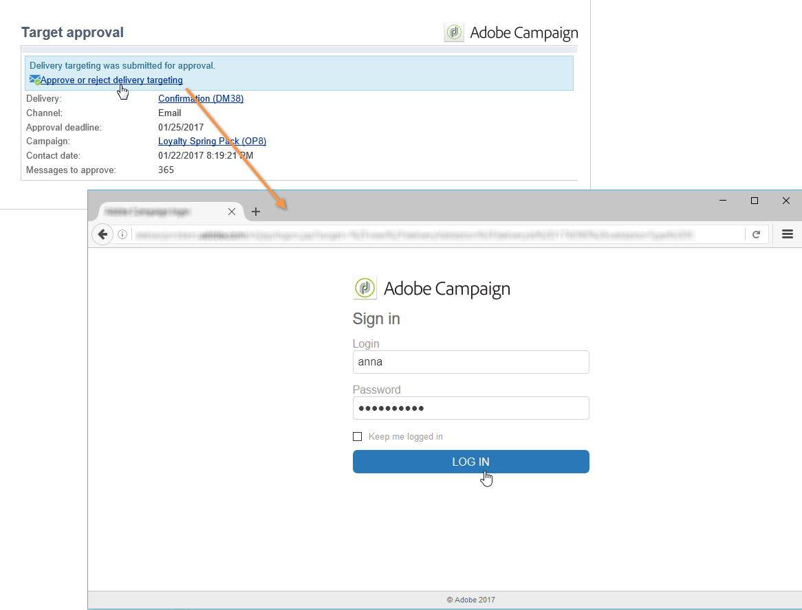

# 승인 프로세스 설정 및 관리 {#approving-marketing-campaigns}

게재의 각 단계는 캠페인의 다양한 프로세스를 완벽하게 모니터링하고 제어하기 위해 승인을 받을 수 있습니다.타겟팅, 컨텐츠, 예산, 추출 및 증명 전송

알림 메시지는 지정된 검토자가 승인 요청을 알려주기 위해 Adobe Campaign 운영자에게 전송됩니다. 검토자에게 승인을 위한 **적절한 권한**&#x200B;이 있으며 해당 보안 영역이 올바르게 정의되어 있는지 확인합니다. [자세히 알아보기](#selecting-reviewers)

승인 절차는 [이 섹션](#checking-and-approving-deliveries)에 나와 있습니다.

>[!NOTE]
>
>게재 소유자만 게재를 시작할 수 있습니다. 다른 연산자(또는 연산자 그룹)가 게재를 시작할 수 있으려면 **[!UICONTROL Delivery start:]** 필드에서 검토자로 추가해야 합니다.\
>[자세히 알아보기](#selecting-reviewers)

## 운영 원칙 {#operating-principle-}

예를 들어 예산 승인을 위한 표준 메시지는 다음과 같습니다.

그러면 검토자 운영자가 예산을 승인하도록 선택할 수 있습니다.

연산자가 유효성을 검사하면 작업의 승인 또는 거부가 게재 대시보드에 전달됩니다.

이 정보는 캠페인의 승인 로그에서도 사용할 수 있습니다. 이러한 로그는 **[!UICONTROL Edit > Tracking > Approvals]** 탭을 통해 액세스합니다.

이러한 알림은 승인이 활성화된 각 프로세스에 영향을 받는 운영자에게 전송됩니다.

캠페인 템플릿, 각 캠페인에 대해 개별적으로 또는 게재에 대해 승인을 활성화할 수 있습니다.

승인이 필요한 모든 작업은 승인을 담당하는 연산자와 마찬가지로 캠페인 템플릿( **[!UICONTROL Properties]** > **[!UICONTROL Advanced campaign settings...]** > **[!UICONTROL Approvals]** 탭)에서 선택됩니다(이 옵션이 활성화되지 않은 한 알림이 수신됨). 이 작업에 대한 자세한 정보는 [이 섹션](#approving-processes)을 참조하십시오.

이 템플릿을 사용하여 만든 각 캠페인에 대해 이러한 설정을 재정의하고 각 캠페인 게재에 대해 개별적으로 재정의할 수 있습니다.**[!UICONTROL Properties]** 단추를 클릭한 다음 **[!UICONTROL Approvals]** 탭을 클릭합니다.

다음 예에서는 게재 컨텐츠에 승인을 필요로 하지 않습니다.

## 검토자 {#selecting-reviewers} 선택

각 승인 유형에 대해 게재의 드롭다운 목록에서 승인을 담당하는 운영자 또는 운영자 그룹이 선택됩니다. **[!UICONTROL Edit...]** 링크를 사용하여 더 많은 연산자를 추가할 수 있습니다. 이 창에서는 승인 기한을 편집할 수도 있습니다.

검토자가 지정되지 않은 경우 캠페인 관리자가 승인을 담당하며 알림을 받게 됩니다. 캠페인 관리자는 캠페인의 **[!UICONTROL Edit > Properties]** 탭에 지정됩니다.

>[!NOTE]
>
>**[!UICONTROL Administrator]** 권한을 가진 다른 모든 Adobe Campaign 연산자도 작업을 승인할 수 있지만, 알림을 받지 않습니다.\
>기본적으로 승인 연산자가 정의된 경우 캠페인 관리자가 승인을 수행하거나 게재를 시작할 수 없습니다. **1**&#x200B;을 값으로 사용하여 **NmsCampaign_Activate_OwnerConfirmation** 옵션을 만들어 이 동작을 수정하고 캠페인 관리자에서 게재를 승인/시작하도록 승인할 수 있습니다.

## 승인 모드 {#approval-modes}

### 대시보드 {#approval-via-the-dashboard}를 통한 승인

콘솔 또는 웹 인터페이스를 통해 작업을 승인하려면 캠페인 대시보드에서 해당 링크를 클릭합니다. 게재 추적 또는 게재 대시보드를 통해 작업을 승인할 수도 있습니다.

승인할 정보를 확인하고 승인을 수락할지 또는 거부할지를 선택하고 필요한 경우 설명을 입력합니다. **[!UICONTROL Ok]** 을 클릭하여 저장합니다.

>[!NOTE]
>
>다른 운영자가 이미 프로세스를 승인한 경우 승인 링크를 사용할 수 없습니다.

### 알림 메시지를 통한 승인 {#approval-via-notification-messages}

알림 메시지에서 사용할 수 있는 링크를 클릭합니다( [알림](#notifications) 참조). 아래와 같이 로그인해야 합니다.

**[!UICONTROL Accept]** 또는 **[!UICONTROL Reject]** 을 선택하고 필요한 경우 설명을 입력합니다.

**[!UICONTROL Validate]**&#x200B;을(를) 클릭합니다.

>[!NOTE]
>
>프로세스 중에 경고가 발생하면 알림에 경고가 표시됩니다.

### 승인 추적 {#approval-tracking}

이 정보는 다음과 같은 여러 위치에서 사용할 수 있습니다.

* 캠페인 승인 로그에서 **[!UICONTROL Edit > Tracking]** 탭의 **[!UICONTROL Approvals]** 하위 탭에서 다음을 수행합니다.

   

* 캠페인 게재 로그에서 **[!UICONTROL Edit > Tracking]** 탭의 **[!UICONTROL Deliveries]** 하위 탭에서 다음을 수행합니다.

   

* 각 게재의 승인 상태는 **[!UICONTROL Summary]** 탭의 **[!UICONTROL Hide/show log]** 옵션을 클릭하여 볼 수 있습니다.

   

* 이 정보는 각 게재의 **[!UICONTROL Tracking > Approvals]** 탭을 통해 액세스할 수도 있습니다.

   

>[!NOTE]
>
>운영자가 작업을 승인하거나 거부하면 다른 검토 운영자가 더 이상 승인을 수행할 수 없습니다.

### 자동 및 수동 승인 {#automatic-and-manual-approval}

타깃팅 워크플로우를 만들 때 승인이 자동(기본 모드)이면 Adobe Campaign에서 승인 링크를 표시하거나 승인이 필요한 즉시 알림을 보냅니다.

승인 모드(수동 또는 자동)를 선택하려면 캠페인 또는 캠페인 템플릿의 **[!UICONTROL Edit > Properties]** 탭을 클릭한 다음 **[!UICONTROL Advanced campaign settings...]** 를 클릭하고 마지막으로 **[!UICONTROL Approvals]** 탭을 클릭합니다.

>[!NOTE]
>
>선택한 승인 모드는 캠페인의 모든 게재에 적용됩니다.

타깃팅 워크플로우를 빌드하고 있으면 수동 승인을 사용하여 승인 링크를 만들거나 자동으로 알림을 보내지 않습니다. 그런 다음 캠페인 대시보드는 승인 프로세스를 수동으로 시작하는 **[!UICONTROL Submit targeting for approval]** 링크를 제공합니다.

확인 메시지를 통해 이 게재에 대해 선택한 작업에 대한 승인을 승인할 수 있습니다.

그러면 승인 버튼이 캠페인 대시보드(이 게재의 경우), 게재 대시보드 및 게재 추적에 표시됩니다. 알림이 활성화되면 동시에 전송됩니다.

이 승인 사용 방법을 사용하면 검토자에게 잘못된 알림을 보내지 않고 타겟팅을 작업할 수 있습니다.

## 알림 을 참조하십시오 {#notifications}

알림은 프로세스가 승인 보류 중임을 알리기 위해 검토자에게 전송되는 특정 전자 메일 메시지입니다. 연산자가 메시지의 링크를 클릭하면 인증 페이지가 나타나고 로그인 후 연산자가 정보를 보고 작업을 승인하거나 거부할 수 있습니다. 승인 창에 설명을 입력할 수도 있습니다.

알림 이메일의 콘텐츠는 개인화할 수 있습니다. [알림 내용](#notification-content)을 참조하십시오.

### 알림 활성화/비활성화 {#enabling-disabling-notification}

기본적으로 캠페인 템플릿, 캠페인 또는 게재에서 관련 작업 승인이 활성화된 경우 알림 메시지가 전송됩니다. 그러나 콘솔에서 승인을 승인하기 위해 알림을 비활성화할 수 있습니다.

이렇게 하려면 캠페인 또는 캠페인 템플릿의 승인 창( **[!UICONTROL Edit > Properties]** > **[!UICONTROL Advanced campaign settings...]** > **[!UICONTROL Approvals]** 탭)을 편집하고 **[!UICONTROL Do not enable notification sending]**&#x200B;을(를) 선택합니다.

### 알림 내용 {#notification-content}

알림 컨텐츠는 특정 템플릿에서 정의됩니다.**[!UICONTROL Notification of validations for the marketing campaign]** 이 템플릿은 Adobe Campaign 트리의 **[!UICONTROL Administration > Campaign management > Technical delivery templates]** 폴더에 저장됩니다.

## 게재 검토 및 승인 {#checking-and-approving-deliveries}

Adobe Campaign을 사용하면 마케팅 캠페인의 주요 단계에 대한 승인 프로세스를 공동 작업 모드로 설정할 수 있습니다.

DM 게재의 경우 Adobe Campaign 운영자는 추출 파일을 라우터로 보내기 전에 볼 수 있으며 필요한 경우 형식을 변경하고 추출을 다시 시작할 수 있습니다. [추출 파일 승인](#approving-an-extraction-file)을 참조하십시오.

각 캠페인에 대해 게재 타겟, 컨텐츠([승인 컨텐츠](#approving-content) 참조) 및 비용을 승인할 수 있습니다. 승인이 필요한 Adobe Campaign 운영자는 전자 메일로 통보를 받을 수 있으며 콘솔 또는 웹 연결을 통해 승인을 수락하거나 거부할 수 있습니다. [게재를 승인하는 단계](#approving-processes)를 참조하십시오.

이러한 유효성 검사 단계가 완료되면 게재를 시작할 수 있습니다. [자세히 알아보기](../../campaign/using/marketing-campaign-deliveries.md#starting-a-delivery)

### 게재를 승인하는 단계 {#approving-processes}

승인이 필요한 단계가 캠페인 대시보드에 나타납니다(웹 인터페이스의 콘솔을 통해). 게재 추적 테이블 및 게재 대시보드에도 표시됩니다.

이 시점에서 캠페인의 상태는 **[!UICONTROL To validate]**&#x200B;입니다.

>[!NOTE]
>
>승인이 필요한 프로세스를 선택하려면 캠페인 템플릿을 수정합니다. 자세한 내용은 [캠페인 템플릿](../../campaign/using/marketing-campaign-templates.md#campaign-templates)을 참조하십시오.

>[!NOTE]
>
>타깃팅 워크플로우에서 메시지를 준비하는 동안 구성 문제에 연결된 오류가 발생하면 대시보드에 **[!UICONTROL Restart message preparation]** 링크가 표시됩니다. 오류를 수정하고 이 링크를 클릭하여 타깃팅 단계를 우회하는 동안 메시지 준비를 다시 시작합니다.

캠페인의 각 게재에 대해 다음 프로세스를 승인할 수 있습니다.

* **타겟팅, 컨텐츠 및 예산**

   작업 승인 설정 창에서 **[!UICONTROL Enable target approval]**, **[!UICONTROL Enable content approval]** 또는 **[!UICONTROL Enable budget approval]** 옵션을 선택하면 관련 게재에 대한 캠페인 대시보드에 관련 링크가 표시됩니다.

   >[!NOTE]
   >
   >승인 설정 창에서 타깃팅 승인이 활성화된 경우에만 예산 승인을 사용할 수 있습니다. 대상이 분석된 경우에만 예산 승인에 대한 링크가 표시됩니다. 또한, 이 링크는 타겟 승인을 위한 링크와 함께 표시됩니다.

   승인 설정 창에서 **[!UICONTROL Assign content editing]** 또는 **[!UICONTROL External content approval]** 옵션을 선택하면 대시보드에 **[!UICONTROL Available content]** 및 **[!UICONTROL External content approval]** 링크가 표시됩니다.

   콘텐츠 승인을 사용하면 보내는 증명에 액세스할 수 있습니다.

* **추출 승인(DM 게재)**

   승인 설정 창에서 **[!UICONTROL Enable extraction approval]** 을 선택하면 라우터에 알림을 받으려면 먼저 추출된 파일을 승인해야 합니다.

   아래와 같이 캠페인 대시보드에서 **[!UICONTROL Approve content]** 링크를 사용할 수 있습니다.

   

   승인 상자를 통해 추출 파일을 미리 본 다음, 수락하거나 거부할 수 있습니다.

   

   >[!NOTE]
   >
   >추출 파일 미리 보기는 데이터 샘플만 다룹니다. 전체 출력 파일이 로드되지 않습니다.

* **연결된 게재 승인**

   **[!UICONTROL Enable individual approval of each associated delivery]** 옵션은 보조 게재와 연결된 하나의 기본 게재에 사용됩니다. 기본적으로 이 옵션은 선택되어 있지 않으므로 주 게재의 전체 승인을 수행할 수 있습니다. 이 옵션을 선택한 경우 각 게재를 개별적으로 승인해야 합니다.

   

### 승인 프로세스 선택 {#choosing-the-processes-to-be-approved}

승인 단계는 캠페인과 연결된 템플릿과 함께 정의됩니다. 템플릿에서 승인할 요소를 선택하고 이러한 승인을 담당하는 Adobe Campaign 연산자를 지정해야 합니다. 캠페인 템플릿에 대한 자세한 정보는 [이 섹션](../../campaign/using/marketing-campaign-templates.md#campaign-templates)을 참조하십시오.

>[!NOTE]
>
>캠페인(또는 캠페인 템플릿)에 대한 승인 구성은 이 캠페인에 연결된 이후의 모든 게재에 적용됩니다. 구성 변경 사항은 이전 게재에는 적용되지 않습니다.

이 정보는 각 캠페인 및 각 게재에 대해 재정의할 수 있습니다.

캠페인의 경우 **[!UICONTROL Edit > Properties]** 탭을 클릭하고 **[!UICONTROL Advanced campaign settings...]** 링크를 클릭한 다음, 마지막으로 **[!UICONTROL Approvals]** 하위 탭을 클릭하여 승인 구성 페이지에 액세스합니다.

승인을 담당하는 Adobe Campaign 연산자를 승인하고 지정하는 프로세스를 선택하고 선택 취소할 수 있습니다. 개별 연산자, 연산자 그룹 또는 연산자 목록일 수 있습니다.

연산자 목록을 선택하려면 필드 오른쪽에 있는 **[!UICONTROL Edit...]** 링크를 클릭하여 첫 번째 검토자를 지정하고 아래 표시된 대로 필요한 만큼 연산자를 추가합니다.

>[!NOTE]
>
>* 검토자 목록이 정의된 경우 한 검토자가 검토자를 수락하면 작업이 승인됩니다. 그러면 관련 승인 링크가 더 이상 대시보드에서 제공되지 않습니다. 알림 전송이 활성화되면 다른 검토자가 알림 메시지에서 승인 링크를 클릭하면 다른 운영자가 이미 작업을 승인했다는 알림을 받게 됩니다.
>* 검토자 편집 창의 아래 섹션에서 캠페인에 대한 승인 일정을 정의할 수 있습니다. 기본적으로 검토자는 제출 날짜부터 3일을 시작하여 프로세스를 승인합니다. 승인 기한 전에 관련 운영자에게 자동으로 보내지는 미리 알림을 구성할 수 있습니다.
>* 이 섹션에서 미리 알림을 추가할 수 있습니다.

>

각 게재에 대해 **[!UICONTROL Audit]** 버튼 및 **[!UICONTROL Approvals]** 탭을 클릭하여 승인 날짜와 자동 미리 알림을 보고 편집합니다.

>[!NOTE]
>
>이 탭은 컨텐츠 승인 프로세스가 시작된 후에 사용할 수 있습니다.

### 컨텐츠 승인 {#approving-content}

>[!CAUTION]
>
>컨텐츠를 승인하려면 증명 주기가 필수입니다. 증명을 사용하면 정보 표시를 승인하고 개인화 데이터를 승인하며 링크가 작동하는지 확인할 수 있습니다. [이 섹션](../../delivery/using/steps-validating-the-delivery.md#sending-a-proof)에서 증명을 만드는 방법을 알아봅니다.
>
>아래에 자세히 설명된 콘텐츠 승인 기능은 증명 게재와 관련되어 있습니다.

콘텐츠 승인 주기를 구성할 수 있습니다. 이렇게 하려면 승인 설정 창에서 **[!UICONTROL Enable content approval]** 옵션을 선택합니다. 컨텐츠 승인 주기의 주요 단계는 다음과 같습니다.

1. 새 게재를 만든 후 캠페인 관리자는 캠페인 대시보드에서 **[!UICONTROL Submit content]** 링크를 클릭하여 컨텐츠 승인 주기를 시작합니다.

   

   >[!NOTE]
   >
   >승인 설정 창에서 **[!UICONTROL Enable the sending of proofs]** 옵션(이메일 게재용) 또는 **[!UICONTROL Enable the sending and approval of proofs]**(DM 게재의 경우) 옵션을 선택한 경우 증명이 자동으로 전송됩니다.

1. 알림 이메일은 컨텐츠 담당자(컨텐츠 담당자)에게 전송되며 사용자는 승인 여부를 선택할 수 있습니다.

   * 알림 이메일을 통해 다음을 수행합니다.

      

      >[!NOTE]
      >
      >알림 전자 메일에는 이미 보낸 증명에 대한 링크가 포함되어 있으며, 이 인스턴스에 대해 **게재 가능성** 옵션이 활성화되어 있는 경우 다양한 웹 메일에 대한 메시지 렌더링에 액세스할 수 있습니다.

   * 콘솔 또는 웹 인터페이스, 게재 추적, 게재 대시보드 또는 캠페인 대시보드를 통해 다음을 수행합니다.

      

      >[!NOTE]
      >
      >이 캠페인 대시보드에서 **[!UICONTROL Inbox rendering...]** 링크를 클릭하여 전송된 증명 목록을 볼 수 있습니다. 내용을 보려면 목록 오른쪽의 **[!UICONTROL Detail]** 아이콘을 클릭하십시오.

      

1. 컨텐츠가 승인되었는지 여부를 알리는 알림 이메일이 캠페인 담당 개인에게 전송됩니다.

   >[!NOTE]
   >
   >캠페인을 담당하는 사람은 언제든지 컨텐츠 승인 주기를 다시 시작할 수 있습니다. 이렇게 하려면 캠페인 대시보드(게재 수준)의 **[!UICONTROL Content status]** 행에 있는 링크를 클릭한 다음 **[!UICONTROL Reset content approval to submit it again]** 를 클릭합니다.

   

#### 컨텐츠 편집 할당 {#assign-content-editing}

이 옵션을 사용하면 웹 마스터와 같은 컨텐츠 편집 담당자를 정의할 수 있습니다. 승인 설정 창에서 **[!UICONTROL Assign content editing]** 옵션을 선택하면 알림 전자 메일의 배달과 배달 사이에 컨텐츠 담당자에게 몇 가지 승인 단계가 추가됩니다.

1. 새 게재를 만든 후 캠페인을 담당하는 사람이 캠페인 대시보드의 **[!UICONTROL Submit content editing]** 링크를 클릭하여 컨텐츠 편집 주기를 시작합니다.

   

1. 컨텐츠 편집 책임자는 해당 컨텐츠를 사용할 수 있다는 이메일을 받게 됩니다.

   

1. 그런 다음 콘솔에 로그인하고, 게재를 열고, 간소화된 마법사를 사용하여 편집하여 제목, HTML 및 텍스트 컨텐츠를 변경하고, 증명을 전송할 수 있습니다.

   

   >[!NOTE]
   >
   >승인 설정 창에서 **[!UICONTROL Enable the sending of proofs]** 옵션(이메일 게재용) 또는 **[!UICONTROL Enable the sending and approval of proofs]**(DM 게재의 경우) 옵션을 선택한 경우 증명이 자동으로 전송됩니다.

1. 컨텐츠 편집 담당자는 게재 컨텐츠의 변경을 완료하면 컨텐츠를 사용할 수 있도록 할 수 있습니다.

   이렇게 하려면 다음을 수행할 수 있습니다.

   * Adobe Campaign 콘솔을 통해 **[!UICONTROL Available content]** 링크를 클릭합니다.

      

   * 알림 메시지에서 링크를 클릭한 다음 컨텐츠 가용성을 승인합니다.

      

      연산자는 캠페인 담당자에게 콘텐츠를 제출하기 전에 설명을 추가할 수 있습니다.

      

      알림 메시지를 통해 검토자가 콘텐츠를 승인하거나 거부할 수 있습니다.

      

#### 외부 콘텐츠 승인 {#external-content-approval}

이 옵션을 사용하면 브랜드 커뮤니케이션 일관성, 비율 등과 같은 게재 렌더링을 승인하는 외부 연산자를 정의할 수 있습니다. 승인 설정 창에서 **[!UICONTROL External content approval]** 옵션을 선택하면 컨텐츠 승인과 캠페인 담당자에게 통지하는 배달 사이에 몇 가지 승인 단계가 추가됩니다.

1. 외부 콘텐츠 관리자는 컨텐츠가 승인되었음을 알리는 알림 이메일을 받고 외부 승인을 요청합니다.
1. 알림 전자 메일에는 증명을 보내는 링크와 게재 렌더링을 볼 수 있는 링크, 게재 콘텐츠를 승인하거나 거부하는 단추가 포함되어 있습니다.

   >[!NOTE]
   >
   >이러한 링크는 하나 이상의 증명을 보낸 경우에만 사용할 수 있습니다. 그렇지 않으면 콘솔 또는 웹 인터페이스를 통해서만 게재 렌더링을 사용할 수 있습니다.

   

### 추출 파일 승인 {#approving-an-extraction-file}

오프라인 게재의 경우, Adobe Campaign은 설정 방식에 따라 라우터로 전송되는 추출 파일을 생성합니다. 콘텐츠는 사용된 내보내기 템플릿에 따라 다릅니다.

컨텐츠, 타깃팅 및 예산이 승인되면 캠페인에 대한 추출 워크플로우가 시작될 때까지 게재가 **[!UICONTROL Extraction pending]**&#x200B;로 변경됩니다.

추출 요청 날짜에 추출 파일이 만들어지고 배달 상태가 **[!UICONTROL File to approve]**&#x200B;으로 변경됩니다.

추출된 파일의 컨텐츠를 보거나(해당 이름을 클릭하여), 승인하거나, 필요한 경우 형식을 변경하고, 대시보드의 링크를 사용하여 추출을 다시 시작할 수 있습니다.

파일이 승인되면 라우터에 알림 이메일을 보낼 수 있습니다. 자세한 내용은 [오프라인 게재 시작](../../campaign/using/marketing-campaign-deliveries.md#starting-an-offline-delivery)을 참조하십시오.
