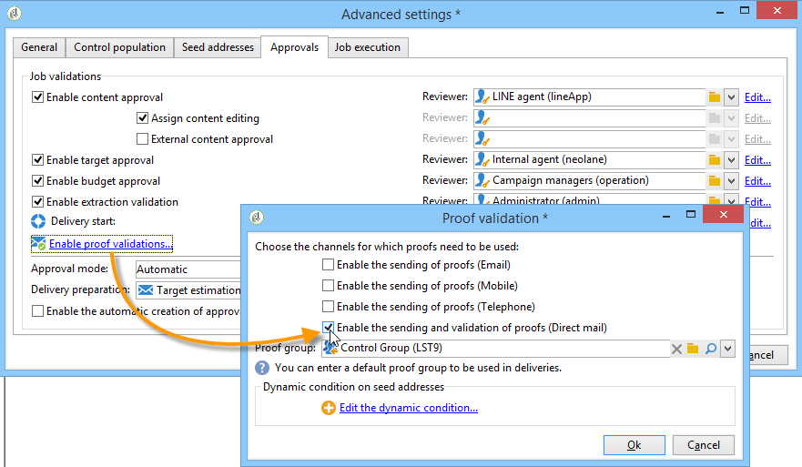
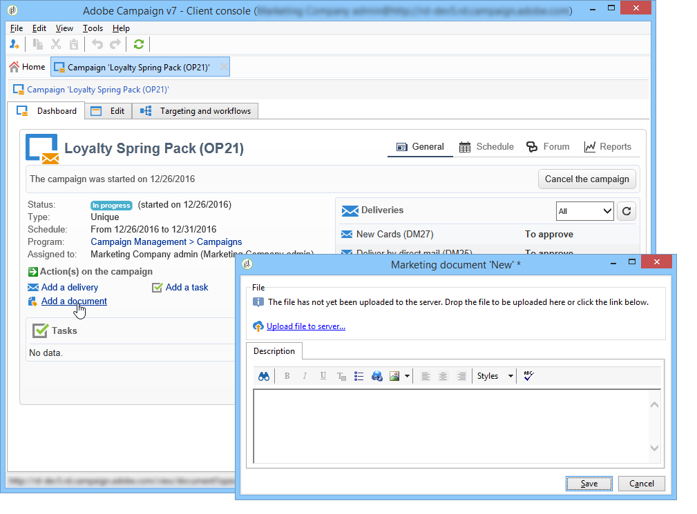

# 마케팅 캠페인 전달 {#marketing-campaign-deliveries}

게재는 캠페인 대시보드, 캠페인 워크플로우를 통해 또는 게재 개요를 통해 직접 만들 수 있습니다.

## 배달 만들기 {#creating-deliveries}

캠페인에 연결된 배달을 만들려면 캠페인 대시보드의 **[!UICONTROL Add a delivery]** 링크를 클릭합니다.

제안된 구성은 다양한 유형의 배달(DM, 이메일, 모바일 채널, 팩스 또는 전화)에 적합합니다.

>[!NOTE]
>
>배달 만들기 및 구성에 대한 자세한 내용은 메시지 [보내기 섹션을 참조하십시오](../../delivery/using/communication-channels.md) .

## 타겟 모집단 선택 {#selecting-the-target-population}

각 게재에 대해 캠페인 관리자는 다음을 정의합니다.

* 주요 타겟입니다. 자세한 내용은 워크플로우에서 [기본 타겟 만들기](#building-the-main-target-in-a-workflow) 및 타겟 [모집단](#selecting-the-target-population)선택을 참조하십시오.
* 컨트롤 그룹입니다. 자세한 내용은 제어 그룹 [정의를 참조하십시오](#defining-a-control-group).
* 시드 주소. For more on this, refer to [this section](../../delivery/using/about-seed-addresses.md).

이 정보 중 일부는 템플릿에서 상속됩니다.

>[!NOTE]
>
>캠페인 템플릿은 캠페인 템플릿에 [표시됩니다](../../campaign/using/marketing-campaign-templates.md#campaign-templates).

배달 대상을 만들려면 데이터베이스의 받는 사람에 대한 필터링 기준을 정의할 수 있습니다. 이 수신자 선택 모드는 메시지 전송 [섹션에](../../delivery/using/steps-defining-the-target-population.md) 있습니다.

### 예:수신자 그룹에 전달 {#example--delivering-to-a-group-of-recipients}

모집단을 목록으로 가져온 다음 게재에서 이 목록을 타깃팅할 수 있습니다.

1. 이렇게 하려면 관련 전달을 편집하고 링크를 클릭하여 타깃팅된 인구를 변경합니다. **[!UICONTROL To]**

1. 탭에서 **[!UICONTROL Main target]** 옵션을 선택하고 수신자를 **[!UICONTROL Defined via the database]** **[!UICONTROL Add]** 클릭하여 선택합니다.

1. 선택하고 클릭하여 **[!UICONTROL A list of recipients]** **[!UICONTROL Next]** 선택합니다.

### 워크플로우에서 기본 대상 작성 {#building-the-main-target-in-a-workflow}

게재의 기본 타겟은 타깃팅 워크플로우에서도 정의할 수 있습니다.이 그래픽 환경에서는 쿼리, 테스트 및 연산자를 사용하여 대상을 만들 수 있습니다.결합, 중복 제거, 공유 등

워크플로우 [자동화](../../workflow/using/executing-a-workflow.md#architecture) 안내서에는 워크플로우 모듈의 작동 방식에 대한 자세한 설명이 포함되어 있습니다.

>[!CAUTION]
>
>동일한 캠페인에서 28개 이상의 워크플로우를 설정할 수 없습니다. 이 제한을 지나면 인터페이스에 추가 워크플로우가 표시되지 않고 오류가 발생할 수 있습니다.

#### 타깃팅 워크플로우 만들기 {#creating-a-targeting-workflow}

타깃팅은 워크플로우의 그래픽 시퀀스에서 필터링 조건을 조합하여 만들 수 있습니다. 사용자 요구 사항에 따라 타깃팅되는 모집단과 하위 모집단을 만들 수 있습니다. 워크플로우 편집기를 표시하려면 캠페인 대시보드의 **[!UICONTROL Targeting and workflows]** 탭을 클릭합니다.

타겟 채우기는 워크플로에 배치된 하나 이상의 쿼리를 통해 Adobe Campaign 데이터베이스에서 추출됩니다. 쿼리를 작성하는 방법에 대해 알아보려면 [이 섹션을](../../workflow/using/query.md)참조하십시오.

통합, 교차, 공유, 제외 등과 같은 상자를 통해 쿼리를 실행하고 모집단을 공유할 수 있습니다.

목록에서 작업 영역의 왼쪽에 있는 개체를 선택하고 이를 연결하여 대상을 구성합니다.

다이어그램에서 대상 구성에 필요한 타깃팅 및 예약 쿼리를 연결합니다. 데이터베이스가 추출된 인구를 확인하기 위해 건설 진행 중인 동안 타깃팅을 실행할 수 있습니다.

>[!NOTE]
>
>쿼리 정의에 대한 예와 절차는 [이 섹션에](../../workflow/using/query.md)설명되어 있습니다.

편집기의 왼쪽 섹션에는 활동을 나타내는 그래픽 개체 라이브러리가 포함되어 있습니다. 첫 번째 탭에는 타깃팅 활동이 포함되어 있고 두 번째 탭에는 때때로 타깃팅 활동을 조정하는 데 사용되는 흐름 제어 활동이 포함되어 있습니다.

다이어그램 편집기 도구 모음을 통해 타깃팅 워크플로우 실행 및 서식 지정 기능에 액세스할 수 있습니다.

>[!NOTE]
>
>다이어그램을 작성하는 데 사용할 수 있는 활동과 모든 표시 및 레이아웃 기능은 워크플로우  자동화 안내서에 자세히 설명되어 있습니다.

단일 캠페인에 대해 여러 타깃팅 워크플로우를 만들 수 있습니다. 워크플로우를 추가하려면:

1. 워크플로우 작성 영역의 왼쪽 상단으로 이동하고 마우스 오른쪽 버튼을 클릭한 다음 선택합니다 **[!UICONTROL Add]**. 이 영역 위에 있는 **[!UICONTROL New]** 단추를 사용할 수도 있습니다.

   

1. 템플릿을 **[!UICONTROL New workflow]** 선택하고 이 워크플로우의 이름을 지정합니다.
1. 을 **[!UICONTROL OK]** 클릭하여 워크플로우 만들기를 확인한 다음 이 워크플로우에 대한 다이어그램을 만듭니다.

#### 워크플로우 실행 {#executing-a-workflow}

적절한 권한이 있는 경우 도구 모음의 **[!UICONTROL Start]** 단추를 통해 타깃팅 워크플로우를 수동으로 시작할 수 있습니다.

타깃팅은 일정(스케줄러) 또는 이벤트(외부 신호, 파일 가져오기 등)에 따라 자동 실행되도록 프로그래밍할 수 있습니다.

타깃팅 워크플로우 실행(시작, 중지, 일시 중지 등)과 관련된 작업 은(는) **비동기** 프로세스입니다.명령이 저장되고 서버가 명령을 적용하는 즉시 적용됩니다.

도구 모음 아이콘을 사용하면 타깃팅 워크플로우의 실행에 대한 작업을 수행할 수 있습니다.

* 시작 또는 다시 시작

   * 이 **[!UICONTROL Start]** 아이콘을 사용하여 타깃팅 워크플로우를 시작할 수 있습니다. 이 아이콘을 클릭하면 입력 전환이 없는 모든 활동이 활성화됩니다(끝점 이동 제외).

      

      서버는 다음과 같이 요청을 고려합니다.

      

      프로세스 상태가 로 변경됩니다 **[!UICONTROL Started]**.

   * 적절한 도구 모음 아이콘을 통해 타깃팅 워크플로우를 다시 시작할 수 있습니다. 이 명령은 타깃팅 워크플로우 중지가 진행 중인 경우와 같이 아이콘을 사용할 수 없는 경우에 유용할 수 있습니다. **[!UICONTROL Start]** 이 경우 **[!UICONTROL Restart]** 아이콘을 클릭하여 다시 시작을 예측합니다. 서버는 상태가 다음과 같이 요청을 고려합니다.

      

      그러면 프로세스가 **[!UICONTROL Started]** 상태를 입력합니다.

* 중지 또는 일시 중지

   * 도구 모음 아이콘을 사용하면 진행 중인 타깃팅 워크플로우를 중지하거나 일시 중지할 수 있습니다.

      클릭하면 **[!UICONTROL Pause]**&#x200B;진행 중인 작업이 **[!UICONTROL are not]** 일시 중지되지만 다음 다시 시작할 때까지 다른 활동이 시작되지 않습니다.

      

      서버는 상태 표시와 같이 명령을 고려합니다.

      

      또한 타깃팅 워크플로우가 특정 활동에 도달하면 자동으로 일시 중지할 수 있습니다. 이렇게 하려면 타깃팅 워크플로우를 일시 중지할 활동을 마우스 오른쪽 단추로 클릭하고 **[!UICONTROL Enable but do not execute]**&#x200B;선택합니다.

      

      이 구성은 특수 아이콘으로 표시됩니다.

      

      >[!NOTE]
      >
      >이 옵션은 고급 타깃팅 캠페인 디자인 및 테스트 단계에서 유용합니다.

      실행을 **[!UICONTROL Start]** 재개하려면 을 클릭합니다.

   * 진행 중인 실행을 중지하려면 **[!UICONTROL Stop]** 아이콘을 클릭합니다.

      

      서버는 상태 표시와 같이 명령을 고려합니다.

      
   실행이 활동에 도달하면 타깃팅 워크플로우를 자동으로 중지할 수도 있습니다. 이렇게 하려면 타깃팅 워크플로가 중지될 활동을 마우스 오른쪽 단추로 클릭하고 **[!UICONTROL Do not activate]**&#x200B;선택합니다.

   

   

   이 구성은 특수 아이콘으로 표시됩니다.

   >[!NOTE]
   >
   >이 옵션은 고급 타깃팅 캠페인 디자인 및 테스트 단계에서 유용합니다.

* 무조건적인 중단

   탐색기에서 모든 캠페인 워크플로우에 액세스하고 **[!UICONTROL Administration > Production > Object created automatically > Campaign workflows]** 동작하도록 선택합니다.

   아이콘을 클릭하고 **[!UICONTROL Actions]** **[!UICONTROL Unconditional]** 중지를 선택하여 워크플로우를 무조건 중지할 수 있습니다. 이 작업은 캠페인 워크플로우를 종료합니다.

   

### 제어 그룹 정의 {#defining-a-control-group}

제어 그룹은 배달을 받지 않는 모집단입니다.배달을 받은 타겟 모집단 동작과 비교하여 배달 후 동작 및 캠페인 효과를 추적하는 데 사용됩니다.

제어 그룹은 기본 대상에서 추출하거나 특정 그룹 또는 쿼리에서 추출할 수 있습니다.

#### 캠페인에 대한 제어 그룹 활성화 {#activating-the-control-group-for-a-campaign}

캠페인 수준에서 제어 그룹을 정의할 수 있습니다. 이 경우 제어 그룹이 해당 캠페인의 각 전달에 적용됩니다.

1. 관련 캠페인을 편집하고 **[!UICONTROL Edit]** 탭을 클릭합니다.
1. 클릭 **[!UICONTROL Advanced campaign settings]**.

   

1. 옵션을 **[!UICONTROL Enable and edit control group configuration]** 선택합니다.
1. 을 **[!UICONTROL Edit...]** 클릭하여 제어 그룹을 구성합니다.

   

구성 절차는 기본 대상에서 [제어 그룹 추출](#extracting-the-control-group-from-the-main-target) 및 [모집단](#adding-a-population)추가에서 제공됩니다.

#### 게재에 대한 제어 그룹 활성화 {#activating-the-control-group-for-a-delivery}

배달 수준에서 제어 그룹을 정의할 수 있습니다. 이 경우 제어 그룹이 해당 캠페인의 각 전달에 적용됩니다.

기본적으로 캠페인 수준에서 정의된 제어 그룹 구성은 해당 캠페인의 모든 게재에 적용됩니다. 그러나 개별 배달을 위해 제어 그룹을 조정할 수 있습니다.

>[!NOTE]
>
>캠페인에 대한 제어 그룹을 정의했고 이 캠페인에 연결된 게재에 대해 구성한 경우 게재에 대해 정의된 제어 그룹만 적용됩니다.

1. 관련 배달을 편집한 다음 **[!UICONTROL To]** **[!UICONTROL Email parameters]** 섹션에서 링크를 클릭합니다.

   

1. 탭을 **[!UICONTROL Control group]** 클릭한 다음 **[!UICONTROL Enable and edit control group configuration]**&#x200B;선택합니다.
1. 제어 그룹을 **[!UICONTROL Edit...]** 구성하려면 클릭하십시오.

구성 절차는 기본 대상에서 [제어 그룹 추출](#extracting-the-control-group-from-the-main-target) 및 [모집단](#adding-a-population)추가에서 제공됩니다.

#### 기본 대상에서 제어 그룹 추출 {#extracting-the-control-group-from-the-main-target}

전달의 기본 대상에서 수신자를 추출할 수 있습니다. 이 경우 수신자는 이 구성으로 인해 영향을 받는 배달 작업의 대상에서 수행됩니다. 이 추출은 무작위 또는 받는 사람을 정렬한 결과일 수 있습니다.

제어 그룹을 추출하려면 캠페인 또는 전달에 대한 제어 그룹을 활성화하고 다음 옵션 중 하나를 선택합니다. **[!UICONTROL Activate random sampling]** 또는 **[!UICONTROL Keep only the first records after sorting]**.

* **[!UICONTROL Activate random sampling]** :이 옵션은 타깃팅된 모집단에서 받는 사람에게 무작위 샘플링을 적용합니다. 그런 다음 임계값을 100으로 설정하면 대상 모집단에서 임의로 선택한 100명의 받는 사람으로 제어 그룹이 구성됩니다. 임의 샘플링은 데이터베이스 엔진에 따라 다릅니다.
* **[!UICONTROL Keep only the first records after sorting]** :이 옵션을 사용하면 하나 이상의 정렬 순서를 기준으로 제한을 정의할 수 있습니다. 필드를 정렬 기준으로 선택한 다음 100을 한계값으로 정의하면 제어 그룹이 100명의 가장 어린 수신자로 구성됩니다. **[!UICONTROL Age]** 예를 들어 구매를 거의 하지 않는 받는 사람 또는 빈번하게 구매하는 수신자를 포함하는 제어 그룹을 정의하고 이러한 행동을 수신자와 비교하여 보고 싶은 것이 있습니다.

을 **[!UICONTROL Next]** 클릭하여 정렬 순서를 정의하고(필요한 경우) 수신자 제한 모드를 선택합니다.

이 구성은 타깃을 하위 세트로 분류할 수 있는 워크플로우의 공유 활동과 같습니다. 컨트롤 그룹은 이러한 하위 세트 중 하나입니다. 자세한 내용은 [이 섹션을](../../workflow/using/executing-a-workflow.md#architecture) 참조하십시오.

### 모집단 추가 {#adding-a-population}

제어 그룹으로 사용할 새 모집단을 정의할 수 있습니다. 이 모집단은 수신자 그룹에서 가져올 수도 있고 특정 쿼리를 통해 만들 수도 있습니다.

>[!NOTE]
>
>Adobe Campaign 쿼리 편집기가 [이 섹션에](../../workflow/using/query.md)설명되어 있습니다.

## 배달 시작 {#starting-a-delivery}

모든 승인이 승인되면 배송을 시작할 준비가 됩니다. 배달 절차는 배달 유형에 따라 달라집니다. 전자 메일 또는 모바일 채널 전달의 경우 [온라인 배달](#starting-an-online-delivery)시작을 참조하고, DM 전달의 경우 [오프라인 배달](#starting-an-offline-delivery)시작을 참조하십시오.

### 온라인 전달 시작 {#starting-an-online-delivery}

모든 승인 요청이 부여되면 배달 상태가 **[!UICONTROL Pending confirmation]** 변경되며 운영자가 시작할 수 있습니다. 적절한 경우, 배달을 시작하도록 검토자로 지정된 Adobe Campaign 운영자(또는 연산자 그룹)에게 배달을 시작할 준비가 되었음을 알리는 메시지가 표시됩니다.

>[!NOTE]
>
>전달 속성에서 배달을 시작하기 위해 특정 연산자 또는 연산자 그룹이 지정된 경우 배달을 담당하는 연산자가 전송을 확인하도록 허용할 수도 있습니다. 이렇게 하려면 값으로 **1** 을 입력하여 NMS_ActivateOwnerConfirmation **옵션을** 활성화합니다. 옵션은 Adobe Campaign 탐색기의 **[!UICONTROL Administration]** > **[!UICONTROL Platform]** > **[!UICONTROL Options]** 노드에서 관리됩니다.
>  
>이 옵션을 비활성화하려면 **0** 값을 입력합니다. 그러면 전송 확인 프로세스가 기본값으로 작동합니다.전송 속성에서 전송을 위해 지정된 연산자 또는 그룹(또는 관리자)만 전송을 확인하고 수행할 수 있습니다.

정보는 캠페인 대시보드에도 표시됩니다. 이 **[!UICONTROL Confirm delivery]** 링크를 사용하면 배달을 시작할 수 있습니다.

확인 메시지를 통해 이 작업의 보안을 설정할 수 있습니다.

### 오프라인 배달 시작 {#starting-an-offline-delivery}

모든 승인이 승인되면 배달 상태가 로 변경됩니다 **[!UICONTROL Pending extraction]**. 추출 파일은 다이렉트 메일 배달이 추출 보류 중일 때 자동으로 시작되는 특수 워크플로우를 통해 만들어집니다. 프로세스가 진행 중이면 대시보드에 표시되고 링크를 통해 편집할 수 있습니다.

>[!NOTE]
>
>캠페인 프로세스와 관련된 기술 워크플로우는 캠페인 [프로세스 워크플로우](../../workflow/using/campaign.md)목록에 표시됩니다.

**1단계 - 파일 승인**

추출 워크플로우가 성공적으로 실행되면 추출 파일을 승인해야 합니다(배달 설정에서 추출 파일 승인이 선택된 경우).

자세한 내용은 추출 [파일](../../campaign/using/marketing-campaign-approval.md#approving-an-extraction-file)승인을 참조하십시오.

**2단계 - 서비스 공급자에 대한 메시지 승인**

* 추출 파일이 승인되면 라우터 알림 전자 메일에 대한 증명을 생성할 수 있습니다. 이 전자 메일 메시지는 배달 템플릿을 기반으로 만들어집니다. 승인을 받아야 합니다.

   >[!NOTE]
   >
   >이 단계는 승인 창에서 교정쇄의 전송 및 승인이 활성화된 경우에만 사용할 수 있습니다.

* 교정본을 만들려면 **[!UICONTROL Send a proof]** 단추를 클릭합니다.

   증명 대상을 미리 정의해야 합니다.

   필요한 만큼 교정본을 만들 수 있습니다. 배달 세부 정보의 **[!UICONTROL Direct mail...]** 링크를 통해 액세스합니다.

   

* 배달 상태가 로 변경됩니다 **[!UICONTROL To submit]**. 승인 프로세스를 시작하려면 **[!UICONTROL Submit proofs]** 단추를 클릭합니다.

   

* 배달 상태가 로 변경되고 **[!UICONTROL Proof to validate]** 단추를 사용하면 승인을 수락하거나 거부할 수 있습니다.

   

   이 승인을 수락하거나 거부하거나 추출 단계로 돌아갈 수 있습니다.

   

* 추출 파일이 라우터로 전송되고 배달이 완료되었습니다.

### 비용 및 주식 계산 {#calculation-of-costs-and-stocks}

파일 추출은 다음 두 가지 작업을 실행합니다.예산 계산 및 주식 계산. 예산 항목이 업데이트됩니다.

* 이 **[!UICONTROL Budget]** 탭에서는 캠페인에 대한 예산을 관리할 수 있습니다. 비용 항목의 합계는 캠페인의 기본 탭 및 해당 항목이 속하는 프로그램의 **[!UICONTROL Calculates cost]** 필드에 표시됩니다. 금액은 캠페인 예산에도 반영됩니다.

   결과적으로 실제 비용은 라우터가 제공한 정보를 통해 계산됩니다. 실제로 전송된 메시지만 송장에 기입됩니다.

* 주식은 트리의 **[!UICONTROL Administration > Campaign management > Stocks]** 노드에 정의되며, 비용 구조는 **[!UICONTROL Administration > Campaign management > Service providers]** 노드에 정의됩니다.

   재고 라인은 재고 섹션에 표시됩니다. 초기 재고를 정의하려면 재고 라인을 엽니다. 주식은 배달이 일어날 때마다 감소한다. 경고 수준 및 알림을 정의할 수 있습니다.

>[!NOTE]
>
>비용 계산 및 주식 관리에 대한 자세한 내용은 제공업체, [주식 및 예산을](../../campaign/using/providers--stocks-and-budgets.md)참조하십시오.

## 관련 문서 관리 {#managing-associated-documents}

다양한 문서를 캠페인에 연결할 수 있습니다.보고서, 사진, 웹 페이지, 다이어그램 등 이러한 문서는 모든 형식(Microsoft Word, PowerPoint, PNG, JPG, Acrobat PDF 등)으로 사용할 수 있습니다. 문서와 캠페인을 연결하려면 문서 [추가를 참조하십시오](#adding-documents).

>[!CAUTION]
>
>이 모드는 작은 문서용으로 예약되어 있습니다.

캠페인에서 홍보 쿠폰, 특정 지점 또는 스토어와 관련된 특별 행사 등 다른 항목을 참조할 수도 있습니다. 이러한 요소가 개요에 포함되어 있으면 직접 메일 배달과 연결할 수 있습니다. 게재 [개요를](#associating-and-structuring-resources-linked-via-a-delivery-outline)통해 연결된 리소스 연결 및 구조화를 참조하십시오.

>[!NOTE]
>
>MRM을 사용하는 경우 여러 참가자가 공동 작업을 위해 사용할 수 있는 마케팅 리소스 라이브러리를 관리할 수도 있습니다. 마케팅 [리소스](../../campaign/using/managing-marketing-resources.md)관리를 참조하십시오.

### 문서 추가 {#adding-documents}

캠페인 수준(컨텍스트 문서) 또는 프로그램 수준(일반 문서)에서 문서를 연결할 수 있습니다.

이 **[!UICONTROL Documents]** 탭에는 다음이 포함되어 있습니다.

* 컨텐츠에 필요한 모든 문서 목록(템플릿, 이미지 등) 적절한 권한을 가진 Adobe Campaign 운영자가 로컬로 다운로드할 수 있습니다.
* 라우터에 대한 정보가 들어 있는 문서(있는 경우)

문서는 **[!UICONTROL Edit > Documents]** 탭을 통해 프로그램 또는 캠페인에 연결됩니다.

대시보드에 제공된 링크를 통해 캠페인에 문서를 추가할 수도 있습니다.

파일의 컨텐츠를 보고 정보를 추가하려면 **[!UICONTROL Details]** 아이콘을 클릭합니다.

대시보드에서 다음 예와 같이 캠페인과 연관된 문서는 **[!UICONTROL Document(s)]** 섹션에 그룹화됩니다.

이 보기에서 편집하고 수정할 수도 있습니다.

### 전달 개요를 통해 연결된 리소스 연결 및 구조화 {#associating-and-structuring-resources-linked-via-a-delivery-outline}

>[!NOTE]
>
>배달 개요는 DM 캠페인 컨텍스트에서만 사용됩니다.

배달 아웃라인은 구조화된 요소 집합(문서, 분기/스토어, 프로모션 쿠폰 등)을 나타냅니다. 를 만들고 특정 캠페인에 대해 만듭니다.

이러한 요소는 배달 아웃라인으로 그룹화되며, 특정 배달 아웃라인은 게재와 연관됩니다.전달에 첨부하기 위해 **서비스 제공업체에** 전송된 추출 파일에서 참조됩니다. 예를 들어 분기 및 해당 회사가 사용하는 마케팅 브로셔를 참조하는 배달 개요를 만들 수 있습니다.

캠페인의 경우, 배달 개요를 사용하여 특정 기준에 따라 게재와 연관될 외부 요소를 구성할 수 있습니다.관련 지점, 프로모션 행사 제안, 지역 이벤트 초대 등

#### 윤곽선 만들기 {#creating-an-outline}

개요를 만들려면 관련 캠페인의 **[!UICONTROL Delivery outlines]** 탭에서 **[!UICONTROL Edit > Documents]** 하위 탭을 클릭합니다.

>[!NOTE]
>
>이 탭이 없으면 이 기능을 이 캠페인에 사용할 수 없습니다. 캠페인 템플릿 구성을 참조하십시오.
>   
>자세한 내용은 캠페인 템플릿을 [참조하십시오](../../campaign/using/marketing-campaign-templates.md#campaign-templates).

그런 다음 캠페인을 클릭하여 아웃라인 계층을 **[!UICONTROL Add a delivery outline]** 만듭니다.

1. 트리의 루트를 마우스 오른쪽 단추로 클릭하고 **[!UICONTROL New > Delivery outlines]**&#x200B;선택합니다.
1. 방금 만든 아웃라인을 마우스 오른쪽 단추로 클릭하고 **[!UICONTROL New > Item]** 또는 **[!UICONTROL New > Personalization fields]**&#x200B;을 선택합니다.

아웃라인에는 항목 및 개인화 필드, 리소스 및 오퍼가 포함될 수 있습니다.

* 항목은 실제 문서(예: 여기에서 참조되고 설명되며 게재에 첨부되는 문서)일 수 있습니다.
* 개인화 필드를 사용하면 수신자가 아닌 게재와 관련된 개인화 요소를 만들 수 있습니다. 따라서 특정 타겟(환영 오퍼, 할인 등)에 사용할 값을 만들 수 있습니다. Adobe Campaign에서 만들고 링크를 통해 아웃라인으로 가져옵니다. **[!UICONTROL Import personalization fields...]**

   

   목록 영역의 오른쪽에 있는 **[!UICONTROL Add]** 아이콘을 클릭하여 아웃라인에서 직접 만들 수도 있습니다.

   

* 리소스는 **[!UICONTROL Resources]** 우주의 **[!UICONTROL Campaigns]** 링크를 통해 액세스되는 마케팅 리소스 대시보드에서 생성된 마케팅 리소스입니다.

   

   >[!NOTE]
   >
   >마케팅 리소스에 대한 자세한 내용은 마케팅 [리소스](../../campaign/using/managing-marketing-resources.md)관리를 참조하십시오.

#### 개요 선택 {#selecting-an-outline}

다음 예와 같이 각 게재에 대해 추출 아웃라인에 예약된 섹션에서 연결할 아웃라인을 선택할 수 있습니다.

그런 다음 선택한 아웃라인이 창의 하단 섹션에 표시됩니다. 필드 오른쪽의 아이콘을 사용하여 편집하거나 드롭다운 목록을 사용하여 변경할 수 있습니다.

게재의 **[!UICONTROL Summary]** 탭에는 다음 정보도 표시됩니다.

#### 추출 결과 {#extraction-result}

서비스 제공업체에 보내진 파일에 아웃라인의 이름과 적절한 경우 특성(비용, 설명 등)이 있습니다. 는 서비스 제공자와 연결된 내보내기 템플릿의 정보에 따라 컨텐츠에 추가됩니다.

다음 예에서는 게재와 연결된 아웃라인의 레이블, 예상 비용 및 설명이 추출 파일에 추가됩니다.

내보내기 모델은 해당 배달을 위해 선택한 서비스 공급자와 연결되어 있어야 합니다. 서비스 [제공업체 및 해당 비용 구조](../../campaign/using/providers--stocks-and-budgets.md#creating-service-providers-and-their-cost-structures)만들기를 참조하십시오.

>[!NOTE]
>
>내보내기에 대한 자세한 내용은 시작하기 [섹션을 참조하십시오](../../platform/using/generic-imports-and-exports.md) .
