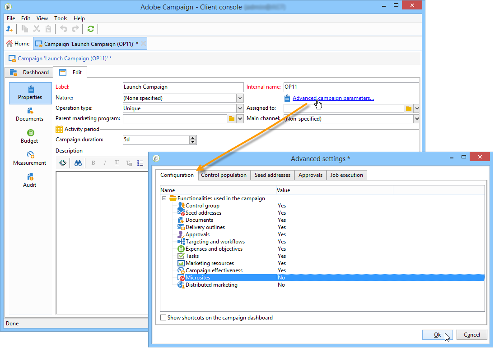
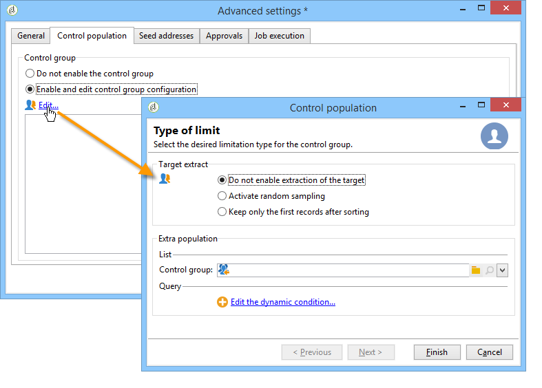
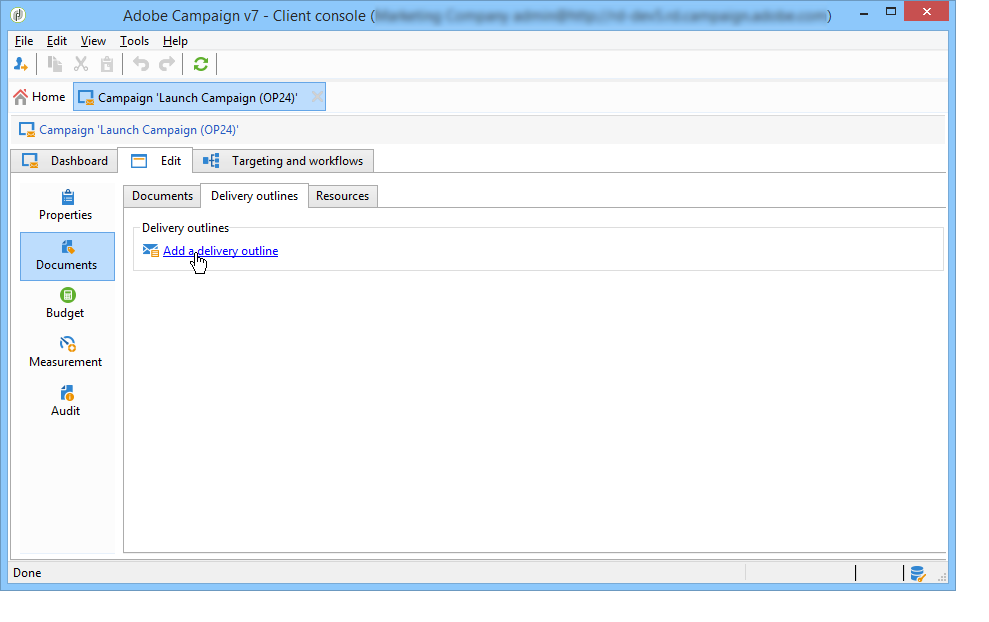
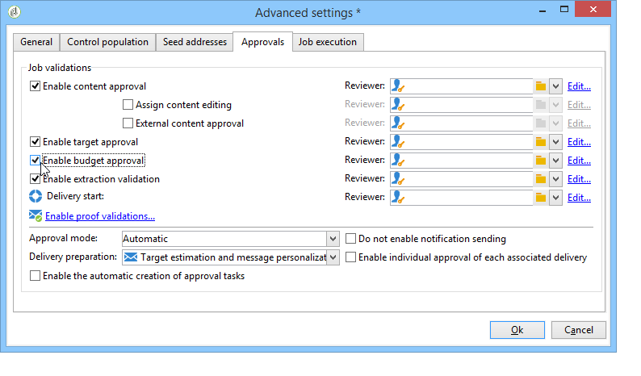

# 마케팅 캠페인 템플릿 {#campaign-templates}

캠페인 템플릿은 **[!UICONTROL Resources > Templates > Campaign templates]** 노드에서 중앙에서 관리합니다. 기본 템플릿이 표준으로 제공됩니다. 사용 가능한 모든 모듈(문서, 작업, 시드 주소 등)을 사용하여 새 캠페인을 만들 수 있지만 제공된 모듈은 사용자의 권한 및 Adobe Campaign 플랫폼의 구성에 따라 다릅니다.

## 캠페인 템플릿 만들기 또는 복제 {#creating-or-duplicating-a-campaign-template}

새 템플릿을 만들려면 다음 단계를 수행하십시오.

1. 캠페인 탐색기를 **엽니다**.
1. 리소스 **> 템플릿 > 캠페인 템플릿에서**&#x200B;템플릿 **목록** 위의 도구 모음에서 새로 만들기를 클릭합니다.

   

1. 새 캠페인 템플릿의 레이블을 입력합니다.
1. 저장을 **클릭하고** 템플릿을 다시 엽니다.
1. 편집 **탭에서** 필요에 따라 **내부 이름과** 다른 값을 입력합니다.
1. 고급 **캠페인 설정을** 선택하여 캠페인 템플릿에 워크플로우를 추가합니다.

   

1. 타깃팅 **및 워크플로우** 값을 예로 **변경합니다**.

   

1. **타깃팅**&#x200B;및 워크플로우&#x200B;**탭에서 워크플로우**&#x200B;추가...를 클릭합니다..

   

1. 레이블 **필드를 완료하고** 확인을 **클릭합니다**.
1. 요구 사항에 따라 워크플로우를 만들 수 있습니다.
1. 저장을 **클릭합니다**. 이제 캠페인에 템플릿을 사용할 준비가 되었습니다.

기본 템플릿을 복제하여 구성을 다시 사용하고 조정할 수도 있습니다.

캠페인 템플릿의 다양한 탭과 하위 탭에서는 일반 구성에 [설명된 대로 해당 설정에 액세스할 수](#general-configuration)있습니다.

## 캠페인 템플릿 구성 {#configuring-a-campaign-template}

캠페인은 사전 정의된 매개 변수 세트를 공유하는 모델을 기반으로 합니다.

기본 구성에서 캠페인 템플릿은 Adobe Campaign 트리의 **[!UICONTROL Resources > Templates > Campaign templates]** 노드에서 중앙 집중화됩니다.

>[!NOTE]
>
>홈 페이지에서 **[!UICONTROL Explorer]** 아이콘을 클릭하면 트리가 표시됩니다.

특정 구성이 정의되지 않은 캠페인을 만들기 위해 기본 템플릿을 제공합니다. 캠페인 템플릿을 만들고 구성한 다음 이러한 템플릿에서 캠페인을 만들 수 있습니다.

캠페인 템플릿 만들기 및 구성은 캠페인 템플릿에 [표시됩니다](#campaign-templates).

캠페인 만들기에 대한 자세한 내용은 캠페인 [만들기 및 이메일](https://docs.campaign.adobe.com/doc/AC/en/Videos/Videos.html) 비디오를 참조하십시오.

## 사용 가능한 모듈 구성 {#configuration-of-the-available-modules}

### 모듈 선택 {#module-selection}

이 **[!UICONTROL Advanced campaign settings...]** 링크를 사용하면 이 템플릿을 기반으로 한 캠페인에 대한 작업을 활성화 및 비활성화할 수 있습니다. 이 템플릿을 기반으로 만든 캠페인에서 활성화할 함수를 선택합니다.

기능을 선택하지 않으면 프로세스에 관한 요소(메뉴, 아이콘, 옵션, 탭, 하위 탭 등)가 은 템플릿의 인터페이스나 이 템플릿을 기반으로 하는 캠페인에 나타나지 않습니다. 캠페인 세부 사항 왼쪽의 탭은 일반적으로 템플릿에서 선택한 프로세스와 일치합니다. 예를 들어, **비용과 목표를** 선택하지 않으면 해당 **[!UICONTROL Budget]** 탭이 이 템플릿을 기반으로 하는 캠페인에 표시되지 않습니다.

또한 구성 창에 대한 단축키가 캠페인 대시보드에 추가됩니다. 기능이 활성화되면 직접 링크를 통해 캠페인 대시보드에서 해당 기능에 액세스할 수 있습니다.

예를 들어, 아래 구성을 사용합니다.

다음 링크가 캠페인 대시보드에 표시됩니다( **[!UICONTROL Add a task]** 링크가 없음).

다음 탭만 표시됩니다.

그러나 이 유형의 구성은 다음과 같습니다.

다음 링크와 탭이 표시됩니다.

### 활성화된 모듈의 유형 {#typology-of-enabled-modules}

* **제어 그룹**

   이 모듈을 선택하면 추가 탭이 템플릿의 고급 설정 및 이 템플릿을 기반으로 하는 캠페인에 추가됩니다. 구성을 템플릿을 통해 정의하거나 각 캠페인에 대해 개별적으로 정의할 수 있습니다.

   

* **시드 주소**

   이 모듈을 선택하면 추가 탭이 템플릿의 고급 설정 및 이 템플릿을 기반으로 하는 캠페인에 추가됩니다. 구성을 템플릿을 통해 정의하거나 각 캠페인에 대해 개별적으로 정의할 수 있습니다.

   

* **문서**

   이 모듈을 선택하면 템플릿의 **[!UICONTROL Edition]** 탭과 이 템플릿을 기반으로 하는 캠페인에 추가 탭이 추가됩니다. 첨부 문서는 템플릿에서 추가하거나 각 캠페인에 대해 개별적으로 추가할 수 있습니다.

   

* **개요**

   이 모듈을 선택하면 캠페인에 대한 배달 외곽선을 정의하기 위해 **[!UICONTROL Delivery outlines]** 하위 탭이 **[!UICONTROL Documents]** 탭에 추가됩니다.

   

* **타깃팅 및 워크플로우**

   이 **[!UICONTROL Targeting and workflows]** 모듈을 선택하면 이 템플릿을 기반으로 한 캠페인에 대한 워크플로우를 하나 이상 만들 수 있도록 탭이 추가됩니다. 이 템플릿을 기반으로 각 캠페인에 대해 워크플로우를 개별적으로 구성할 수도 있습니다.

   

   이 모듈이 활성화되면 프로세스 실행 시퀀스를 정의하는 탭이 캠페인의 고급 설정에 추가됩니다.

   

* **승인**

   을 선택하는 **[!UICONTROL Approval]**&#x200B;경우 승인할 프로세스와 승인을 담당하는 운영자를 선택할 수 있습니다.

   

* **비용 및 목표**

   이 모듈을 선택하면 관련 예산을 선택할 수 있도록 이 템플릿을 기반으로 한 템플릿 및 캠페인의 세부 정보에 **[!UICONTROL Budget]** 탭이 추가됩니다.

   

### 작업 승인 {#approval-of-jobs}

템플릿 고급 설정 섹션의 **[!UICONTROL Approvals]** 탭을 통해 프로세스 승인을 활성화할지 여부를 선택할 수 있습니다. 승인을 선택한 작업은 메시지 전달을 승인하려면 승인되어야 합니다.

검토자 연산자 또는 연산자 그룹을 활성화된 각 승인에 연결해야 합니다.

## 일반 구성 {#general-configuration}

### 템플릿 속성 {#template-properties}

캠페인 템플릿을 만들 때 다음 정보를 입력해야 합니다.

* 템플릿의 **레이블을** 입력합니다.이 레이블은 기본적으로 이 템플릿을 통해 만든 모든 캠페인에 지정됩니다.
* 드롭다운 목록에서 캠페인 **특성을** 선택합니다. 이 목록에서 사용할 수 있는 값은 **[!UICONTROL natureOp]** 열거형에 저장된 값입니다.

   >[!NOTE]
   >
   >열거형에 대한 자세한 내용은 시작하기 [섹션을 참조하십시오](../../platform/using/managing-enumerations.md) .

* 캠페인 **유형을 선택합니다**.고유, 반복 또는 주기적. 기본적으로 캠페인 템플릿은 고유한 캠페인에 적용됩니다. 반복 및 정기 캠페인이 여기에 자세히 설명되어 있습니다.반복 [및 정기 캠페인](../../campaign/using/setting-up-marketing-campaigns.md#recurring-and-periodic-campaigns).
* 캠페인 기간(예: 캠페인이 발생하는 일 수)을 지정합니다. 이 템플릿을 기반으로 캠페인을 만들 때 캠페인 시작 날짜와 종료 날짜가 자동으로 채워집니다.

   캠페인이 반복되면 템플릿에서 캠페인 시작 날짜와 종료 날짜를 직접 지정해야 합니다.

* 템플릿의 **관련 프로그램을** 지정합니다.이 템플릿을 기반으로 하는 캠페인은 선택한 프로그램에 연결됩니다.

### 템플릿 실행 매개 변수 {#template-execution-parameters}

이 **[!UICONTROL Advanced campaign settings...]** 링크를 사용하면 전달 대상(제어 그룹, 시드 주소 등)을 처리하기 위한 템플릿의 고급 옵션을 구성할 수 있습니다. 캠페인 측정 및 워크플로우 실행의 구성

## 캠페인 역방향 예약 {#campaign-reverse-scheduling}

예를 들어 날짜가 미리 알려진 이벤트를 준비하는 캠페인의 역방향 예약을 만들 수 있습니다. 이제 캠페인 템플릿을 사용하여 캠페인의 종료 날짜를 기준으로 작업의 시작 날짜를 계산할 수 있습니다.

작업 구성 상자에서 **[!UICONTROL Implementation schedule]** 영역으로 이동하여 **[!UICONTROL The start date is calculated based on the campaign end date]** 상자를 선택합니다. 여기서 &quot;시작 날짜&quot;는 작업 시작 날짜입니다. 필드로 이동하여 **[!UICONTROL Start]** 간격을 입력합니다.작업이 캠페인 종료 날짜 훨씬 전에 시작됩니다. 캠페인이 마지막으로 설정된 기간보다 긴 기간을 입력하면 작업이 캠페인 전에 시작됩니다.

이 템플릿을 사용하여 캠페인을 만들면 작업 시작 날짜가 자동으로 계산됩니다. 하지만 나중에 언제든지 변경할 수 있습니다.
