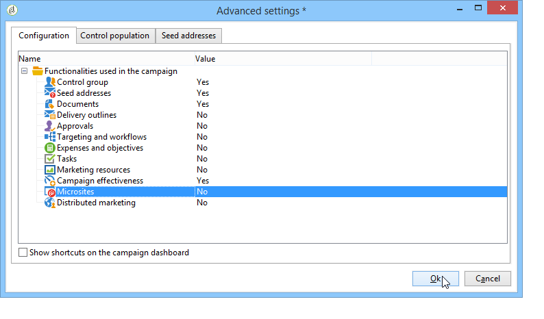
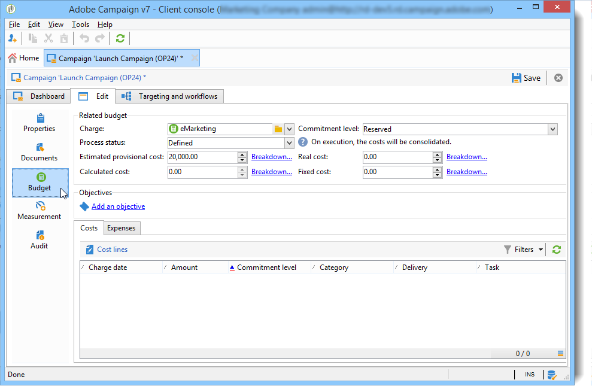

# Campaign 템플릿 만들기 및 구성 {#campaign-templates}

모든 마케팅 캠페인은 주요 특성 및 기능을 저장하는 템플릿을 기반으로 합니다. 캠페인 템플릿은 **[!UICONTROL Resources > Templates > Campaign templates]** 노드 아래에 있어야 합니다. 기본 템플릿이 표준으로 제공됩니다. 사용 가능한 모든 모듈(문서, 작업, 시드 주소 등)을 사용하여 새 캠페인을 만들 수 있지만 제공된 모듈은 Adobe Campaign 플랫폼의 권한 및 구성에 따라 다릅니다.

>[!NOTE]
>
>트리를 클릭하면 트리가 표시됩니다 **[!UICONTROL Explorer]** 아이콘을 클릭합니다.

특정 구성이 정의되지 않은 캠페인을 만들기 위해 내장 템플릿이 제공됩니다. 캠페인 템플릿을 만들고 구성한 다음 그 템플릿에서 캠페인을 만들 수 있습니다.

 캠페인 만들기에 대한 자세한 내용은 [이 비디오](../../campaign/using/marketing-campaign-deliveries.md#create-email-video).

## 캠페인 템플릿 만들기 {#creating-or-duplicating-a-campaign-template}

캠페인 템플릿을 만들려면 아래 단계를 수행하십시오.

1. 캠페인 열기 **탐색기**.
1. in **리소스 > 템플릿 > 캠페인 템플릿**&#x200B;를 클릭합니다. **새로 만들기** 을 클릭합니다.

   

1. 새 캠페인 템플릿의 레이블을 입력합니다.
1. 클릭 **저장** 템플릿을 다시 엽니다.
1. 에서 **편집** 탭에서 다음을 입력합니다 **내부 이름** 필요한 경우 다른 값을 사용할 수 있습니다.
1. 선택 **고급 캠페인 설정** 워크플로우 를 campaign 템플릿에 추가하려면

   

1. 변경 **타겟팅 및 워크플로우** 값 **예**.

   

1. 에서 **타겟팅 및 워크플로우** 탭, **워크플로우 추가...**.

   

1. 을(를) 완료합니다 **레이블** 필드를 입력하고 **확인**.
1. 요구 사항에 따라 워크플로우를 만듭니다.
1. 클릭 **저장**. 이제 템플릿을 캠페인에서 사용할 수 있습니다.

다음을 수행할 수도 있습니다 **중복** 기본 템플릿을 사용하여 구성을 재사용하고 조정합니다.

캠페인 템플릿의 다양한 탭 및 하위 탭에서는 다음 설명에 따라 해당 설정에 액세스할 수 있습니다. [일반 구성](#general-configuration).

## 모듈 선택 {#select-modules}

다음 **[!UICONTROL Advanced campaign settings...]** 링크를 사용하면 이 템플릿을 기반으로 캠페인에 대한 작업을 활성화 및 비활성화할 수 있습니다. 이 템플릿을 기반으로 만든 캠페인에서 활성화할 기능을 선택합니다.

기능을 선택하지 않으면 프로세스에 대한 요소(메뉴, 아이콘, 옵션, 탭, 하위 탭 등)는 은 템플릿의 인터페이스나 이 템플릿을 기반으로 하는 캠페인에 나타나지 않습니다. 캠페인 세부 사항 왼쪽에 있는 탭은 일반적으로 템플릿에서 선택한 프로세스와 일치합니다. 예를 들어 **비용 및 목표** 이(가) 선택되어 있지 않은 경우 해당 **[!UICONTROL Budget]** 이 템플릿을 기준으로 캠페인에 탭이 표시되지 않습니다.

또한 구성 창에 대한 바로 가기가 campaign 대시보드에 추가됩니다. 기능을 활성화하면 직접 연결되는 링크가 캠페인 대시보드에서 해당 기능에 액세스할 수 있습니다.

예를 들어, 아래 구성을 사용할 수 있습니다.

다음 링크가 캠페인 대시보드(캠페인 대시보드의 **[!UICONTROL Add a task]** 링크가 누락됨):

그리고 다음 탭만 표시됩니다.

그러나 이러한 유형의 구성은

다음 링크와 탭이 표시됩니다.

## 모듈 유형화 {#typology-of-enabled-modules}

* **컨트롤 그룹**

   이 모듈을 선택하면 템플릿 및 이 템플릿을 기반으로 하는 캠페인의 고급 설정에 추가 탭이 추가됩니다. 구성은 템플릿을 통해 또는 각 캠페인에 대해 개별적으로 정의할 수 있습니다. 의 컨트롤 그룹에 대해 자세히 알아보십시오 [이 섹션](../../campaign/using/marketing-campaign-deliveries.md#defining-a-control-group).

   

* **시드 주소**

   이 모듈을 선택하면 템플릿 및 이 템플릿을 기반으로 하는 캠페인의 고급 설정에 추가 탭이 추가됩니다. 구성은 템플릿을 통해 또는 각 캠페인에 대해 개별적으로 정의할 수 있습니다. 의 시드 주소에 대해 자세히 알아보기 [이 섹션](../../delivery/using/about-seed-addresses.md).

   

* **문서**

   이 모듈을 선택하면 추가 탭이 **[!UICONTROL Edition]** 탭합니다. 첨부된 문서는 템플릿에서 또는 각 캠페인에 대해 개별적으로 추가할 수 있습니다. 에서 문서에 대해 자세히 알아보십시오 [이 섹션](../../campaign/using/marketing-campaign-deliveries.md#managing-associated-documents).

   

* **개요**

   이 모듈을 선택하면 **[!UICONTROL Delivery outlines]** 하위 탭이 **[!UICONTROL Documents]** 탭하여 캠페인에 대한 게재 개요를 정의합니다. 의 게재 아웃라인에 대해 자세히 알아보십시오 [이 섹션](../../campaign/using/marketing-campaign-deliveries.md#associating-and-structuring-resources-linked-via-a-delivery-outline).

   

* **타겟팅 및 워크플로우**

   을(를) 선택하는 경우 **[!UICONTROL Targeting and workflows]** 모듈에는 이 템플릿을 기반으로 캠페인에 대해 하나 이상의 워크플로우를 만들 수 있는 탭이 추가됩니다. 워크플로우는 이 템플릿을 기준으로 각 캠페인에 대해 개별적으로 구성할 수도 있습니다. [이 섹션](../../campaign/using/marketing-campaign-deliveries.md#building-the-main-target-in-a-workflow).

   

   이 모듈이 활성화되면 캠페인의 고급 설정에 탭이 추가되어 프로세스 실행 시퀀스를 정의합니다.

   

* **승인**

   을(를) 선택하는 경우 **[!UICONTROL Approval]**&#x200B;로 이동하여 승인할 프로세스와 승인을 담당하는 연산자를 선택할 수 있습니다. 승인을 확인하는 방법에 대해 자세히 알아보십시오 [이 섹션](../../campaign/using/marketing-campaign-approval.md#selecting-reviewers).

   

   을 통해 프로세스 승인을 사용할지 여부를 선택할 수 있습니다 **[!UICONTROL Approvals]** 템플릿 고급 설정 섹션의 탭입니다. 메시지 전달을 승인하려면 승인을 선택한 작업을 승인해야 합니다.

   검토자 운영자 또는 운영자 그룹을 활성화된 각 승인에 연결해야 합니다.

* **비용 및 목표**

   이 모듈을 선택하면 **[!UICONTROL Budget]** 관련 예산을 선택할 수 있도록 이 템플릿을 기반으로 하는 템플릿 및 캠페인의 세부 사항에 탭이 추가됩니다.

   

## 속성 및 실행 {#general-configuration}

### 템플릿 속성 {#template-properties}

캠페인 템플릿을 만들 때 다음 정보를 입력해야 합니다.

* 을(를) 입력합니다. **레이블** 템플릿: 이 레이블은 기본적으로 이 템플릿을 통해 만든 모든 캠페인에 할당됩니다.
* 캠페인을 선택합니다 **자연** 드롭다운 목록에서 을 선택합니다. 이 목록에서 사용할 수 있는 값은 **[!UICONTROL natureOp]** 열거형.

   >[!NOTE]
   >
   >열거형에 대한 자세한 내용은 [시작하기](../../platform/using/managing-enumerations.md) 섹션을 참조하십시오.

* 을(를) 선택합니다 **캠페인 유형**: 고유, 반복 또는 주기적. 기본적으로 캠페인 템플릿은 고유한 캠페인에 적용됩니다. 반복 및 주기적 캠페인은 [이 섹션](../../campaign/using/setting-up-marketing-campaigns.md#recurring-and-periodic-campaigns).
* 캠페인 기간(즉, 캠페인이 발생하는 일 수)을 지정합니다. 이 템플릿을 기반으로 캠페인을 만들 때 캠페인 시작 및 종료 날짜가 자동으로 채워집니다.

   캠페인이 반복되는 경우 템플릿에서 직접 캠페인 시작 및 종료 날짜를 지정해야 합니다.

* 을(를) 지정합니다. **관련 프로그램** 템플릿: 이 템플릿을 기반으로 하는 캠페인은 선택한 프로그램에 연결됩니다.

### 템플릿 실행 매개 변수 {#template-execution-parameters}

다음 **[!UICONTROL Advanced campaign settings...]** 링크를 사용하면 게재 대상(제어 그룹, 시드 주소 등)을 처리하기 위해 템플릿의 고급 옵션을 구성할 수 있습니다. 및 캠페인 측정 및 워크플로우 실행 구성.

## 캠페인 실행 추적{#campaign-reverse-scheduling}

예를 들어 특정 날짜에 대한 이벤트 일정을 준비하기 위해 캠페인 일정을 만들고 성과를 추적할 수 있습니다. 이제 캠페인 템플릿을 사용하여 캠페인의 종료 날짜를 기반으로 작업 시작 날짜를 계산할 수 있습니다.

작업 구성 상자에서 **[!UICONTROL Implementation schedule]** 영역 및 확인 **[!UICONTROL The start date is calculated based on the campaign end date]** 상자. (여기서 &quot;시작 날짜&quot;는 작업 시작 날짜입니다.) 로 이동합니다. **[!UICONTROL Start]** 필드를 입력하고 간격을 입력합니다. 작업은 캠페인 종료 날짜 훨씬 전에 시작됩니다. 캠페인이 마지막으로 설정되는 기간보다 긴 기간을 입력하는 경우 작업이 캠페인 전에 시작됩니다.

이 템플릿을 사용하여 캠페인을 만들 때 작업 시작 날짜가 자동으로 계산됩니다. 하지만 언제든지 나중에 변경할 수 있습니다.
