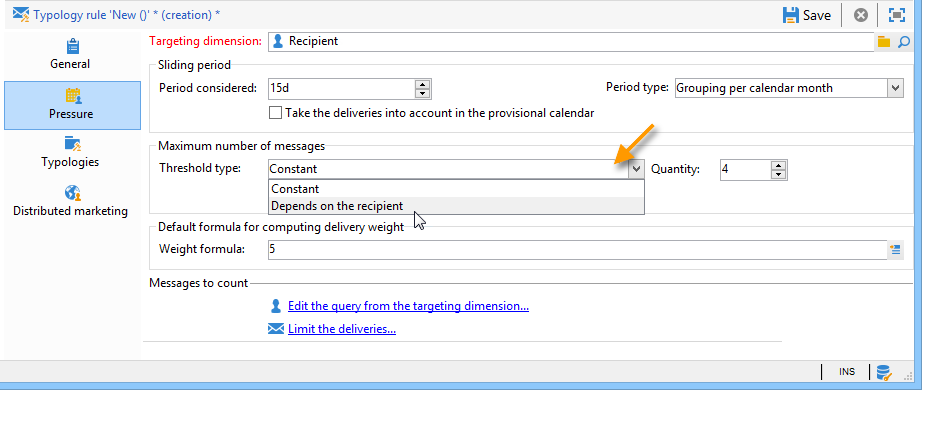

# 압력 규칙{#pressure-rules}

## 마케팅 피로도 정보 {#about-marketing-fatigue}

매출 압력 관리를 구현하면 데이터 데이터베이스에서 마케팅 피로라고도 하는 과도한 호객행위를 방지할 수 있습니다. 이를 위해 받는 사람당 최대 메시지 수를 정의할 수 있습니다. 또한 타깃팅된 대상자에게 최상의 메시지를 보내기 위해 캠페인 간 중재 규칙을 구현할 수도 있습니다.

**마케팅** 피로도를 관리하기 위해, 예를 들어 인구 2명으로 보낼 서신 수를 제한하고, 구독자 그룹의 관심사에 가장 잘 맞는 커뮤니케이션을 선택하며, 불만있는 고객에게 SMS를 보내는 것을 피하도록 합니다.

캠페인은 정의된 임계값과 메시지 가중치를 기반으로 선택됩니다.

* 임계값은 지정된 기간 내에 지정된 수신자에 대해 허가된 배달 중 가장 많은 수입니다. 설정이나 변수를 사용할 수 있습니다. 이것은 분류 규칙 설정에서 설정되거나 계산됩니다. [최대 메시지 수](#maximum-number-of-messages)를 참조하십시오.
* 전달 가중치를 사용하면 압력 관리 프레임워크 내에서 우선 순위가 가장 높은 배달을 식별할 수 있습니다. 무게가 가장 큰 메시지는 우선 순위가 높습니다. [메시지 무게](#message-weight)를 참조하십시오.

중재는 진행 중인 캠페인보다 가중치가 큰 예약된 캠페인이 과도한 프로필 요청을 발생시키지 않도록 하는 데 포함됩니다.이 경우 프로필이 전달에서 제외됩니다.

중재 기준(메시지 무게 및/또는 임계값)은 다음 두 가지 유형의 정보에 따라 달라질 수 있습니다.

* 수신자 환경 설정(선언적 정보):뉴스레터 가입, 수신자 상태(고객 또는 잠재 고객),
* 받는 사람 행동:구매, 방문한 링크 등

적격한 메시지를 정의하는 중재 규칙은 분석 단계에서 적용됩니다. 다음 공식이 참인 경우 각 수신자와 해당 기간에 대해 메시지가 전송됩니다.**(보낸 메시지 수) + (가중치가 큰 메시지 수) &lt; 임계값**.

그렇지 않으면 수신자는 **[!UICONTROL Excluded by arbitration]**&#x200B;이 됩니다. 이에 대한 자세한 내용은 [중재 후 제외](#exclusion-after-arbitration)를 참조하십시오.

## 압력 규칙 만들기 {#creating-a-pressure-rule}

Adobe Campaign을 사용하여 캠페인 간 중재를 설정하려면 캠페인 유형 규칙을 만들고 연결된 유형 규칙(**압력** 규칙)을 정의하는 것으로 시작합니다.

**[!UICONTROL Pressure]** 유형화 규칙을 만들고 구성하려면 다음 단계를 수행합니다.

1. 캠페인 유형 규칙 목록에서 목록 위의 **[!UICONTROL New]** 아이콘을 클릭합니다.

   

1. 새 규칙의 **[!UICONTROL General]** 탭에서 **압력** 유형 규칙을 선택하고 이름과 설명을 입력합니다.

   

1. 필요한 경우 실행 순서를 변경합니다. 여러 유형 규칙을 **[!UICONTROL Typology]** 세트로 적용하면 순서가 낮은 규칙이 먼저 적용됩니다. 자세한 내용은 [실행 주문](../../campaign/using/applying-rules.md#execution-order)을 참조하십시오.
1. 다음 일별 재중재 실행 이후 타깃팅을 저장하려면 **[!UICONTROL Calculation parameters]** 섹션에서 빈도를 정의합니다. 자세한 내용은 [계산 주기 조정](../../campaign/using/applying-rules.md#adjusting-calculation-frequency)을 참조하십시오.
1. **[!UICONTROL Pressure]** 탭을 클릭하고 Typical 규칙이 적용되는 달력 기간을 선택합니다.

   

   해당 기간에 연락처 날짜가 포함된 배달물에 규칙이 적용됩니다.

   >[!NOTE]
   >
   >예약된 배달은 **[!UICONTROL Take the deliveries into account in the provisional calendar]** 옵션이 선택된 경우에만 고려됩니다. 자세한 내용은 [기간 설정](#setting-the-period)을 참조하십시오.

1. 가장 많은 메시지 수를 계산하는 방법을 정의합니다.

   임계값은 해당 기간 동안 수신자에게 보낼 수 있는 가장 높은 메시지 수를 나타냅니다.

   기본적으로 임계값은 일정하며 규칙에서 허가한 최대 메시지 수를 표시해야 합니다.

   

   변수 임계값을 정의하려면 **[!UICONTROL Type of threshold]** 필드에서 **[!UICONTROL Depends on the recipient]** 값을 선택하고 오른쪽의 아이콘을 사용하여 표현식 편집기를 엽니다.

   

   자세한 내용은 [최대 메시지 수](#maximum-number-of-messages)를 참조하십시오.

1. 배달 가중치를 계산하는 방법을 지정합니다.

   각 배달에는 가중치(즉, 우선순위 수준을 나타내는 값)가 있습니다.이렇게 하면 캠페인 간 중재를 할 수 있습니다. 가중치는 유형 규칙 및/또는 해당 속성에 정의된 공식을 사용하여 계산됩니다. 자세한 내용은 [메시지 무게](#message-weight)를 참조하십시오.

1. 기본적으로 모든 메시지는 임계값 계산에 고려됩니다. **[!UICONTROL Restriction]** 탭에서는 Typical 규칙에 따라 관련된 메시지를 필터링할 수 있습니다.

   * 이 탭의 상단 섹션에서 관련 수신자를 제한할 수 있습니다.
   * 이 탭의 하단에서는 계산할 메시지를 필터링할 수 있습니다.

      다음 예제에서는 **NewContacts** 폴더에 저장된 수신자만 고려되고 **Newsletter**&#x200B;로 시작하는 배달이 고려됩니다.
   

1. **[!UICONTROL Typologies]** 탭에서는 이 규칙을 적용하거나 규칙을 하나 이상의 기존 유형 분류에 연결하는 캠페인 유형을 볼 수 있습니다. 자세한 내용은 [유형 적용](../../campaign/using/about-campaign-typologies.md#applying-typologies)을 참조하십시오.

## 임계값 및 가중치 정의 {#defining-thresholds-and-weights}

### 최대 메시지 수 {#maximum-number-of-messages}

각 압력 규칙은 주어진 기간 동안 한 명의 수신자에게 보낼 수 있는 최대 메시지 수, 즉 임계값을 정의합니다. 이 임계값에 도달하면, 고려된 기간이 끝날 때까지 더 이상 게재할 수 없습니다. 이 프로세스를 사용하면 메시지가 설정된 임계값을 초과하는 경우 수신자를 게재에서 자동으로 제외하여 과도한 요청을 방지할 수 있습니다.

임계값은 상수 또는 변수가 있는 공식에 의해 계산될 수 있습니다. 즉, 주어진 기간에 임계값은 한 수신자와 다른 수신자에 따라 달라지거나 동일한 수신자에 대해서도 다를 수 있습니다.

>[!CAUTION]
>
>임계값으로 **0**&#x200B;을(를) 입력하면 해당 기간 동안 대상 모집단에 대한 모든 배달을 수행할 수 없습니다.

**예제:**

받는 사람이 속한 세그먼트에 따라 허가된 메시지 수를 색인화할 수 있습니다. 이는 웹 세그먼트에 속하는 수신자가 다른 받는 사람보다 더 많은 메시지를 받을 수 있음을 의미합니다. **[!UICONTROL Iif (@origin='Web', 5, 3)]** 유형 공식은 수신자에게 5개의 메시지를 전달하고 다른 세그먼트에 대해 3개의 메시지를 전달하도록 허용합니다. 구성은 다음과 같습니다.

임계값을 정의하려면 타깃팅 차원에 연결된 차원을 사용할 수 있습니다.예를 들어 방문자 테이블에 저장된 수신자 프로필로 배달된 메시지를 포함하거나(방문자 테이블에 대한 자세한 내용은 [이 섹션](../../web/using/use-case--creating-a-refer-a-friend-form.md) 참조) 받는 사람의 차원과 연결된 차원에서 식별된 동일한 호구에 매주 두 개 이상의 메시지를 보내지 않으려면(여러 이메일 주소를 참조할 수 있음).

이렇게 하려면 **[!UICONTROL Count messages on a linked dimension]** 옵션을 선택한 다음 방문자 또는 연락처 테이블을 선택합니다.

### 메시지 무게 {#message-weight}

각 배달에는 우선 순위 수준을 나타내는 중량이 있습니다. 기본적으로 전달의 무게는 5로 설정됩니다. 압력 규칙을 사용하여 적용할 납품의 가중치를 정의할 수 있습니다.

가중치는 수식을 통해 설정하거나 계산하여 수신자에게 맞출 수 있습니다. 예를 들어 수신자 관심사에 따라 게재의 가중치를 정의할 수 있습니다.

>[!CAUTION]
>
>**[!UICONTROL Properties]** 탭에서 분류 규칙에 정의된 가중치는 각 전달에 대해 개별적으로 오버로드될 수 있습니다. **[!UICONTROL Typology]** 탭을 클릭하여 캠페인 유형을 선택하고 필요한 경우 적용할 가중치를 지정합니다.\
>그러나 A 유형 분류 규칙에 선언된 가중치는 B 유형 분류 규칙을 계산하는 데 사용되지 않습니다.이 가중치는 A 규칙을 사용하는 배달에만 적용됩니다.

**예제:**

다음 예에서는 음악에 대한 뉴스레터 중량을 수신자의 성향 점수와 연결하려고 합니다. 방법은 다음과 같습니다.

1. 수신자 성향 점수를 저장할 새 필드를 만듭니다. 이 경우 **@Music** 필드는 설문 조사 및 온라인 투표에 대한 답변, 수집된 추적 데이터 등과 함께 제공됩니다.
1. 이 필드를 기반으로 메시지 두께를 계산하기 위해 유형 규칙을 만듭니다.

   

1. 다음 항목이 있는 메시지에 이 규칙을 적용합니다.뉴스레터, 특별 프로모션 등 이러한 게재의 가중치 및 우선 순위 수준은 각 수신자의 성향 점수에 따라 달라집니다.

## 마침표 {#setting-the-period} 설정

압력 규칙은 **n**-일 롤링 기간에 정의됩니다.

마침표는 규칙의 **[!UICONTROL Pressure]** 탭에 구성됩니다. 일 수를 지정할 수 있으며, 필요한 경우 적용할 그룹화 유형(일, 주, 월, 분기 등)을 선택할 수 있습니다.

그룹화 유형을 사용하면 해당 기간의 날짜에 대해 **[!UICONTROL Period considered]** 필드를 전체 일, 달력 주, 달력 월 또는 달력 연도로 확장할 수 있습니다.

예를 들어, 각 달력 월을 그룹화하여 매주 2개의 메시지 임계값을 정의하는 압력 규칙은 동일한 주 내 2개 이상의 메시지가 동일한 달력 월 내에 전달되지 않도록 합니다. 경고: 기간이 2개월과 겹치는 경우, 계산 임계값은 이러한 두 달력의 배달을 고려하므로 두 번째 달 동안 모든 신규 납품을 방지할 수 있습니다.

>[!NOTE]
>
>기본적으로 임계값을 계산할 때 이미 전송된 배달만 고려됩니다. 해당 기간에 예약된 배달도 고려하려면 **[!UICONTROL Take the deliveries into account in the provisional calendar]** 옵션을 선택합니다. 이 경우, 고려된 기간이 두 배로 증가하여 이전 기간뿐만 아니라 미래 배달도 통합할 수 있습니다.\
>2주 기간으로 고려하는 납품을 제한하려면 다음 중 하나를 수행합니다.
>
>* **[!UICONTROL Concerned period]** 필드에 **15d**&#x200B;을 입력합니다.배송일 최대 2주 전에 전송된 배달은 계산에 고려됩니다.
>
>  
또는
>
>* **[!UICONTROL Period considered]** 필드에 **7d**&#x200B;을 입력하고 **[!UICONTROL Take the deliveries into account in the provisional calendar]**\
   >옵션:배달 일자 7일 전까지 최대 7일까지 발송된 게재와 규칙이 적용되는 배달 일자 이후 최대 7일까지 예약된 배달은 계산에 고려됩니다.
>
>
기간 시작 날짜는 데이터베이스가 구성되는 방식에 따라 다릅니다.

예를 들어 12/11의 게재에 그룹화하지 않고 15일 압력 규칙을 적용하는 경우 11/27에서 12/12 사이의 배달이 고려됩니다. 압력 규칙이 임시 달력에서 납품을 고려하는 경우 11/27 ~ 12/27 사이에 예약된 모든 납품이 고려됩니다. 마지막으로, 규칙에서 달력 월당 그룹을 구성하는 경우, 11월과 12월의 모든 게재는 임계값을 계산하기 위해 고려됩니다(11/1부터 12/31까지).

>[!CAUTION]
>
>**자주 사용되는 사례**
>계산 임계값에 대한 이전 주의 배송을 고려할 뿐만 아니라 현재 달력 주에 대한 납품이 고려되지 않도록 하려면 &#39;0&#39;에서 **[!UICONTROL Period considered]**&#x200B;을 지정하고 &#39;달력 주당 그룹화&#39;를 **[!UICONTROL Period type]**&#x200B;으로 선택합니다.
> 
>기간이 0(예: 1)보다 크면 계산 임계값은 이전 날짜의 배달을 고려할 수 있습니다. 따라서 이전 요일이 이전 달력 주에 해당하고 선택한 기간 유형이 &#39;달력 주당 그룹화&#39;인 경우, 계산 임계값에 대한 이전 주의 모든 사항을 고려하게 됩니다.

**예제:**

2주 기간마다 3개의 메시지로 모집을 제한하는 달력 달로 그룹화하는 압력 규칙을 만들고 싶습니다.

05/30, 06/3, 06/8, 06/8, 06/12, 06/22 및 06/30으로 예약된 동일한 무게의 6개의 뉴스레터를 가져갑시다.

6월 12일과 30일로 예정된 배달은 전송되지 않습니다.06/12 배달은 2주 기간당 3개의 메시지 임계값을 초과하며 30번째 배달은 달력당 허가된 통신 임계값을 초과하게 됩니다.

이러한 게재에 대한 모든 수신자는 분석 단계 중 중재에 의해 제외됩니다.

동일한 규칙의 경우 분기당 배달을 그룹화하는 경우 **newsletter no.5**&#x200B;의 수신자도 제외되며 발송되지 않습니다.

마지막으로, 그룹을 선택하지 않으면 처음 3개의 뉴스레터와 동일한 2주 기간에 대해 계획되었기 때문에 **뉴스레터 no.4**&#x200B;만 전송되지 않습니다.

>[!NOTE]
>
>분류 규칙 정의를 변경할 때 **시뮬레이션**&#x200B;을 만들어 적용된 게재에 대한 영향을 제어하고 배달이 서로 미치는 영향을 모니터링할 수 있습니다. 자세한 내용은 [캠페인 시뮬레이션](../../campaign/using/campaign-simulations.md)을 참조하십시오.

## 중재 후 제외 {#exclusion-after-arbitration}

중재는 **[!UICONTROL Forecasting]** 기술 작업 과정과 **[!UICONTROL Campaign jobs]** 작업 과정을 통해 매일 밤 다시 적용됩니다.

**[!UICONTROL Forecasting]** 작업 과정은 진행 중인 기간(시작 날짜부터 현재 날짜까지)의 데이터를 미리 계산하여 분석 중에 분류 규칙을 적용할 수 있습니다. 또한 매일 밤 중재에 대한 제외 카운터도 다시 계산합니다.

따라서 Adobe Campaign은 각 수신자에게 보낼 메시지 수가 해당 기간 동안 이미 보낸 메시지 수를 고려하여 임계값을 초과하지 않는지 확인합니다. 이 정보는 배달 시 모든 계산이 업데이트되므로 **표시기**&#x200B;입니다.

이 수가 임계값을 초과하는 경우, 캠페인 유형에 정의된 중재 규칙이 적용되며 수신자는 더 낮은 가중치의 캠페인에서 제외됩니다.

>[!NOTE]
>
>여러 게재에 동일한 점수가 있는 경우 가장 빠른 날짜에 예약된 캠페인이 전송됩니다.

## 압력 규칙에 대한 사용 사례 {#use-cases-on-pressure-rules}

### 기준 {#adapting-the-threshold-based-on-criterion}을(를) 기준으로 임계값 조정

고객에게 매주 4개 이상의 메시지를 전달하고 잠재 고객에게 매주 2개의 메시지를 전달하는 것을 방지하기 위해 유형 분석 규칙을 만들려고 합니다.

고객과 잠재 고객을 식별하려면 잠재 고객을 위해 0을, 고객을 위해 1을 포함하는 **[!UICONTROL Status]** 필드를 사용하십시오.

규칙을 만들려면 다음 단계를 적용합니다.

1. 새 **압력** 유형 분류 규칙을 만듭니다.
1. **[!UICONTROL Pressure]** 탭을 편집합니다.**[!UICONTROL Maximum number of messages]** 섹션에서 각 수신자에 따라 임계값을 계산하는 공식을 생성하려고 합니다. **[!UICONTROL Threshold type]** 필드에서 **[!UICONTROL Depends on the recipient]** 값을 선택한 다음 **[!UICONTROL Formula]** 필드 오른쪽에 있는 **[!UICONTROL Edit expression]**&#x200B;를 클릭합니다.

   **[!UICONTROL Advanced parameters]** 단추를 클릭하여 계산 공식을 정의합니다.

   

1. **[!UICONTROL Edit the formula using an expression]** 옵션을 선택하고 **[!UICONTROL Next]**&#x200B;을 클릭합니다.

   

1. 함수 목록에서 **[!UICONTROL Others]** 노드의 **Iif** 함수를 두 번 클릭합니다.

   그런 다음 **[!UICONTROL Available fields]** 섹션에서 받는 사람의 **상태**&#x200B;를 선택합니다.

   

   다음 공식을 입력합니다.**Iif(@status=0,2,4)**

   

   이 수식을 사용하면 상태가 0인 경우 값 2를 할당하고 다른 모든 상태에 대해 값 4를 할당할 수 있습니다.

   수식을 승인하려면 **[!UICONTROL Finish]**&#x200B;을(를) 클릭합니다.

1. 규칙이 적용되는 기간을 지정합니다.이 경우 7일 동안 주당 메시지 수를 카운트합니다.

   

1. 규칙을 저장하여 생성을 승인합니다.

이제 유형 분석에 방금 만든 규칙을 배달에 적용하기 위해 연결합니다. 방법은 다음과 같습니다.

1. 캠페인 유형을 만듭니다.
1. **[!UICONTROL Rules]** 탭으로 이동하여 **[!UICONTROL Add]** 버튼을 클릭하고 방금 만든 규칙을 선택합니다.

   

1. 다음과 같은 유형을 저장합니다.가 기존 유형 유형 목록에 추가됩니다.

게재에서 이 유형을 사용하려면 아래 표시된 대로 **[!UICONTROL Typology]** 탭에서 배달 속성에서 선택합니다.

>[!NOTE]
>
>이 템플릿을 사용하여 만든 모든 게재에 자동으로 적용되도록 게재 템플릿에서 유형화를 정의할 수 있습니다.

배달 분석 중에 배달 받는 사람은 이미 발송한 배달 수에 따라 해당하는 경우 배달에서 제외됩니다. 이 정보를 보려면 다음을 수행합니다.

* 분석 결과 보기:

   

* 배달을 편집하고 **[!UICONTROL Delivery]** 탭 및 **[!UICONTROL Exclusions]** 하위 탭을 클릭합니다.

   

* **[!UICONTROL Audit]** 탭을 클릭한 다음 **[!UICONTROL Causes of exclusions]** 하위 탭을 클릭하여 제외 수와 적용된 분류 규칙 수를 표시합니다.

   

### {#calculating-the-delivery-weight-based-on-behavior} 비헤이비어를 기반으로 배달 가중치 계산

받는 사람 행동에 따라 압력 규칙을 정의할 수 있습니다.따라서 한 수신자가 다른 수신자에 따라 달라지는 기준에 따라 배달 무게가 조정됩니다. 예를 들어 수신자가 인터넷 사이트를 방문했는지 여부, 마지막 뉴스레터의 특정 섹션을 클릭했는지, 정보 서비스에 구독했는지 또는 설문 조사, 온라인 게임 등에 대한 응답에 따라 메시지를 전송하기로 결정할 수 있습니다.

다음 예에서는 5의 무게로 배달을 만듭니다. 이 가중치는 받는 사람 행동에 따라 성향 점수가 높아집니다.이 사이트에서 이미 주문한 고객은 5점을 받게 되고, 온라인 주문을 한 적이 없는 고객은 4점을 받게 됩니다.

이 유형의 구성을 수행하려면 공식을 사용하여 메시지 두께를 정의해야 합니다. 성향 점수와 설문 조사 응답에 대한 정보는 데이터 모델에서 액세스할 수 있어야 합니다. 이 예에서는 **성향** 필드가 추가되었습니다.

다음 구성 단계를 적용합니다.

1. 새 **압력** 유형 분류 규칙을 만듭니다.
1. **[!UICONTROL Pressure]** 탭을 편집합니다. 각 개별 수신자를 기반으로 하는 임계값 공식을 생성하려고 합니다.**[!UICONTROL Weight formula]** 필드 오른쪽에 있는 **[!UICONTROL Edit expression]** 아이콘을 클릭합니다.

   

1. 기본적으로 **5** 값은 표현식 편집기의 위쪽 섹션에 표시됩니다. 이 가중치에 각 수신자의 성향 점수를 추가하고 싶습니다.5의 오른쪽에 커서를 놓고 **+** 문자를 입력하고 **성향** 필드를 선택합니다.

   

1. 그런 다음 이미 구입한 수신자에게 더 높은 값을 추가합니다. 그들에게, 배달되는 것의 무게는 5를 증가시켜야 하고, 다른 사람들에게는 4개만 증가시켜야 합니다.

   

1. **[!UICONTROL Finish]**&#x200B;을 클릭하여 이 규칙을 저장합니다.
1. 규칙을 캠페인 유형 분석에 연결하고 전달에서 이 유형을 참조하여 승인합니다.

### 가장 높은 가중 메시지 {#sending-only-the-highest-weighted-messages}만 보내기

동일한 주 내에 하루에 2개 이상의 메시지를 수신자에게 전송하려면 가중치가 높은 메시지만 전달해야 합니다.

이렇게 하려면 동일한 수신자에 대해 서로 다른 가중치를 사용하여 여러 배달 일정을 예약하고 가중치가 낮은 게재는 제외하도록 압력 규칙을 적용해야 합니다.

먼저 압력 규칙을 구성합니다.

1. 압력 규칙을 만듭니다. 자세한 내용은 [압력 규칙 만들기](#creating-a-pressure-rule)를 참조하십시오.
1. **[!UICONTROL General]** 탭에서 **[!UICONTROL Re-apply the rule at the start of personalization]** 옵션을 선택합니다.

   

   이 옵션은 **[!UICONTROL Frequency]** 필드에 정의된 값을 무시하고 개인화 단계 동안 규칙을 자동으로 적용합니다. 자세한 내용은 [계산 주기 조정](../../campaign/using/applying-rules.md#adjusting-calculation-frequency)을 참조하십시오.

1. **[!UICONTROL Pressure]** 탭에서 **[!UICONTROL Period considered]**, **[!UICONTROL Grouping per day]**&#x200B;을 **[!UICONTROL Period type]**(으)로 선택합니다.**[!UICONTROL 7d]**
1. 예약된 배달을 포함하려면 **[!UICONTROL Take the deliveries into account in the provisional calendar]** 옵션을 선택합니다.

   

   납품 일자 7일 전까지 최대 7일까지 발송된 게재와 납품 일자 이후 최대 7일까지 계획된 게재는 계산에 고려됩니다. 자세한 내용은 [기간 설정](#setting-the-period)을 참조하십시오.

1. **[!UICONTROL Typologies]** 탭에서 규칙을 캠페인 유형 분석에 연결합니다.
1. 변경 내용을 저장합니다.

이제 압력 규칙을 적용할 각 전달에 대한 워크플로우를 만들고 구성합니다.

1. 캠페인 만들기. 이 작업에 대한 자세한 정보는 [이 섹션](../../campaign/using/setting-up-marketing-campaigns.md#creating-a-campaign)을 참조하십시오.
1. 캠페인의 **[!UICONTROL Targeting and workflows]** 탭에서 워크플로우에 **쿼리** 활동을 추가합니다. 이 활동 사용에 대한 자세한 내용은 [이 섹션](../../workflow/using/query.md)을 참조하십시오.
1. 워크플로우에 **[!UICONTROL Email delivery]** 활동을 추가하고 엽니다. 이 활동 사용에 대한 자세한 내용은 [이 섹션](../../workflow/using/delivery.md)을 참조하십시오.
1. **[!UICONTROL Delivery properties]**&#x200B;의 **[!UICONTROL Approvals]** 탭으로 이동하여 모든 승인을 비활성화합니다.

   

1. **[!UICONTROL Delivery properties]**&#x200B;의 **[!UICONTROL Typology]** 탭에서 규칙을 적용할 캠페인 유형을 참조하십시오. 배달을 위한 가중치를 정의합니다.

   

1. 배달에서 **[!UICONTROL Scheduling]**&#x200B;을 클릭하고 **[!UICONTROL Schedule delivery (automatic execution when the scheduled date is reached)]**&#x200B;을 선택합니다. 이 예에서 **[!UICONTROL Use a calculation formula]** 옵션을 선택합니다.
1. 추출 날짜를 10분(현재 날짜 + 10분)으로 설정합니다.
1. 연락처 날짜를 다음 날(현재 날짜 + 1일)로 설정합니다.

   

   압력 규칙 제외를 성공적으로 구현하려면, 반드시 연락처 날짜 및 시간 전, 야간 중재를 다시 적용하기 전에 추출 날짜와 시간을 설정해야 합니다. 이에 대한 자세한 내용은 [중재 후 제외](#exclusion-after-arbitration)를 참조하십시오.

1. **[!UICONTROL Confirm the delivery before sending]** 옵션을 선택 취소하고 변경 내용을 저장합니다.
1. 전송하려는 각 전달에 대해 비슷하게 진행하십시오. 각 전달에 대해 원하는 가중치를 설정해야 합니다.
1. 관련 워크플로우를 실행하여 배달을 준비하고 전송합니다.

야간 중재를 적용할 때 동일한 수신자에 대해 가중치가 낮은 배달은 제외됩니다. 가장 큰 무게의 배달품만 발송하는 것으로 간주됩니다. 자세한 내용은 [메시지 무게](#message-weight)를 참조하십시오.

주 중에 이미 해당 수신자에게 이메일을 보냈다는 점을 고려할 때 아래 표는 두 개 더 많은 게재에 적용할 수 있는 구성의 예를 보여줍니다.

<table> 
 <thead> 
  <tr> 
   <th> 게재  </th> 
   <th> 승인  </th> 
   <th> 무게  </th> 
   <th> 추출 날짜/시간  </th> 
   <th> 연락처 날짜  </th> 
   <th> 배달 시작 날짜/시간  </th> 
   <th> 중재 워크플로우 실행 날짜/시간  </th> 
   <th> 배달 상태  </th> 
   <th> 배달 전송(날짜/시간)  </th> 
  </tr> 
 </thead> 
 <tbody> 
  <tr> 
   <td> 배달 1  </td> 
   <td> 비활성화됨  </td> 
   <td> 5  </td> 
   <td> 3pm  </td> 
   <td> 8am (다음날)  </td> 
   <td> 2pm  </td> 
   <td> 야간  </td> 
   <td> 제외  </td> 
   <td> 제외  </td> 
  </tr> 
  <tr> 
   <td> 배달 2  </td> 
   <td> 비활성화됨  </td> 
   <td> 10  </td> 
   <td> 4pm  </td> 
   <td> 9시(다음날)  </td> 
   <td> 2pm  </td> 
   <td> 야간  </td> 
   <td> 보낸 날짜  </td> 
   <td> 9시(다음날)  </td> 
  </tr> 
 </tbody> 
</table>

두 게재에 대해 추출 날짜가 지난 후 야간 중재는 두 게재의 연락 날짜 전에 다시 적용됩니다. 이렇게 하면 이미 발송된 모든 배달(배달을 처리하고 광범위한 로그를 통해 기록되는 받는 사람) 또는 전송될 예약된 모든 배달(예측 로그를 통해 기록되는 배달을 받을 수 있는 받는 사람)을 찾을 수 있습니다.

압력 규칙에 정의된 기간 동안 모든 전송 및 잠재적 배달이 목록에 포함되면 Adobe Campaign은 가장 높은 가중치를 먼저 사용하여 가중치별로 정렬합니다. 압력 규칙에 설정된 임계값에 도달하면(동일한 주 내에 2개 이하의 이메일이 있음) 받는 사람은 전달에서 제외됩니다.
