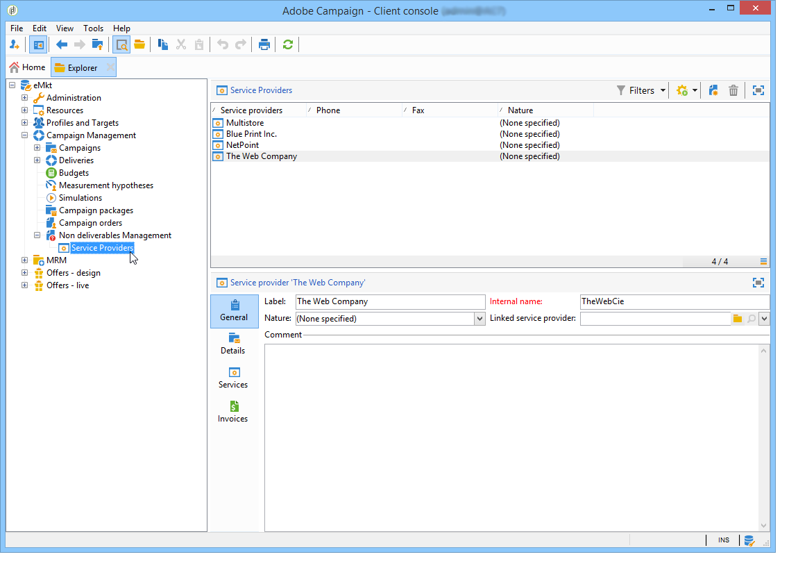
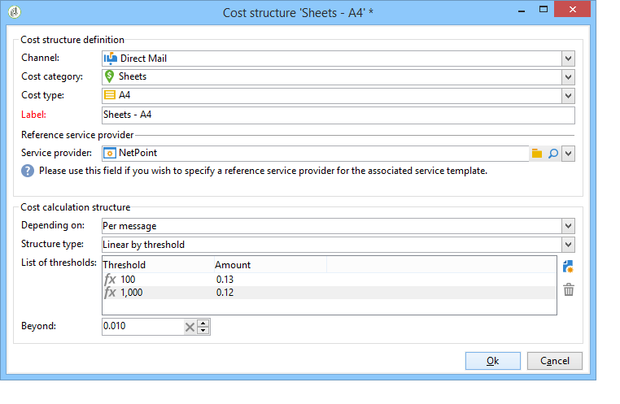

# 제공업체, 주식 및 예산{#providers-stocks-and-budgets}

Adobe Campaign lets you define service providers who will be involved in the jobs carried out within the campaigns. 서비스 제공업체 및 관련 비용 구조에 대한 정보는 기본 보기에서 Adobe Campaign 관리자가 정의합니다. The service provider is referenced from the delivery, and its cost structures allow the calculation of costs associated with this delivery as well as the management of the stock concerned.

## Creating service providers and their cost structures {#creating-service-providers-and-their-cost-structures}

Each service provider is saved in a file with contact details, service templates, and related jobs.

서비스 공급자는 트리의 **[!UICONTROL Administration > Campaign management]** 노드에서 구성됩니다.

배달 중에 수행되는 작업은 서비스 제공자들에 의해, 특히 다이렉트 메일 및 모바일 채널에서 수행됩니다. These service providers can, for example, be involved in printing or distributing messages. These jobs involve configurations and costs which are specific to each service provider. The configuration of service providers involves four stages:

1. Creation of a service provider in Adobe Campaign

   See [Adding a service provider](#adding-a-service-provider).

1. Defining cost categories and structures of associated service templates

   See [Defining cost categories](#defining-cost-categories) and [Defining the cost structure](#defining-the-cost-structure).

1. Configuration of processes

   See [Configuring processes associated with a service](#configuring-processes-associated-with-a-service).

1. Referencing the service provider at the campaign level

   See [Associating a service with a campaign](#associating-a-service-with-a-campaign).

### 서비스 공급자 및 해당 비용 범주 만들기 {#creating-a-service-provider-and-its-cost-categories}

#### Adding a service provider {#adding-a-service-provider}

You can create as many service providers as necessary for your deliveries. 서비스 공급자를 추가하는 절차는 다음과 같습니다.

1. Right-click the list of service providers and select **[!UICONTROL New]**, or click the **[!UICONTROL New]** button above the list of service providers.
1. In the lower section of the window, specify the name and contact details of the service provider.

   

1. Click the **[!UICONTROL Save]** button to add the service provider to the list.

#### Defining cost categories {#defining-cost-categories}

You must associate service templates with each service provider. In these templates, you must first identify the cost categories and if necessary the stock concerned. You must then create the cost calculation rules for each category, via the cost structures.

>[!NOTE]
>
>For more on this, refer to [Defining the cost structure](#defining-the-cost-structure).

비용 카테고리는 배달 유형(이메일, DM 등)에 적합한 비용 세트를 포함하는 개체입니다. or for a task. Cost categories are grouped in the templates of services associated with the service providers. Each service provider can reference one or more service templates.

To create a service template and define its content, apply the following steps:

1. In the **[!UICONTROL Services]** tab of the service provider, click the **[!UICONTROL Add]** button and name the service template.

   

1. Create the cost categories for each type of process (delivery by direct mail/e-mail/etc. 작업). To do this, click the **[!UICONTROL Cost categories]** tab and then the **[!UICONTROL Add]** button, and enter the parameters of each cost category.

   

   * 이 원가 범주에 대한 레이블을 입력하고 관련 프로세스 유형을 선택합니다. 전달 방법 **[!UICONTROL Direct mail]**, **[!UICONTROL E-mail]****[!UICONTROL Mobile]**, **[!UICONTROL Telephone]** 또는 **[!UICONTROL Task]**&#x200B;다음
   * 이 카테고리와 연관된 비용 유형을 정의하려면 **[!UICONTROL Add]** 단추를 클릭합니다.
   * 필요한 경우, 사용된 수량이 기존 주식에 자동으로 관련되도록 각 유형의 원가와 재고 라인을 연결합니다.

      >[!NOTE]
      >
      >스톡 라인은 **[!UICONTROL Stock management]** 노드에서 정의됩니다.\
      >자세한 내용은 [Stock 및 주문 관리를 참조하십시오](#stock-and-order-management).

1. You can pre-select a value for this cost category, which will be offered by default in the service provider cost categories (instead of a blank). To do this, select the option in the **[!UICONTROL Selected]** column for the type of category concerned:

   

   At the delivery level, the value will be selected by default:

   

### Defining the cost structure {#defining-the-cost-structure}

For each type of cost, a cost structure specifies the calculation rules to be applied.

각 비용 범주 및 유형에 대한 원가 계산을 구성하려면 **[!UICONTROL Cost structure]** 탭을 클릭합니다. Click **[!UICONTROL Add]** and input the cost structure.

* 원가 구조를 생성하려면 드롭다운 목록에서 메시지 유형과 비용 범주 및 계산 규칙이 적용될 원가 유형을 선택합니다. The content of these drop-down lists comes from the information entered via the **[!UICONTROL Cost categories]** tab.

   원가 구조에 레이블을 지정해야 합니다. 기본적으로 다음과 같은 배달 개요가 있습니다. **원가 범주 - 원가**&#x200B;유형.

   그러나 이름을 바꿀 수 있습니다. 원하는 값을 **[!UICONTROL Label]** 필드에 직접 입력합니다.

* The cost calculation formula is defined in the lower section of the window.

   This formula can be fixed (for any number of messages) or calculated according to the number of messages.

   When it depends on the number of messages, the cost calculation structure can be **[!UICONTROL Linear]**, **[!UICONTROL Linear by threshold]**, or **[!UICONTROL Constant by threshold]**.

#### 선형 구조 {#linear-structure}

If the amount is always the same for a message (or a batch of messages) irrespective of the total number of messages, select **[!UICONTROL Linear]** and enter the cost of each message.

이 금액이 메시지 묶음에 적용되는 경우 필드에 관련된 메시지 수를 **[!UICONTROL for]** 지정합니다.

#### 임계값별 선형 구조 {#linear-structure-by-threshold}

If the amount applies by threshold for each message, you must define a **[!UICONTROL Linear by threshold]** calculation structure. 이러한 유형의 비용 구조에서는 각 메시지의 총 메시지 수가 1에서 100 사이인 경우 0.13이 소요되며 메시지 송수신 시 100개에서 1000개로 0.12개 또는 메시지 수 1000개 이상의 0.11개가 사용됩니다.

The configuration will be as follows:

To add a threshold, click the **[!UICONTROL Add]** button to the right of the list.

#### 임계값별 상수 구조 {#constant-structure-by-threshold}

마지막으로 총 메시지 수에 따라 비용 계산을 구성할 수 있습니다. To do this, select a **[!UICONTROL Constant by threshold]** calculation structure. For example, the cost will be set at a fixed amount of 12.00 for 1 to 100 messages, and at 100.00 for a delivery of 101 to 1000 messages, and 500.00 for any delivery over 1000 messages, whatever the total number.

### Configuring processes associated with a service {#configuring-processes-associated-with-a-service}

You can associate information on the processes associated with the service via the **[!UICONTROL Processes]** tab.

To do this, click the **[!UICONTROL Processes]** tab to configure the sending of information to the router.

* The **[!UICONTROL File extraction]** section indicates the export template used for delivery when this service is selected. You can indicate the name of the output file in the **[!UICONTROL Extraction file]** field. The button to the right of the field lets you insert variables.

   

* The **[!UICONTROL Notification e-mail]** section lets you specify the template to notify service providers after files have been sent. Select the template used to create the alert message and the group of recipients.

   기본적으로 알림 메시지에 대한 배달 템플릿은 **[!UICONTROL Administration > Campaign management > Technical delivery templates]** 노드에 저장되며, 이 노드는 일반 보기에서 액세스할 수 있습니다.

* 이 **[!UICONTROL Post-processing]** 섹션에서는 배달을 승인한 후 실행할 워크플로우를 선택할 수 있습니다. 워크플로우 템플릿을 입력하면 승인 즉시 워크플로우 인스턴스가 자동으로 생성되어 실행됩니다. This workflow can send the extraction file to an external service provider for processing, for example.

### Associating a service with a campaign {#associating-a-service-with-a-campaign}

Services are associated with campaigns via deliveries or tasks. Service providers are linked to delivery templates to offer their services in the deliveries created via this template.

서비스를 선택하면 배달 유형(DM, 이메일 등)에 해당하는 비용 카테고리 는 정의된 처리 옵션과 함께 중앙 테이블에 자동으로 표시됩니다.

>[!NOTE]
>
>If no cost category is displayed when a service is selected, it means that no cost category was defined for this type of process. For example, for an email delivery, if no **[!UICONTROL E-mail]** type cost category has been defined, no category will be displayed, and selecting the service will have no effect.

* For a direct mail delivery, you can select the service from the configuration window.

   

* For delivery on mobile channels or telephone, the same selection mode applies.
* For an email delivery, the service is selected from the **[!UICONTROL Advanced]** tab in the delivery properties, as in the following example:

   

The **[!UICONTROL Amount to surcharge]** column lets you add a cost for this category in the context of the delivery or task concerned.

You can impose mandatory selection of a cost type during the definition of cost categories for a delivery. To do this, select **[!UICONTROL A cost type must be selected]**.

## Stock and order management {#stock-and-order-management}

Cost types can be associated with stock lines in order to handle alerts, track supplies, and launch orders.

The procedure for setting up stock and order management in Adobe Campaign, and alerting operators in the event of insufficient supplies for a delivery to be carried out, is as follows:

1. Stock creation and referencing of associated service providers

   See [Creating a stock](#creating-a-stock).

1. Adding stock lines

   See [Adding stock lines](#adding-stock-lines).

1. 경고 시 연산자 알림

   경고 [연산자를 참조하십시오](#alerting-operators).

1. Orders and supply.

   주문 [을 참조하십시오](#orders).

### 스톡 관리 {#stock-management}

Adobe Campaign은 재고가 부족하거나 최소 임계값에 도달한 경우 연산자 그룹에 경고를 줄 수 있습니다. 스톡 레벨은 탐색 영역의 **[!UICONTROL Stocks]** 링크를 통해 **[!UICONTROL Campaigns]** 우주의 **[!UICONTROL Other choices]** 링크를 통해 액세스할 수 있습니다.

#### 스톡 만들기 {#creating-a-stock}

다음 단계를 적용하여 새 재고를 만듭니다.

1. 주식 목록 위의 **[!UICONTROL Create]** 단추를 클릭합니다.
1. 스톡 레이블을 입력하고 드롭다운 목록에서 스톡 레이블을 연결할 서비스 공급자를 선택합니다.

   

   >[!NOTE]
   >
   >자세한 내용은 서비스 제공업체 [및 해당 비용 구조 만들기를 참조하십시오](#creating-service-providers-and-their-cost-structures).

#### 재고 라인 추가 {#adding-stock-lines}

주식은 다양한 주식들로 이루어져 있다. 재고 라인에는 납품에 의해 소비되는 초기 자원 수량이 포함됩니다. 각 재고 라인은 소비 수량, 재고 수량 및 주문 수량을 나타냅니다.

스톡 이미지를 만들 때 **[!UICONTROL Stock lines]** 탭을 클릭하여 새 라인을 추가합니다.

재고가 만들어지면 해당 대시보드를 클릭하여 편집하고 사용하여 스톡 라인을 만들고 봅니다.

스톡 매개 변수를 정의하려면 **[!UICONTROL Create]** 단추를 클릭합니다.

* 필드에서 처음에 재고가 있는 수량을 **[!UICONTROL Initial stock]** 표시합니다. 캠페인 진행 **[!UICONTROL Consumed]** 에 따라 및 **[!UICONTROL In stock]** 필드가 자동으로 계산되고 업데이트됩니다.

   

* 필드에서 재고를 주문하기 위해 응답해야 하는 연산자의 임계값을 **[!UICONTROL Alert level]** 지정합니다. 경고 수준에 도달하면 이 Stock을 사용한 게재의 승인 창에 경고 메시지가 표시됩니다.

#### 재고 및 원가 범주 연관 {#associating-a-stock-with-cost-categories}

특정 서비스 공급자의 경우 다음과 같이 비용 범주 중 하나에서 스톡 라인을 참조할 수 있습니다.

### 스톡 추적 {#stock-tracking}

#### 경고 연산자 {#alerting-operators}

게재에서 참조된 스톡 내용이 부족하면 경고가 표시됩니다. 예를 들어 추출 파일이 승인되면 다음 경고가 표시됩니다.

#### 주문 수 {#orders}

하위 **[!UICONTROL Orders]** 탭에서는 현재 주문을 보고 새 주문을 저장할 수 있습니다.

주문을 저장하려면 타깃팅된 스톡 라인을 편집하고 **[!UICONTROL Add]** 버튼을 클릭하고 배달 일자 및 주문 수량을 지정합니다.

>[!NOTE]
>
>납품 일자에 도달하면 주문 스톡 라인이 자동으로 사라지고 필드에 입력한 수량이 **[!UICONTROL Volume on order]** **[!UICONTROL Tracking]** 탭에 추가됩니다. 이 수량은 자동으로 재고 볼륨에 추가됩니다.

이 **[!UICONTROL Consumptions]** 탭에는 캠페인당 소비되는 볼륨이 포함되어 있습니다. 이 탭의 정보는 수행된 게재에 따라 자동으로 입력됩니다. 단추를 **[!UICONTROL Edit]** 클릭하여 캠페인을 엽니다.

## 예산 계산 {#calculating-budgets}

### 원칙 {#principle}

비용은 게재 및 캠페인에 대해 관리됩니다. 진행 상황에 따라, 이러한 비용은 예산에 할당된다.

캠페인에 대한 배달 비용은 캠페인 수준으로 통합되고 프로그램의 모든 캠페인 비용은 해당 캠페인과 연관된 프로그램으로 전달됩니다. 전용 보고서를 사용하면 전체 플랫폼 또는 각 플랜 및 프로그램에 대한 예산을 추적할 수 있습니다.

### 구현 {#implementation}

캠페인에서 예산을 선택할 때 초기 금액을 입력해야 합니다. 계산된 비용은 입력한 금액(비용, 예상, 예약, 약정)의 약정 수준에 따라 자동으로 업데이트됩니다. 금액 [계산을 참조하십시오](../../campaign/using/controlling-costs.md#calculating-amounts).

>[!NOTE]
>
>예산 생성 절차는 예산 [생성에서 제공됩니다](../../campaign/using/controlling-costs.md#creating-a-budget).

