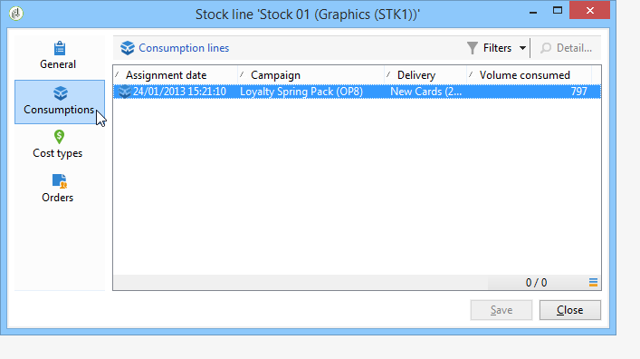

# 공급자, 재고 및 예산{#providers-stocks-and-budgets}

Adobe Campaign을 사용하면 캠페인 내에서 수행하는 작업에 참여할 서비스 공급자를 정의할 수 있습니다. 서비스 제공업체 및 관련 비용 구조에 대한 정보는 기본 보기에서 Adobe Campaign 관리자가 정의합니다. 서비스 제공자는 게재에서 참조되며, 비용 구조를 통해 이 게재와 관련된 비용과 해당 주식의 관리를 계산할 수 있습니다.

## 서비스 공급자 및 해당 비용 구조 만들기 {#creating-service-providers-and-their-cost-structures}

각 서비스 공급자는 연락처 정보, 서비스 템플릿 및 관련 작업이 있는 파일에 저장됩니다.

서비스 공급자는 트리의 **[!UICONTROL Administration > Campaign management]** 노드에 구성됩니다.

배달 중에 수행되는 작업은 특히 다이렉트 메일 및 모바일 채널을 위해 서비스 제공자들에 의해 수행됩니다. 예를 들어 이러한 서비스 제공업체는 메시지를 인쇄하거나 배포하는 데 관여할 수 있습니다. 이러한 작업에는 각 서비스 제공업체에 적용되는 구성 및 비용이 포함됩니다. 서비스 제공업체의 구성은 4단계로 이루어집니다.

1. Adobe Campaign에서 서비스 공급자 만들기

   [서비스 공급자 추가](#adding-a-service-provider)를 참조하십시오.

1. 관련 서비스 템플릿의 비용 범주 및 구조 정의

   [비용 범주 정의](#defining-cost-categories) 및 [비용 구조 정의](#defining-the-cost-structure)를 참조하십시오.

1. 프로세스 구성

   [서비스](#configuring-processes-associated-with-a-service)와 연관된 프로세스 구성을 참조하십시오.

1. 캠페인 수준에서 서비스 공급자 참조

   [서비스를 캠페인](#associating-a-service-with-a-campaign)에 연결을 참조하십시오.

### 서비스 공급자 및 해당 비용 범주 만들기 {#creating-a-service-provider-and-its-cost-categories}

#### 서비스 공급자 {#adding-a-service-provider} 추가

배달에 필요한 만큼 서비스 공급자를 생성할 수 있습니다. 서비스 공급자를 추가하는 절차는 다음과 같습니다.

1. 서비스 공급자 목록을 마우스 오른쪽 단추로 클릭하고 **[!UICONTROL New]**&#x200B;을 선택하거나 서비스 공급자 목록 위의 **[!UICONTROL New]** 단추를 클릭합니다.
1. 창의 아래 섹션에서 서비스 공급자의 이름과 연락처 세부 정보를 지정합니다.

   

1. **[!UICONTROL Save]** 단추를 클릭하여 서비스 공급자를 목록에 추가합니다.

#### 비용 범주 정의 {#defining-cost-categories}

서비스 템플릿을 각 서비스 제공자와 연결해야 합니다. 이러한 템플릿에서, 먼저 비용 카테고리와 필요한 경우 해당 주식을 식별해야 합니다. 그런 다음 비용 구조를 통해 각 카테고리에 대한 원가 계산 규칙을 생성해야 합니다.

>[!NOTE]
>
>자세한 내용은 [비용 구조 정의](#defining-the-cost-structure)를 참조하십시오.

비용 카테고리는 배달 유형(이메일, DM 등)에 적합한 비용 세트를 포함하는 엔티티입니다. 또는 작업에 사용할 수 있습니다. 비용 범주는 서비스 제공업체와 관련된 서비스 템플릿으로 그룹화됩니다. 각 서비스 공급업체는 하나 이상의 서비스 템플릿을 참조할 수 있습니다.

서비스 템플릿을 만들고 해당 컨텐츠를 정의하려면 다음 단계를 적용합니다.

1. 서비스 공급자의 **[!UICONTROL Services]** 탭에서 **[!UICONTROL Add]** 단추를 클릭하고 서비스 템플릿의 이름을 지정합니다.

   

1. 각 프로세스 유형에 대한 비용 범주를 만듭니다(DM/이메일 등으로 전달). 또는 작업)을 선택합니다. 이렇게 하려면 **[!UICONTROL Cost categories]** 탭을 클릭한 다음 **[!UICONTROL Add]** 버튼을 클릭하고 각 비용 범주의 매개 변수를 입력합니다.

   

   * 이 원가 범주에 대한 레이블을 입력하고 관련 프로세스 유형을 선택합니다.**[!UICONTROL Direct mail]**, **[!UICONTROL E-mail]**, **[!UICONTROL Mobile]**, **[!UICONTROL Telephone]** 또는 **[!UICONTROL Task]**&#x200B;에 의한 배달.
   * **[!UICONTROL Add]** 단추를 클릭하여 이 카테고리와 연관된 비용 유형을 정의합니다.
   * 필요한 경우, 사용된 수량이 기존 주식과 자동으로 관련되도록 각 유형의 원가와 재고 라인을 연결합니다.

      >[!NOTE]
      >
      >스톡 라인은 **[!UICONTROL Stock management]** 노드에 정의됩니다.\
      >자세한 내용은 [Stock 및 주문 관리](#stock-and-order-management)를 참조하십시오.

1. 이 비용 카테고리에 대한 값을 미리 선택할 수 있습니다. 이 비용 카테고리는 기본적으로 서비스 공급자 비용 카테고리에서 제공됩니다(비어 있는 값 대신). 이렇게 하려면 해당 카테고리 유형의 **[!UICONTROL Selected]** 열에서 옵션을 선택합니다.

   

   배달 수준에서 기본적으로 값이 선택됩니다.

   

### 비용 구조 정의 {#defining-the-cost-structure}

각 유형의 원가에 대해 원가 구조는 적용할 계산 규칙을 지정합니다.

**[!UICONTROL Cost structure]** 탭을 클릭하여 각 비용 카테고리 및 유형에 대한 비용 계산을 구성합니다. **[!UICONTROL Add]**&#x200B;을 클릭하고 비용 구조를 입력합니다.

* 비용 구조를 생성하려면 드롭다운 목록에서 메시지 유형과 비용 범주를 선택하고 계산 규칙이 적용될 원가 유형을 선택합니다. 이러한 드롭다운 목록의 내용은 **[!UICONTROL Cost categories]** 탭을 통해 입력한 정보에서 가져옵니다.

   원가 구조에 레이블을 지정해야 합니다. 기본적으로 다음과 같은 배달 아웃라인이 있습니다.**비용 카테고리 - 비용**&#x200B;의 유형입니다.

   그러나 이름을 바꿀 수 있습니다.**[!UICONTROL Label]** 필드에 원하는 값을 직접 입력합니다.

* 원가 계산 공식은 창의 하단 섹션에 정의됩니다.

   이 공식은 수정되거나(메시지 수에 관계없이) 메시지 수에 따라 계산될 수 있습니다.

   메시지 수에 따라 비용 계산 구조가 **[!UICONTROL Linear]**, **[!UICONTROL Linear by threshold]** 또는 **[!UICONTROL Constant by threshold]**&#x200B;일 수 있습니다.

#### 선형 구조 {#linear-structure}

전체 메시지 수에 관계없이 해당 금액이 항상 메시지(또는 메시지 일괄 처리)와 같으면 **[!UICONTROL Linear]**&#x200B;을 선택하고 각 메시지의 비용을 입력합니다.

이 금액이 메시지 일괄 처리에 적용되는 경우 **[!UICONTROL for]** 필드에 해당하는 메시지 수를 지정합니다.

#### 임계값별 선형 구조 {#linear-structure-by-threshold}

해당 금액이 각 메시지에 대해 임계값별로 적용되는 경우 **[!UICONTROL Linear by threshold]** 계산 구조를 정의해야 합니다. 이러한 유형의 비용 구조에서는 각 메시지의 비용이 0.13(예: 총 메시지 수가 1에서 100 사이이고 100에서 1000개 사이의 메시지 수, 100개 이상의 메시지 수 0.12 또는 1000개 이상의 메시지 수 0.11)입니다.

구성은 다음과 같습니다.

임계값을 추가하려면 목록 오른쪽에 있는 **[!UICONTROL Add]** 단추를 클릭합니다.

#### 임계값 {#constant-structure-by-threshold}별 상수 구조

마지막으로 총 메시지 수에 따라 비용 계산을 구성할 수 있습니다. 이렇게 하려면 **[!UICONTROL Constant by threshold]** 계산 구조를 선택합니다. 예를 들어 비용은 1~100개 메시지의 경우 12.00개, 메시지 101~1000개 전달의 경우 100.00개, 메시지 1000개 이상의 전달에 대해서는 총 수에 관계없이 500.00개 금액으로 설정됩니다.

### 서비스 {#configuring-processes-associated-with-a-service}에 연결된 프로세스 구성

**[!UICONTROL Processes]** 탭을 통해 서비스와 관련된 프로세스에 대한 정보를 연결할 수 있습니다.

이렇게 하려면 **[!UICONTROL Processes]** 탭을 클릭하여 라우터에 정보 전송을 구성합니다.

* **[!UICONTROL File extraction]** 섹션은 이 서비스를 선택할 때 배달에 사용되는 내보내기 템플릿을 나타냅니다. **[!UICONTROL Extraction file]** 필드에 출력 파일의 이름을 표시할 수 있습니다. 필드 오른쪽의 단추를 사용하여 변수를 삽입할 수 있습니다.

   

* **[!UICONTROL Notification e-mail]** 섹션에서는 파일을 보낸 후 서비스 제공자에게 알릴 템플릿을 지정할 수 있습니다. 경고 메시지 및 수신자 그룹을 만드는 데 사용되는 템플릿을 선택합니다.

   기본적으로 알림 메시지에 대한 배달 템플릿은 일반 보기에서 액세스할 수 있는 **[!UICONTROL Administration > Campaign management > Technical delivery templates]** 노드에 저장됩니다.

* **[!UICONTROL Post-processing]** 섹션에서는 배달을 승인한 후 시작할 워크플로우를 선택할 수 있습니다. 워크플로우 템플릿을 입력하면 승인 작업이 진행되는 즉시 워크플로우 인스턴스가 자동으로 생성되고 시작됩니다. 이 워크플로우는 처리를 위해 추출 파일을 외부 서비스 제공자에게 보낼 수 있습니다(예:

### 서비스를 캠페인 {#associating-a-service-with-a-campaign}과 연결

서비스는 배달 또는 작업을 통해 캠페인과 연결됩니다. 서비스 공급자는 이 템플릿을 통해 생성된 배달에서 서비스를 제공하기 위해 배달 템플릿에 연결됩니다.

서비스를 선택하면 배달 유형(DM, 이메일 등)에 해당하는 비용 카테고리 는 정의된 처리 옵션과 함께 중앙 테이블에 자동으로 표시됩니다.

>[!NOTE]
>
>서비스를 선택할 때 비용 카테고리가 표시되지 않는 경우 이 프로세스 유형에 대해 비용 카테고리가 정의되지 않은 것입니다. 예를 들어, 이메일 배달의 경우 **[!UICONTROL E-mail]** 유형 비용 카테고리가 정의되지 않은 경우 카테고리가 표시되지 않으며 서비스를 선택해도 아무런 영향을 주지 않습니다.

* 직접 메일 배달을 위해 구성 창에서 서비스를 선택할 수 있습니다.

   

* 모바일 채널 또는 전화로 제공하기 위해 동일한 선택 모드가 적용됩니다.
* 이메일 배달의 경우 다음 예와 같이 배달 속성의 **[!UICONTROL Advanced]** 탭에서 서비스가 선택됩니다.

   

**[!UICONTROL Amount to surcharge]** 열을 사용하면 해당 배달 또는 작업의 컨텍스트에서 이 카테고리에 대한 비용을 추가할 수 있습니다.

게재에 대한 원가 범주의 정의 중에 원가 유형의 필수 선택을 부과할 수 있습니다. 이렇게 하려면 **[!UICONTROL A cost type must be selected]**&#x200B;을 선택합니다.

## Stock 및 주문 관리 {#stock-and-order-management}

경고, 공급 추적 및 주문 실행을 처리하기 위해 비용 유형을 재고 라인과 연결할 수 있습니다.

Adobe Campaign에서 재고 및 주문 관리를 설정하고 배송에 필요한 공급이 부족한 경우 운영자에게 알리는 절차는 다음과 같습니다.

1. 관련 서비스 공급자의 스톡 생성 및 참조

   [재고 만들기](#creating-a-stock)를 참조하십시오.

1. 재고 라인 추가

   [재고 라인 추가](#adding-stock-lines)를 참조하십시오.

1. 경고 시 연산자에게 알림

   [경고 연산자](#alerting-operators)를 참조하십시오.

1. 주문 및 공급.

   [주문](#orders)을 참조하십시오.

### 스톡 관리 {#stock-management}

Adobe Campaign은 재고가 부족하거나 최소 임계값에 도달한 경우 연산자 그룹에 경고를 표시할 수 있습니다. 스톡 수준은 탐색 영역의 **[!UICONTROL Other choices]** 링크를 통해 **[!UICONTROL Campaigns]** 우주의 **[!UICONTROL Stocks]** 링크를 통해 액세스할 수 있습니다.

#### 스톡 {#creating-a-stock} 만들기

다음 단계를 적용하여 새 재고를 만듭니다.

1. 주식 목록 위의 **[!UICONTROL Create]** 단추를 클릭합니다.
1. 스톡 레이블을 입력하고 드롭다운 목록에서 스톡 레이블을 연결할 서비스 공급자를 선택합니다.

   

   >[!NOTE]
   >
   >자세한 내용은 [서비스 공급자 만들기 및 해당 비용 구조](#creating-service-providers-and-their-cost-structures)를 참조하십시오.

#### 재고 라인 추가 중 {#adding-stock-lines}

주식은 다양한 주식선으로 이루어져 있다. 재고 라인에는 납품에 의해 소비될 초기 자원 수량이 포함됩니다. 각 재고 라인은 소비 수량, 재고 수량 및 주문 수량을 나타냅니다.

스톡 이미지를 만들 때 **[!UICONTROL Stock lines]** 탭을 클릭하여 새 줄을 추가합니다.

스톡이 만들어지면 해당 대시보드를 클릭하여 편집하고 사용하여 스톡 라인을 만들고 봅니다.

**[!UICONTROL Create]** 단추를 클릭하여 스톡 매개 변수를 정의합니다.

* **[!UICONTROL Initial stock]** 필드에서 처음에 재고가 있는 수량을 가리킵니다. **[!UICONTROL Consumed]** 및 **[!UICONTROL In stock]** 필드는 자동으로 계산되어 캠페인이 진행됨에 따라 업데이트됩니다.

   

* **[!UICONTROL Alert level]** 필드에서 스톡을 주문하도록 연산자에게 알려야 하는 임계값을 지정합니다. 경고 수준에 도달하면 이 Stock을 사용하여 게재의 승인 창에 경고 메시지가 표시됩니다.

#### 재고 및 비용 카테고리 {#associating-a-stock-with-cost-categories} 연결

특정 서비스 공급자의 경우 다음과 같이 비용 범주 중 하나에서 스톡 라인을 참조할 수 있습니다.

### 스톡 추적 {#stock-tracking}

#### 경고 연산자 {#alerting-operators}

배달에서 참조된 스톡 내용이 부족할 때 경고가 표시됩니다. 예를 들어 추출 파일이 승인되면 다음 경고가 표시됩니다.

#### 주문 {#orders}

**[!UICONTROL Orders]** 하위 탭에서는 현재 주문을 보고 새 주문을 저장할 수 있습니다.

주문을 저장하려면 타깃팅된 스톡 라인을 편집하고 **[!UICONTROL Add]** 버튼을 클릭한 다음 배송 날짜와 주문된 수량을 지정합니다.

>[!NOTE]
>
>배달 날짜에 도달하면 주문 스톡 라인이 자동으로 사라지고 **[!UICONTROL Volume on order]** 필드에 입력한 수량이 **[!UICONTROL Tracking]** 탭에 추가됩니다. 이 수량은 자동으로 재고 볼륨에 추가됩니다.

**[!UICONTROL Consumptions]** 탭에는 캠페인당 사용된 볼륨이 포함되어 있습니다. 이 탭의 정보는 수행된 게재에 따라 자동으로 입력됩니다. **[!UICONTROL Edit]** 단추를 클릭하여 해당 캠페인을 엽니다.

## 예산 계산 중 {#calculating-budgets}

### 원칙 {#principle}

비용은 게재 및 캠페인에 대해 관리됩니다. 진행 상황에 따라, 이러한 비용은 예산에 할당된다.

캠페인에 대한 배달 비용은 캠페인 수준에서 통합되고 프로그램의 모든 캠페인 비용이 해당 캠페인과 연관된 프로그램으로 전달됩니다. 전용 보고서를 사용하면 전체 플랫폼 또는 각 플랜 및 프로그램에 대한 예산을 추적할 수 있습니다.

### 구현 {#implementation}

캠페인에서 예산을 선택할 때 초기 금액을 입력해야 합니다. 계산된 비용은 입력한 금액(비용, 예상, 예약, 약정)의 약정 수준에 따라 자동으로 업데이트됩니다. [금액 계산](../../campaign/using/controlling-costs.md#calculating-amounts)을 참조하십시오.

>[!NOTE]
>
>예산을 만드는 절차는 [예산 만들기](../../campaign/using/controlling-costs.md#creating-a-budget)에 있습니다.

