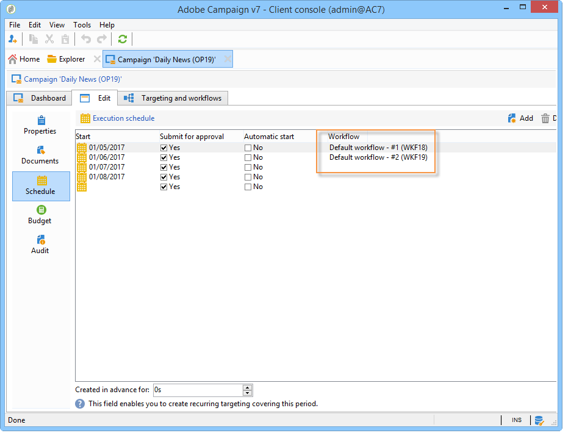

# 마케팅 캠페인 설정{#setting-up-marketing-campaigns}

캠페인에는 작업(배달) 및 프로세스(파일 가져오기 또는 추출)뿐만 아니라 리소스(마케팅 문서, 배달 외곽선)도 포함됩니다. 마케팅 캠페인에 사용됩니다. 캠페인은 프로그램의 일부이며 프로그램은 캠페인 계획에 포함됩니다.

마케팅 캠페인을 만들려면

1. 캠페인 만들기:캠페인 및 그 특징:레이블, 유형, 시작 및 종료 날짜, 예산, 관련 리소스, 관리자 및 참가자

   캠페인 [만들기를 참조하십시오](#creating-a-campaign).

1. 타겟 모집단 정의:타깃팅 쿼리를 사용하여 워크플로우를 만듭니다.

   타겟 [모집단](../../campaign/using/marketing-campaign-deliveries.md#selecting-the-target-population)선택을 참조하십시오.

1. 배달 만들기:채널을 선택하고 전송할 컨텐츠를 정의합니다.

   게재 [만들기를](../../campaign/using/marketing-campaign-deliveries.md#creating-deliveries)참조하십시오.

1. 배달 승인.

   승인 [프로세스를](../../campaign/using/marketing-campaign-approval.md#approval-process)참조하십시오.

1. 배달 모니터링.

   모니터링을 [참조하십시오](../../campaign/using/marketing-campaign-monitoring.md).

1. 캠페인 및 관련 비용 계획

   서비스 [제공업체 및 해당 비용 구조](../../campaign/using/providers--stocks-and-budgets.md#creating-service-providers-and-their-cost-structures)만들기를 참조하십시오.

이러한 단계가 완료되면 배달을 시작하고(전달 [시작](../../campaign/using/marketing-campaign-deliveries.md#starting-a-delivery)참조) 게재와 관련된 데이터, 프로세스 및 정보를 확인하고 필요한 경우 관련 문서를 관리할 수 있습니다(관련 문서 [관리 참조](../../campaign/using/marketing-campaign-deliveries.md#managing-associated-documents)). 캠페인 및 게재 처리 단계의 실행을 추적할 수도 [있습니다](../../campaign/using/marketing-campaign-monitoring.md).

## 계획 및 프로그램 계층 생성 {#creating-plan-and-program-hierarchy}

마케팅 계획 및 프로그램에 대한 폴더 계층을 구성하려면:

1. 홈 **페이지에서** 탐색기 아이콘을 클릭합니다.
1. 플랜을 만들 폴더를 마우스 오른쪽 단추로 클릭합니다.
1. 새 **폴더 추가 > 캠페인 관리 > 계획을 선택합니다**.

   

1. 계획의 이름을 변경합니다.
1. **새로 만든 계획을 마우스 오른쪽 단추로 클릭하고 속성...**&#x200B;을 선택합니다..

   

1. 일반 **탭에서** 내부 이름을 **** 수정하여 패키지 내보내기 중에 중복되지 않도록 합니다.
1. 저장을 **클릭합니다**.
1. 새로 만든 플랜을 마우스 오른쪽 단추로 클릭하고 **새 &#39;프로그램&#39; 폴더**&#x200B;만들기를 선택합니다.
1. 위의 단계를 반복하여 새 프로그램 폴더 및 내부 이름의 이름을 변경합니다.

## 캠페인 만들기 {#creating-a-campaign}

### 캠페인 추가 {#adding-a-campaign}

캠페인 목록을 통해 캠페인을 만들 수 있습니다. 이 보기를 표시하려면 **[!UICONTROL Campaigns]** 대시보드에서 **[!UICONTROL Campaigns]** 메뉴를 선택합니다.

이 **[!UICONTROL Program]** 필드를 사용하면 캠페인을 첨부할 프로그램을 선택할 수 있습니다. 이 정보는 필수입니다.

캠페인을 프로그램을 통해 만들 수도 있습니다. 이렇게 하려면 관련 프로그램의 **[!UICONTROL Add]** 탭에서 **[!UICONTROL Schedule]** 단추를 클릭합니다.

프로그램의 **[!UICONTROL Schedule]** 탭을 통해 캠페인을 만들 때 캠페인은 자동으로 관련 프로그램에 연결됩니다. 이 경우 **[!UICONTROL Program]** 필드가 숨겨집니다.

캠페인 만들기 창에서 캠페인 템플릿을 선택하고 캠페인 이름과 설명을 추가합니다. 캠페인 시작 날짜와 종료 날짜를 지정할 수도 있습니다.

아이콘을 **[!UICONTROL OK]** 클릭하여 캠페인을 만듭니다. 프로그램 일정에 추가됩니다.

>[!NOTE]
>
>표시할 캠페인을 필터링하려면 **[!UICONTROL Filter]** 링크를 클릭하고 표시할 캠페인 상태를 선택합니다.

### 캠페인 편집 및 구성 {#editing-and-configuring-a-campaign}

그런 다음 방금 만든 캠페인을 편집하고 해당 매개 변수를 정의할 수 있습니다.

캠페인을 열고 구성하려면 예약에서 선택하고 을 **[!UICONTROL Open]**&#x200B;클릭합니다.

그러면 캠페인 대시보드로 이동합니다.

## 반복 및 정기 캠페인 {#recurring-and-periodic-campaigns}

반복 캠페인은 특정 템플릿을 기반으로 하는 캠페인으로, 관련 일정에 따라 워크플로우를 실행하도록 구성되어 있습니다. 따라서 워크플로우는 캠페인 내에서 반복됩니다. 타깃팅은 각 실행에 대해 복제되며 다양한 프로세스와 대상 모집단이 추적됩니다. 또한 자동 워크플로우 생성 중에 적용 기간을 통해 타겟 추정을 통한 시뮬레이션을 실행하기 위해 향후 타깃팅을 미리 실행할 수 있습니다.

주기적 캠페인은 템플릿의 실행 일정에 따라 자동으로 생성되는 캠페인입니다.

### 반복 캠페인 만들기 {#creating-a-recurring-campaign}

반복 캠페인은 실행할 워크플로우 템플릿 및 실행 일정을 정의하는 특정 템플릿에서 만듭니다.

#### 반복 캠페인에 대한 템플릿 만들기 {#creating-the-campaign-template}

1. 캠페인 **[!UICONTROL Recurring]** 템플릿을 만듭니다.

   >[!NOTE]
   >
   >빈 템플릿을 만드는 대신 기본 템플릿을 복제하는 것이 좋습니다.

   

1. 템플릿의 이름과 캠페인 기간을 입력합니다.

   

1. 이 유형의 캠페인의 경우 템플릿 실행 일정을 만들기 위해 **[!UICONTROL Schedule]** 탭이 추가됩니다.

이 탭에서 이 템플릿을 기준으로 캠페인의 계획된 실행 날짜를 지정합니다.

예약 생성 마법사를 사용하여 모든 실행 날짜를 자동으로 채울 수 있습니다. 이렇게 하려면 표 위에 있는 **[!UICONTROL Complete the execution schedule...]** 링크를 클릭합니다.

실행 일정의 구성 모드는 워크플로우의 **[!UICONTROL Scheduler]** 객체와 일치합니다. For more on this, refer to [this section](../../workflow/using/executing-a-workflow.md#architecture).

>[!IMPORTANT]
>
>데이터베이스 오버로드를 방지하려면 실행 일정 구성을 신중하게 수행해야 합니다. 반복되는 캠페인은 지정된 일정에 따라 템플릿의 워크플로우를 복제합니다. 너무 빈번한 워크플로우 작성을 구현하면 데이터베이스 작업이 방해될 수 있습니다.

1. 지정된 기간 동안 해당 워크플로우를 만들려면 **[!UICONTROL Create in advance for]** 필드에 값을 지정합니다.
1. 타깃팅 매개 변수와 하나 이상의 일반 전달을 사용하여 이 템플릿을 기반으로 하는 캠페인에 사용할 워크플로우 템플릿을 만듭니다.

   >[!NOTE]
   >
   >이 워크플로우는 반복되는 워크플로우 템플릿으로 저장해야 합니다. 이렇게 하려면 워크플로우 속성을 편집하고 **[!UICONTROL Recurring workflow template]** **[!UICONTROL Execution]** 탭에서 옵션을 선택합니다.

   

#### 반복 캠페인 만들기 {#create-the-recurring-campaign}

반복 캠페인을 만들고 템플릿에 정의된 일정에 따라 워크플로우를 실행하려면 다음 절차를 적용합니다.

1. 반복되는 캠페인 템플릿을 기반으로 새 캠페인을 만듭니다.
1. 워크플로우 실행 일정을 채웁니다.

   

1. 캠페인 일정을 사용하면 각 라인에 대한 자동 워크플로우 생성 또는 실행 시작 날짜를 입력할 수 있습니다.

   각 라인에 대해 다음 추가 옵션을 추가할 수 있습니다.

   * **[!UICONTROL To be approved]** :워크플로우에서 배달 승인 요청을 강제 수행할 수 있습니다.
   * **[!UICONTROL To be started]** :시작 날짜에 도달하면 워크플로우를 시작할 수 있습니다.
   이 **[!UICONTROL Create in advance for]** 필드를 사용하면 입력한 기간을 포함하는 모든 워크플로우를 만들 수 있습니다.

   워크플로우가 실행되면 **[!UICONTROL Jobs on campaigns]** 캠페인 일정에 정의된 발생을 기반으로 전용 워크플로우가 만들어집니다. 따라서 각 실행 날짜에 대해 워크플로우가 생성됩니다.

1. 반복되는 워크플로우는 캠페인에 있는 워크플로우 템플릿에서 자동으로 생성됩니다. 캠페인의 **[!UICONTROL Targeting and workflows]** 탭에서 볼 수 있습니다.

   

   반복 워크플로우 인스턴스의 레이블은 템플릿 레이블과 워크플로우 번호로 구성되며 그 사이에 # 문자가 있습니다.

   일정에서 생성된 워크플로우는 탭의 **[!UICONTROL Workflow]** 열에 자동으로 연결됩니다 **[!UICONTROL Schedule]** .

   

   이 탭에서 각 워크플로우를 편집할 수 있습니다.

   

   >[!NOTE]
   >
   >워크플로우와 연관된 일정 라인의 시작 날짜는 워크플로우의 변수에서 다음 구문을 사용하여 사용할 수 있습니다.\
   >`$date(instance/vars/@startPlanningDate)`

### 주기적인 캠페인 만들기 {#creating-a-periodic-campaign}

주기적 캠페인은 실행 일정을 기반으로 캠페인 인스턴스를 만들 수 있는 특정 템플릿을 기반으로 하는 캠페인입니다. 캠페인 인스턴스는 템플릿 일정에 정의된 빈도에 따라 주기적인 캠페인 템플릿을 기반으로 자동으로 생성됩니다.

#### 캠페인 템플릿 만들기 {#creating-the-campaign-template-1}

1. 기존 캠페인 템플릿을 복제하여 **[!UICONTROL Periodic]** 캠페인 템플릿을 만듭니다.

   

1. 템플릿의 속성을 입력합니다.

   >[!NOTE]
   >
   >템플릿을 할당받은 연산자는 선택한 프로그램에서 캠페인을 만들 수 있는 적절한 권한을 가져야 합니다.

1. 이 템플릿과 연결된 워크플로우를 만듭니다. 이 템플릿은 템플릿에서 만든 모든 주기적 캠페인에 복제됩니다.

   

   >[!NOTE]
   >
   >이 워크플로우는 워크플로우 템플릿입니다. 캠페인 템플릿에서 실행할 수 없습니다.

1. 반복 캠페인 템플릿에 대해 실행 일정을 완료합니다.단추를 클릭하고 시작 및 종료 날짜를 정의하거나 링크를 통해 실행 일정을 채웁니다. **[!UICONTROL Add]**

   

   >[!IMPORTANT]
   >
   >주기 캠페인 템플릿은 위에 정의된 일정에 따라 새 캠페인을 만듭니다. 따라서 Adobe Campaign 데이터베이스가 오버로드되지 않도록 주의하여 완료해야 합니다.

1. 실행 시작 날짜에 도달하면 일치하는 캠페인이 자동으로 생성됩니다. 템플릿의 모든 특성을 사용합니다.

   각 캠페인은 템플릿 예약을 통해 편집할 수 있습니다.

   

각 정기 캠페인에는 동일한 요소가 포함됩니다. 만들어진 후에는 표준 캠페인으로 관리됩니다.
