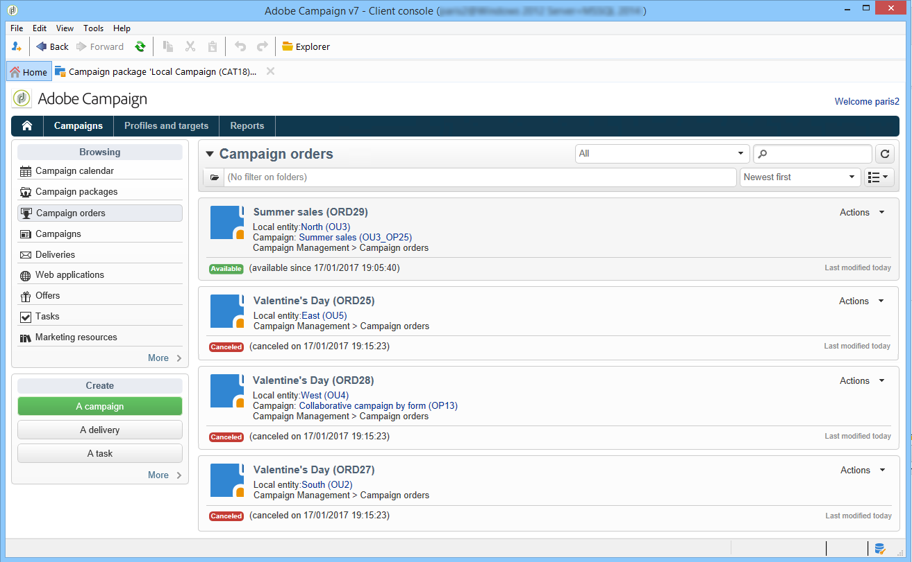
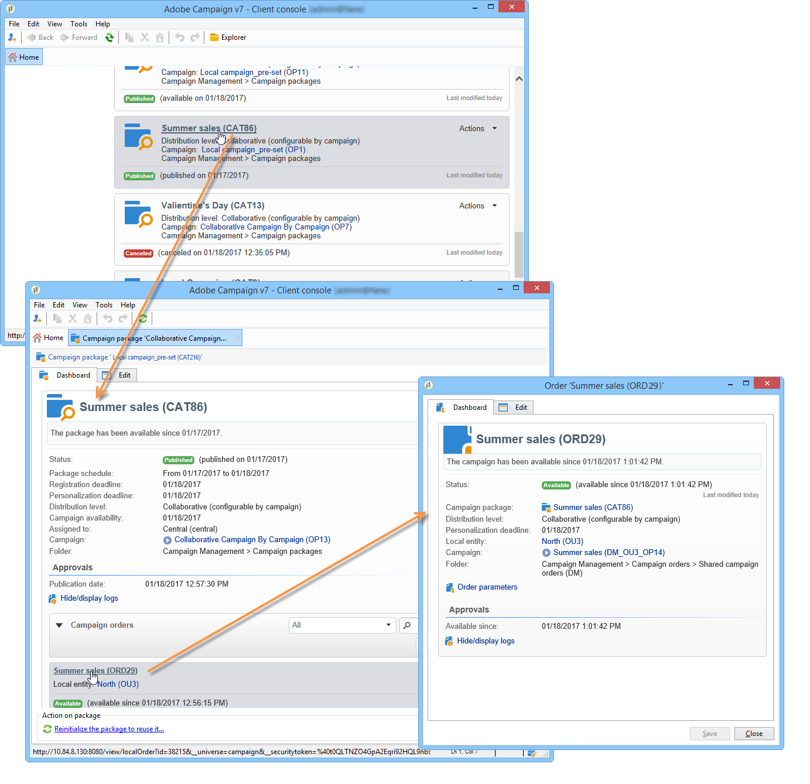
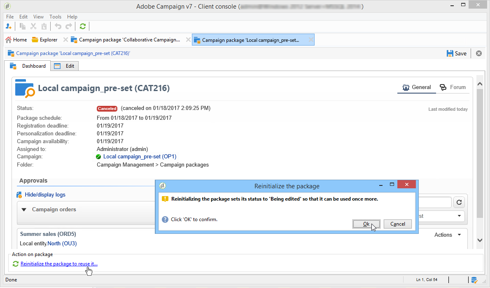

# 캠페인 추적{#tracking-a-campaign}

중앙 개체 연산자는 캠페인 패키지 목록에서 캠페인 주문을 추적할 수 있습니다.

이렇게 하면 다음과 같은 이점이 있습니다.

* [패키지 필터링](#filter-packages),
* [패키지 편집](#edit-packages),
* [패키지](#cancel-a-package) 취소,
* [패키지를 다시 초기화합니다](#reinitializing-a-package).

## 필터 패키지 {#filter-packages}

**[!UICONTROL Campaigns universe]**&#x200B;에서 기존의 모든 분산 마케팅 캠페인을 다시 그룹화하는 **[!UICONTROL Campaign packages]** 목록을 표시할 수 있습니다. 게시, 지연, 승인 대기 중 등의 캠페인만 표시되도록 이 목록을 필터링할 수 있습니다. 이렇게 하려면 이 보기의 위쪽 섹션에 있는 링크를 클릭하거나 **[!UICONTROL Filter list]** 링크를 사용하여 표시할 캠페인 패키지 상태를 선택합니다.

## 패키지 편집 {#edit-packages}

**[!UICONTROL Campaign packages]** 페이지에서는 각 패키지의 요약을 볼 수 있습니다.

이 요약에는 다음 정보가 표시됩니다.레이블, 캠페인 유형, 캠페인을 만든 캠페인 이름 및 폴더

편집할 패키지 이름을 클릭합니다. 로컬 개체 및 상태별로 주문을 볼 수도 있습니다.

이 정보는 모든 주문을 나열하는 **[!UICONTROL Campaign orders]** 보기에도 제공됩니다.

중앙 연산자는 순서를 편집할 수 있습니다. 두 가지 방법이 있습니다.

1. 연산자는 주문 이름을 클릭하여 편집할 수 있습니다.주문 세부 정보가 표시됩니다.

   

   **[!UICONTROL Edit > General]** 탭에서는 캠페인을 주문했을 때 로컬 엔티티가 입력한 정보를 볼 수 있습니다.

   

1. 연산자는 캠페인 패키지 레이블을 클릭하여 편집하고 특정 설정을 변경할 수 있습니다.

   

## 패키지 {#cancel-a-package} 취소

중앙 엔티티는 언제든지 캠페인 패키지를 취소할 수 있습니다.

캠페인 패키지 **[!UICONTROL Dashboard]**&#x200B;에서 **[!UICONTROL Cancel]**&#x200B;을 클릭합니다.

**[!UICONTROL Comment]** 필드를 사용하면 취소를 정당화할 수 있습니다.

**로컬 캠페인**&#x200B;의 경우 패키지를 취소하면 사용 가능한 마케팅 캠페인 목록에서 해당 패키지가 제거됩니다.

**공동 작업 캠페인**&#x200B;의 경우 패키지를 취소하면 다음과 같은 다양한 작업이 트리거됩니다.

1. 이 패키지와 관련된 주문은 모두 취소됩니다.

   

1. 참조 캠페인이 취소되고 모든 활성 프로세스(워크플로우, 배달)가 중지되고

   

1. 알림은 관련된 모든 로컬 개체에 전송됩니다.

   

필요한 경우 중앙 엔티티에서 취소된 패키지에 계속 액세스하고 다시 초기화할 수 있습니다(아래 참조). 승인받고 시작한 지역에게만 다시 제공됩니다. 패키지 재초기화 프로세스는 아래에 나와 있습니다.

## 패키지 {#reinitializing-a-package} 다시 초기화

이미 게시된 캠페인 패키지는 다시 초기화하여 수정하고 로컬 엔터티에 사용할 수 있게 만들 수 있습니다.

1. 관련 패키지를 선택합니다.
1. **[!UICONTROL Reinitialize the package to reuse it]** 링크를 클릭하고 **[!UICONTROL OK]**&#x200B;을 클릭합니다.

   

1. 패키지 재초기화를 승인하려면 **[!UICONTROL Save]** 단추를 클릭합니다.

   

1. 패키지 상태가 **[!UICONTROL Being edited]**&#x200B;으로 변경됩니다. 캠페인 패키지 목록에 복원하기 위해 수정, 승인 및 다시 게시합니다.

>[!NOTE]
>
>취소된 캠페인 패키지를 다시 시작할 수도 있습니다.

