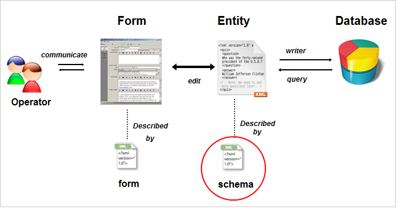

# 스키마 참조 정보{#about-schema-reference}

이 장에서는 Adobe Campaign 데이터베이스의 개념 데이터 모델을 확장하기 위해 확장 스키마를 구성하는 방법에 대해 설명합니다.

Campaign 기본 제공 테이블 및 상호 작용에 대한 자세한 내용은 Campaign Classic [데이터 모델을](https://helpx.adobe.com/campaign/kb/acc-datamodel.html)참조하십시오.

응용 프로그램에 포함된 데이터의 물리적 및 논리적 구조는 XML에 설명되어 있습니다. Adobe Campaign에만 적용되는 **스키마라고**&#x200B;합니다.

스키마는 데이터베이스 테이블과 연결된 XML 문서입니다. 데이터 구조를 정의하고 테이블의 SQL 정의에 대해 설명합니다.

* 표의 이름
* 필드
* 인덱스
* 다른 테이블과 링크

또한 데이터를 저장하는 데 사용되는 XML 구조에 대해 설명합니다.

* 요소 및 속성
* 요소 계층 구조
* 요소 및 속성 유형
* 기본값
* 레이블, 설명 및 기타 속성입니다.

스키마를 사용하여 데이터베이스에서 엔티티를 정의할 수 있습니다. 각 엔티티에 대한 스키마가 있습니다.

다음 그림은 Adobe Campaign 데이터 시스템의 스키마 위치를 보여줍니다.



## 스키마 구문 {#syntax-of-schemas}

스키마의 루트 요소는 입니다 **`<srcschema>`**. ** **`<element>`** 및 **`<attribute>`** 하위 요소가 포함되어 있습니다.

첫 번째 **`<element>`** 하위 요소는 엔티티의 루트와 일치합니다.

```
<srcSchema name="recipient" namespace="cus">
  <element name="recipient">  
    <attribute name="lastName"/>
    <attribute name="email"/>
    <element name="location">
      <attribute name="city"/>
   </element>
  </element>
</srcSchema>
```

>[!NOTE]
>
>엔티티의 루트 요소의 이름이 스키마와 같습니다.


이 **`<element>`** 태그는 엔티티 요소의 이름을 정의합니다. **`<attribute>`** 스키마의 태그는 연결된 태그의 속성 이름을 정의합니다. **`<element>`**

## 스키마 식별 {#identification-of-a-schema}

데이터 스키마는 이름 및 네임스페이스로 식별됩니다.

네임스페이스를 사용하면 관심 영역별로 스키마 집합을 그룹화할 수 있습니다. 예를 들어 **1** 차 네임스페이스는 고객별 구성(**고객**)에 사용됩니다.

>[!CAUTION]
>
>표준으로서, 네임스페이스의 이름은 간결해야 하며 XML 이름 지정 규칙에 따라 인증된 문자만 포함해야 합니다.
>
>식별자는 숫자 문자로 시작하지 않아야 합니다.

특정 네임스페이스는 Adobe Campaign 응용 프로그램의 작업에 필요한 시스템 개체에 대한 설명을 위해 예약되어 있습니다.

* **xtk**:플랫폼 시스템 데이터 관련 정보
* **nl**:전체 애플리케이션 사용에 대해,
* **nms**:전달(수신자, 배달, 추적 등)에 대해
* **ncm**:콘텐츠 관리 관련
* **임시**:임시 스키마에 대해 예약되었습니다.

스키마의 ID 키는 네임스페이스와 콜론으로 구분된 이름을 사용하여 빌드된 문자열입니다.예를 들면 다음과 같습니다. **cus:recipient**.
