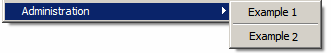

# 구성{#configuration}

탐색 목록에 사용되는 폴더 유형은 **xtk:navtree** 스키마의 문법을 따르는 XML 문서에 설명되어 있습니다.

XML 문서는 다음과 같이 구성됩니다.

```
<navtree name="name" namespace="name_space">
  <!-- Global commands -->
  <commands>
      ...
  </commands>
  
  <!-- Structured space for adding a folder -->
  <model name="<name>" label="<Label>">
    <!-- Folder type -->
    <nodeModel>
      ...
    </nodeModel>
<model name="<name>" label="<Sub model>">
      ...
    </model>
  </model> 
</navtree>
```

XML 문서에는 문서 이름 및 네임스페이스를 지정하는 **`<navtree>`** 이름 **및** 네임스페이스 **특성이 있는** 루트 요소가 포함되어 있습니다. 이름 및 네임스페이스는 문서 ID 키를 구성합니다.

애플리케이션의 전역 명령은 **`<commands>`** 요소에서 문서에 선언됩니다.

파일 유형의 선언은 다음 요소가 포함된 문서로 구성됩니다. **`<model>`** 및 **`<nodemodel>`** Adobe

## 전역 명령 {#global-commands}

전역 명령을 사용하면 동작을 실행할 수 있습니다. 이 작업은 입력 양식 또는 SOAP 호출일 수 있습니다.

전역 명령은 기본 **[!UICONTROL Tools]** 메뉴에서 액세스할 수 있습니다.

명령 구성 구조는 다음과 같습니다.

```
<commands>
  <!-- Description of a command -->
  <command name="<name>" label="<label>" desc="<Description>" form="<form>" rights="<rights>">
    <soapCall name="<name>" service="<schema>">
      <param type="<type>" exprIn="<xpath>"/>  
        ...
    </soapCall>
    <enter>
      ...
    </enter>
  </command>
  <!-- Separator -->
  <command label="-" name="<name>"/>
  <!-- Command structure -->
  <command name="<name>" label="<Label>">
    <command...
  </command>
</commands>
```

전역 명령에 대한 설명은 다음 속성을 가진 **`<command>`** 요소에 입력됩니다.

* **이름**:명령의 내부 이름:이름을 입력하고 고유해야 합니다.
* **레이블**:레이블입니다.
* **desc**:기본 화면의 상태 표시줄에 표시되는 설명입니다.
* **양식**:양식 시작:입력할 값은 입력 양식의 식별 키(예:&quot;cus:recipient&quot;)
* **권한**:이 명령에 액세스할 수 있는 명명된 권한 목록(쉼표로 구분) 사용 가능한 권한 목록은 **[!UICONTROL Administration > Access management > Named rights]** 폴더에서 액세스할 수 있습니다.
* **promptLabel**:명령을 실행하기 전에 확인 상자를 표시합니다.

요소에는 **`<command>`** **`<command>`** 하위 요소가 포함될 수 있습니다. 이 경우 상위 요소를 사용하면 이러한 하위 요소로 구성된 하위 메뉴를 표시할 수 있습니다.

명령은 XML 문서에서 선언된 순서대로 표시됩니다.

명령 구분 기호를 사용하면 명령 간 분리 막대를 표시할 수 있습니다. 명령 레이블에 포함된 **&#39;-&#39;** 값으로 식별됩니다.

입력 매개 변수가 있는 **`<soapcall>`** 태그의 선택 사항은 실행할 SOAP 메서드 호출을 정의합니다. SOAP API에 대한 자세한 내용은 Campaign JSAPI [설명서를 참조하십시오](http://docs.campaign.adobe.com/doc/AC/en/jsapi/index.html).

양식 컨텍스트는 **`<enter>`** 태그에서 초기화 시 업데이트할 수 있습니다. 이 태그에 대한 자세한 내용은 입력 양식에 대한 설명서를 참조하십시오.

**예**:

* &quot;xtk:import&quot; 양식을 시작하는 전역 명령 선언:

   ```
   <command desc="Start the data import wizard" form="xtk:import" label="&amp;Data import..." name="import" rights="import,recipientImport"/>
   ```

   키보드 단축키는 명령 레이블에 있는 **&amp;** 값으로 &#39;I&#39; 문자에서 선언됩니다.

* 구분 기호가 있는 하위 메뉴의 예:

   

   ```
   <command label="Administration" name="admin">
     <command name="cmd1" label="Example 1" form="cus:example1"/>
     <command name="sep" label="-"/>
     <command name="cmd1" label="Example 2" form="cus:example2">
       <enter>
         <set xpath="@type" expr="1"/>
       </enter>
     </command>
   </command>
   ```

* SOAP 메서드 실행:

   ```
   <command name="cmd3" label="Example 3" promptLabel="Do you really want to execute the command?">
     <soapCall name="Execute" service="xtk:sql"/>
   </command>
   ```

## 폴더 유형 {#folder-type}

폴더 유형을 사용하면 스키마 데이터에 액세스할 수 있습니다. 폴더와 연관된 보기는 목록과 입력 양식으로 구성됩니다.

폴더 유형 구성 구조는 다음과 같습니다.

```
<!-- Structured location to add the folder -->
<model name="name" label="Labelled">
  <!-- Type of folder -->
  <nodeModel name="<name>" label="<Labelled>" img="<image>">
    <view name="<name>" schema="<schema>" type="<listdet|list|form|editForm>">
      <columns>
        <node xpath="<field1>"/>
        ...
    </columns>
    </view> 
  </nodeModel>
  <model name="<name>" label="<Sous modèle>">
    ...
  </model>
</model>
```

폴더 유형 선언을 **`<model>`** 요소 아래에 입력해야 합니다. 이 요소를 사용하면 **[!UICONTROL Add new folder]** 메뉴에서 볼 수 있는 계층적 구성을 정의할 수 있습니다. 요소에는 **`<model>`** 요소 및 기타 **`<nodemodel>`** **`<model>`** 요소가 포함되어야 합니다.

이름 **및** 레이블 **속성은** **[!UICONTROL Add new folder]** 메뉴의 내부 이름과 레이블을 채웁니다.

이 **`<nodemodel>`** 요소에는 다음 속성이 있는 폴더 유형에 대한 설명이 포함되어 있습니다.

* **이름**:내부 이름
* **레이블**:레이블을 **[!UICONTROL Add new folder]** 메뉴에 사용하고 폴더를 삽입할 때 기본 레이블로 사용합니다.
* **img**:폴더 삽입에 대한 기본 이미지입니다.
* **hiddenCommands**:마스크할 명령 목록(쉼표로 구분) 가능한 값:&quot;insert&quot;, &quot;delete&quot;, &quot;update&quot; 및 &quot;duplicate&quot;
* **newFolderShortCuts**:폴더 작성 시 모델의 단축키 목록(쉼표로&#x200B;**`<nodemodel>`** 구분)을 참조하십시오.
* **insertRight**, **editRight**, **deleteRight**:폴더 삽입, 편집 및 삭제를 위한 권한.

요소 아래의 **`<view>`** 요소에는 **`<nodemodel>`** 뷰와 연결된 목록의 구성이 포함됩니다. 목록의 스키마는 **요소의** schema **`<view>`** 속성에 입력됩니다.

목록 레코드를 편집하려면 목록 스키마와 동일한 이름의 입력 양식이 암시적으로 사용됩니다. 요소의 **type** 속성은 **`<view>`** 양식의 표시에 영향을 줍니다. 가능한 값은 다음과 같습니다.

* **listedet**:목록 하단에 양식을 표시합니다.
* **목록**:목록을 단독으로 표시합니다. 양식을 두 번 클릭하거나 목록 선택 메뉴의 &quot;열기&quot;를 통해 실행합니다.
* **양식**:읽기 전용 양식을 표시합니다.
* **editForm**:양식을 편집 모드로 표시합니다.

>[!NOTE]
>
>입력 양식의 이름은 **요소에** form **`<view>`** 속성을 입력하여 오버로드할 수 있습니다.

목록 열의 기본 구성은 **`<columns>`** 요소를 통해 입력됩니다. 스키마에서 값으로 참조할 필드가 있는 **`<node>`** xpath **** 속성이 들어 있는 요소에 열이 선언됩니다.

**예**:&quot;nms:recipient&quot; 스키마에 대한 폴더 유형 선언입니다.

```
<model label="Profiles and targets" name="nmsProfiles">
  <nodeModel deleteRight="folderDelete" editRight="folderEdit" folderLink="folder"
             img="nms:folder.png" insertRight="folderInsert" label="Recipients"
             name="nmsFolder">
    <view name="listdet" schema="nms:recipient" type="listdet">
      <columns>
        <node xpath="@firstName"/>
        <node xpath="@lastName"/>
        <node xpath="@email"/>
        <node xpath="@account"/>
      </columns>
    </view>
  </nodeModel>
  <nodeModel name="nmsGroup" label="Groups"...
</model>
```

해당 폴더 삽입 메뉴:


목록을 로드할 때 필터링 및 정렬을 적용할 수 있습니다.

```
<view name="listdet" schema="nms:recipient" type="listdet">
  <columns>
    ...
  </columns>

  <orderBy>
    <node expr="@lastName" desc="true"/>
</orderBy>
  <sysFilter>
    <condition expr="@type = 1"/>
  </sysFilter>
</view>  
```

### 단축키 명령 {#shortcut-commands}

단축키 명령을 사용하면 목록 선택 작업을 시작할 수 있습니다. 이 작업은 입력 양식이나 SOAP 호출일 수 있습니다.

명령은 목록 **[!UICONTROL Action]** 메뉴 또는 관련 메뉴 단추에서 액세스할 수 있습니다.

명령 구성 구조는 다음과 같습니다.

```
<nodeModel...
  ...
  <command name="<name>" label="<label>" desc="<Description>" form="<form>" rights="<rights>">
    <soapCall name="<name>" service="<schema>">
      <param type="<type>" exprIn="<xpath>"/>  
        ...
    </soapCall>
    <enter>
      ...
    </enter>
  </command>
</nodeModel>
```

명령에 대한 설명은 다음 속성이 있는 **`<command>`** 요소에 입력됩니다.

* **이름**:명령의 내부 이름:이름을 입력하고 고유해야 합니다.
* **레이블**:레이블입니다.
* **desc**:기본 화면의 상태 표시줄에 표시되는 설명입니다.
* **양식**:양식 시작:입력할 값은 입력 양식의 식별 키(예:&quot;cus:recipient&quot;).
* **권한**:이 명령에 액세스할 수 있는 명명된 권한 목록(쉼표로 구분) 사용 가능한 권한 목록은 **[!UICONTROL Administration > Access management > Named rights]** 폴더에서 액세스할 수 있습니다.
* **promptLabel**:명령 실행 전에 확인 상자를 표시합니다.
* **monoSelection**:모노 선택을 강제 적용합니다(기본적으로 여러 선택).
* **refreshView**:명령 실행 후 목록의 다시 로드를 강제로 수행합니다.
* **enabledIf**:입력한 표현식에 따라 명령을 활성화합니다.
* **img**:목록 도구 모음에서 명령에 액세스할 수 있는 이미지를 입력합니다.

요소에는 **`<command>`** **`<command>`** 하위 요소가 포함될 수 있습니다. 이 경우 상위 요소를 사용하면 이러한 하위 요소로 구성된 하위 메뉴를 표시할 수 있습니다.

명령은 XML 문서에서 선언된 순서대로 표시됩니다.

명령 구분 기호를 사용하면 명령 간 분리 막대를 표시할 수 있습니다. 명령 레이블에 포함된 **&#39;-&#39;** 값으로 식별됩니다.

입력 매개 변수가 있는 **`<soapcall>`** 태그의 선택 사항은 실행할 SOAP 메서드 호출을 정의합니다. SOAP API에 대한 자세한 내용은 Campaign JSAPI [설명서를 참조하십시오](http://docs.campaign.adobe.com/doc/AC/en/jsapi/index.html).

양식 컨텍스트는 **`<enter>`** 태그를 통해 초기화 시 업데이트할 수 있습니다. 이 태그에 대한 자세한 내용은 입력 양식 설명서를 참조하십시오.

**예**:

```
<command desc="Cancel execution of the job" enabledIf="EV(@status, 'running')"
         img="nms:difstop.bmp" label="Cancel..." name="cancelJob" 
         promptLabel="Do you really want to cancel this job?" refreshView="true">
  <soapCall name="Cancel" service="xtk:jobInterface"/>
</command>
<command label="-" name="sep1"/>
<command desc="Execute selected template" form="cus:form" lmonoSelection="true" name="executeModel"
         rights="import,export,aggregate">
  <enter>
    <set expr="0" xpath="@status"/>
  </enter>
</command>
```

### 연결된 폴더 {#linked-folder}

두 가지 유형의 폴더 관리 작업이 있습니다.

1. 폴더는 보기입니다.목록은 스키마와 연결된 모든 레코드를 폴더 속성에 입력된 시스템 필터링 가능성과 함께 표시합니다.
1. 폴더가 연결되어 있습니다.목록의 레코드는 폴더 링크에서 암시적으로 필터링됩니다.

연결된 폴더의 경우 **요소의 folderLink** 속성을 채워야 **`<nodemodel>`** 합니다. 이 속성에는 데이터 스키마에 구성된 폴더의 링크 이름이 포함됩니다.

데이터 스키마에서 연결된 폴더의 선언의 예:

```
<element default="DefaultFolder('nmsFolder')" label="Folder" name="folder" revDesc="Recipients in the folder" revIntegrity="own" revLabel="Recipients" target="xtk:folder" type="link"/>
```

&quot;folder&quot;라는 폴더의 **`<nodemodel>`** 링크에 대한 구성은 다음과 같습니다.

```
<nodeModel deleteRight="folderDelete" editRight="folderEdit" folderLink="folder"
  img="nms:folder.png" insertRight="folderInsert" label="Recipients" name="nmsFolder">
...
</nodeModel>
```

