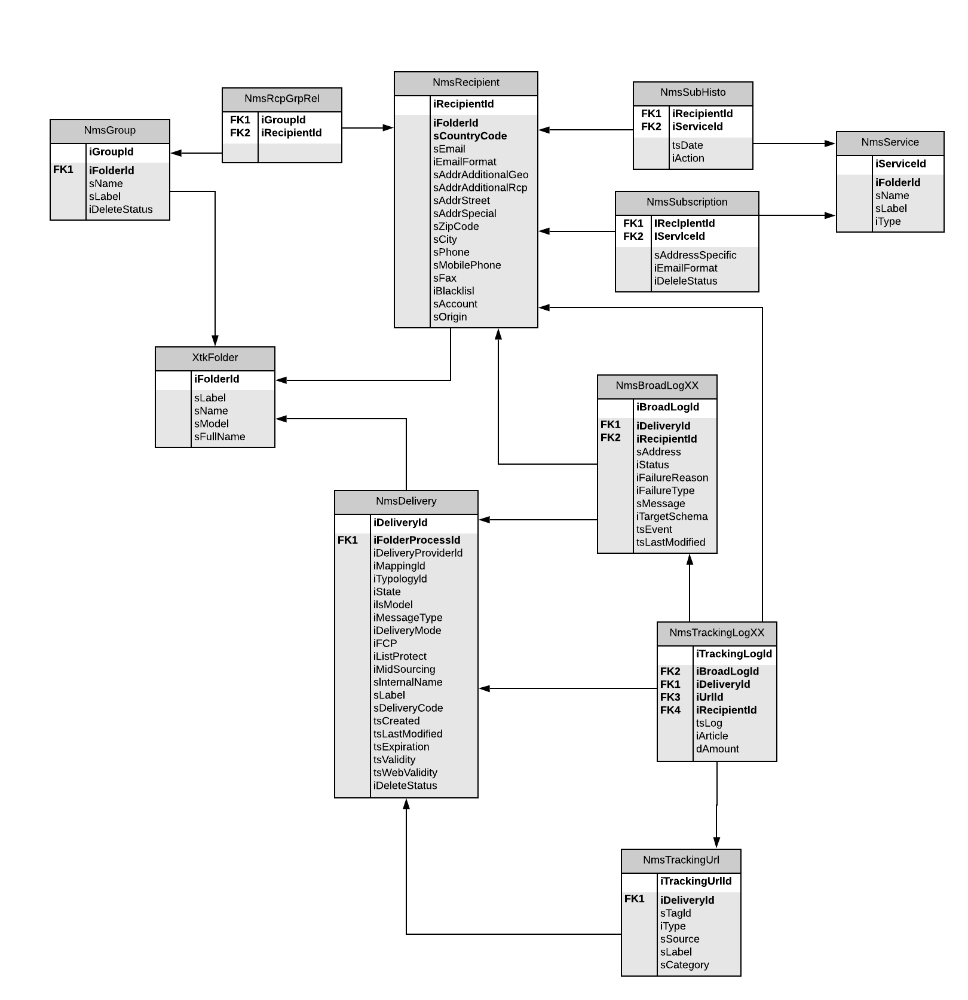

# 캠페인 데이터 모델 설명{#data-model-description}

Adobe Campaign은 사전 정의된 데이터 모델과 함께 제공됩니다. 이 섹션에서는 Adobe Campaign 데이터 모델의 내장 테이블 및 상호 작용에 대한 세부 사항을 제공합니다.

각 테이블에 대한 설명에 액세스하려면 **[!UICONTROL Admin > Configuration > Data schemas]**&#x200B;목록에서 리소스를 선택하고 **[!UICONTROL Documentation]** 탭을 클릭합니다.

>[!NOTE]
>
>응용 프로그램에 포함된 데이터의 물리적 및 논리적 구조는 XML에 설명되어 있습니다. 스키마라고 하는 Adobe Campaign에 대한 문법을 따릅니다. Adobe Campaign 스키마에 대한 자세한 내용은 이 [섹션을](../../configuration/using/about-schema-reference.md)참조하십시오.

## 기본 테이블에 대한 설명 {#description-main-tables}

Adobe Campaign은 함께 연결된 테이블을 포함하는 관계형 데이터베이스에 의존합니다.

다음 다이어그램은 Adobe Campaign 데이터 모델의 기본 비즈니스 테이블 간의 조인과 각 필드에 대한 기본 필드를 보여줍니다.

<!---->

사전 정의된 Adobe Campaign 데이터 모델에는 아래에 나열된 기본 테이블이 포함되어 있습니다.

### NmsRecipient {#NmsRecipient}

이 테이블은 **nms:recipient** 스키마와 일치합니다.

게재 **수신자에**&#x200B;사용되는 기본 테이블입니다. 그 결과, 다양한 채널을 통해 배달하는 데 필요한 정보가 포함됩니다.

* sEmail:이메일 주소.
* iEmailFormat:이메일의 기본 형식(텍스트의 경우 1, HTML의 경우 2, 정의되지 않은 경우 0)입니다.
* sAddress1, sAddress2, sAddress3, sAddress4, sZipCode, sCity는 우편 주소를 작성하는 데 사용됩니다(1997년 5월 XPZ 10-011 AFNOR 표준과 함께 사용).
* sPhone, sMobilePhone, sFax에는 각각 전화, 휴대폰 및 팩스 번호가 포함되어 있습니다.
* iBlackList는 프로필에 사용되는 기본 옵트아웃 플래그입니다(1은 &quot;가입되지 않음&quot;을 의미하며, 0을 의미함).

iFolderId 필드는 수신자를 실행 폴더로 연결하는 외래 키입니다. 자세한 내용은 XtkFolder를 [참조하십시오](#XtkFolder).

sCountryCode 필드는 수신자와 관련된 국가의 3166-1 Alpha 2 ISO 코드(2자)입니다. 이 필드는 국가 레이블 및 기타 국가 코드 데이터를 포함하는 국가 참조 테이블(NmsCountry)의 외래 키입니다. 국가가 채워지지 않으면 &#39;XX&#39; 값이 저장됩니다(그리고 이 값은 0의 ID 레코드 대신 사용됩니다).

수신자 표에 대한 자세한 내용은 이 [섹션을](../../configuration/using/about-data-model.md#default-recipient-table)참조하십시오.

### NmsGroup {#NmsGroup}

이 테이블은 **nms:group** 스키마와 일치합니다.

이를 통해 수신자의 **통계 그룹을**&#x200B;만들 수 있습니다. 받는 사람과 그룹 간에는 다대다 관계가 있습니다. 예를 들어 한 명의 받는 사람이 여러 그룹에 속할 수 있고 한 그룹에 여러 명의 받는 사람이 포함될 수 있습니다. 그룹은 가져오기 또는 배달 타깃팅을 통해 수동으로 만들 수 있습니다. 그룹은 종종 배달 대상으로 사용됩니다. 필드에 sName 그룹의 내부 이름을 나타내는 고유한 인덱스가 있습니다. 그룹이 폴더에 연결되어 있습니다(키는 iFolderId입니다. 자세한 내용은 XtkFolder [를 참조하십시오](#XtkFolder).

### NmsRcpGrpRel {#NmsRcpGrpRel}

NmsRcpGrpRel 관계 테이블은 iRecipientId 및 iGroupId 연결된 테이블의 식별자에 해당하는 두 개의 필드만 포함합니다.

### NmsService {#NmsService}

이 테이블은 **nms:service** 스키마와 일치합니다.

서비스는 더 많은 정보를 배포하고 양식을 통해 구독 및 구독 취소를 손쉽게 관리할 수 있다는 점을 제외하면 그룹(정적 수신자 그룹)과 유사한 개체입니다.

sName 서비스의 내부 이름을 나타내는 고유한 인덱스가 필드에 있습니다. 서비스가 폴더에 연결되어 있습니다(키는 iFolderId입니다. 자세한 내용은 XtkFolder [를 참조하십시오](#XtkFolder). 마지막으로 iType 필드는 이 서비스의 배달 채널(이메일의 경우 0, SMS의 경우 1, 전화의 경우 2, DM의 경우 3, 팩스의 경우 4)을 지정합니다.

### NmsSubscription {#NmsSubscription}

이 테이블은 nms: **subscription** 스키마와 일치합니다.

정보 서비스에 대한 수신자 구독을 관리할 수 있습니다.

### NmsSubHisto {#NmsSubHisto}

이 테이블은 nms:subHisto **스키마와** 일치합니다.

구독이 웹 양식 또는 응용 프로그램의 인터페이스를 사용하여 관리되는 경우 모든 구독 및 구독 취소는 NmsSubHistot 테이블에 저장됩니다. iAction 필드는 tsDate 필드에 저장된 날짜에 수행되는 작업(구독 취소 시 0, 구독의 경우 1)을 지정합니다.

### NmsDelivery {#NmsDelivery}

이 테이블은 **nms:delivery** 스키마와 일치합니다.

이 표의 각 레코드는 **배달 작업** 또는 **배달 템플릿을**&#x200B;나타냅니다. 여기에는 게재 수행에 필요한 모든 매개 변수(대상, 컨텐츠 등)가 포함됩니다. 분석 단계 동안 배달(브로드캐스트) 로그(NmsBroadLog) 및 관련 추적 URL(NmsTrackingUrl)이 만들어집니다(이러한 테이블 모두에 대한 자세한 내용은 아래 참조).

sInternalName 배달 또는 시나리오의 내부 이름을 나타내는 고유한 인덱스가 필드에 있습니다. 배달이 실행 폴더에 연결되어 있습니다(외래 키는 iFolderProcessId임). 자세한 내용은 XtkFolder [를 참조하십시오](#XtkFolder).

### XtkFolder {#XtkFolder}

여기에는 콘솔의 탐색 탭에 표시되는 트리의 **** 모든 **폴더가** 포함됩니다.

폴더 유형은 다음과 같습니다.sModel 필드의 값은 폴더에 포함할 수 있는 데이터 유형을 지정합니다. 또한 이 필드를 사용하면 클라이언트 콘솔에서 해당 양식과 함께 데이터를 올바르게 표시할 수 있습니다. 이 필드에 사용할 수 있는 값은 navTree에 정의됩니다.

트리는 iParentId 및 iChildCount 필드에 의해 관리됩니다. sFullName 필드는 트리에 있는 폴더의 전체 경로를 제공합니다. 마지막으로, 필드에 sName 폴더의 내부 이름을 나타내는 고유한 인덱스가 있습니다.

## 전달 및 추적 {#delivery-and-tracking}

이 테이블 세트는 배달 **모듈에 연결되어** 메시지를 전송할 때 발생하는 전달 및 최종 문제를 모니터링할 수 있습니다. 자세한 내용은 배달 [모니터링을](../../delivery/using/monitoring-a-delivery.md)참조하십시오. 추적에 대한 자세한 내용은 추적 [메시지를](../../delivery/using/about-message-tracking.md)참조하십시오.

**NmsBroadLogMsg**:이 표에서는 nms:broadLogMsg **스키마와** 일치합니다. 배달 로그 테이블의 확장입니다.

## 캠페인 관리 {#campaign-management}

이 표 세트는 커뮤니케이션 및 마케팅 캠페인을 정의, 최적화, **실행 및 분석할 수 있는 마케팅 캠페인** 모듈에 연결됩니다. 자세한 내용은 마케팅 [캠페인](../../campaign/using/designing-marketing-campaigns.md)정보를 참조하십시오.

* **NmsOperation**:이 테이블은 **nms:operation** 스키마와 일치합니다. 여기에는 마케팅 캠페인의 데이터가 포함됩니다.
* **NmsDeliveryOutline**:이 표에서는 nms:deliveryOutline **스키마와** 일치합니다. 여기에는 배달의 확장 속성(배달 개요)이 포함되어 있습니다.
* **NmsDlvOutlineItem**:이 테이블은 **nms:dlvOutlineItem 스키마와** 일치합니다. 배달 개요의 아티클이 포함되어 있습니다.
* **NmsDeliveryCustomization**:이 표에서는 nms:deliveryCustomization **스키마와** 일치합니다. 여기에는 배달의 개인화 필드가 포함됩니다.
* **NmsBudget**:이 테이블은 **nms:budget** 스키마와 일치합니다. 여기에는 캠페인, 계획, 프로그램, 작업 및/또는 게재에 대한 예산 데이터가 포함됩니다.
* **NmsDocument**:이 테이블은 **nms:document** 스키마와 일치합니다. 여기에는 캠페인의 마케팅 문서가 파일 형식(이미지, Excel 또는 Word 파일 등)으로 포함됩니다.
* **XtkWorkflow**:이 테이블은 xtk:workflow **스키마와** 일치합니다. 여기에는 캠페인 타깃팅이 포함됩니다.
* **NmsTask**:이 테이블은 **nms:task** 스키마와 일치합니다. 여기에는 마케팅 작업의 정의가 포함됩니다.
* **NmsAsset**:이 테이블은 **nms:asset** 스키마와 일치합니다. 여기에는 마케팅 리소스의 정의가 포함됩니다.

## 커뮤니케이션 일관성 {#communication-consistency}

이 테이블 세트는 게재 전송을 제어, **필터링** 및 모니터링할 수 있는 캠페인 최적화 모듈에 연결됩니다. 자세한 내용은 캠페인 유형 [정보를 참조하십시오](../../campaign/using/about-campaign-typologies.md).

* **NmsTypicalRule**:이 테이블은 nms: **typicalRule 스키마와** 일치합니다. 유형 유형에 따라 게재에 적용되는 규칙을 포함합니다.
* **NmsTypical**:이 테이블은 nms: **typical** 스키마와 일치합니다. 여기에는 유형 유형과 일치하는 게재에 적용할 규칙 집합이 포함됩니다.
* **NmsTypicalRuleRel**:이 테이블은 nms: **typicalRuleRel 스키마와** 일치합니다. 그것은 유형 유형과 규칙 사이의 관계를 포함합니다.
* **NmsVolumeLine**:이 표에서는 nms:volumeLine **스키마와** 일치합니다. 용량 규칙의 가용성 라인 세트가 포함되어 있습니다.
* **NmsVolumeUsed**:이 표에서는 nms:volumeUsed **스키마와** 일치합니다. 여기에는 용량 규칙의 모든 소비 라인이 포함됩니다.

## 응답 관리 {#response-management}

이 표 세트는 마케팅 캠페인의 성공과 **수익성을 측정하거나 모든 커뮤니케이션 채널에 대한 제안을** 제공할 수 있는 응답 관리자 모듈과 연결됩니다. 자세한 내용은 응답 [관리자](../../campaign/using/about-response-manager.md)정보를 참조하십시오.

### NmsRema가설 {#NmsRemaHypothesis}

이 표에서는 nms:rema가설 **스키마와** 일치합니다. 측정 가설의 정의가 포함되어 있습니다.

이 표에는 다음을 포함하여 XML에 저장되는 중요한 정보가 포함되어 있습니다.

**실행 컨텍스트(XML에 저장된 정보)**

실행 컨텍스트는 측정 계산을 위해 고려할 테이블 및 필드(예:
* nms:remaMatchRcp 반응 로그 저장소 스키마입니다.
* 트랜잭션 테이블 스키마(예: 구매).
* 가설 조건의 시작 테이블을 정의할 수 있는 쿼리 스키마입니다.
* 쿼리 스키마를 기반으로 개인을 식별할 수 있는 개인 링크.
* 거래 일자. 이 필드는 필수는 아니지만 계산 경계를 제한하는 데 사용하는 것이 좋습니다.
* 거래 금액:수익 지표를 자동으로 계산하기 위한 선택적 필드입니다.

**가설 경계(XML에 저장된 정보)**

가설 경계는 쿼리 스키마 테이블을 기반으로 가설 필터링에 포함됩니다.

**가설 오버로드 스크립트(XML에 저장된 정보)**

가설 오버로드 스크립트는 실행 중에 가설 컨텐츠를 오버로드하도록 하는 JavaScript 코드입니다.

**측정 지표**

가설을 실행하는 동안 다음 표시기가 자동으로 업데이트됩니다.

* 반응 수:i **Transaction**. 응답 로그 테이블의 줄 수입니다.
* 연락 횟수:iContact **Response**. 가설을 통해 타게팅된 연락처의 수를 구별합니다.
* 제어 그룹 수:iProof **Responsive**. 가설을 통해 타게팅된 제어 그룹 연락처의 고유 수입니다.
* 연결된 응답률: **dContactResponsiveRate**. 가설을 통해 타깃팅된 연락처의 응답률.
* 제어 그룹의 응답률:d **ProofResponsiveRate**. 가설 제어 그룹의 응답률.
* 방문한 모집단의 총 매출액:d **ContactResponsiveTotalAmount**. 가설을 통해 타깃팅된 연락처의 총 매출액.
* 제어 그룹의 평균 매출: **dContactResponsiveAvgAmount**. 가설을 통해 타깃팅된 제어 그룹 연락처의 평균 매출액.
* 제어 그룹의 총 매출:d **ProofResponseedTotalAmount**. 가설 제어 그룹의 총 매출액.
* 제어 그룹의 평균 매출: **dProofResponsiveAvgAmount**. 가설 제어 그룹의 평균 매출액.
* 연락처당 총 여백:d **ContactResponseokTotalMargin**. 가설을 대상으로 한 접촉당 총 마진 수.
* 연락처당 평균 여백: **dContactResponseokAvgMargin**. 가설을 대상으로 한 접촉당 평균 마진.
* 제어 그룹의 총 여백:d **ProofResponsiveTotalMargin**. 가설을 대상으로 한 제어 그룹의 전체 여백입니다.
* 제어 그룹의 평균 여백: **dProofResponseokAvgMargin**. 가설을 대상으로 하는 제어 그룹의 평균 여백입니다.
* 추가 매출:추가 **금액**. (연락된 평균 매출 - 제어 그룹의 평균 매출) * 접촉된 횟수입니다.
* 추가 여백:추가 **여백**. (접촉의 평균 마진 - 제어 그룹의 평균 마진) / 연락 수.
* 연락처당 평균 비용(SQL 표현식) 배달 비용 계산/연락 횟수.
* ROI(SQL 표현식). 배달의 계산된 비용 / 총 연락 여익.
* 효과적인 ROI(SQL 표현식) 게재의 계산된 비용/추가 마진.
* 중요도:유효 **값** (SQL 표현식). 캠페인의 중요도에 따라 0부터 3까지의 값을 포함합니다.

### NmsRemaMatchRcp {#NmsRemaMatchRcp}

이 표에서는 nms:remaMatchRcp **스키마와** 일치합니다.

그것은 주어진 가설을 향한 개인의 반응을 나타내는 기록을 포함합니다. 이러한 기록들은 가설 실행 중에 만들어졌다.

## 시뮬레이션 및 전달 {#simulation-and-delivery}

이 표 세트는 시뮬레이션 **모듈과 연결되어** 있으므로, 제안을 수신자에게 보내기 전에 카테고리 또는 환경에 속하는 오퍼의 배포를 테스트할 수 있습니다. 자세한 내용은 오퍼 [시뮬레이션](../../interaction/using/about-offers-simulation.md)정보를 참조하십시오.

* **NmsSimulation**:이 테이블은 nms: **simulation** 스키마와 일치합니다. 지정된 모집단에서 전달 또는 오퍼 집합에 대한 시뮬레이션을 나타냅니다.
* **NmsDlvSimulationRel**:이 테이블은 **nms:dlvSimulationRel 스키마와** 일치합니다. 시뮬레이션에서 고려된 배달 목록이 포함되어 있습니다. 시뮬레이션의 범위는 XML로 저장됩니다.
* **NmsOfferSimulationRel**:이 표에서는 nms:offerSimulationRel **스키마와** 일치합니다. 시뮬레이션을 오퍼와 연결할 수 있습니다.

## 상호 작용 모듈 {#interaction-module}

이 표 세트는 **상호 작용** 모듈과 연결되어 있으므로, 지정된 담당자와 상호 작용 중에 한 개 또는 여러 개의 적용된 오퍼로 만들어 실시간으로 응답할 수 있습니다. 자세한 내용은 상호 작용 [및 오퍼 관리를](../../interaction/using/interaction-and-offer-management.md)참조하십시오.

* **NmsOffer**:이 테이블은 **nms:offer** 스키마와 일치합니다. 여기에는 각 마케팅 오퍼의 정의가 포함됩니다.
* **NmsProvisionRcp**:이 표에서는 nms:provisionRcp **스키마와** 일치합니다. 여기에는 각 개인에게 전송된 마케팅 프로필의 크로스 채널 로그가 포함되어 있습니다. 기록은 제안을 준비하거나 효과적으로 개인에게 제출될 때 생성됩니다.
* **NmsOfferSpace**:이 표에서는 nms:offerSpace **스키마와** 일치합니다. 여기에는 proposition이 작성되는 위치의 정의가 포함됩니다.
* **NmsOfferContext**:이 테이블은 nms:offerContext **스키마와** 일치합니다. 그것은 제안 적용과 가중치 계산 공식의 정의에 대한 추가적인 기준을 포함합니다.
* **NmsOfferView**:이 표에서는 nms:offerView와 **일치합니다**. 여기에는 오퍼 표현이 포함됩니다.
* **NmsOfferCategory**:이 표에서는 nms:offerCategory와 **일치합니다**. 여기에는 오퍼 카테고리가 포함됩니다.
* **NmsOfferEnv**:이 테이블은 **nms:offerEnv와 일치합니다**. 오퍼 환경을 포함합니다.

## 메시지 센터 모듈 {#message-center-module}

다음 표는 사용자에게 전송되고 정보 시스템에서 트리거된 **이벤트에서 생성되는 개별 및 고유한 커뮤니케이션을 관리할 수 있는 트랜잭션 메시징** (메시지 센터) 모듈에 연결되어 있습니다. 자세한 내용은 트랜잭션 [메시지](../../message-center/using/about-transactional-messaging.md)정보를 참조하십시오.

### NmsRtEvent {#NmsRtEvent}

이 테이블은 nms:rtEvent **스키마와** 일치합니다. 여기에는 실시간 이벤트의 정의가 포함되어 있습니다.

### NmsBatchEvent {#NmsBatchEvent}

이 표에서는 nms:batchEvent **스키마와** 일치합니다. 여기에는 일괄 처리별 이벤트 정의가 포함됩니다.

<!--## Microsites Module {#microsites-module}

This set of tables is linked to the **Web applications** functionality, which allows to create and publish dynamic and interactive web applications with data from the database and content adapted to the rights of the connected user. For more on this, see [About web applications](../../web/using/about-web-applications.md).

* **NmsTrackingUrl**: This table matches the **nms:trackingUrl** schema.

* **NmsPurl**: This table matches the **nms:purl** schema.-->

## NMAC 모듈 {#nmac-module}

이 표 세트는 모바일 앱 채널에 연결되어 **있으므로**&#x200B;앱을 통해 개인화된 알림을 iOS 및 Android 터미널에 보낼 수 있습니다. 자세한 내용은 모바일 앱 [채널](../../delivery/using/about-mobile-app-channel.md)정보를 참조하십시오.

* **NmsMobileApp**:이 표에서는 nms:mobileApp **스키마와** 일치합니다. 여기에는 Adobe Campaign에 정의된 모바일 애플리케이션이 포함되어 있습니다.
* **NmsAppSubscription**:이 표에서는 nms:appSubscription **스키마와** 일치합니다. 여기에는 하나 이상의 응용 프로그램에 대한 구독자 정보가 포함되어 있습니다.
* **NmsAppSubscriptionRcp**:이 표에서는 nms:appSubscriptionRcp **스키마와** 일치합니다. 애플리케이션을 구독한 방문자를 수신자 테이블과 연결할 수 있습니다.
* **NmsExcludeLogAppSubRcp**:이 표에서는 nms:excludeLogAppSubRcp **스키마와** 일치합니다.
* **NmsTrackingLogAppSubRcp**:이 표에서는 nms:trackingLogAppSubRcp **스키마와** 일치합니다.
* **NmsBroadLogAppSubRcp**:이 표에서는 nms:broadLogAppSubRcp **스키마와** 일치합니다.

## 소셜 마케팅 모듈 {#social-marketing-module}

이 표는 Facebook 및 Twitter를 통해 **고객 및 잠재 고객과 상호 작용할 수 있는 소셜 네트워크** 관리 모듈과 연결되어 있습니다. 자세한 내용은 소셜 [마케팅](../../social/using/about-social-marketing.md)정보를 참조하십시오.

* **NmsVisitor**:이 테이블은 **nms:visitor** 스키마와 일치합니다. 방문자에 대한 정보가 포함되어 있습니다.
* **NmsVisitorSub**:이 표에서는 nms:visitorSub **스키마와** 일치합니다. 방문자를 사용자가 가입한 서비스(Twitter 또는 Facebook)에 연결할 수 있습니다.
* **NmsFriendShipRel**:이 표에서는 nms:friendshipRel **스키마와** 일치합니다. Facebook 서비스 컨텍스트 내에서 방문자를 자신의 친구와 연결할 수 있습니다.
* **NmsVisitorInterestRel**:이 표에서는 nms:visitorInterestRel **스키마와** 일치합니다. 방문자와 관심사를 연결할 수 있습니다.
* **NmsInterest**:이 테이블은 **nms:interest** 스키마와 일치합니다. 여기에는 각 방문자에 대한 관심 목록이 포함되어 있습니다.