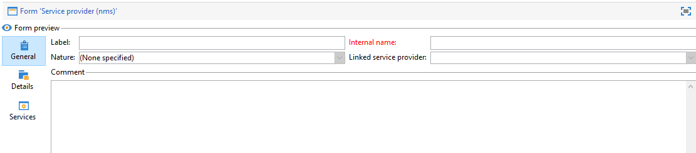
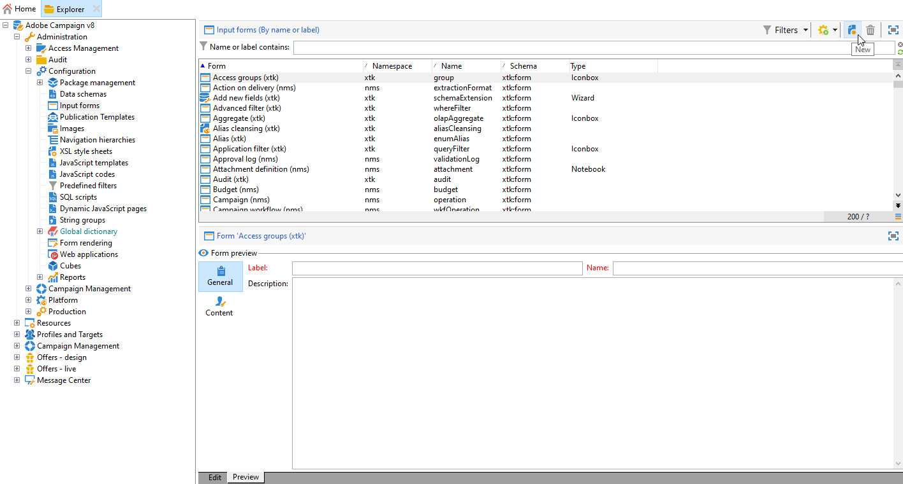
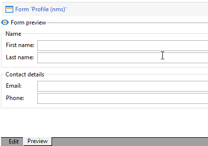

# 양식 편집{#editing-forms}


## 개요

마케터와 운영자는 입력 양식을 사용하여 레코드를 작성, 수정 및 미리 봅니다. Forms은 정보를 시각적으로 보여줍니다.

You can create and modify input forms:

* 기본적으로 제공되는 출하 시 입력 양식을 수정할 수 있습니다. The factory input forms are based on the factory data schemas.
* 정의한 데이터 스키마를 기반으로 하여 사용자 정의 입력 양식을 만들 수 있습니다.

Forms은 의 엔티티입니다 `xtk:form` 유형. 에서 입력 양식 구조를 볼 수 있습니다 `xtk:form` 스키마. To view this schema, choose **[!UICONTROL Administration]** > **[!UICONTROL Configuration]** > **[!UICONTROL Data schemas]** from the menu. 자세한 내용 [양식 구조](form-structure.md).

To access input forms, choose **[!UICONTROL Administration]> [!UICONTROL Configuration] >[!UICONTROL Input forms]** from the menu:


양식을 디자인하려면 XML 편집기에서 XML 내용을 편집합니다.


[자세한 내용](form-structure.md#formatting).

To preview a form, click the **[!UICONTROL Preview]** tab:


## 양식 유형

다양한 유형의 입력 양식을 만들 수 있습니다. 양식 유형은 사용자가 양식을 탐색하는 방법을 결정합니다.

* 콘솔 화면

   기본 양식 유형입니다. 상기 양식은 하나의 페이지로 이루어진다.

   

* 콘텐츠 관리

   콘텐츠 관리를 위해 이 양식 유형을 사용합니다. 다음 보기 [사용 사례](../../delivery/using/use-case--creating-content-management.md).

   

* 마법사

   이 양식은 특정 시퀀스로 정렬된 여러 부동 화면으로 구성됩니다. 사용자가 한 화면에서 다음 화면으로 이동합니다. [자세한 내용](form-structure.md#wizards).

* Iconbox

   이 양식은 여러 페이지로 구성됩니다. 양식을 탐색하려면 양식 왼쪽에서 아이콘을 선택합니다.

   

* Notebook

   This form comprises multiple pages. 양식을 탐색하려면 양식 상단에 있는 탭을 선택합니다.

   

* 세로 창

   이 양식은 탐색 트리를 보여 줍니다.

* 가로 창

   이 양식에 항목 목록이 표시됩니다.

## 컨테이너

In forms, you can use containers for various purposes:

* 양식 내에서 컨텐츠 구성
* 입력 필드에 대한 액세스 정의
* 다른 양식 내에 양식 중첩

[자세한 내용](form-structure.md#containers).

### Organize content

컨테이너를 사용하여 양식 내에서 컨텐츠를 구성할 수 있습니다.

* You can group fields into sections.
* You can add pages to multipage forms.

컨테이너를 삽입하려면 `<container>` 요소를 생성하지 않습니다. [자세한 내용](form-structure.md#containers).

#### 그룹 필드

Use containers to group input fields into organized sections.

To insert a section into a form, use this element: `<container type="frame">`. 섹션 제목을 추가하려면 `label` 속성을 사용합니다.

구문: `<container type="frame" label="`*section_title*`"> […] </container>`

이 예에서 컨테이너는 **만들기** 섹션을 포함하는 **[!UICONTROL Created by]** 및 **[!UICONTROL Name]** 입력 필드:

```xml
<form _cs="Coupons (nms)" entitySchema="xtk:form" img="xtk:form.png" label="Coupons"
      name="coupon" namespace="nms" type="default" xtkschema="xtk:form">
  <input xpath="@code"/>
  <input xpath="@type"/>
  <container label="Creation" type="frame">
    <input xpath="createdBy"/>
    <input xpath="createdBy/@name"/>
  </container>
</form>
```


#### Add pages to multipage forms

다중 페이지 양식의 경우 컨테이너를 사용하여 양식 페이지를 만듭니다.

This example shows containers for the **General** and **Details** pages of a form:

```xml
<container img="ncm:book.png" label="General">
[…]
</container>
<container img="ncm:detail.png" label="Details">
[…]
</container>
```

### 필드에 대한 액세스 정의

컨테이너를 사용하여 표시되는 내용을 정의하고 필드에 대한 액세스를 정의합니다. 필드 그룹을 켜거나 끌 수 있습니다.

### Nest forms

Use containers to nest forms within other forms. [자세한 내용](#add-pages-to-multipage-forms).

## 이미지에 대한 참조

To find images, choose **[!UICONTROL Administration]** > **[!UICONTROL Configuration]** > **[!UICONTROL Images]** from the menu.

예를 들어 아이콘과 같은 양식의 요소에 이미지를 연결하려면 이미지에 참조를 추가할 수 있습니다. 를 사용하십시오 `img` 속성(예: `<container>` 요소를 생성하지 않습니다.

구문: `img="`*`namespace`*`:`*`filename`*`.`*`extension`*`"`

이 예는 `book.png` 및 `detail.png` 의 이미지 `ncm` namespace:

```xml
<container img="ncm:book.png" label="General">
[…]
</container>
<container img="ncm:detail.png" label="Details">
[…]
</container>
```

이 이미지는 사용자가 다중 페이지 양식을 탐색하기 위해 클릭하는 아이콘에 사용됩니다.


## 간단한 양식 만들기 {#create-simple-form}

양식을 만들려면 다음 단계를 수행합니다.

1. 메뉴에서 **[!UICONTROL Administration]** > **[!UICONTROL Configuration]** > **[!UICONTROL Input forms]**.
1. Click the **[!UICONTROL New]** button at the top right of the list.

   

1. 양식 속성을 지정합니다.

   * 양식 이름과 네임스페이스를 지정합니다.

      양식 이름 및 네임스페이스가 관련 데이터 스키마와 일치할 수 있습니다.  이 예제에서는 `cus:order` 데이터 스키마:

      ```xml
      <form entitySchema="xtk:form" img="xtk:form.png" label="Order" name="order" namespace="cus" type="iconbox" xtkschema="xtk:form">
        […]
      </form>
      ```

      Alternatively, you can explicitly specify the data schema in the `entity-schema` attribute.

      ```xml
      <form entity-schema="cus:stockLine" entitySchema="xtk:form" img="xtk:form.png" label="Stock order" name="stockOrder" namespace="cus" xtkschema="xtk:form">
        […]
      </form>
      ```

   * Specify the label to be displayed on the form.
   * 원할 경우 양식 유형을 지정합니다. If you do not specify a form type, the console screen type is used by default.

      

      If you are designing a multipage form, you can omit the form type in the `<form>` element and specify the type in a container.

1. **[!UICONTROL Save]**&#x200B;를 클릭합니다.

1. 양식 요소를 삽입합니다.

   For example, to insert an input field, use the `<input>` element. Set the `xpath` attribute to the field reference as an XPath expression. [자세한 내용](schema-structure.md#referencing-with-xpath).

   이 예제에서는 `nms:recipient` 스키마.

   ```xml
   <input xpath="@firstName"/>
   <input xpath="@lastName"/>
   ```

1. 양식이 특정 스키마 유형을 기반으로 하는 경우 다음 스키마에 대한 필드를 조회할 수 있습니다.

   1. 클릭 **[!UICONTROL Insert]** > **[!UICONTROL Document fields]**.

      

   1. Select the field and click **[!UICONTROL OK]**.

      

1. Optionally, specify the field editor.

   A default field editor is associated with each data type:
   * 날짜 유형 필드의 경우 양식에 입력 달력이 표시됩니다.
   * For an enumeration-type field, the form shows a selection list.

   You can use these field editor types:

   | Field editor | 양식 속성 |
   | --- | --- |
   | 라디오 단추 | `type="radiobutton"` |
   | 확인란 | `type="checkbox"` |
   | 트리 편집 | `type="tree"` |

   Read more about [memory list controls](form-structure.md#memory-list-controls).

1. Optionally, define access to the fields:

   | 요소 | 속성 | 설명 |
   | --- | --- | --- |
   | `<input>` | `read-only:"true"` | 필드에 읽기 전용 액세스 권한을 제공합니다 |
   | `<container>` | `type="visibleGroup" visibleIf="`*edit-expr*`"` | 조건부로 필드 그룹을 표시합니다. |
   | `<container>` | `type="enabledGroup" enabledIf="`*edit-expr*`"` | Conditionally enables a group of fields |

   예제:

   ```xml
   <container type="enabledGroup" enabledIf="@gender=1">
     […]
   </container>
   <container type="enabledGroup" enabledIf="@gender=2">
     […]
   </container>
   ```

1. 컨테이너를 사용하여 필드를 섹션으로 그룹화합니다(선택적).

   ```xml
   <container type="frame" label="Name">
      <input xpath="@firstName"/>
      <input xpath="@lastName"/>
   </container>
   <container type="frame" label="Contact details">
      <input xpath="@email"/>
      <input xpath="@phone"/>
   </container>
   ```

   

## 다중 페이지 양식 만들기 {#create-multipage-form}

You can create multipage forms. You can also nest forms within other forms.

### Create an `iconbox` form

Use the `iconbox` form type to show icons at the left of the form, which take users to different pages in the form.


기존 양식의 유형을 `iconbox`다음 단계를 수행합니다.

1. Change the `type` attribute of the `<form>` element to `iconbox`:

   ```xml
   <form […] type="iconbox">
   ```

1. 각 양식 페이지에 대한 컨테이너를 설정합니다.

   1. 추가 `<container>` 요소의 하위 `<form>` 요소를 생성하지 않습니다.
   1. 아이콘에 대한 레이블과 이미지를 정의하려면 `label` 및 `img` 속성을 사용합니다.

      ```xml
      <form entitySchema="xtk:form" name="Service provider" namespace="nms" type="iconbox" xtkschema="xtk:form">
          <container img="xtk:properties.png" label="General">
              <input xpath="@label"/>
              <input xpath="@name"/>
              […]
          </container>
          <container img="nms:msgfolder.png" label="Details">
              <input xpath="@address"/>
              […]
          </container>
          <container img="nms:supplier.png" label="Services">
              […]
          </container>
      </form>
      ```
   또는, `type="frame"` 기존 속성의 특성 `<container>` 요소를 생성하지 않습니다.

### 전자 필기장 양식 만들기

를 사용하십시오 `notebook` 양식 유형은 양식의 맨 위에 탭을 표시하여 사용자를 다른 페이지로 안내하는 데 사용합니다.


기존 양식의 유형을 `notebook`다음 단계를 수행합니다.

1. 변경 `type` 의 속성 `<form>` 요소 대상 `notebook`:

   ```xml
   <form […] type="notebook">
   ```

1. 각 양식 페이지에 대한 컨테이너를 추가합니다.

   1. 추가 `<container>` 요소의 하위 `<form>` 요소를 생성하지 않습니다.
   1. To define the label and the image for the icon, use the `label` and `img` attributes.

   ```xml
     <form entitySchema="xtk:form" name="Service provider" namespace="nms" type="notebook" xtkschema="xtk:form">
         <container label="General">
             <input xpath="@label"/>
             <input xpath="@name"/>
             […]
         </container>
         <container label="Details">
             <input xpath="@address"/>
             […]
         </container>
         <container label="Services">
             […]
         </container>
     </form>
   ```

   또는, `type="frame"` 기존 속성의 특성 `<container>` 요소를 생성하지 않습니다.


