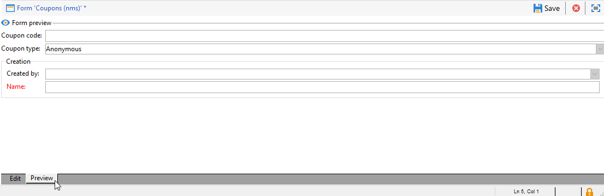

# 양식 편집{#editing-forms}

입력 양식 작성 및 구성 화면은 Adobe Campaign 클라이언트 콘솔의 **[!UICONTROL Administration > Configuration > Input forms]** 폴더에서 액세스할 수 있습니다.

편집 영역을 사용하면 입력 양식의 XML 내용을 입력할 수 있습니다.

미리 보기는 입력 양식의 표시를 생성합니다.

