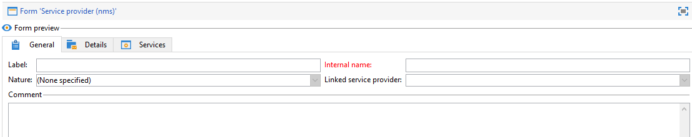

# 양식 편집{#editing-forms}

## 개요

마케터와 연산자는 입력 양식을 사용하여 레코드를 만들고, 수정하고, 미리 봅니다. Forms은 정보를 시각적으로 표시합니다.

입력 양식을 만들고 수정할 수 있습니다.

* 기본적으로 제공되는 출고 시 입력 양식을 수정할 수 있습니다. 팩터리 입력 양식은 팩터리 데이터 스키마를 기반으로 합니다.
* 정의한 데이터 스키마를 기반으로 하여 사용자 정의 입력 양식을 생성할 수 있습니다.

Forms은 `xtk:form` 유형의 엔터티입니다. `xtk:form` 스키마에서 입력 양식 구조를 볼 수 있습니다. 이 스키마를 보려면 메뉴에서 **[!UICONTROL Administration]** > **[!UICONTROL Configuration]** > **[!UICONTROL Data schemas]**&#x200B;을(를) 선택하십시오. [양식 구조](form-structure.md)에 대해 자세히 알아보세요.

입력 양식에 액세스하려면 메뉴에서 **[!UICONTROL Administration]> [!UICONTROL Configuration] >[!UICONTROL Input forms]**&#x200B;을(를) 선택하십시오.


양식을 디자인하려면 XML 편집기에서 XML 내용을 편집합니다.


[자세히 보기](form-structure.md#formatting).

양식을 미리 보려면 **[!UICONTROL Preview]** 탭을 클릭하십시오.


## 양식 유형

다양한 유형의 입력 양식을 만들 수 있습니다. 양식 유형은 사용자가 양식을 탐색하는 방법을 결정합니다.

* 콘솔 화면

  기본 양식 유형입니다. 양식은 하나의 페이지로 구성됩니다.

  

* 콘텐츠 관리

  콘텐츠 관리에 이 양식 유형을 사용합니다. 이 [사용 사례](../../delivery/using/use-case-creating-content-management.md)를 참조하세요.

  

* 마법사

  이 양식은 특정 시퀀스로 순서가 지정된 여러 부동 화면으로 구성됩니다. 사용자는 한 화면에서 다음 화면으로 이동합니다. [자세히 보기](form-structure.md#wizards).

* 아이콘 상자

  이 양식은 여러 페이지로 구성됩니다. 양식을 탐색하려면 양식 왼쪽에 있는 아이콘을 선택합니다.

  

* Notebook

  이 양식은 여러 페이지로 구성됩니다. 양식을 탐색하려면 양식 맨 위에서 탭을 선택합니다.

  

* 세로 창

  이 양식은 탐색 트리를 보여 줍니다.

* 가로 창

  이 양식에는 항목 목록이 표시됩니다.

## 컨테이너

양식에서 다양한 용도로 컨테이너를 사용할 수 있습니다.

* 양식 내에서 컨텐츠 구성
* 입력 필드에 대한 액세스 정의
* 다른 양식 내에 양식 중첩

[자세히 보기](form-structure.md#containers).

### 컨텐츠 구성

컨테이너를 사용하여 양식 내에서 콘텐츠를 구성합니다.

* 필드를 섹션으로 그룹화할 수 있습니다.
* 다중 페이지 양식에 페이지를 추가할 수 있습니다.

컨테이너를 삽입하려면 `<container>` 요소를 사용합니다. [자세히 보기](form-structure.md#containers).

#### 그룹 필드

컨테이너를 사용하여 입력 필드를 구성된 섹션으로 그룹화합니다.

양식에 섹션을 삽입하려면 이 요소 `<container type="frame">`을(를) 사용합니다. 필요한 경우 섹션 제목을 추가하려면 `label` 특성을 사용하십시오.

구문: `<container type="frame" label="`*section_title*`"> […] </container>`

이 예제에서 컨테이너는 **[!UICONTROL Created by]** 및 **[!UICONTROL Name]** 입력 필드를 구성하는 **Creation** 섹션을 정의합니다.

```xml
<form _cs="Coupons (nms)" entitySchema="xtk:form" img="xtk:form.png" label="Coupons"
      name="coupon" namespace="nms" type="default" xtkschema="xtk:form">
  <input xpath="@code"/>
  <input xpath="@type"/>
  <container label="Creation" type="frame">
    <input xpath="createdBy"/>
    <input xpath="createdBy/@name"/>
  </container>
</form>
```


#### 다중 페이지 양식에 페이지 추가

다중 페이지 양식의 경우 컨테이너를 사용하여 양식 페이지를 만듭니다.

다음 예제에서는 양식의 **일반** 및 **세부 정보** 페이지에 대한 컨테이너를 보여 줍니다.

```xml
<container img="ncm:book.png" label="General">
[…]
</container>
<container img="ncm:detail.png" label="Details">
[…]
</container>
```

### 필드에 대한 액세스 정의

컨테이너를 사용하여 표시되는 항목을 정의하고 필드에 대한 액세스를 정의합니다. 필드 그룹을 켜거나 끌 수 있습니다.

### 양식 중첩

컨테이너를 사용하여 양식을 다른 양식 내에 중첩합니다. [자세히 보기](#add-pages-to-multipage-forms).

## 이미지에 대한 참조

이미지를 찾으려면 메뉴에서 **[!UICONTROL Administration]** > **[!UICONTROL Configuration]** > **[!UICONTROL Images]**&#x200B;을(를) 선택합니다.

이미지를 양식의 요소(예: 아이콘)와 연결하려면 이미지에 참조를 추가할 수 있습니다. `img` 특성을 사용합니다(예: `<container>` 요소).

구문: `img="`*`namespace`*`:`*`filename`*`.`*`extension`*`"`

이 예제에서는 `ncm` 네임스페이스의 `book.png` 및 `detail.png` 이미지에 대한 참조를 보여 줍니다.

```xml
<container img="ncm:book.png" label="General">
[…]
</container>
<container img="ncm:detail.png" label="Details">
[…]
</container>
```

이 이미지는 사용자가 다중 페이지 양식을 탐색하기 위해 클릭하는 아이콘에 사용됩니다.


## 간단한 양식 만들기 {#create-simple-form}

양식을 만들려면 다음 단계를 수행합니다.

1. 메뉴에서 **[!UICONTROL Administration]** > **[!UICONTROL Configuration]** > **[!UICONTROL Input forms]**&#x200B;을(를) 선택합니다.
1. 목록의 오른쪽 상단에 있는 **[!UICONTROL New]** 단추를 클릭합니다.

   

1. 양식 속성 지정:

   * 양식 이름과 네임스페이스를 지정합니다.

     양식 이름 및 네임스페이스는 관련 데이터 스키마와 일치할 수 있습니다.  이 예제에서는 `cus:order` 데이터 스키마에 대한 양식을 보여 줍니다.

     ```xml
     <form entitySchema="xtk:form" img="xtk:form.png" label="Order" name="order" namespace="cus" type="iconbox" xtkschema="xtk:form">
       […]
     </form>
     ```

     또는 `entity-schema` 특성에 데이터 스키마를 명시적으로 지정할 수 있습니다.

     ```xml
     <form entity-schema="cus:stockLine" entitySchema="xtk:form" img="xtk:form.png" label="Stock order" name="stockOrder" namespace="cus" xtkschema="xtk:form">
       […]
     </form>
     ```

   * 양식에 표시할 레이블을 지정합니다.
   * 필요한 경우 양식 유형을 지정합니다. 양식 유형을 지정하지 않으면 기본적으로 콘솔 화면 유형이 사용됩니다.

     

     다중 페이지 양식을 디자인하는 경우 `<form>` 요소에서 양식 유형을 생략하고 컨테이너에 유형을 지정할 수 있습니다.

1. **[!UICONTROL Save]**&#x200B;를 클릭합니다.

1. 양식 요소를 삽입합니다.

   예를들어 입력 필드를 삽입하려면 `<input>` 요소를 사용합니다. `xpath` 특성을 필드 참조로 XPath 식으로 설정합니다. [자세히 보기](schema-structure.md#referencing-with-xpath).

   이 예제에서는 `nms:recipient` 스키마를 기반으로 하는 입력 필드를 보여줍니다.

   ```xml
   <input xpath="@firstName"/>
   <input xpath="@lastName"/>
   ```

1. 양식이 특정 스키마 유형을 기반으로 하는 경우 이 스키마에 대한 필드를 조회할 수 있습니다.

   1. **[!UICONTROL Insert]** > **[!UICONTROL Document fields]**&#x200B;을(를) 클릭합니다.

      

   1. 필드를 선택하고 **[!UICONTROL OK]**&#x200B;을(를) 클릭합니다.

      

1. 선택적으로 필드 편집기를 지정합니다.

   기본 필드 편집기는 각 데이터 유형과 연결되어 있습니다.
   * 날짜 유형 필드의 경우, 양식에 입력 캘린더가 표시됩니다.
   * 열거형 필드의 경우 양식에 선택 목록이 표시됩니다.

   다음 필드 편집기 유형을 사용할 수 있습니다.

   | 필드 편집기 | 양식 속성 |
   | --- | --- |
   | 라디오 버튼 | `type="radiobutton"` |
   | 확인란 | `type="checkbox"` |
   | 트리 편집 | `type="tree"` |

   [메모리 목록 컨트롤](form-structure.md#memory-list-controls)에 대해 자세히 알아보세요.

1. 필드에 대한 액세스를 정의합니다(선택적).

   | 요소 | 속성 | 설명 |
   | --- | --- | --- |
   | `<input>` | `read-only="true"` | 필드에 읽기 전용 액세스 권한 제공 |
   | `<container>` | `type="visibleGroup" visibleIf="`*edit-expr*`"` | 조건부로 필드 그룹 표시 |
   | `<container>` | `type="enabledGroup" enabledIf="`*edit-expr*`"` | 조건부로 필드 그룹 활성화 |

   예:

   ```xml
   <container type="enabledGroup" enabledIf="@gender=1">
     […]
   </container>
   <container type="enabledGroup" enabledIf="@gender=2">
     […]
   </container>
   ```

1. 선택적으로 컨테이너를 사용하여 필드를 섹션으로 그룹화합니다.

   ```xml
   <container type="frame" label="Name">
      <input xpath="@firstName"/>
      <input xpath="@lastName"/>
   </container>
   <container type="frame" label="Contact details">
      <input xpath="@email"/>
      <input xpath="@phone"/>
   </container>
   ```

   

## 다중 페이지 양식 만들기 {#create-multipage-form}

다중 페이지 양식을 만들 수 있습니다. 다른 양식 내에 양식을 중첩할 수도 있습니다.

### `iconbox` 양식 만들기

`iconbox` 양식 유형을 사용하여 양식의 왼쪽에 아이콘을 표시합니다. 이 아이콘은 사용자가 양식의 다른 페이지로 이동하는 데 사용됩니다.


기존 양식의 유형을 `iconbox`(으)로 변경하려면 다음 단계를 수행하십시오.

1. `<form>` 요소의 `type` 특성을 `iconbox`(으)로 변경합니다.

   ```xml
   <form […] type="iconbox">
   ```

1. 각 양식 페이지에 대한 컨테이너를 설정합니다.

   1. `<container>` 요소를 `<form>` 요소의 자식으로 추가합니다.
   1. 아이콘의 레이블과 이미지를 정의하려면 `label` 및 `img` 특성을 사용합니다.

      ```xml
      <form entitySchema="xtk:form" name="Service provider" namespace="nms" type="iconbox" xtkschema="xtk:form">
          <container img="xtk:properties.png" label="General">
              <input xpath="@label"/>
              <input xpath="@name"/>
              […]
          </container>
          <container img="nms:msgfolder.png" label="Details">
              <input xpath="@address"/>
              […]
          </container>
          <container img="nms:supplier.png" label="Services">
              […]
          </container>
      </form>
      ```

   또는 기존 `<container>` 요소에서 `type="frame"` 특성을 제거합니다.

### 전자 필기장 양식 만들기

`notebook` 양식 유형을 사용하여 다른 페이지로 이동하는 탭을 양식 맨 위에 표시합니다.


기존 양식의 유형을 `notebook`(으)로 변경하려면 다음 단계를 수행하십시오.

1. `<form>` 요소의 `type` 특성을 `notebook`(으)로 변경합니다.

   ```xml
   <form […] type="notebook">
   ```

1. 각 양식 페이지에 대한 컨테이너 추가:

   1. `<container>` 요소를 `<form>` 요소의 자식으로 추가합니다.
   1. 아이콘의 레이블과 이미지를 정의하려면 `label` 및 `img` 특성을 사용합니다.

   ```xml
     <form entitySchema="xtk:form" name="Service provider" namespace="nms" type="notebook" xtkschema="xtk:form">
         <container label="General">
             <input xpath="@label"/>
             <input xpath="@name"/>
             […]
         </container>
         <container label="Details">
             <input xpath="@address"/>
             […]
         </container>
         <container label="Services">
             […]
         </container>
     </form>
   ```

   또는 기존 `<container>` 요소에서 `type="frame"` 특성을 제거합니다.

### 양식 중첩

다른 양식 내에 양식을 중첩할 수 있습니다. 예를 들어 전자 필기장 양식을 iconbox 양식 내에 중첩할 수 있습니다.

중첩 수준은 탐색을 제어합니다. 사용자는 하위 양식으로 드릴다운할 수 있습니다.

다른 폼에 폼을 중첩하려면 `<container>` 요소를 삽입하고 `type` 특성을 폼 형식으로 설정합니다. 최상위 폼의 경우 외부 컨테이너 또는 `<form>` 요소에서 폼 형식을 설정할 수 있습니다.

### 예제

다음 예에서는 복잡한 양식을 보여 줍니다.

* 최상위 양식은 iconbox 양식입니다. 이 양식은 레이블이 **일반** 및 **세부 정보**&#x200B;인 두 개의 컨테이너로 구성됩니다.

  따라서 외부 양식에는 최상위 수준의 **일반** 및 **세부 정보** 페이지가 표시됩니다. 이러한 페이지에 액세스하려면 양식 왼쪽에 있는 아이콘을 클릭합니다.

* 하위 양식은 **일반** 컨테이너 내에 중첩된 전자 필기장 양식입니다. 하위 폼은 **이름** 및 **연락처** 레이블이 지정된 두 개의 컨테이너로 구성됩니다.

```xml
<form _cs="Profile (nms)" entitySchema="xtk:form" img="xtk:form.png" label="Profile" name="profile" namespace="nms" xtkschema="xtk:form">
  <container type="iconbox">
    <container img="ncm:general.png" label="General">
      <container type="notebook">
        <container label="Name">
          <input xpath="@firstName"/>
          <input xpath="@lastName"/>
        </container>
        <container label="Contact">
          <input xpath="@email"/>
        </container>
      </container>
    </container>
    <container img="ncm:detail.png" label="Details">
      <input xpath="@birthDate"/>
    </container>
  </container>
</form>
```

따라서 외부 양식의 **일반** 페이지에는 **이름** 및 **연락처** 탭이 표시됩니다.


다른 폼에 폼을 중첩하려면 `<container>` 요소를 삽입하고 `type` 특성을 폼 형식으로 설정합니다. 최상위 폼의 경우 외부 컨테이너 또는 `<form>` 요소에서 폼 형식을 설정할 수 있습니다.

### 예제

다음 예에서는 복잡한 양식을 보여 줍니다.

* 최상위 양식은 iconbox 양식입니다. 이 양식은 레이블이 **일반** 및 **세부 정보**&#x200B;인 두 개의 컨테이너로 구성됩니다.

  따라서 외부 양식에는 최상위 수준의 **일반** 및 **세부 정보** 페이지가 표시됩니다. 이러한 페이지에 액세스하려면 양식 왼쪽에 있는 아이콘을 클릭합니다.

* 하위 양식은 **일반** 컨테이너 내에 중첩된 전자 필기장 양식입니다. 하위 폼은 **이름** 및 **연락처** 레이블이 지정된 두 개의 컨테이너로 구성됩니다.

```xml
<form _cs="Profile (nms)" entitySchema="xtk:form" img="xtk:form.png" label="Profile" name="profile" namespace="nms" xtkschema="xtk:form">
  <container type="iconbox">
    <container img="ncm:general.png" label="General">
      <container type="notebook">
        <container label="Name">
          <input xpath="@firstName"/>
          <input xpath="@lastName"/>
        </container>
        <container label="Contact">
          <input xpath="@email"/>
        </container>
      </container>
    </container>
    <container img="ncm:detail.png" label="Details">
      <input xpath="@birthDate"/>
    </container>
  </container>
</form>
```

따라서 외부 양식의 **일반** 페이지에는 **이름** 및 **연락처** 탭이 표시됩니다.


## 팩터리 입력 양식 수정 {#modify-factory-form}

공장 양식을 수정하려면 다음 단계를 수행합니다.

1. 팩터리 입력 양식 수정:

   1. 메뉴에서 **[!UICONTROL Administration]** > **[!UICONTROL Configuration]** > **[!UICONTROL Input forms]**&#x200B;을(를) 선택합니다.
   1. 입력 양식을 선택하고 수정합니다.

   팩터리 데이터 스키마를 확장할 수 있지만 팩터리 입력 양식은 확장할 수 없습니다. 출고 시 입력 양식을 다시 작성하지 않고 직접 수정하는 것이 좋습니다. 소프트웨어 업그레이드 중에 출하 시 입력 양식의 수정 사항이 업그레이드와 병합됩니다. 자동 병합에 실패하면 충돌을 해결할 수 있습니다. [자세히 보기](../../production/using/upgrading.md#resolving-conflicts).

   예를 들어 추가 필드를 사용하여 팩토리 스키마를 확장하는 경우 이 필드를 관련 팩토리 양식에 추가할 수 있습니다.

## 양식 유효성 검사 {#validate-forms}

양식에 유효성 검사 컨트롤을 포함할 수 있습니다.

### 필드에 읽기 전용 액세스 권한 부여

필드에 읽기 전용 액세스 권한을 부여하려면 `readOnly="true"` 특성을 사용하십시오. 예를 들어, 읽기 전용 액세스 권한이 있는 레코드의 기본 키를 표시할 수 있습니다. [자세히 보기](form-structure.md#non-editable-fields).

이 예제에서는 `nms:recipient` 스키마의 기본 키(`iRecipientId`)가 읽기 전용 액세스로 표시됩니다.

```xml
<value xpath="@iRecipientId" readOnly="true"/>
```

### 필수 필드 확인

필수 정보를 확인할 수 있습니다.

* 필수 필드에 `required="true"` 특성을 사용합니다.
* `<leave>` 노드를 사용하여 이러한 필드를 확인하고 오류 메시지를 표시하십시오.

이 예에서는 이메일 주소가 필수이며, 사용자가 이 정보를 제공하지 않은 경우 오류 메시지가 표시됩니다.

```xml
<input xpath="@email" required="true"/>
<leave>
  <check expr="@email!=''">
    <error>The email address is required.</error>
  </check>
</leave>
```

[표현식 필드](form-structure.md#expression-field) 및 [양식 컨텍스트](form-structure.md#context-of-forms)에 대해 자세히 알아보십시오.

### 값 유효성 검사

JavaScript SOAP 호출을 사용하여 콘솔에서 양식 데이터의 유효성을 검사할 수 있습니다. 예를 들어 복잡한 유효성 검사에 이러한 호출을 사용하여 승인된 값 목록에 대해 값을 확인합니다. [자세히 보기](form-structure.md#soap-methods).

1. JS 파일에 유효성 검사 함수를 만듭니다.

   예:

   ```js
   function nms_recipient_checkValue(value)
   {
     logInfo("checking value " + value)
     if (…)
     {
       logError("Value " + value + " is not valid")
     }
     return 1
   }
   ```

   이 예제에서 함수의 이름은 `checkValue`입니다. 이 함수는 `nms` 네임스페이스에서 `recipient` 데이터 형식을 확인하는 데 사용합니다. 확인 중인 값이 기록됩니다. 값이 올바르지 않으면 오류 메시지가 기록됩니다. 값이 유효하면 값 1이 반환됩니다.

   반환된 값을 사용하여 양식을 수정할 수 있습니다.

1. 양식에서 `<soapCall>` 요소를 `<leave>` 요소에 추가합니다.

   이 예제에서는 SOAP 호출을 사용하여 `@valueToCheck` 문자열의 유효성을 검사합니다.

   ```xml
   <form name="recipient" (…)>
   (…)
     <leave>
       <soapCall name="checkValue" service="nms:recipient">
         <param exprIn="@valueToCheck" type="string"/>
       </soapCall>
     </leave>
   </form>
   ```

   이 예제에서는 `checkValue` 메서드와 `nms:recipient` 서비스를 사용합니다.

   * 서비스는 네임스페이스와 데이터 유형입니다.
   * 메서드는 함수 이름입니다. 이름은 대/소문자를 구분합니다.

   호출이 동기적으로 수행됩니다.

   모든 예외가 표시됩니다. `<leave>` 요소를 사용하는 경우 입력한 정보의 유효성을 검사할 때까지 사용자가 양식을 저장할 수 없습니다.

다음 예에서는 양식 내에서 서비스를 호출하는 방법을 보여 줍니다.

```xml
<enter>
  <soapCall name="client" service="c4:ybClient">
    <param exprIn="@id" type="string"/>
    <param type="boolean" xpathOut="/tmp/@count"/>
  </soapCall>
</enter>
```

이 예에서 입력은 기본 키인 ID입니다. 사용자가 이 ID의 양식을 채우면 이 ID를 입력 매개 변수로 하는 SOAP 호출이 수행됩니다. 출력은 이 필드에 기록되는 부울입니다. `/tmp/@count`. 양식 내에서 이 부울을 사용할 수 있습니다. [양식 컨텍스트](form-structure.md#context-of-forms)에 대해 자세히 알아보세요.
