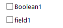

# 양식 구조{#form-structure}

양식의 설명은 양식 스키마 xtk:form의 문법을 **준수하는 구조화된 XML 문서입니다**.

양식 이름과 네임스페이스를 채우려면 입력 양식의 XML 문서에 `<form>` 이름 **및** 네임스페이스 **특성이 있는** 루트요소가 포함되어야 합니다.

```
<form name="form_name" namespace="name_space">
...
</form>
```

기본적으로 양식은 동일한 이름 및 네임스페이스의 데이터 스키마에 연결됩니다. 양식을 다른 이름과 연결하려면 요소의 **엔티티 스키마** 속성을 스키마 키 `<form>` 의 이름으로 설정합니다. 입력 양식의 구조를 설명하기 위해 &quot;cus:recipient&quot; 예제 스키마를 사용하여 인터페이스에 대해 설명하겠습니다.

```
<srcSchema name="recipient" namespace="cus">
  <enumeration name="gender" basetype="byte">    
    <value name="unknown" label="Not specified" value="0"/>    
    <value name="male" label="Male" value="1"/>   
    <value name="female" label="Female" value="2"/>   
  </enumeration>

  <element name="recipient">
    <attribute name="email" type="string" length="80" label="Email" desc="E-mail address of recipient"/>
    <attribute name="birthDate" type="datetime" label="Date"/>
    <attribute name="gender" type="byte" label="Gender" enum="gender"/>
  </element>
</srcSchema>
```

예제 스키마를 기반으로 하는 입력 양식:


```
<form name="recipient" namespace="cus">
  <input xpath="@gender"/>
  <input xpath="@birthDate"/>
  <input xpath="@email"/>
</form>
```

편집 컨트롤에 대한 설명은 `<form>` 루트 요소에서 시작됩니다. 스키마의 필드 경로를 포함하는 **`<input>`** xpath **특성이 있는 요소** 에 편집 컨트롤이입력됩니다.

편집 컨트롤은 해당 데이터 유형에 자동으로 적응하며 스키마에 정의된 레이블을 사용합니다.

>[!NOTE]
>
>레이블 속성을 요소에 추가하여 데이터 스키마에 정의된 레이블을 **오버로드할** 수 `<input>` 있습니다.\
>`<input label="E-mail address" xpath="@name" />`

기본적으로 각 필드는 단일 행에 표시되며 데이터 유형에 따라 사용 가능한 모든 공간을 차지합니다.

## 서식 {#formatting}

컨트롤의 레이아웃은 컨트롤을 여러 개의 열로 나누거나, 인터레이스 요소를 사용하거나, 사용 가능한 공간의 위치를 지정할 수 있으므로 HTML 표에 사용되는 레이아웃과 비슷합니다. 하지만 서식을 지정하면 비율을 기준으로 영역을 분할할 수 있습니다.오브젝트에 대해 고정 차원을 지정할 수 없습니다.

위의 예제의 컨트롤을 두 열에 표시하려면:


```
<form name="recipient" namespace="cus">
  <container colcount="2">
    <input xpath="@gender"/>
    <input xpath="@birthDate"/>
    <input xpath="@email"/>
  </container>
</form>
```

colcount **`<container>`** 특성이 **있는** 요소를 사용하면 자식 컨트롤을 두 개의 열로 강제 표시할 수 있습니다.

컨트롤의 **colspan** 속성은 해당 값에 입력한 열 수로 컨트롤을 확장합니다.


```
<form name="recipient" namespace="cus">
  <container colcount="2">
    <input xpath="@gender"/>
    <input xpath="@birthDate"/>
    <input xpath="@email" colspan="2"/>
  </container>
</form> 
```

type=&quot;frame&quot; **속성을** 채우면 이 컨테이너는 **label** 특성에 포함된 레이블로 자식 컨트롤 주위의 프레임을 추가합니다.


```
<form name="recipient" namespace="cus">
  <container colcount="2" type="frame" label="General">
    <input xpath="@gender"/>
    <input xpath="@birthDate"/>
    <input xpath="@email" colspan="2"/>
  </container>
</form>
```

입력 양식의 서식을 지정하는 데 요소를 사용할 수 **`<static>`** 있습니다.


```
<form name="recipient" namespace="cus">
  <static type="separator" colspan="2" label="General"/>
  <input xpath="@gender"/>
  <input xpath="@birthDate"/>
  <input xpath="@email" colspan="2"/>
  <static type="help" label="General information about recipient with date of birth, gender, and e-mail address." colspan="2"/>
</form>
```

구분 문자 **`<static>`** 유형이 있는 태그를 사용하면 **label** 속성에 포함된 레이블로 구분 막대를 추가할 수 있습니다 **** .

도움말 유형이 있는 `<static>` 태그를 사용하여 도움말 텍스트가 추가되었습니다. 텍스트 컨텐츠는 **label** 속성에 입력됩니다.

## 컨테이너 {#containers}

컨테이너에서는 일련의 컨트롤을 그룹화할 수 있습니다. 요소별로 **`<container>`** 표시됩니다. 위에서 여러 열에 대한 컨트롤의 서식을 지정하는 데 사용되었습니다.

xpath **속성을** 사용하면 `<container>` 자식 컨트롤의 참조를 단순화할 수 있습니다. 컨트롤의 참조는 상위 `<container>` 상위에 상대적입니다.

&quot;xpath&quot;가 없는 컨테이너의 예:

```
<container colcount="2">
  <input xpath="location/@zipCode"/>
  <input xpath="location/@city"/>
</container>
```

&quot;location&quot;이라는 요소에 &quot;xpath&quot;가 추가된 예:

```
<container colcount="2" xpath="location">
  <input xpath="@zipCode"/>
  <input xpath="@city"/>
</container>
```

### 컨테이너 유형 {#types-of-container}

컨테이너는 페이지에서 서식이 지정된 필드 집합을 사용하여 복잡한 컨트롤을 구성하는 데 사용됩니다.

#### 탭 컨테이너 {#tab-container}

탭 컨테이너는 탭에서 액세스할 수 있는 페이지의 데이터 형식을 지정합니다.


```
<container type="notebook">
  <container colcount="2" label="General">
    <input xpath="@gender"/>
    <input xpath="@birthDate"/>
    <input xpath="@email" colspan="2"/>
  </container>
  <container colcount="2" label="Location">
    ...
  </container>
</container>
```

기본 컨테이너는 **type=&quot;notebook&quot;** 속성으로 정의됩니다. 탭은 하위 컨테이너에서 선언되며, 탭의 레이블은 **label** 속성에서 채워집니다.

>[!NOTE]
>
>A **style=&quot;down|up**(기본값)**&quot;** 기능은컨트롤 아래 또는 위에 탭 레이블의 세로 위치를 지정합니다. 이 기능은 선택 사항입니다.
>
>`<container style="down" type="notebook">  ... </container>`

#### 아이콘 목록 {#icon-list}

이 컨테이너에는 표시할 페이지를 선택할 수 있는 세로 아이콘 막대가 표시됩니다.


```
<container type="iconbox">
  <container colcount="2" label="General" img="xtk:properties.png">
    <input xpath="@gender"/>
    <input xpath="@birthDate"/>
    <input xpath="@email" colspan="2"/>
  </container>
  <container colcount="2" label="Location" img="nms:msgfolder.png">
    ...
  </container>
</container>
```

기본 컨테이너는 **type=&quot;iconbox&quot; 속성으로** 정의됩니다. 아이콘과 연결된 페이지는 하위 컨테이너에서 선언됩니다. 아이콘의 레이블은 **label** 속성에서 채워집니다.

페이지의 아이콘은 `img="<image>"` 속성에서 채워집니다. 여기서 `<image>` 는 이름과 네임스페이스로 구성된 키에 해당하는 이미지의 이름입니다(예: &quot;xtk:properties.png&quot;).

이미지는 노드에서 사용할 수 **[!UICONTROL Administration > Configuration > Images]** 있습니다.

#### 가시성 컨테이너 {#visibility-container}

동적 조건을 통해 컨트롤 세트를 마스크할 수 있습니다.

이 예에서는 &quot;성별&quot; 필드 값에 대한 컨트롤의 가시성을 보여 줍니다.

```
<container type="visibleGroup" visibleIf="@gender=1">
  ...
</container>
<container type="visibleGroup" visibleIf="@gender=2">
  ...
</container>
```

가시성 컨테이너는 속성 **type=&quot;visibleGroup&quot;으로 정의됩니다**. visibleIf **특성에 가시성** 조건이 포함되어 있습니다.

조건 구문의 예:

* **visibleIf=&quot;@email=&#39;peter.martinezATneolane.net&#39;&quot;**:문자열 유형 데이터에 대한 평형을 테스트합니다. 비교 값은 따옴표로 묶어야 합니다.
* **visibleIf=&quot;@gender >= 1 and @gender != 2&quot;**:조건을 숫자 값으로 설정합니다.
* **visibleIf=&quot;@boolean1==true 또는 @boolean2==false&quot;**:부울 필드에서 테스트합니다.

#### 컨테이너 활성화 {#enabling-container}

이 컨테이너를 사용하면 동적 조건에서 데이터 집합을 활성화하거나 비활성화할 수 있습니다. 컨트롤을 비활성화하면 컨트롤이 편집되지 않습니다. 다음 예에서는 &quot;성별&quot; 필드의 값에서 컨트롤을 활성화하는 방법을 보여 줍니다.

```
<container type="enabledGroup" enabledIf="@gender=1">
  ...
</container>
<container type="enabledGroup" enabledIf="@gender=2">
  ...
</container>
```

활성화 컨테이너는 **type=&quot;enabledGroup&quot; 속성으로** 정의됩니다. enabledIf **특성에** 활성화 조건이 포함됩니다.

## 링크 편집 {#editing-a-link}

링크는 다음과 같이 데이터 스키마에 선언됩니다.

```
<element label="Company" name="company" target="cus:company" type="link"/>
```

입력 양식의 링크 편집 컨트롤은 다음과 같습니다.


```
<input xpath="company"/>
```

Target 선택 항목은 편집 필드를 통해 액세스할 수 있습니다. 입력한 처음 몇 개의 문자에서 대상 요소를 쉽게 찾을 수 있도록 사전 입력 방식으로 항목을 지원합니다. 그러면 검색은 타깃팅된 스키마에 정의된 **계산 문자열을** 기반으로 합니다. 컨트롤에 대한 유효성 검사 후 스키마가 없으면 즉시 대상 만들기의 확인 메시지가 표시됩니다. 확인은 대상 테이블에 새 레코드를 만들고 이 레코드를 링크에 연결합니다.

드롭다운 목록은 이미 만든 레코드 목록에서 대상 요소를 선택하는 데 사용됩니다.

(폴더) **[!UICONTROL Modify the link]** 아이콘은 타깃팅된 요소 목록과 필터 영역이 있는 선택 양식을 시작합니다.


(돋보기) **[!UICONTROL Edit link]** 아이콘은 연결된 요소의 편집 형태를 실행합니다. 사용된 양식은 타깃팅된 스키마의 키에 대해 기본적으로 추론됩니다. 양식 **속성을 사용하면** 편집 양식(예:&quot;cus:company2&quot;).

입력 양식의 링크 정의에서 요소를 추가하여 대상 요소 **`<sysfilter>`** 의 선택을 제한할 수 있습니다.

```
<input xpath="company">
  <sysFilter>
    <condition expr="[location/@city] =  'Newton"/>
  </sysFilter>
</input>
```

다음과 같은 요소를 사용하여 목록을 정렬할 수도 **`<orderby>`** 있습니다.

```
<input xpath="company">
  <orderBy>
    <node expr="[location/@zipCode]"/>
  </orderBy>
</input>
```

### 컨트롤 속성 {#control-properties}

* **noAutoComplete**:문자 앞에 비활성화(값 &quot;true&quot;로 설정)
* **createMode**:링크가 없는 경우 링크를 신속하게 만듭니다. 가능한 값은 다음과 같습니다.

   * **없음**:만들기를 비활성화합니다. 링크가 없는 경우 오류 메시지가 표시됩니다.
   * **인라인**:편집 필드에 내용이 포함된 링크를 만듭니다.
   * **에디션**:링크에 편집 양식이 표시됩니다. 양식의 유효성을 검사하면 데이터가 저장됩니다(기본 모드)

* **noZoom**:링크에 양식 편집 없음(값 &quot;true&quot;로 설정됨)
* **양식**:타깃팅된 요소의 편집 양식을 오버로드함

## 링크 목록 {#list-of-links}

데이터 스키마에 컬렉션 요소(언바운드=&quot;true&quot;)로 입력된 링크는 연관된 모든 요소를 보려면 목록을 통과해야 합니다.

이 원칙은 최적화된 데이터 로딩(데이터 일괄 다운로드로 다운로드, 목록이 표시되는 경우에만 목록 실행)이 있는 연결된 요소 목록을 표시하는 데 있습니다.

스키마의 컬렉션 링크의 예:

```
<element label="Events" name="rcpEvent" target="cus:event" type="link" unbound="true">
...
</element>
```

입력 형식의 목록:


```
 <input xpath="rcpEvent" type="linklist">
  <input xpath="@label"/>
  <input xpath="@date"/>
</input>
```

목록 컨트롤은 **type=&quot;linklist&quot; 특성에 의해** 정의됩니다. 목록 경로는 컬렉션 링크를 참조해야 합니다.

열은 목록의 **`<input>`** 요소를 통해 선언됩니다. xpath **** 속성은 대상 스키마의 필드 경로를 참조합니다.

레이블(스키마의 링크에 정의됨)이 있는 도구 모음이 목록 위에 자동으로 배치됩니다.

이 목록은 **[!UICONTROL Filters]** 단추를 통해 필터링되고 열을 추가 및 정렬하도록 구성할 수 있습니다.

링크 **[!UICONTROL Add]** 및 **[!UICONTROL Delete]** 단추를 사용하여 링크에 컬렉션 요소를 추가하고 삭제할 수 있습니다. 기본적으로 요소를 추가하면 대상 스키마의 편집 양식이 실행됩니다.

목록 **[!UICONTROL Detail]** 의 태그에서 **zoom=&quot;true&quot;** 속성이 완료되면 **`<input>`** 단추가 자동으로 추가됩니다.선택한 라인의 편집 양식을 실행할 수 있습니다.

목록을 로드할 때 필터링 및 정렬을 적용할 수 있습니다.

```
 <input xpath="rcpEvent" type="linklist">
  <input xpath="@label"/>
  <input xpath="@date"/>
  <sysFilter>
    <condition expr="@type = 1"/>
  </sysFilter>
  <orderBy>
    <node expr="@date" sortDesc="true"/>
  </orderBy>
</input>
```

### 관계 테이블 {#relationship-table}

관계 테이블을 사용하면 두 테이블을 N-N 카디널리티와 연결할 수 있습니다. 관계 테이블에는 두 테이블에 대한 링크만 포함되어 있습니다.

따라서 목록에 요소를 추가하면 관계 테이블의 두 링크 중 하나에서 목록을 완료할 수 있습니다.

스키마의 관계 테이블 예:

```
<srcSchema name="subscription" namespace="cus">
  <element name="recipient" type="link" target="cus:recipient" label="Recipient"/>
  <element name="service" type="link" target="cus:service" label="Subscription service"/>
</srcSchema>
```

예를 들어 &quot;cus:recipient&quot; 스키마의 입력 양식부터 시작합니다. 목록에 서비스에 대한 구독과 관련된 연결이 표시되어야 하며, 기존 서비스를 선택하여 구독을 추가할 수 있어야 합니다.


```
<input type="linklist" xpath="subscription" xpathChoiceTarget="service" xpathEditTarget="service" zoom="true">
  <input xpath="recipient"/>
  <input xpath="service"/>
</input>
```

xpathChoiceTarget **** 속성을 사용하면 입력한 링크에서 선택 양식을 시작할 수 있습니다. 관계 테이블 레코드를 만들면 현재 받는 사람 및 선택한 서비스에 대한 링크가 자동으로 업데이트됩니다.

>[!NOTE]
>
>xpathEditTarget **** 속성을 사용하면 입력한 링크에 대해 선택한 행을 강제로 편집할 수 있습니다.

### 목록 속성 {#list-properties}

* **noToolbar**:도구 모음을 숨깁니다(값 &quot;true&quot;로).
* **toolbarCaption**:도구 모음 레이블 오버로드
* **toolbarAlign**:toolbar의 수직 또는 수평 형상을 수정합니다(가능한 값:&quot;vertical&quot;|&quot;horizontal&quot;)
* **img**:목록에 연결된 이미지를 표시합니다.
* **양식**:타깃팅된 요소의 편집 양식을 오버로드함
* **확대/축소**:타깃팅된 요소를 편집할 **[!UICONTROL Zoom]** 단추를 추가합니다.
* **xpathEditTarget**:입력한 링크에 대한 편집 설정
* **xpathChoiceTarget**:을 추가하여 입력한 링크에서 선택 양식을 시작합니다.

## 메모리 목록 컨트롤 {#memory-list-controls}

메모리 목록을 사용하면 목록 데이터 미리 로드를 사용하여 수집 요소를 편집할 수 있습니다. 이 목록은 필터링하거나 구성할 수 없습니다.

이러한 목록은 XML 매핑 컬렉션 요소 또는 볼륨 낮은 링크에서 사용됩니다.

### 열 목록 {#column-list}

이 컨트롤은 추가 및 삭제 단추가 포함된 도구 모음이 있는 편집 가능한 열 목록을 표시합니다.


```
<input xpath="rcpEvent" type="list">
  <input xpath="@label"/>
  <input xpath="@date"/>
</input>
```

목록 컨트롤은 **type=&quot;list&quot;** 속성으로 채워져야 하며 목록 경로는 컬렉션 요소를 참조해야 합니다.

목록의 하위 **`<input>`** 태그에 열이 선언됩니다. 열 레이블과 크기는 레이블 **및** colSize **** 속성을 사용하여 강제 적용할 수 있습니다.

>[!NOTE]
>
>정렬 순서 화살표는 **ordered=&quot;true&quot;** 속성이 데이터 스키마의 컬렉션 요소에 추가되면 자동으로 추가됩니다.

도구 모음 단추를 가로로 정렬할 수 있습니다.


```
<input nolabel="true" toolbarCaption="List of events" type="list" xpath="rcpEvent" zoom="true">
  <input xpath="@label"/>
  <input xpath="@date"/>
</input>
```

toolbarCaption **** 속성은 도구 모음의 가로 정렬을 강제로 적용하고 목록 위에 제목을 입력합니다.

#### 목록 확대 {#zoom-in-a-list}

목록의 데이터를 삽입하고 편집하는 작업은 별도의 편집 양식으로 입력할 수 있습니다.


```
<input nolabel="true" toolbarCaption="List of events" type="list" xpath="rcpEvent" zoom="true" zoomOnAdd="true">
  <input xpath="@label"/>
  <input xpath="@date"/>

  <form colcount="2" label="Event">
    <input xpath="@label"/>
    <input xpath="@date"/>
  </form>
</input>
```

편집 양식은 목록 정의 아래의 `<form>` 요소에서 완료됩니다. 해당 구조는 입력 양식과 동일합니다. 목록 **[!UICONTROL Detail]** 의 태그에서 **zoom=&quot;true&quot;** 속성이 완료되면 **`<input>`** 단추가 자동으로 추가됩니다. 이 속성을 사용하면 선택한 라인의 편집 양식을 시작할 수 있습니다.

>[!NOTE]
>
>zoomOnAdd=&quot;true&quot; **** 속성을 추가하면 목록 요소가 삽입될 때 편집 양식이 호출됩니다.

### 목록 속성 {#list-properties-1}

* **noToolbar**:도구 모음을 숨깁니다(값 &quot;true&quot;로).
* **toolbarCaption**:도구 모음 레이블 오버로드
* **toolbarAlign**:도구 모음의 위치를 수정합니다(가능한 값:&quot;vertical&quot;|&quot;horizontal&quot;)
* **img**:목록에 연결된 이미지를 표시합니다.
* **양식**:타깃팅된 요소의 편집 양식을 오버로드함
* **확대/축소**:타깃팅된 요소를 편집할 **[!UICONTROL Zoom]** 단추를 추가합니다.
* **zoomOnAdd**:추가할 때 편집 양식 시작
* **xpathChoiceTarget**:을 추가하여 입력한 링크에서 선택 양식을 시작합니다.

## 편집할 수 없는 필드 {#non-editable-fields}

필드를 표시하고 편집하지 못하도록 하려면 **`<value>`** 태그를 사용하거나 **태그에서** readOnly=&quot;true&quot; **`<input>`** 속성을완료합니다.

&quot;성별&quot; 필드의 예:


```
<value value="@gender"/>
<input xpath="@gender" readOnly="true"/>
```

## 라디오 단추 {#radio-button}

라디오 단추를 사용하면 여러 옵션 중에서 선택할 수 있습니다. 이 **`<input>`** 태그는 가능한 옵션을 나열하는 데 사용되고, checkedValue **** 속성은 선택 사항과 연관된 값을 지정합니다.

&quot;성별&quot; 필드의 예:

```
<input type="RadioButton" xpath="@gender" checkedValue="0" label="Choice 1"/>
<input type="RadioButton" xpath="@gender" checkedValue="1" label="Choice 2"/>
<input type="RadioButton" xpath="@gender" checkedValue="2" label="Choice 3"/>
```


## 확인란 {#checkbox}

확인란은 부울 상태(선택 또는 선택 안 함)를 반영합니다. 기본적으로 이 컨트롤은 &quot;Boolean&quot;(true/false) 필드에서 사용됩니다. 기본값이 0 또는 1인 변수를 이 단추와 연결할 수 있습니다. 이 값은 checkValue 속성을 통해 오버로드될 수 **있습니다** .

```
<input xpath="@boolean1"/>
<input xpath="@field1" type="checkbox" checkedValue="Y"/>
```



## 탐색 계층 편집 {#navigation-hierarchy-edit}

이 컨트롤은 편집할 필드 집합에 트리를 만듭니다.

편집할 컨트롤은 트리 컨트롤의 **`<container>`** 태그 아래에 **`<input>`** 입력되어 그룹화됩니다.

```
<input nolabel="true" type="treeEdit">
  <container label="Text fields">
    <input xpath="@text1"/>
    <input xpath="@text2"/>
  </container>
  <container label="Boolean fields">
    <input xpath="@boolean1"/>
    <input xpath="@boolean2"/>
  </container>
</input>
```


## 표현식 필드 {#expression-field}

식 필드는 표현식에서 동적으로 필드를 업데이트합니다.xpath **`<input>`** 특성과 함께 **태그를 사용하여** 업데이트할 필드의 경로 **및 업데이트 식이 포함된 expr** 속성을입력합니다.

```
<!-- Example: updating the boolean1 field from the value contained in the field with path /tmp/@flag -->
<input expr="Iif([/tmp/@flag]=='On', true, false)" type="expr" xpath="@boolean1"/>
<input expr="[/ignored/@action] == 'FCP'" type="expr" xpath="@launchFCP"/>
```

## 양식 컨텍스트 {#context-of-forms}

입력 양식 실행은 편집되는 엔티티 데이터를 포함하는 XML 문서를 초기화합니다. 이 문서는 양식의 컨텍스트를 나타내며 작업 공간으로 사용할 수 있습니다.

### 컨텍스트 업데이트 {#updating-the-context}

양식의 컨텍스트를 수정하려면 **`<set expr="<value>" xpath="<field>"/>`** 태그를 사용합니다. 여기서 **`<field>`** **`<value>`** 는 대상 필드이고 업데이트 표현식 또는 값입니다.

태그의 사용 **`<set>`** 예:

* **`<set expr="'Test'" xpath="/tmp/@test" />`**:임시 위치 /tmp/@test1에 &#39;test&#39; 값을 배치합니다.
* **`<set expr="'Test'" xpath="@lastName" />`**:&#39;Test&#39; 값으로 &quot;lastName&quot; 특성의 엔터티를 업데이트합니다.
* **`<set expr="true" xpath="@boolean1" />`**:&quot;boolean1&quot; 필드의 값을 &quot;true&quot;로 설정합니다.
* **`<set expr="@lastName" xpath="/tmp/@test" />`**:&quot;lastName&quot; 특성의 내용으로 업데이트

양식 컨텍스트는 양식 초기화 및 닫기 시 **`<enter>`** 및 태그를 통해 업데이트할 수 **`<leave>`** 있습니다.

```
<form name="recipient" namespace="cus">
  <enter>
    <set...
  </enter>
  ...
  <leave>
    <set...
  </leave>
</form>
```

>[!NOTE]
>
>페이지 `<enter>` `<leave>` `<container>` (&quot;노트북&quot; 및 &quot;아이콘 상자&quot; 유형)에서 및 태그를 사용할 수 있습니다.

### 표현 언어 {#expression-language-}

조건부 테스트를 수행하기 위해 매크로 언어를 양식 정의에 사용할 수 있습니다.

표현식이 확인되는 경우 태그에서 지정된 지침을 **`<if expr="<expression>" />`** 실행합니다.

```
<if expr="([/tmp/@test] == 'Test' or @lastName != 'Doe') and @boolean2 == true">
  <set xpath="@boolean1" expr="true"/>
</if>
```

태그와 함께 **`<check expr="<condition>" />`** 태그를 지정하면 양식의 **`<error>`** 유효성 검사가 수행되지 않고 조건이 충족되지 않을 경우 오류 메시지가 표시됩니다.

```
<leave>
  <check expr="/tmp/@test != ''">
    <error>You must populate the 'Test' field!</error> 
  </check>
</leave>
```

## 마법사 {#wizards}

마법사가 페이지 형태의 데이터 입력 단계를 안내합니다. 입력된 데이터는 양식의 유효성을 검사할 때 저장됩니다.

마법사의 구조는 다음과 같습니다.

```
<form type="wizard" name="example" namespace="cus" img="nms:rcpgroup32.png" label="Wizard example" entity-schema="nms:recipient">
  <container title="Title of page 1" desc="Long description of page 1">
    <input xpath="@lastName"/>
    <input xpath="comment"/>
  </container>
  <container title="Title of page 2" desc="Long description of page 2">
    ...
  </container>
  ...
</form>
```


요소에 **type=&quot;wizard&quot;** 속성이 `<form>` 있으면양식 작성 시 마법사 모드를 정의할 수 있습니다. 페이지는 요소의 하위 요소인 `<container>` 요소를 통해 `<form>` 완료됩니다. 페이지의 `<container>` 요소는 페이지 제목 아래에 설명을 표시하는 제목 및 설명 속성으로 채워집니다. 페이지 간 **[!UICONTROL Previous]** 의 검색을 허용하도록 및 **[!UICONTROL Next]** 단추가 자동으로 추가됩니다.

이 **[!UICONTROL Finish]** 단추를 클릭하면 입력한 데이터가 저장되고 양식이 닫힙니다.

### SOAP 메서드 {#soap-methods}

SOAP 메서드 실행은 페이지 끝에 채워진 **`<leave>`** 태그에서 실행할 수 있습니다.

태그에는 다음 입력 매개 변수를 사용하는 메서드에 대한 호출이 포함되어 있습니다. **`<soapcall>`**

```
<soapCall name="<name>" service="<schema>">
  <param type="<type>" exprIn="<xpath>"/>  
  ...
</soapCall>
```

서비스 이름 및 구현 스키마는 **태그의 이름** 및 **서비스** 속성을 통해 **`<soapcall>`** 입력됩니다.

입력 매개 변수는 **`<param>`** 태그 아래의 **`<soapcall>`** 요소에 대해 설명합니다.

매개 변수 유형은 **type** 속성을 통해 지정해야 합니다. 가능한 유형은 다음과 같습니다.

* **문자열**:문자 문자열
* **boolean**:부울
* **byte**:8비트 정수
* **short**:16비트 정수
* **long**:32비트 정수
* **short**:16비트 정수
* **double**:배정밀도 부동 소수점 수
* **돔**&#x200B;요소:element-type node

exprIn **** 속성에는 매개 변수로 전달할 데이터의 위치가 포함됩니다.

**예제**:

```
<leave>
  <soapCall name="RegisterGroup" service="nms:recipient">         
    <param type="DOMElement" exprIn="/tmp/entityList"/>         
    <param type="DOMElement" exprIn="/tmp/choiceList"/>         
    <param type="boolean"    exprIn="true"/>       
  </soapCall>
</leave>
```

