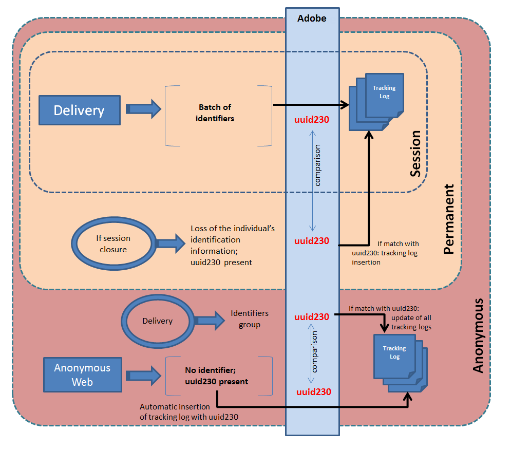

# 웹 추적 모드{#web-tracking-mode}

Adobe Campaign을 사용하면 애플리케이션에서 추적 로그를 처리하는 방법을 정의하는 웹 추적 모드를 선택할 수 있습니다.

다음 세 가지 웹 추적 모드를 사용할 수 있습니다.&quot; **세션 추적&quot;**,**&quot;영구 추적&quot;** 및 **&quot;익명 추적&quot;**.


각 모드에는 특정 특성이 있습니다. &quot;영구&quot; 웹 추적 모드에는 &quot;세션&quot; 웹 추적 모드의 특성이 포함되고 &quot;익명&quot; 모드에는 &quot;영구&quot; 및 &quot;세션&quot; 모드의 특성이 포함됩니다.

>[!CAUTION]
>
>&quot;Leads&quot; 패키지가 활성화된 경우 기본적으로 &quot;익명&quot; 웹 추적 모드가 활성화됩니다. 다른 모든 경우 &quot;세션&quot; 웹 추적 모드는 기본적으로 활성화되어 있습니다.
>
>언제든지 인스턴스 배포 마법사에서 기본 모드를 변경할 수 있습니다.

영구 웹 **또는** 익명 **** 추적 모드를 사용하는 경우 추적 테이블(trackingLogXXX)의 &quot;sourceID&quot; 열(uuid230)에 인덱스를 추가해야 합니다.

1. 영구 추적을 통해 관련 추적 테이블을 식별합니다.
1. 다음 라인을 추가하여 이러한 테이블과 일치하는 스키마를 확장합니다.

```
<dbindex name="sourceId">
 <keyfield xpath="@sourceId"/>
</dbindex>
```

**영구** 및 **익명** 웹 추적 모드에는 다음 두 가지 옵션이 있습니다.강제 **배달** 및 **마지막 배달**.

강제 **배달** 옵션을 사용하면 추적 중에 배달 식별자(@jobid)를 지정할 수 있습니다.

마지막 **배달** 옵션을 사용하면 현재 추적 로그를 마지막으로 추적한 배달에 연결할 수 있습니다.

**세션 웹 추적 특성:**

이 모드에서는 세션 쿠키가 있는 사용자에 대한 추적 로그를 만듭니다. Adobe Campaign에서 보낸 이메일의 URL을 클릭함으로써 다음 정보를 추적할 수 있게 된 사람들입니다.

* 배달 ID
* 연락처 ID
* 배달 로그
* 영구 쿠키(uuid230)
* 추적 URL
* 추적 로그 날짜

이 웹 추적 모드에서는 정보의 일부가 누락된 경우 애플리케이션에 추적 로그가 생성되지 않습니다.

이 모드는 볼륨(trackingLog 테이블의 레코드 수 제한)과 계산(조정 없음)으로 경제적입니다.

**영구 웹 추적 모드의 특성:**

이 웹 추적 모드에서는 영구 uuid230 쿠키가 있는지 기준으로 추적 로그를 만들 수 있습니다. 방문자가 세션을 종료하는 경우 Adobe Campaign은 영구 쿠키를 사용하여 이전 추적 로그에서 해당 사용자에 대한 정보를 복구합니다. 현재 세션의 uuid230이 추적 테이블에 이미 저장된 uuid230과 동일한 값을 갖는 경우 Adobe Campaign은 추적 로그를 다시 삽입합니다.

즉, 방문자가 uuid230 값에 대한 조정을 활성화하려면 Adobe Campaign에서 이전에 식별되어야 합니다.

기본적으로 이전 추적 로그의 검색은 &quot;trackingLog&quot; 테이블에서 수행됩니다. 리드 패키지가 활성화된 경우 &quot;trackingLog&quot; 테이블을 검색하기 전에 Adobe Campaign은 이전 추적 로그 레코드에 대해 &quot;incomingLead&quot; 테이블을 검색합니다.

이 모드는 로그 조정 중에 계산하면 비용이 많이 듭니다.

**익명의 웹 추적 모드의 특성:**

이 웹 추적 모드를 사용하면 Adobe Campaign에서 익명 검색에 연결된 추적 로그를 검색할 수 있습니다. 추적 로그는 추적된 URL에서 클릭할 때마다 자동으로 생성됩니다. 이 로그에는 uuid230의 값만 있습니다. 마케팅 캠페인 동안 모든 ID 정보와 함께 추적 로그가 자동으로 생성됩니다(세션 추적 참조). Adobe Campaign은 이 마케팅 캠페인에 대한 추적 로그의 값과 같은 &quot;uuid230&quot; 값을 이전 로그에 자동으로 검색합니다. 동일한 값이 발견되면 마케팅 캠페인 추적 로그의 모든 정보와 함께 모든 이전 추적 로그가 입력됩니다.

이 모드는 계산 및 볼륨 측면에서 가장 비용이 많이 듭니다.

>[!NOTE]
>
>패키지가 설치되어 있는 **[!UICONTROL Leads]** 경우 활동 테이블(**crm:incomingLead)에 대해 동일한 작업을 수행해야 합니다**.

다음 스키마는 세 가지 웹 추적 모드의 모든 기능을 요약합니다.



**마지막 전달을 기반으로 하는 영구 웹 추적 예:**

플로렌스는 배달을 받고 이메일을 열고 링크를 클릭하고 소매 사이트에서 찾아보지만 구매는 하지 않습니다. 다음 날, 플로렌스는 소매 사이트로 돌아가 찾아보고 구매합니다. 영구 웹 추적(마지막 배달)이 활성화되어 있으므로, 두 번째 방문에 대한 모든 로그가 이전 날짜로 전송된 배달과 연결됩니다.
