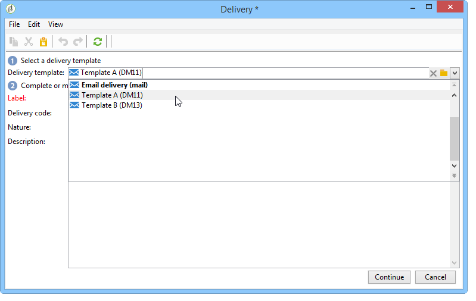

# 워크플로우 {#step-4--configuring-the-deliveries-in-the-workflow}에서 배달 구성

다음 단계는 제공을 구성하는 것입니다. 이전 단계에서 생성된 3개의 모집단 중 하나로 지정됩니다.[단계 2:모집단 샘플 구성](#step-2--configuring-population-samples). 처음 두 게재는 서로 다른 컨텐트를 인구 A와 B로 보낼 수 있도록 합니다. 세 번째 배달은 A와 B를 전혀 받지 않은 모집단에 대해 지정됩니다. 컨텐트는 스크립트로 계산되며 가장 높은 공개 비율의 점수가 지정된 A 또는 B와 동일합니다. 배달 A와 B의 결과를 확인하려면 세 번째 배달을 위해 대기 기간을 구성해야 합니다. 세 번째 배달에는 **[!UICONTROL Wait]** 활동이 포함되어 있는 이유입니다.

1. **[!UICONTROL Split]** 활동으로 이동하여 채우기 A에 대한 전환을 워크플로우에 이미 있는 이메일 배달 중 하나에 연결합니다.

   

1. 배달을 두 번 클릭하여 엽니다.
1. 드롭다운 목록을 사용하여 배달 A에 사용할 템플릿을 선택합니다.

   

1. **[!UICONTROL Continue]**&#x200B;을 클릭하여 배달을 표시한 다음 저장합니다.

   

1. 채우기 B로 지정되는 **[!UICONTROL Split]** 활동의 전환을 두 번째 이메일 배달에 연결합니다.

   

1. 배달을 열고 배달 B에서 템플릿을 선택한 다음 배달을 저장합니다.

   

1. 나머지 모집단에 대한 전환을 **[!UICONTROL Wait]** 활동에 연결합니다.

   

1. **[!UICONTROL Wait]** 활동을 열고 5일 대기 기간을 구성합니다.

   

1. **[!UICONTROL Wait]** 활동을 **[!UICONTROL JavaScript code]** 활동에 연결합니다.

   
