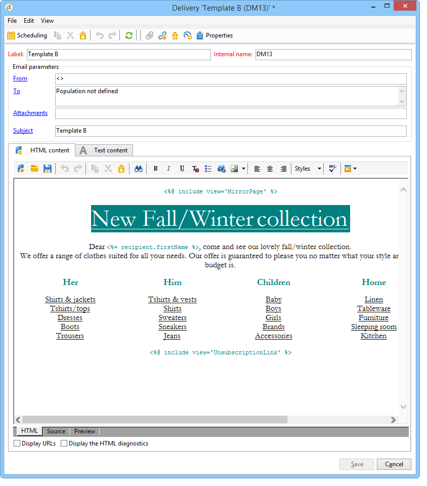

# 배달 템플릿 만들기 {#step-3--creating-two-delivery-templates}

이제 2개의 배달 템플릿을 생성하려고 합니다. 각 템플릿은 **[!UICONTROL Split]** 활동에 연결된 **[!UICONTROL Email delivery]** 활동에서 참조됩니다. 자세한 정보는 이 [섹션](../../delivery/using/about-templates.md)을 참조하십시오.

1. **[!UICONTROL Resources > Delivery template]** 폴더로 이동합니다.
1. **[!UICONTROL Email]** 배달 템플릿을 복제합니다.

   

1. 배달 A에 사용할 컨텐츠를 만듭니다.

   

1. 배달 B에 대한 템플릿을 만들려면 이 프로세스를 반복합니다.

   
