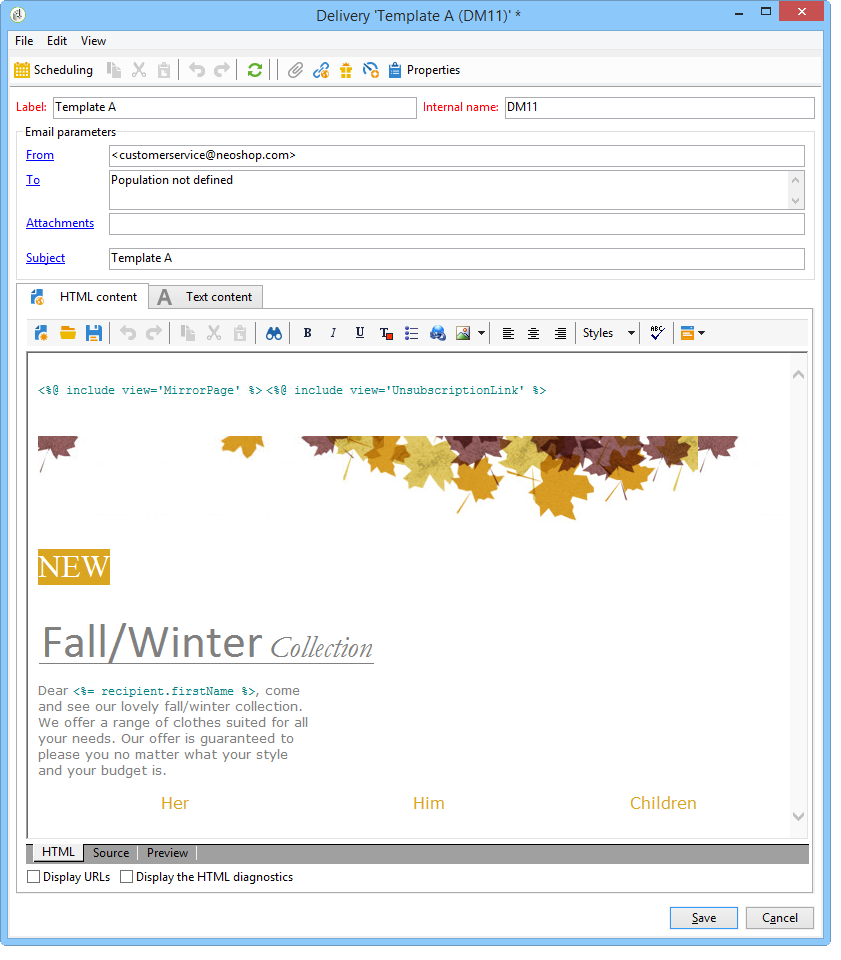

# AB 테스트: 게재 템플릿 만들기 {#step-3--creating-two-delivery-templates}

이제 두 개의 게재 템플릿을 만들겠습니다. 각 템플릿은 **[!UICONTROL Split]** 활동에 연결된 **[!UICONTROL Email delivery]** 활동에서 참조됩니다. [Campaign v8 설명서](https://experienceleague.adobe.com/docs/campaign/campaign-v8/send/create-templates.html){target="_blank"}를 참조하세요.

1. **[!UICONTROL Resources > Delivery template]** 폴더를 찾습니다.
1. **[!UICONTROL Email]** 게재 템플릿을 복제합니다.

   

1. 게재 A에 사용할 콘텐츠를 만듭니다.

   

1. 이 프로세스를 반복하여 게재 B에 대한 템플릿을 만듭니다.

   

이제 워크플로우에서 게재를 구성할 수 있습니다. [자세히 알아보기](a-b-testing-uc-configuring-deliveries.md).
