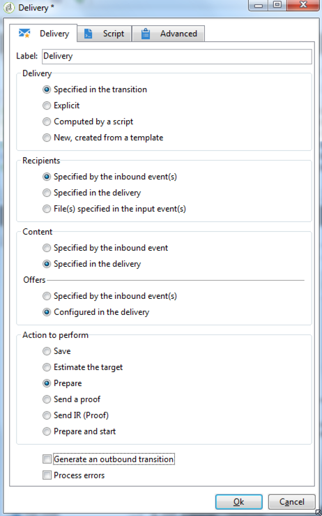

# AB 테스트: 최종 게재 정의 {#step-6--defining-the-final-delivery}

A/B 테스트 승자를 선택하는 스크립트가 만들어지면 최종 게재의 매개 변수를 정의할 수 있습니다.

1. **[!UICONTROL JavaScript code]** 활동을 나머지 **[!UICONTROL Delivery]** 활동에 연결합니다.
1. **[!UICONTROL Delivery]** 활동을 엽니다.
1. 이 활동으로 워크플로우를 완료하려면 **[!UICONTROL Generate an outbound transition]** 옵션을 선택 취소하십시오.
1. 다른 옵션은 기본값으로 둡니다.

   

**[!UICONTROL Javascript Code]** 활동을 통해 정의된 전환에 지정된 게재를 준비하면 다음 단계에 설명된 대로 이를 승인하고 전송을 시작할 수 있습니다.

이제 워크플로우를 시작할 수 있습니다. [자세히 알아보기](a-b-testing-uc-start-workflow.md).
