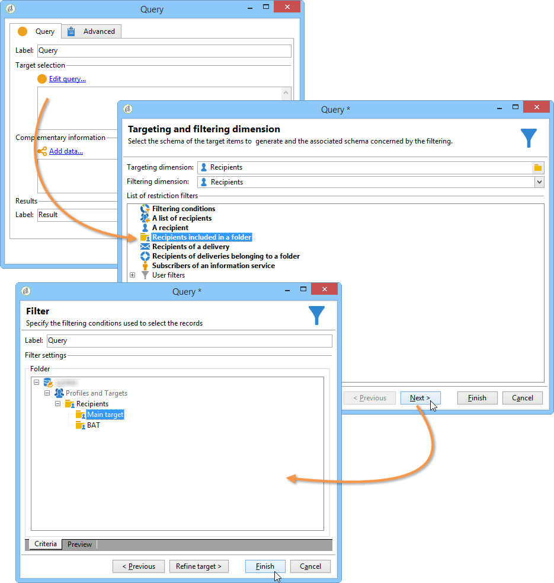

# 모집단 샘플 구성 {#step-2--configuring-population-samples}

## 쿼리 활동 구성 {#configuring-the-query-activity}

* 를 두 번 클릭합니다. **[!UICONTROL Query]** 활동.

   

* 다음을 클릭합니다. **[!UICONTROL Edit query]** 타겟팅할 수신자를 연결하고 선택합니다.

   

* 링크 **[!UICONTROL Query]** 에 대한 활동 **[!UICONTROL Split]** 활동.

   

## 분할 활동 구성 {#configuring-the-split-activity}

이 활동을 사용하면 게재 A를 받는 모집단과 게재 B를 받는 모집단과 나머지 모집단을 만들 수 있습니다. 무작위 선택을 사용하면 각 게재의 모집단 일부를 타깃팅할 수 있습니다.

1. 모집단 A 만들기:

   * 를 두 번 클릭합니다. **[!UICONTROL Split]** 활동.

      

   * 기존 탭에서 레이블을 모집단 A로 변경합니다.

      

   * 다음 항목 선택 **[!UICONTROL Limit the selected records]** 옵션을 선택합니다.

      

   * 다음을 클릭합니다. **[!UICONTROL Edit]** 링크, 선택 **[!UICONTROL Activate random sampling]**, 및 클릭 **[!UICONTROL Next]**.

      

   * 임계값을 10%로 설정한 다음 **[!UICONTROL Finish]**.

      

1. 모집단 B 만들기:

   * 클릭 **[!UICONTROL Add]** 모집단 B에 대한 새 탭을 만듭니다.

      

   * 이전처럼 모집단을 10%로 제한합니다.

      

1. 나머지 모집단 만들기:

   * **[!UICONTROL General]** 탭으로 이동합니다. 

      

   * **[!UICONTROL Generate complement]**&#x200B;을(를) 선택합니다.

      

   * 이 모집단에 A와 B가 모두 포함되지 않도록 레이블을 변경하고 **[!UICONTROL OK]** 활동을 닫습니다.

      

이제 두 개의 게재 템플릿을 만들 수 있습니다. [자세히 알아보기](a-b-testing-uc-delivery-templates.md)).
