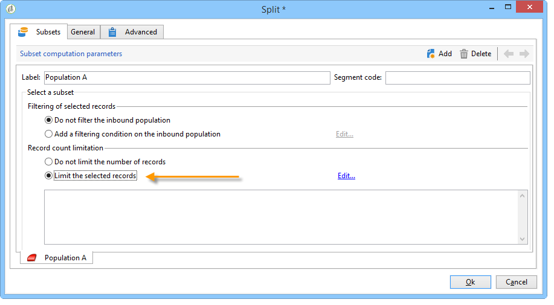

# 모집단 샘플 구성 중 {#step-2--configuring-population-samples}

## 쿼리 활동 {#configuring-the-query-activity} 구성

* **[!UICONTROL Query]** 활동을 두 번 클릭합니다.

   

* **[!UICONTROL Edit query]** 링크를 클릭하고 타깃팅할 수신자를 선택합니다.

   

* **[!UICONTROL Query]** 활동을 **[!UICONTROL Split]** 활동에 연결합니다.

   

## 분할 활동 구성 {#configuring-the-split-activity}

이 활동을 통해 다음과 같은 여러 모집단을 만들 수 있습니다.배달 A를 받는 사람, 배달 B를 받는 사람 및 나머지 모집단을 말합니다. 임의 선택을 사용하면 각 게재의 모집단의 일부만 타깃팅할 수 있습니다.

1. 모집단 A 만들기:

   * **[!UICONTROL Split]** 활동을 두 번 클릭합니다.

      

   * 기존 탭에서 레이블을 인구 A로 변경합니다.

      

   * **[!UICONTROL Limit the selected records]** 옵션을 선택합니다.

      

   * **[!UICONTROL Edit]** 링크를 클릭하고 **[!UICONTROL Activate random sampling]**&#x200B;을 선택한 다음 **[!UICONTROL Next]**&#x200B;를 클릭합니다.

      

   * 임계값을 10%로 설정한 다음 **[!UICONTROL Finish]**&#x200B;을 클릭합니다.

      

1. 모집단 생성 B:

   * **[!UICONTROL Add]**&#x200B;을 클릭하여 모집단 B에 대한 새 탭을 만듭니다.

      

   * 모집단 수를 이전에 비해 10%로 제한합니다.

      

1. 나머지 채우기 만들기:

   * **[!UICONTROL General]** 탭으로 이동합니다. 

      

   * **[!UICONTROL Generate complement]**&#x200B;을(를) 선택합니다.

      

   * 이 모집단에는 A와 B가 포함되지 않도록 레이블을 변경하고 **[!UICONTROL OK]**&#x200B;을 클릭하여 활동을 닫습니다.

      
