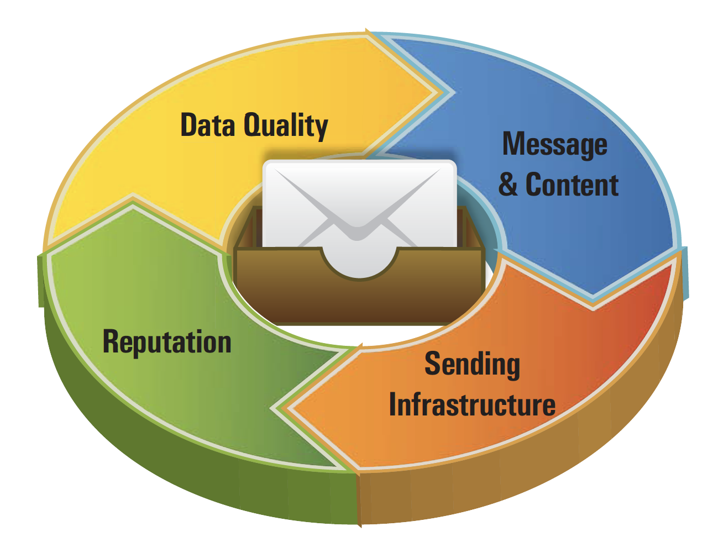

# 게재 기능 기본 정보{#about-deliverability}

**전달 능력은** 바운싱 없이 수신자의 받은 편지함에 도달하거나 스팸으로 표시되지 않는 캠페인의 성공을 측정하는 데 포함됩니다.

Adobe Campaign은 플랫폼의 전달 성능을 추적하는 특정 수의 도구를 제공합니다. 또한 이 섹션에서는 전달 능력을 관리 및 최적화할 때 고려해야 하는 주요 원칙을 집중적으로 설명합니다.

## 구성 {#configuration}

이 기능은 Adobe Campaign의 전용 패키지를 통해 사용할 수 있습니다. 사용하려면 이 패키지를 설치해야 합니다. 완료되면 패키지를 고려하기 위해 서버를 다시 시작합니다.
* 호스팅 및 하이브리드 클라이언트의 경우 **전달 능력 모니터링은 Adobe 기술 지원 및 컨설턴트를 통해 사용자 인스턴스에** 구성됩니다. 자세한 내용은 Adobe 계정 담당자에게 문의하십시오.

* 온-프레미스 설치의 경우 **[!UICONTROL Deliverability monitoring (Email Deliverability)]** > **[!UICONTROL Tools]** > **[!UICONTROL Advanced]** 메뉴를 통해 **[!UICONTROL Import package]** 패키지를 설치해야 합니다. 자세한 내용은 Campaign Classic 표준 패키지 [설치를 참조하십시오](../../installation/using/installing-campaign-standard-packages.md).

Adobe Campaign Classic에서 **배달** 기능 모니터링은 **[!UICONTROL Refresh for deliverability]** 워크플로우에 의해 관리됩니다. 기본적으로 모든 인스턴스에 설치되며 바운스 메일 자격 규칙 목록, 도메인 목록 및 MX 목록을 초기화할 수 있습니다. 패키지가 설치되면 이 워크플로우는 **[!UICONTROL Deliverability monitoring (Email Deliverability)]** 매일 밤 실행되고 규칙 목록을 정기적으로 업데이트하고 플랫폼 제공 기능을 적극적으로 관리할 수 있습니다.

## 배경 {#background}

이메일 전달 기능은 마케터에게 수 천 건의 메시지를 전송하든 수 십억 건의 메시지를 전송하든 중요한 문제를 제시합니다. 메시지 5개 중 1개는 받은 편지함이나 수신자에게 도달하지 않습니다.

한때 IT 부서에서 &quot;기술적 문제&quot;로 언급되었던 이메일 전달 능력은 마케팅 분야의 높은 수준으로 계속 증가하고 있습니다. 이는 지능적인 마케터가 많은 요소가 본질적으로 기술적인 요소이지만, 전달 능력은 궁극적으로 엄청난 매출 의미를 갖는 비즈니스 문제라고 인식하기 때문입니다.

이메일 마케팅 단계를 고려합니다. 전달 능력은 수신한 메시지 수를 결정하며, 이는 차례로 단계의 각 후속 단계에 영향을 줍니다. 수신한 이메일이 적을수록 열람이 줄고 클릭 수가 줄며 전환율도 줄어듭니다. **대규모 데이터베이스를 보유한 기업에게 있어 평균 전달과 뛰어난 전달성의 차이는 수십만 달러에서 수백만 달러의 매출을 올릴 수 있습니다.**

마케터는 평균(80%) 제공 가능성을 계산하여 상당한 전환율(달러)을 책정하고 있습니다.

이메일 배달은 정확히 무엇입니까? 마케터가 어떻게 고객 확보를 확대하고 이메일 캠페인의 더 많은 결과를 짜내기 위해 전달 비율을 높일 수 있습니까?

이메일 전달 능력은 메시지 수신, 이메일 주소를 통해, 짧은 시간 내에, 그리고 컨텐츠 및 형식 측면에서 예상되는 품질을 결정하는 일련의 특성입니다. 이러한 특성은 다음 네 가지 주요 카테고리로 분류됩니다.데이터 품질, 메시지 및 컨텐츠, 전송 인프라 및 명성을 높일 수 있습니다. 이들은 성공적인 이메일 전달 프로그램의 기반이 됩니다. 이 개요는 이메일 전달 성공의 4가지 기본 사항을 간략히 설명하고, 받은 편지함에 도달하고 이메일 마케팅 프로그램의 매출을 증대하기 위한 모범 사례를 제공합니다.

<!---->
