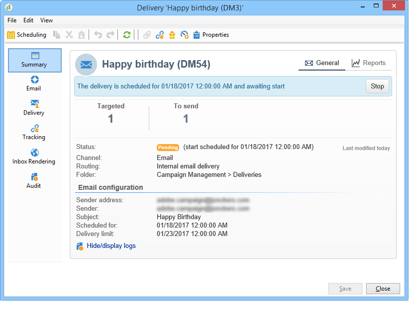

# 배달 정보 액세스{#accessing-deliveries-information}

## 배달 목록 액세스 {#accessing-the-list-of-deliveries}

배달 목록에 액세스하려면 **[!UICONTROL Campaigns]** 우주로 이동하고 **[!UICONTROL Deliveries]** 링크를 클릭합니다.

탐색기 [보기를](../../platform/using/adobe-campaign-workspace.md#about-adobe-campaign-explorer)사용하는 경우 트리의 **[!UICONTROL Campaign management > Deliveries]** 노드를 통해 모든 게재에 액세스할 수 있습니다.

>[!NOTE]
>
>Adobe Campaign 작업 영역은 [이 섹션에](../../platform/using/adobe-campaign-workspace.md)있습니다.

이 페이지에서는 게재의 전체 보기에 액세스할 수 있습니다.데이터베이스의 모든 배달을 표시합니다. 상태, 성공률 및 수정 날짜를 볼 수 있습니다.

>[!NOTE]
>
>정보 필터링이 [이 섹션에](../../platform/using/filtering-options.md)제공됩니다.

배달 마법사를 사용하면 배달을 구성하고 승인 프로세스를 실행하고 전송할 수 있습니다. 마법사의 내용은 통신 채널(이메일, 모바일, 푸시, DM) 및 운영자 권한에 따라 다릅니다.

목록에서 배달을 조작하려면 배달을 클릭합니다. 새 창에서 열리고 배달을 확인하거나 일시 중지할 수 있습니다. 예를 들어

배달 주기의 단계에 따라 가능한 주 상태는 다음과 같습니다.

* 취소됨
* 실패
* 보류 중
* 완료
* 일시 중지됨
* 다시 시도 보류 중
* 진행 중
* 전달 준비
* 준비 중
* Target 계산
* 편집 중

각 상태에는 고유의 색상과 레이블이 있습니다.

단추 옆의 드롭다운 목록을 사용하여 **[!UICONTROL Create]** 해당 상태에 따라 배달을 필터링할 수 있습니다.

## 배달 달력 액세스 {#accessing-the-delivery-calendar}

배달 달력에 액세스하려면 **[!UICONTROL Campaign]** 우주로 이동하고 **[!UICONTROL Campaign calendar]** 링크를 클릭합니다. 이 달력은 시간에 따른 캠페인 분류를 표시합니다. 월, 주 또는 일별로 디스플레이를 개인화할 수 있습니다.

게재의 이름을 클릭하여 게시에 대한 주요 정보를 표시합니다. 필요한 경우 아이콘을 클릭하여 캠페인을 열 수도 **[!UICONTROL Open]**&#x200B;있습니다.

## 배달 처리량 정보 액세스 {#accessing-deliveries-throughput-information}

페이지에 있는 정보는 플랫폼의 모든 전달에 **[!UICONTROL Delivery throughput]** 관한 것입니다. 메시지가 전달되는 속도를 측정하기 위해 기준은 시간당 전송된 메시지 수와 메시지 크기(초당 비트 수)입니다. 아래 예에서 첫 번째 그래프는 성공적인 게재의 파란색과 잘못된 배달 수를 주황색으로 표시합니다.

처리량이 계산되는 시간 슬롯을 선택할 수 있습니다. 이렇게 하려면 드롭다운 목록에서 값을 선택한 다음 을 클릭합니다 **[!UICONTROL Refresh]**.

>[!NOTE]
>
>호스팅 또는 하이브리드 설치의 경우, 향상된 MTA로 업그레이드한 경우, **[!UICONTROL Delivery throughput]** 페이지가 이메일 수신자에 대한 처리량을 더 이상 표시하지 않습니다. Adobe Campaign에서 Enhanced MTA로 메시지 전달에 대한 처리량 속도를 표시합니다.
>
>Adobe Campaign 향상된 MTA에 대한 자세한 내용은 이 [문서를](https://helpx.adobe.com/campaign/kb/campaign-enhanced-mta.html)참조하십시오.