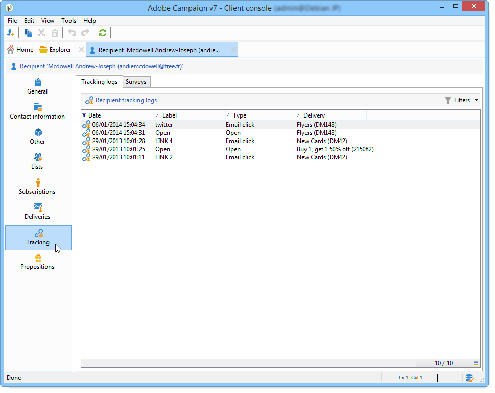

# 추적 로그 액세스{#accessing-the-tracking-logs}

게재를 전송하고 추적을 활성화하면 **[!UICONTROL Tracking]** 기술 워크플로우가 추적 데이터 검색을 담당합니다. 기본적으로 시간별로 실행됩니다.

이 정보는 다음 예와 같이 게재가 타깃팅한 수신자의 프로필 탭에 표시됩니다. **[!UICONTROL Tracking]**

배달 **[!UICONTROL Tracking]** 탭을 통해서도 액세스할 수 있습니다.

>[!NOTE]
>
>게재의 **[!UICONTROL Tracking]** 탭이 표시되지 않으면 추적이 활성화되지 않은 것입니다. 이 [섹션을](../../delivery/using/how-to-configure-tracked-links.md)참조하십시오.
