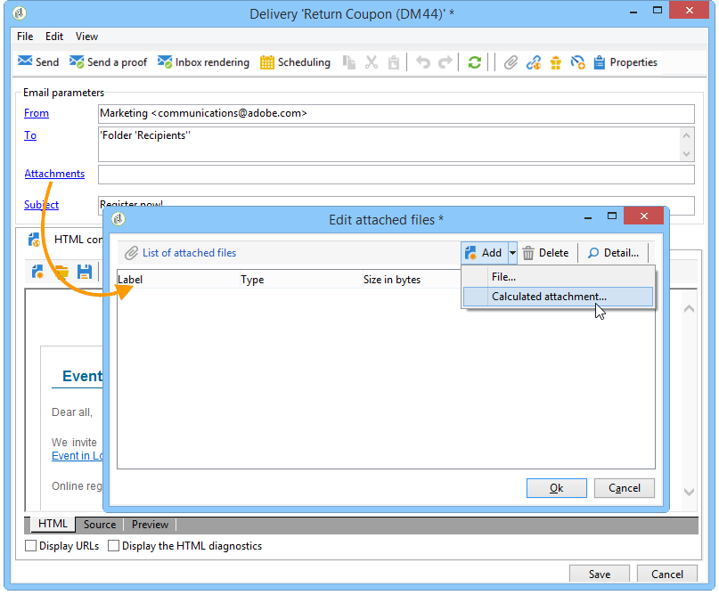

# 파일 첨부{#attaching-files}

## 이메일 첨부 파일 정보 {#about-email-attachments}

하나 이상의 파일을 이메일 배달에 첨부할 수 있습니다. 두 가지 가능한 경우가 있습니다.

* 파일을 선택하고 그대로 전달에 첨부합니다.
* 각 수신자에 대해 첨부 파일의 컨텐츠를 개인화합니다. 이 경우 **계산된 첨부 파일을**&#x200B;만들어야 합니다.첨부 파일의 이름은 받는 사람에 따라 각 메시지에 대한 배달 시 계산됩니다. 또한 가변 디지털 인쇄 옵션이 있는 경우 컨텐츠를 개인화하여 제공할 때 PDF 포맷으로 변환할 **수** 있습니다.

>[!NOTE]
>
>이러한 유형의 구성은 일반적으로 배달 템플릿에서 수행됩니다. 자세한 내용은 템플릿 [정보를 참조하십시오](../../delivery/using/about-templates.md).

## 로컬 파일 첨부 {#attaching-a-local-file}

로컬 파일을 전달에 첨부하려면 아래 단계를 따르십시오.

>[!NOTE]
>
>여러 파일을 전달에 첨부할 수 있습니다. 첨부 파일은 모든 포맷으로, 압축 형식으로 포함될 수 있습니다.

1. 링크를 **[!UICONTROL Attachments]** 클릭합니다.
1. 단추를 **[!UICONTROL Add]** 클릭한 다음 **[!UICONTROL File...]** 을 클릭하여 배달에 첨부할 파일을 선택합니다.

배달 **[!UICONTROL Attachments]** 필드에 파일을 직접 드래그하여 놓거나 배달 마법사 도구 모음에서 **[!UICONTROL Attach]** 아이콘을 사용할 수도 있습니다.

1. 파일을 선택하면 즉시 서버에 업로드되어 배달 시 사용할 수 있습니다. 필드에 나열됩니다 **[!UICONTROL Attachments]** .

## 계산된 첨부 파일 만들기 {#creating-a-calculated-attachment}

계산된 첨부 파일을 만들 때 각 메시지를 분석하거나 전달하는 동안 첨부 파일의 이름을 계산할 수 있으며 받는 사람에 따라 달라질 수 있습니다. 또한 개인화되고 PDF로 변환할 수 있습니다.

개인화된 첨부 파일을 만들려면 다음 단계를 수행합니다.

1. 링크를 **[!UICONTROL Attachments]** 클릭합니다.
1. 단추를 **[!UICONTROL Add]** 클릭한 다음 **[!UICONTROL Calculated attachment]**&#x200B;선택합니다.
1. 드롭다운 목록에서 계산 유형을 **[!UICONTROL Type]** 선택합니다.

다음 옵션을 사용할 수 있습니다.

* **배달 템플릿을 만들 때 파일 이름이 지정됩니다.**
* **각 메시지를 전달하는 동안 파일의 내용이 개인화되고 PDF로 변환됩니다**
* **파일 이름은 배달 분석 중에 계산됩니다(수신자 프로필에 따라 달라질 수 없음).**
* **파일 이름은 각 수신자에 대한 배달 시 계산됩니다(수신자에 따라 달라질 수 있음).**

### 로컬 파일 첨부 {#attach-a-local-file}

첨부 파일이 로컬 파일인 경우 옵션을 선택합니다. **[!UICONTROL File name is specified when creating the delivery template]** Adobe 파일이 로컬에서 선택되고 서버에 업로드됩니다. 아래 단계를 따르십시오.

1. 필드에서 업로드할 파일을 **[!UICONTROL Local file]** 선택합니다.
1. 필요한 경우 레이블을 지정합니다. 메시지 시스템에서 볼 때 레이블은 파일 이름을 대체합니다. 아무 것도 지정하지 않으면 기본적으로 파일 이름이 사용됩니다.

   

1. 필요한 경우 을 선택한 **[!UICONTROL Upload file on the server]**&#x200B;다음 을 클릭하여 전송을 **[!UICONTROL Update on server]** 시작합니다.

   

   그런 다음 서버에서 파일을 사용하여 이 템플릿에서 만든 다른 배달물에 연결할 수 있습니다.

### 개인화된 메시지 첨부 {#attach-a-personalized-message}

이 옵션을 **[!UICONTROL The file content is personalized and converted into PDF format at the time of delivery for each message]** 사용하면 원하는 수신자의 성 및 이름과 같은 개인화 필드를 사용하여 벌금을 선택할 수 있습니다.

이 유형의 첨부 파일에 대해 다음 구성 단계를 적용합니다.

1. 업로드할 파일을 선택합니다.

   >[!NOTE]
   >
   >소스 파일은 LibreOffice에서 만들어야 합니다. 인스턴스는 [이 섹션에](../../installation/using/before-starting.md)설명된 사전 요구 사항을 준수하도록 구성해야 합니다.

1. 필요한 경우 레이블을 지정합니다.
1. 을 **[!UICONTROL Upload file on the server]**&#x200B;선택한 다음 을 클릭하여 전송을 **[!UICONTROL Update on server]** 시작합니다.
1. 미리 보기를 표시할 수 있습니다. 이렇게 하려면 수신자를 선택합니다.

   

1. 전달을 분석한 다음 시작합니다.

   각 수신자는 전달에 첨부된 개인화된 PDF를 받습니다.

   

### 계산된 파일 첨부 {#attach-a-calculated-file}

납품 준비 중에 첨부 이름을 계산할 수 있습니다. 이렇게 하려면 옵션을 선택합니다 **[!UICONTROL The file name is calculated during delivery analysis (it cannot depend on the recipient)]**.

>[!NOTE]
>
>이 옵션은 전달이 외부 프로세스 또는 워크플로우에 의해 전송되는 경우에만 사용됩니다.

1. 첨부 파일에 적용할 레이블을 지정합니다.
1. 파일의 액세스 경로와 정확한 이름을 정의 창에서 지정합니다.

   >[!CAUTION]
   >
   >파일이 서버에 있어야 합니다.

   

1. 분석 후 전달 시작

   분석 로그에서 파일 이름 계산을 볼 수 있습니다.

   

### 개인화된 파일 첨부 {#attach-a-personalized-file}

첨부 파일을 선택할 때 옵션을 선택할 수 **[!UICONTROL The file name is calculated during delivery for each recipient (it can depend on the recipient)]**&#x200B;있습니다. 그런 다음 수신자의 개인화 데이터를 전송할 파일 이름으로 매핑할 수 있습니다.

>[!NOTE]
>
>이 옵션은 전달이 외부 프로세스 또는 워크플로우에 의해 전송되는 경우에만 사용됩니다.

1. 첨부 파일에 적용할 레이블을 지정합니다.
1. 파일의 액세스 경로와 정확한 이름을 정의 창에서 지정합니다. 파일 이름이 개인화된 경우 관련 값에 개인화 필드를 사용할 수 있습니다.

   

   >[!CAUTION]
   >
   >파일이 서버에 있어야 합니다.

1. 분석 후 전달 시작

   아래 예에서, 첨부된 파일은 병합 필드를 사용하여 정의된 이름으로 선택되었습니다.

   

### 첨부 파일 설정 {#attachment-settings}

처음 두 옵션에 대해 적절한 옵션을 **[!UICONTROL Upload file on the server]** 선택하여 선택할 수 있습니다. 이 **[!UICONTROL Update the file on the server]** 링크를 통해 업로드를 시작할 수 있습니다.

파일이 서버에 업로드되었다는 메시지가 표시됩니다.

파일을 변경하면 경고 메시지가 표시됩니다.

이 **[!UICONTROL Advanced]** 탭에서는 첨부 파일에 고급 옵션을 정의할 수 있습니다.

* 첨부된 파일을 모든 수신자에게 보내지 않도록 필터 옵션을 정의할 수 있습니다. 이 옵션은 JavaScript에 입력해야 하는 수신자 선택 스크립트를 정의하는 데 사용되는 입력 필드를 **[!UICONTROL Enable filtering of recipients who will receive the attachment]** 활성화합니다.
* 파일 이름을 스크립팅하여 개인화할 수 있습니다.

   창에 텍스트를 입력하고 드롭다운 목록에서 사용할 수 있는 개인화 필드를 사용합니다. 다음 예제에서는 파일 이름이 오늘 날짜와 수신자 이름을 포함하도록 개인화됩니다.

   
