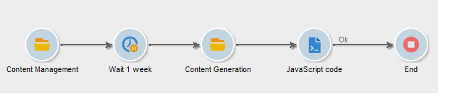
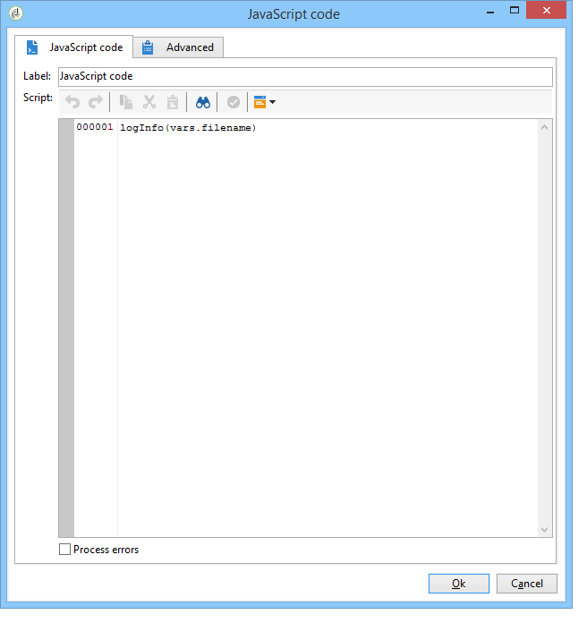

# 워크플로우 자동화{#automating-via-workflows}


## 콘텐츠 관리 활동 {#content-management-activity}

Adobe Campaign 클라이언트 인터페이스를 통해 구성된 워크플로우를 사용하여 컨텐츠 만들기, 편집 및 게시를 자동화할 수 있습니다.

다음 **콘텐츠 관리** 활동은 를 통해 액세스할 수 있습니다 **[!UICONTROL Tools]** 워크플로우 다이어그램의 도구 모음

활동 속성은 다음 네 단계로 분류됩니다.

* **[!UICONTROL Content]** : 기존 컨텐츠를 입력하거나 컨텐츠를 만들 수 있습니다.
* **[!UICONTROL Update content]** : 에서는 컨텐츠의 제목을 수정하거나 XML 데이터 유량을 통해 컨텐츠를 업데이트할 수 있습니다.
* **[!UICONTROL Action to execute]** : 컨텐츠를 저장하거나 생성할 수 있습니다.
* **[!UICONTROL Transition]** : 출력 전환을 생성할 것인지 여부를 선택하고 이름을 지정할 수 있습니다.


### 콘텐츠 {#content}

* **전환에서 지정합니다.**

   사용할 컨텐츠는 이전에 만들었습니다. 프로세스는 들어오는 이벤트에서 전파한 콘텐츠 인스턴스를 고려합니다. 컨텐츠 식별자는 이벤트의 &quot;contentId&quot; 변수를 통해 액세스합니다.

* **명시적**

   이전에 만든 콘텐츠를 선택할 수 있습니다.

* **스크립트로 계산됨**

   JavaScript 템플릿을 기반으로 컨텐츠 인스턴스를 선택합니다. 평가할 코드를 사용하여 컨텐츠 식별자를 검색할 수 있습니다.

* **게시 템플릿을 통해 새로 만들기**

   게시 템플릿을 통해 새 콘텐츠를 만듭니다. 컨텐츠 인스턴스는 채워진 &quot;문자열&quot; 폴더에 저장됩니다.

### 콘텐츠 업데이트 {#update-the-content}

* **주제**

   게시할 때 게재 작업의 제목을 수정할 수 있습니다.

* **XML 피드에서 데이터에 액세스**

   컨텐츠는 외부 소스의 XML 피드에서 업데이트됩니다. 데이터를 다운로드하려면 URL을 입력해야 합니다.

   XSL 스타일시트를 사용하여 들어오는 XML 데이터를 변환할 수 있습니다.

### 실행할 작업 {#action-to-execute}

* **저장**

   만들거나 수정한 콘텐츠를 저장합니다. 저장된 컨텐츠의 식별자는 나가는 이벤트의 &quot;contentId&quot; 변수에 전파됩니다.

* **생성**

   &quot;파일&quot; 유형 게시를 사용하여 각 변형 템플릿의 출력 파일을 생성합니다. 다음 매개 변수를 사용하여 생성된 각 파일에 대해 발신 전환이 활성화됩니다. &quot;contentId&quot; 변수에 저장된 컨텐츠의 식별자 및 &quot;filename&quot; 변수에 있는 파일 이름입니다.

### 전환 {#transition}

다음 **출력 전환 생성** 옵션을 사용하면 출력 전환을 **[!UICONTROL Content management]** 활동을 사용하여 새 활동을 워크플로우 실행에 연결할 수 있습니다. 이 옵션을 선택한 후 전환 레이블을 입력합니다.

## 예제 {#examples}

### 콘텐츠 만들기 및 전달 자동화 {#automating-content-creation-and-delivery}

다음 예제에서는 컨텐츠 블록의 작성 및 배달을 자동화합니다.


콘텐츠는 &quot;콘텐츠 관리&quot; 활동을 통해 구성됩니다.


게시 모델 및 컨텐츠 문자열 폴더를 통해 새 컨텐츠 인스턴스가 생성됩니다.

이 예제에서는 배달 주제를 과부하했습니다. 에 입력된 대신 고려됩니다. **[!UICONTROL Delivery]** 템플릿.

입력한 URL에서 나오는 XML 피드에 의해 컨텐츠가 자동으로 채워집니다.

```
<?xml version='1.0' encoding='ISO-8859-1'?>
<book name="Content automation test" date="2008/06/08" language="eng" computeString="Content automation test">
  <section id="1" name="Introduction">
    <page>Introduction to input forms.</page>
  </section>
</book>
```

데이터 형식이 게시 템플릿(**cus:책** 예제에서는 입니다. a **`<section>`** 요소는 다음으로 대체해야 합니다 **`<chapter>`** 요소를 생성하지 않습니다. 필요한 변경을 수행하려면 &quot;cus:book-workflow.xsl&quot; 스타일시트를 적용해야 합니다.

사용된 XSLT 스타일시트의 소스 코드:

```
<?xml version="1.0" encoding="utf-8"?>
<xsl:stylesheet version="1.0" xmlns:xsl="http://www.w3.org/1999/XSL/Transform">
 <xsl:output indent="yes" method="xml"  encoding="ISO-8859-1"/>

 <xsl:template match="text()|@*"/>

  <xsl:template match="*">
    <xsl:variable name="element.name" select="name(.)"/>
    <xsl:element name="{$element.name}">
      <xsl:copy-of select="text()|@*"/>
      <xsl:apply-templates/>
    </xsl:element>
  </xsl:template>

  <xsl:template match="book">
  <book name="test">
     <xsl:apply-templates/>
    <book>
 </xsl:template>

  <xsl:template match="section">
    <chapter>
      <xsl:for-each select="@*">
        <xsl:copy-of select="."/>
      </xsl:for-each>
       <xsl:apply-templates/>
    </chapter>
  </xsl:template>
  
</xsl:stylesheet>
```

활동의 최종 작업은 콘텐츠 인스턴스를 저장하고 다음 작업으로 진행하는 것입니다.

타깃팅은 를 통해 수행됩니다 **쿼리** 활동.

An **AND-결합** 활동이 추가되어 게시가 target 쿼리 및 콘텐츠 업데이트가 완료된 다음에만 시작되도록 합니다.

게재 작업은 을 통해 구성됩니다 **배달** 활동:


템플릿을 기반으로 새 게재 작업이 만들어집니다.

활동의 게재 템플릿은 게시 템플릿의 변형 템플릿을 선택하는 데 사용됩니다. 컨텐츠 생성은 게재 템플릿 없이 모든 HTML 및 텍스트 템플릿 또는 활동과 동일한 템플릿으로 참조되는 템플릿을 고려합니다.

전달할 타겟은 수신 이벤트를 통해 입력됩니다.

게재 콘텐츠는 들어오는 이벤트를 통해 채워집니다.

활동을 완료하기 위한 마지막 단계는 게재를 준비하고 시작하는 것입니다.

### 나중에 게시할 콘텐츠를 만듭니다. {#creating-content-and-publishing-it-later}

이 예에서는 컨텐츠 블록을 만들고 특정 시간 지연 후 파일 게시를 시작합니다.



첫 번째 **콘텐츠 관리** 작업에서 콘텐츠 인스턴스를 만듭니다.


>[!NOTE]
>
>다음 **[!UICONTROL Publication]** 변환 템플릿 창의 탭은 생성할 대상의 위치로 채워야 합니다.

1주일 동안 다음 전환을 일시 중지하기 위해 대기 활동이 추가됩니다.


이 기간 동안 컨텐츠를 수동으로 입력합니다.

다음 작업은 컨텐츠 생성을 시작합니다.


게시할 컨텐츠는 수신 전환을 통해 입력됩니다.

최종 작업은 게시 디렉토리를 강제 설정하여 이 컨텐츠를 생성하는 것입니다.

다음 **JavaScript Code** 활동은 생성된 각 파일의 전체 이름을 검색합니다.



### 게재 및 해당 컨텐츠 만들기 {#creating-the-delivery-and-its-content}

이 예제에서는 첫 번째 예와 동일한 개념을 사용하지만 첫 번째 단계에서 게재 작업만 만듭니다.


첫 번째 **게재 만들기** 작업이 게재 작업을 만듭니다.

포크 활동을 사용하면 타겟 계산 및 컨텐츠 인스턴스 생성을 동시에 시작할 수 있습니다.

작업이 실행되면 AND-join 상자가 **배달** 컨텐츠 및 타깃팅에 대해 이전에 만든 게재를 시작하는 작업.


시작할 게재 작업은 전환을 통해 채워집니다.

전달할 타겟은 수신 이벤트를 통해 입력됩니다.

게재 콘텐츠는 들어오는 이벤트를 통해 채워집니다.

활동의 최종 작업은 게재를 준비하고 시작하는 것입니다.

### FTP에서 콘텐츠 가져오기 {#importing-content-from-ftp}

게재 컨텐츠가 FTP 또는 SFTP 서버에 있는 HTML 파일에서 사용할 수 있는 경우 Adobe Campaign 게재에 이 컨텐츠를 쉽게 로드할 수 있습니다. 을(를) 참조하십시오. [이 예](../../workflow/using/loading-delivery-content.md).

### Amazon Simple Storage Service (S3) 커넥터에서 컨텐츠 가져오기 {#importing-content-from-amazon-simple-storage-service--s3--connector}

게재 컨텐츠가 Amazon Simple Storage Service (S3) 버킷에 있는 경우 이 컨텐츠를 Adobe Campaign 게재에 쉽게 로드할 수 있습니다. 을(를) 참조하십시오. [이 예](../../workflow/using/loading-delivery-content.md).

## 반자동 업데이트 {#semi-automatic-update}

컨텐츠 데이터는 &quot;반자동&quot; 모드로 업데이트할 수 있습니다. 데이터는 URL을 통해 XML 피드에서 복구됩니다.

데이터 복구 활성화는 입력 양식을 통해 수동으로 수행됩니다.

목적은 **editBtn** 유형 **`<input>`** 필드에 입력할 수 있습니다. 이 컨트롤은 편집 영역 및 처리를 시작하는 단추로 구성됩니다.

편집 영역을 사용하면 검색할 데이터의 XML 피드의 URL을 구성하는 데 사용되는 변수 데이터를 채울 수 있습니다.

버튼은 **GetAndTransform** 에 채워진 SOAP 메서드 **`<input>`** 태그에 가깝게 포함했습니다.

폼의 컨트롤 선언은 다음과 같습니다.

```
<input type="editbtn" xpath="<path>">
  <enter>
    <soapCall name="GetAndTransform" service="ncm:content">
      <param exprIn="<url>" type="string"/>
      <param exprIn="'xtk:xslt|<style sheet>'" type="string"/>
      <param type="DOMElement" xpathOut="<output path>"/>
    </soapCall>
  </enter>
</input>
```

다음 **GetAndTransform** 메서드는 **`<enter>`** 요소의 요소 **`<input>`** 태그에 가깝게 포함했습니다. 이 태그는 동적으로 구성된 표현식에서 XML 데이터 복구 URL을 매개 변수로 사용합니다. 함수의 두 번째 매개 변수는 선택 사항이며, 들어오는 XML 데이터가 컨텐츠와 같은 형식이 아닐 때 중간 변환에 사용되는 스타일시트를 참조합니다.

출력은 마지막 매개 변수에 입력한 경로를 기반으로 컨텐츠를 업데이트합니다.

**예**: 이 예를 보여주기 위해 &quot;cus:book&quot; 스키마에서 시작합니다.

반자동 업데이트 편집 제어 입력 양식이 추가되었습니다.


```
<input label="File name" type="editbtn" xpath="/tmp/@name">
  <enter>
    <soapCall name="GetAndTransform" service="ncm:content">
      <param exprIn="'https://myserver.adobe.com/incoming/' + [/tmp/@name] + '.xml'" type="string"/>
      <param exprIn="'xtk:xslt|cus:book-workflow.xsl'" type="string"/>
      <param type="DOMElement" xpathOut="."/>
    </soapCall>
  </enter>
</input>
```

편집 영역에서 검색할 파일의 이름을 입력할 수 있습니다. URL은 다음과 같이 이 이름을 기준으로 만들어집니다. https://myserver.adobe.com/incomin/data.xml

검색할 데이터의 형식은 워크플로우 자동화 예제 1과 동일합니다. 이 예제에서 볼 수 있는 &quot;cus:book-workflow.xsl&quot; 스타일시트를 사용합니다.

작업 실행 결과는 &#39;.&#39; 경로에서 컨텐츠 인스턴스를 업데이트합니다.
