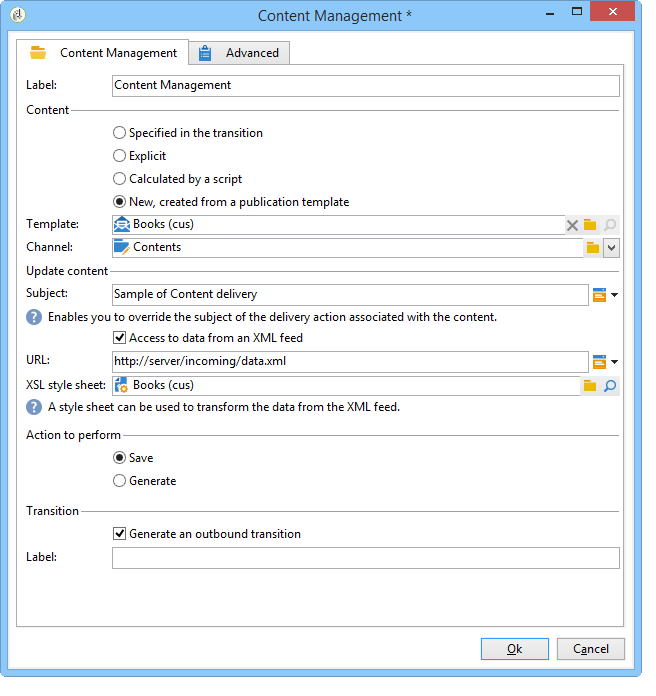

# 워크플로우를 통해 자동화{#automating-via-workflows}

## 컨텐츠 관리 활동 {#content-management-activity}

Adobe Campaign 클라이언트 인터페이스를 통해 구성된 워크플로우를 사용하여 컨텐츠 제작, 편집 및 게시를 자동화할 수 있습니다.

컨텐츠 **관리** 활동은 워크플로우 다이어그램의 **[!UICONTROL Tools]** 도구 모음을 통해 액세스합니다.

활동 속성은 다음 네 단계로 분류됩니다.

* **[!UICONTROL Content]** :기존 컨텐츠를 입력하거나 컨텐츠를 만들 수 있습니다.
* **[!UICONTROL Update content]** :컨텐츠의 제목을 수정하거나 XML 데이터 흐름을 통해 컨텐츠를 업데이트할 수 있습니다.
* **[!UICONTROL Action to execute]** :컨텐츠를 저장하거나 생성할 수 있습니다.
* **[!UICONTROL Transition]** :출력 전환을 생성할지 여부를 선택하고 이름을 지정할 수 있습니다.


### 컨텐츠 {#content}

* **변환에 의해 지정됨**

   사용할 컨텐츠는 이전에 만들어졌습니다. 프로세스는 들어오는 이벤트에서 전파한 컨텐츠 인스턴스에 대해 우려됩니다. 컨텐츠 식별자는 이벤트의 &quot;contentId&quot; 변수를 통해 액세스합니다.

* **명시적**

   이전에 만든 컨텐츠를 선택할 수 있습니다.

* **스크립트로 계산됨**

   JavaScript 템플릿을 기반으로 컨텐츠 인스턴스를 선택합니다. 평가할 코드를 사용하여 컨텐츠 식별자를 검색할 수 있습니다.

* **발행물 템플릿을 통해 새로 만들기**

   게시 템플릿을 통해 새 컨텐츠를 만듭니다. 컨텐츠 인스턴스가 채워진 &quot;문자열&quot; 폴더에 저장됩니다.

### 컨텐츠 업데이트 {#update-the-content}

* **제목**

   게시 시 전달 작업의 제목을 수정할 수 있습니다.

* **XML 피드에서 데이터 액세스**

   외부 소스의 XML 피드에서 컨텐츠가 업데이트됩니다. 데이터를 다운로드하려면 URL을 입력해야 합니다.

   XSL 스타일시트를 사용하여 들어오는 XML 데이터를 변환할 수 있습니다.

### 실행할 작업 {#action-to-execute}

* **저장**

   만들거나 수정한 컨텐츠를 저장합니다. 저장된 컨텐츠의 식별자는 나가는 이벤트의 &quot;contentId&quot; 변수에 전파됩니다.

* **생성**

   &quot;파일&quot; 유형 게시를 사용하여 각 변형 템플릿의 출력 파일을 생성합니다. 나가는 전환이 생성된 각 파일에 대해 다음 매개 변수를 사용하여 활성화됩니다.&quot;contentId&quot; 변수에 저장된 컨텐츠의 식별자와 &quot;filename&quot; 변수의 파일 이름입니다.

### 전환 {#transition}

출력 **전환** 생성 옵션을 사용하면 새로운 활동을 Workflow 실행에 연결하는 출력 전환을 **[!UICONTROL Content management]** 활동에 추가할 수 있습니다. 이 옵션을 선택한 후 전환 레이블을 입력합니다.

## 예 {#examples}

### 컨텐츠 제작 및 전달 자동화 {#automating-content-creation-and-delivery}

다음 예는 컨텐츠 블록의 작성 및 제공을 자동화합니다.


컨텐츠는 &quot;컨텐츠 관리&quot; 활동을 통해 구성됩니다.



게시 모델과 컨텐츠 문자열 폴더를 통해 새 컨텐츠 인스턴스가 생성됩니다.

우리의 예시에서, 우리는 배달 주제의 과부하가 있었습니다. 템플릿에 입력한 항목 대신 **[!UICONTROL Delivery]** 고려됩니다.

입력한 URL에서 오는 XML 피드에 의해 컨텐츠가 자동으로 채워집니다.

```
<?xml version='1.0' encoding='ISO-8859-1'?>
<book name="Content automation test" date="2008/06/08" language="eng" computeString="Content automation test">
  <section id="1" name="Introduction">
    <page>Introduction to input forms.</page>
  </section>
</book>
```

데이터 형식이 게시 템플릿에 입력한 데이터 스키마(**예제에서는 cus:book** )와 일치하지 않습니다.요소를 **`<section>`** 요소로 바꿔야 합니다 **`<chapter>`** . 필요한 변경을 수행하려면 &quot;cus:book-workflow.xsl&quot; 스타일시트를 적용해야 합니다.

사용된 XSLT 스타일시트의 소스 코드:

```
<?xml version="1.0" encoding="utf-8"?>
<xsl:stylesheet version="1.0" xmlns:xsl="http://www.w3.org/1999/XSL/Transform">
 <xsl:output indent="yes" method="xml"  encoding="ISO-8859-1"/>

 <xsl:template match="text()|@*"/>

  <xsl:template match="*">
    <xsl:variable name="element.name" select="name(.)"/>
    <xsl:element name="{$element.name}">
      <xsl:copy-of select="text()|@*"/>
      <xsl:apply-templates/>
    </xsl:element>
  </xsl:template>

  <xsl:template match="book">
  <book name="test">
     <xsl:apply-templates/>
    <book>
 </xsl:template>

  <xsl:template match="section">
    <chapter>
      <xsl:for-each select="@*">
        <xsl:copy-of select="."/>
      </xsl:for-each>
       <xsl:apply-templates/>
    </chapter>
  </xsl:template>
  
</xsl:stylesheet>
```

활동의 최종 작업은 컨텐츠 인스턴스를 저장하고 다음 작업으로 진행하는 것입니다.

타깃팅은 쿼리 활동을 통해 **수행됩니다** .

AND **조인** 활동이 타겟 쿼리 및 컨텐츠 업데이트가 완료된 후에만 배달이 시작되도록 추가되었습니다.

배달 작업은 배달 활동을 통해 **구성됩니다** .


템플릿을 기반으로 새 배달 작업이 만들어집니다.

활동의 배달 템플릿은 게시 템플릿의 변형 템플릿을 선택하는 데 사용됩니다. 컨텐츠 생성은 전달 템플릿 또는 활동과 동일한 템플릿으로 참조되는 템플릿 없이 모든 HTML 및 텍스트 템플릿을 고려합니다.

배달할 대상은 들어오는 이벤트를 통해 입력됩니다.

게재 컨텐츠는 들어오는 이벤트를 통해 채워집니다.

활동을 완료하기 위한 마지막 단계는 배달을 준비한 다음 시작하는 것입니다.

### 컨텐츠 제작 및 나중에 게시 {#creating-content-and-publishing-it-later}

이 예에서는 컨텐츠 블록을 만들고 특정 시간 지연 후 파일 게시를 시작합니다.


첫 번째 **컨텐츠 관리** 작업은 컨텐츠 인스턴스를 만듭니다.


>[!NOTE]
>
>변환 템플릿 창의 **[!UICONTROL Publication]** 탭은 생성할 대상의 위치로 채워야 합니다.

1주일 동안 다음 전환을 일시 중지하기 위해 대기 활동이 추가됩니다.


이 기간 동안 컨텐츠가 수동으로 입력됩니다.

다음 작업은 컨텐츠 생성을 시작합니다.


게시할 컨텐츠는 들어오는 전환을 통해 입력됩니다.

최종 작업은 게시 디렉토리를 강제 실행하여 이 컨텐츠를 생성하는 것입니다.

JavaScript **코드** 활동은 생성된 각 파일의 전체 이름을 검색합니다.


### 게재 및 해당 컨텐츠 만들기 {#creating-the-delivery-and-its-content}

이 예에서는 첫 번째 예와 동일한 개념을 사용하며 첫 번째 단계에서 배달 작업을 생성합니다.


첫 번째 **배달** 만들기 작업은 배달 작업을 만듭니다.

분기 활동을 사용하면 타겟 계산을 실행하고 컨텐츠 인스턴스를 동시에 만들 수 있습니다.

작업이 실행되면 AND-join 상자에서 배달 **작업을 활성화하여** 이전에 만든 컨텐츠 및 타깃팅을 시작합니다.


시작할 배달 작업은 전환을 통해 채워집니다.

배달할 대상은 들어오는 이벤트를 통해 입력됩니다.

게재 컨텐츠는 들어오는 이벤트를 통해 채워집니다.

활동의 최종 동작은 배달을 준비하고 시작하는 것입니다.

### FTP에서 컨텐츠 가져오기 {#importing-content-from-ftp}

배달 컨텐츠가 FTP 또는 SFTP 서버에 있는 HTML 파일에서 사용할 수 있는 경우 이 컨텐츠를 Adobe Campaign 게시에 쉽게 로드할 수 있습니다. 이 [예를](../../workflow/using/loading-delivery-content.md)참조하십시오.

### Amazon Simple Storage Service(S3) 커넥터에서 컨텐츠 가져오기 {#importing-content-from-amazon-simple-storage-service--s3--connector}

배달 컨텐츠가 Amazon Simple Storage Service(S3) 버킷에 있는 경우 이 컨텐츠를 Adobe Campaign 게시에 쉽게 로드할 수 있습니다. 이 [예를](../../workflow/using/loading-delivery-content.md)참조하십시오.

## 반자동 업데이트 {#semi-automatic-update}

컨텐츠 데이터는 &quot;반자동&quot; 모드로 업데이트할 수 있습니다. 데이터는 URL을 통해 XML 피드에서 복구됩니다.

데이터 복구 활성화는 입력 양식을 통해 수동으로 수행됩니다.

양식에서 **editBtn** 유형 **`<input>`** 필드를 선언하는 것이 목표입니다. 이 컨트롤은 편집 영역과 처리를 시작하는 단추로 구성됩니다.

편집 영역을 사용하면 검색할 데이터의 XML 피드의 URL을 구성하는 데 사용되는 변수 데이터를 채울 수 있습니다.

이 단추는 태그 아래에 **채워진** GetAndTransform SOAP 메서드를 실행합니다 **`<input>`** .

양식의 컨트롤 선언은 다음과 같습니다.

```
<input type="editbtn" xpath="<path>">
  <enter>
    <soapCall name="GetAndTransform" service="ncm:content">
      <param exprIn="<url>" type="string"/>
      <param exprIn="'xtk:xslt|<style sheet>'" type="string"/>
      <param type="DOMElement" xpathOut="<output path>"/>
    </soapCall>
  </enter>
</input>
```

GetAnd **Transform** 메서드는 **`<enter>`** 태그의 **`<input>`** 요소 아래에 선언되어야 합니다. 이 태그는 동적으로 생성된 표현식에서 XML 데이터 복구 URL을 매개 변수로 사용합니다. 함수의 두 번째 매개 변수는 선택 사항이며, 들어오는 XML 데이터가 내용과 같은 형식이 아닌 경우 중간 변환에 사용되는 스타일시트를 참조합니다.

출력은 마지막 매개 변수에 입력된 경로를 기반으로 컨텐츠를 업데이트합니다.

**예**:이 예를 설명하기 위해 &quot;cus:book&quot; 스키마에서 시작합니다.

반자동 업데이트 편집 컨트롤 입력 양식이 추가되었습니다.


```
<input label="File name" type="editbtn" xpath="/tmp/@name">
  <enter>
    <soapCall name="GetAndTransform" service="ncm:content">
      <param exprIn="'https://server/incoming/' + [/tmp/@name] + '.xml'" type="string"/>
      <param exprIn="'xtk:xslt|cus:book-workflow.xsl'" type="string"/>
      <param type="DOMElement" xpathOut="."/>
    </soapCall>
  </enter>
</input>
```

편집 영역을 사용하면 검색할 파일의 이름을 입력할 수 있습니다. URL은 다음과 같이 이 이름을 기반으로 만들어집니다.https://server/incomin/data.xml

검색할 데이터의 형식은 워크플로우 자동화 예제 1과 동일합니다. 이 예제에서 본 &quot;cus:book-workflow.xsl&quot; 스타일시트를 사용합니다.

작업 실행 결과는 &#39;.&#39; 경로에서 컨텐츠 인스턴스를 업데이트합니다.
