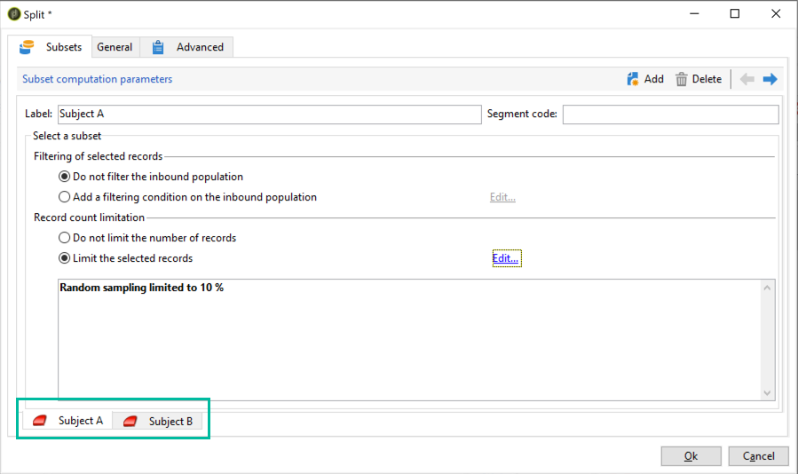

# A/B 테스트 구성 {#configuring-a-b-testing}

이 섹션에서는 A/B 테스트를 수행하는 워크플로우를 구축하는 방법에 대해 자세히 설명합니다.

1. 새 워크플로우를 만든 다음 구성 [쿼리](../../workflow/using/query.md) 활동을 통해 원하는 모집단을 타깃팅할 수 있습니다.

1. 추가 [분할](../../workflow/using/split.md) 활동을 통해 타겟팅된 모집단을 여러 하위 집합으로 나눕니다.

1. 활동을 열고 필요에 따라 각 하위 세트를 구성합니다. 를 구성하는 방법에 대한 자세한 내용 **[!UICONTROL Split]** 활동. 참조: [이 섹션](../../workflow/using/split.md).

   이 예제에서는 뉴스레터에 대한 2개의 새로운 주제를 대상 모집단의 10%에게 각각 제시하여 테스트하려고 합니다.

   

1. 전환을 추가하여 나머지 모집단에 현재 주제가 포함된 뉴스레터를 보냅니다. 이렇게 하려면 를 활성화합니다. **[!UICONTROL Generate complement]** 옵션에서 **[!UICONTROL General]** 탭.

   

1. 각 하위 세트에 대해 테스트할 게재 버전을 추가합니다.

   

이제 워크플로우를 시작할 수 있습니다. 게재가 전송되면 게재 로그에서 3개의 하위 집합의 동작을 추적하여 가장 성공적인 주제를 확인할 수 있습니다.

또한 워크플로우를 사용하면 더 나은 성과를 거둔 게재 변형을 자동으로 식별한 다음 나머지 모집단으로 보내어 프로세스를 자동화할 수 있습니다. 자세한 내용은 이 전용 을 참조하십시오. [사용 사례](a-b-testing-use-case.md).
