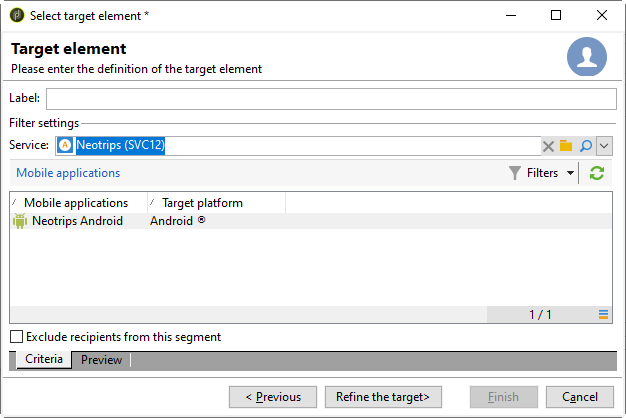

# Android용 구성 단계

패키지가 설치되면 Adobe Campaign Classic에서 Android 앱 설정을 정의할 수 있습니다.

>[!NOTE]
>
>iOS용 앱을 구성하는 방법과 iOS용 배달을 만드는 방법에 대해 알아보려면 이 [섹션을 참조하십시오](../../delivery/using/configuring-the-mobile-application.md).

## Android 외부 계정 구성 {#configuring-external-account-android}

Android의 경우 다음 두 개의 커넥터를 사용할 수 있습니다.

* MTA 자식에 대해 하나의 연결을 허용하는 V1 커넥터입니다.
* V2 커넥터를 사용하면 FCM 서버에 대한 동시 연결이 처리량을 향상시킬 수 있습니다.

사용할 커넥터를 선택하려면 다음 단계를 따르십시오.

1. 로 **[!UICONTROL Administration > Platform > External accounts]**&#x200B;이동합니다.
1. Select the **[!UICONTROL Android routing]** external account.
1. 탭에서 **[!UICONTROL Connector]** 필드를 **[!UICONTROL JavaScript used in the connector]** 입력합니다.

   Android V2의 경우:https://localhost:8080/nms/jsp/androidPushConnectorV2.js

   >[!NOTE]
   >
   > https://localhost:8080/nms/jsp/androidPushConnector.js에 따라 구성할 수도 있지만 커넥터 버전 2를 사용하는 것이 좋습니다.

   

1. Android V2의 경우 Adobe 서버 구성 파일(serverConf.xml)에서 하나의 추가 매개 변수를 사용할 수 있습니다.

   * **maxGCMConnectPerChild**:각 하위 서버에서 시작한 FCM에 대한 병렬 HTTP 요청의 최대 제한(기본적으로 8개)

## Android 서비스 구성 {#configuring-android-service}

1. 노드로 **[!UICONTROL Profiles and Targets > Services and subscriptions]** 이동하고 을 클릭합니다 **[!UICONTROL New]**.

   

1. Define a **[!UICONTROL Label]** and an **[!UICONTROL Internal name]**.
1. 필드로 이동하여 **[!UICONTROL Type]** 선택합니다 **[!UICONTROL Mobile application]**.

   >[!NOTE]
   >
   >기본 **[!UICONTROL Subscriber applications (nms:appSubscriptionRcp)]** 대상 매핑이 수신자 테이블에 연결됩니다. 다른 대상 매핑을 사용하려면 새 대상 매핑을 만들고 서비스 **[!UICONTROL Target mapping]** 필드에 입력해야 합니다. 대상 매핑 만들기에 대한 자세한 내용은 구성 [안내서를 참조하십시오](../../configuration/using/about-custom-recipient-table.md).

   

1. 그런 다음 **[!UICONTROL Add]** 단추를 클릭하여 응용 프로그램 유형을 선택합니다.

   

1. Android 응용 프로그램을 만듭니다. 자세한 정보는 이 [섹션](../../delivery/using/configuring-the-mobile-application-android.md#creating-android-app)을 참조하십시오.

## Android 모바일 응용 프로그램 만들기 {#creating-android-app}

서비스를 만든 후 이제 Android 응용 프로그램을 만들어야 합니다.

1. 새로 만든 서비스에서 **[!UICONTROL Add]** 단추를 클릭하여 응용 프로그램 유형을 선택합니다.

   

1. 을 **[!UICONTROL Create an Android application]** 선택하고 입력합니다 **[!UICONTROL Label]**.

   

1. SDK를 통해 Adobe Campaign **[!UICONTROL Integration key]** 와 애플리케이션 코드에서 동일한지 확인합니다. 자세한 내용은 다음을 참조하십시오. [Campaign SDK를 모바일 애플리케이션에 통합합니다](../../delivery/using/integrating-campaign-sdk-into-the-mobile-application.md).

   >[!NOTE]
   >
   > 문자열 값 **[!UICONTROL Integration key]** 으로 사용자 지정이 가능하지만 SDK에 지정된 값과 동일해야 합니다.

1. 다음 중 하나를 선택합니다 **[!UICONTROL API version]**.
   * HTTP. For more information refer to this [section](../../delivery/using/configuring-the-mobile-application-android.md#android-service-http).
   * HTTPV1. For more information refer to this [section](../../delivery/using/configuring-the-mobile-application-android.md#android-service-httpv1).

1. Fill in the **[!UICONTROL Firebase Cloud Messaging settings for the Android connection]** fields.

1. **[!UICONTROL Finish]**&#x200B;을(를) 클릭한 뒤 **[!UICONTROL Save]**&#x200B;을(를) 클릭합니다. 이제 Campaign Classic에서 Android 응용 프로그램을 사용할 준비가 되었습니다.

기본적으로 Adobe Campaign은 테이블의 **[!UICONTROL User identifier]** (@userKey) 필드에 키를 **[!UICONTROL Subscriber applications (nms:appSubscriptionRcp)]** 저장합니다. 이 키를 사용하면 구독을 수신자에게 연결할 수 있습니다. 추가 데이터(예: 복잡한 조정 키)를 수집하려면 다음 구성을 적용해야 합니다.

1. 스키마의 확장 **[!UICONTROL Subscriber applications (nms:appsubscriptionRcp)]** 을 만들고 새 필드를 정의합니다.

1. 탭에서 매핑을 **[!UICONTROL Subscription parameters]** 정의합니다.

   >[!CAUTION]
   >
   >탭의 구성 이름이 모바일 애플리케이션 코드의 구성 이름과 **[!UICONTROL Subscription parameters]** 동일한지 확인합니다. 모바일 애플리케이션에 [캠페인 SDK 통합 섹션을 참조하십시오](../../delivery/using/integrating-campaign-sdk-into-the-mobile-application.md) .

### API 버전 선택{#select-api-version}

서비스 및 새 모바일 애플리케이션을 만든 후 선택한 API 버전에 따라 모바일 애플리케이션을 구성해야 합니다.

서비스 및 모바일 애플리케이션 제작에 대한 자세한 내용은 이 [섹션을 참조하십시오.](../../delivery/using/configuring-the-mobile-application-android.md#configuring-android-service)

#### HTTP v1 API 버전 사용{#android-service-httpv1}

HTTP v1 API 버전을 구성하려면 아래 단계를 따르십시오.

1. 창에서 **[!UICONTROL Mobile application creation wizard]** 드롭다운 **[!UICONTROL HTTPV1]** 에서 **[!UICONTROL API version]** 선택합니다.

1. JSON 키 파일 **[!UICONTROL Load project json file to extract projet details...]** 을 직접 로드하려면 클릭하십시오. JSON 파일을 추출하는 방법에 대한 자세한 내용은 이 [페이지를 참조하십시오](https://firebase.google.com/docs/admin/setup#initialize-sdk).

1. 다음 세부 사항을 수동으로 입력할 수도 있습니다.
   * **[!UICONTROL Project Id]**
   * **[!UICONTROL Private Key]**
   * **[!UICONTROL Client Email]**

   

1. 구성 **[!UICONTROL Test the connection]** 이 올바르고 마케팅 서버에서 FCM에 액세스할 수 있는지 확인하려면 을(를) 클릭합니다.

   >[!CAUTION]
   >
   >중간 소싱 배포의 경우 MID 서버가 FCM 서버에 액세스할 수 있는지 여부를 **[!UICONTROL Test connection]** 확인하지 않습니다.

   

1. 필요에 따라 푸시 메시지 컨텐츠와 필요한 내용을 추가할 수 **[!UICONTROL Application variables]** 있습니다. 이러한 구성 요소는 사용자 지정이 가능하고 모바일 장치로 전송된 메시지 페이로드의 일부입니다.

1. **[!UICONTROL Finish]**&#x200B;을(를) 클릭한 뒤 **[!UICONTROL Save]**&#x200B;을(를) 클릭합니다. 이제 Campaign Classic에서 Android 응용 프로그램을 사용할 준비가 되었습니다.

다음은 푸시 알림을 더욱 개인화하기 위한 FCM 페이로드 이름입니다.

| 메시지 유형 | 구성 가능한 메시지 요소(FCM 페이로드 이름) | 구성 가능한 옵션(FCM 페이로드 이름) |
|:-:|:-:|:-:|
| 데이터 메시지 | N/A | valid_only |
| 알림 메시지 | title, body, android_channel_id, 아이콘, 사운드, 태그, 색상, click_action, 이미지, 티커, 고정, 가시성, 알림_우선 순위, 통지_count   | valid_only |

 
 

#### HTTP API 버전{#android-service-http}

HTTP(기존) API 버전을 구성하려면 아래 단계를 따르십시오.

1. 창에서 **[!UICONTROL Mobile application creation wizard]** 드롭다운 **[!UICONTROL HTTP (legacy)]** 에서 **[!UICONTROL API version]** 선택합니다.

1. 모바일 응용 프로그램 개발자가 제공한 **[!UICONTROL Project key]** 항목을 입력합니다.

1. 필요에 따라 푸시 메시지 컨텐츠와 필요한 내용을 추가할 수 **[!UICONTROL Application variables]** 있습니다. 이러한 구성 요소는 사용자 지정이 가능하고 모바일 장치로 전송된 메시지 페이로드의 일부입니다.

   다음 예제에서는 **제목**, **imageURL** 및 **iconURL을** 추가하여 리치 푸시 알림을 만든 다음 응용 프로그램에 알림 내에 표시할 이미지, 제목 및 아이콘을 제공합니다.

   

1. **[!UICONTROL Finish]**&#x200B;을(를) 클릭한 뒤 **[!UICONTROL Save]**&#x200B;을(를) 클릭합니다. 이제 Campaign Classic에서 Android 응용 프로그램을 사용할 준비가 되었습니다.

다음은 푸시 알림을 더욱 개인화하기 위한 FCM 페이로드 이름입니다.

| 메시지 유형 | 구성 가능한 메시지 요소(FCM 페이로드 이름) | 구성 가능한 옵션(FCM 페이로드 이름) |
|:-:|:-:|:-:|
| 데이터 메시지 | N/A | dryRun |
| 알림 메시지 | title, body, android_channel_id, icon, sound, tag, color, click_action   | dryRun |

 

## Android 리치 알림 만들기 {#creating-android-delivery}

Firebase Cloud Messaging을 사용하면 다음 두 가지 메시지 유형을 선택할 수 있습니다.

* **[!UICONTROL Data message]**, client app에 의해 처리됨.
    Android 알림을 생성하여 장치에 표시하는 메시지가 모바일 응용 프로그램으로 바로 전송됩니다. 데이터 메시지에는 사용자 지정 응용 프로그램 변수만 포함됩니다.

* **[!UICONTROL Notification message]**, FCM SDK에 의해 자동으로 처리됩니다.
     FCM은 클라이언트 앱을 대신하여 사용자의 장치에 메시지를 자동으로 표시합니다. 알림 메시지에는 사전 정의된 매개 변수 및 옵션 세트가 포함되어 있지만 사용자 지정 애플리케이션 변수를 사용하여 추가로 개인화할 수 있습니다.

Firebase 클라우드 메시지 유형에 대한 자세한 내용은 [FCM 설명서를 참조하십시오](https://firebase.google.com/docs/cloud-messaging/concept-options#notifications_and_data_messages).

### 데이터 메시지 만들기 {#creating-data-message}

1. > **[!UICONTROL Campaign management]** 로 **[!UICONTROL Deliveries]**&#x200B;이동합니다.

1. **[!UICONTROL New]**&#x200B;을(를) 클릭합니다.

   

1. 드롭다운 **[!UICONTROL Deliver on Android (android)]** 에서 **[!UICONTROL Delivery template]** 선택합니다. 전달 **[!UICONTROL Label]** 에 추가

1. 타깃팅할 모집단 **[!UICONTROL To]** 을 정의하려면 클릭합니다. 기본적으로 **[!UICONTROL Subscriber application]** 대상 매핑이 적용됩니다. 서비스 **[!UICONTROL Add]** 를 클릭하여 선택합니다.

   

1. 창에서 **[!UICONTROL Target type]** 을 선택하고 **[!UICONTROL Subscribers of an Android mobile application]** 클릭합니다 **[!UICONTROL Next]**.

1. 드롭다운 **[!UICONTROL Service]** 에서 이전에 만든 서비스를 선택한 다음 애플리케이션을 클릭하고 을 클릭합니다 **[!UICONTROL Finish]**.
구성 단계 **[!UICONTROL Application variables]** 에서 추가된 내용에 따라 자동으로 추가됩니다.

   

1. 다음으로 **[!UICONTROL data message]** 선택합니다 **[!UICONTROL Message Type]**.

1. 리치 알림 편집

   

1. 필요한 경우 이전에 구성한 정보에 정보를 추가할 수 **[!UICONTROL Application variables]** 있습니다. **[!UICONTROL Application variables]** 은 Android 서비스에서 구성되어야 하며 모바일 장치로 전송되는 메시지 페이로드의 일부여야 합니다.

1. 배달 **[!UICONTROL Save]** 을 클릭하고 보냅니다.

구독자의 모바일 Android 장치에서 수신할 때 푸시 알림에 이미지 및 웹 페이지가 표시되어야 합니다.

### 알림 메시지 만들기 {#creating-notification-message}

>[!NOTE]
>
>알림 메시지에 대한 추가 옵션은 HTTP v1 API 구성에서만 사용할 수 있습니다. 자세한 정보는 이 [섹션](../../delivery/using/configuring-the-mobile-application-android.md#android-service-httpv1)을 참조하십시오.

1. > **[!UICONTROL Campaign management]** 로 **[!UICONTROL Deliveries]**&#x200B;이동합니다.

1. **[!UICONTROL New]**&#x200B;을(를) 클릭합니다.

   

1. 드롭다운 **[!UICONTROL Deliver on Android (android)]** 에서 **[!UICONTROL Delivery template]** 선택합니다. 전달 **[!UICONTROL Label]** 에 추가

1. 타깃팅할 모집단 **[!UICONTROL To]** 을 정의하려면 클릭합니다. 기본적으로 **[!UICONTROL Subscriber application]** 대상 매핑이 적용됩니다. 서비스 **[!UICONTROL Add]** 를 클릭하여 선택합니다.

   

1. 창에서 **[!UICONTROL Target type]** 을 선택하고 **[!UICONTROL Subscribers of an Android mobile application]** 클릭합니다 **[!UICONTROL Next]**.

1. 드롭다운 **[!UICONTROL Service]** 에서 이전에 만든 서비스를 선택한 다음 애플리케이션을 클릭하고 을 클릭합니다 **[!UICONTROL Finish]**.

   

1. 다음으로 **[!UICONTROL notification message]** 선택합니다 **[!UICONTROL Message Type]**.

1. 제목을 추가하고 메시지를 편집합니다. 푸시 알림 개인화: **[!UICONTROL Notification options]**

   * **[!UICONTROL Channel ID]**:알림의 채널 ID를 설정합니다. 이 채널 ID의 알림을 수신하려면 먼저 앱이 이 채널 ID로 채널을 만들어야 합니다.
   * **[!UICONTROL Sound]**:장치가 알림을 받을 때 재생할 사운드를 설정합니다.
   * **[!UICONTROL Color]**:알림의 아이콘 색상을 설정합니다.
   * **[!UICONTROL Icon]**:알림의 아이콘을 설정하여 프로필 장치에 표시합니다.
   * **[!UICONTROL Tag]**:알림 서랍에서 기존 알림을 대체하는 데 사용되는 식별자를 설정합니다.
   * **[!UICONTROL Click action]**:알림을 클릭하여 사용자와 관련된 작업을 설정합니다.

   이러한 필드 **[!UICONTROL Notification options]** 를 채우는 방법과 자세한 내용은 [FCM 설명서를 참조하십시오](https://firebase.google.com/docs/reference/fcm/rest/v1/projects.messages#androidnotification).

   

1. 응용 프로그램이 HTTP v1 API 프로토콜로 구성된 경우, 다음과 같이 푸시 알림을 추가로 개인화할 수 있습니다. **[!UICONTROL HTTPV1 additional options]**

   * **[!UICONTROL Ticker]**:알림의 티커 텍스트를 설정합니다. Android 5.0 Lollipop로 설정된 장치에만 사용할 수 있습니다.
   * **[!UICONTROL Image]**:알림에 표시할 이미지의 URL을 설정합니다.
   * **[!UICONTROL Notification Count]**:애플리케이션 아이콘에 직접 표시되도록 새 읽지 않은 정보의 수를 설정합니다.
   * **[!UICONTROL Sticky]**:true 또는 false로 설정합니다. false로 설정하면 사용자가 해당 알림을 클릭할 때 알림이 자동으로 사라집니다. true로 설정된 경우 사용자가 알림을 클릭해도 알림이 계속 표시됩니다.
   * **[!UICONTROL Notification Priority]**:알림의 우선 순위 수준을 기본값, 최소, 낮음 또는 높음으로 설정합니다. For more on this, refer to [FCM documentation](https://firebase.google.com/docs/reference/fcm/rest/v1/projects.messages#NotificationPriority).
   * **[!UICONTROL Visibility]**:알림의 가시성 수준을 공개, 비공개 또는 기밀로 설정합니다. For more on this, refer to [FCM documentation](https://firebase.google.com/docs/reference/fcm/rest/v1/projects.messages#visibility).

   이러한 필드 **[!UICONTROL HTTP v1 additional options]** 를 채우는 방법과 자세한 내용은 [FCM 설명서를 참조하십시오](https://firebase.google.com/docs/reference/fcm/rest/v1/projects.messages#androidnotification).

   

1. 필요한 경우 이전에 구성한 정보에 정보를 추가할 수 **[!UICONTROL Application variables]** 있습니다. **[!UICONTROL Application variables]** 은 Android 서비스에서 구성되어야 하며 모바일 장치로 전송되는 메시지 페이로드의 일부여야 합니다.

1. 배달 **[!UICONTROL Save]** 을 클릭하고 보냅니다.

구독자의 모바일 Android 장치에서 수신할 때 푸시 알림에 이미지 및 웹 페이지가 표시되어야 합니다.
