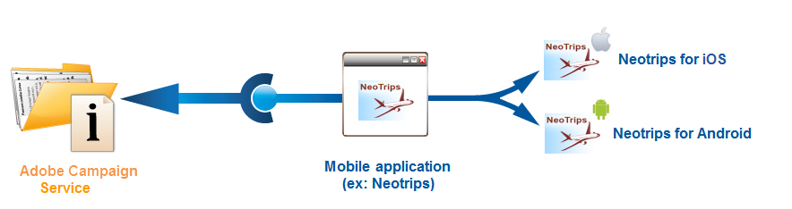

# Adobe Campaign에서 모바일 애플리케이션 구성 {#configuring-the-mobile-application-in-adobe-campaign}

온라인 휴일 패키지를 판매하는 회사를 기반으로 구성 샘플을 아래에서 찾을 수 있습니다. 모바일 애플리케이션(등록 트립)은 두 가지 버전으로 고객에게 제공됩니다.Android용 Neotrips 및 iOS용 Neotrips Adobe Campaign에서 모바일 애플리케이션을 구성하려면 다음을 수행해야 합니다.

* Neotrips 모바일 응용 프로그램에 대한 **[!UICONTROL Mobile application]** 유형 정보 서비스를 만듭니다.
* 이 서비스에 애플리케이션의 iOS 및 Android 버전을 추가합니다.
* iOS 및 Android 모두에 대한 게재를 만듭니다.

>[!NOTE]
>
>서비스의 **[!UICONTROL Subscriptions]** 탭으로 이동하여 해당 서비스의 가입자 목록을 봅니다. 즉, 해당 애플리케이션을 모바일에 설치했고 알림을 수신하기로 동의한 모든 사람입니다.

## iOS를 사용하여 모바일 애플리케이션 구성 {#configuring-the-mobile-application-ios}

>[!CAUTION]
>
>Adobe Campaign SDK와 통합하기 전에 푸시 작업에 대해 애플리케이션이 구성되어야 합니다.
>
>그렇지 않은 경우 [이 페이지를](https://developer.apple.com/library/archive/documentation/NetworkingInternet/Conceptual/RemoteNotificationsPG/)참조하십시오.

### 1단계:패키지 설치 {#installing-package-ios}

1. Adobe Campaign 클라이언트 콘솔에서 패키지 가져오기 마법사에 **[!UICONTROL Tools > Advanced > Package import...]** 액세스합니다.

   

1. 을 **[!UICONTROL Install a standard package]**&#x200B;선택합니다.

1. 표시되는 목록에서 선택합니다 **[!UICONTROL Mobile App Channel]**.

   

1. 을 **[!UICONTROL Next]**&#x200B;클릭한 다음 패키지 설치를 **[!UICONTROL Start]** 시작합니다.

   패키지가 설치되면 진행률 표시줄이 **100%** 로 표시되며 설치 로그에 다음 메시지가 표시됩니다. **[!UICONTROL Installation of packages successful]** Adobe

   

1. **[!UICONTROL Close]** 설치 창

### 2단계:iOS 외부 계정 구성 {#configuring-external-account-ios}

iOS의 경우 다음 두 개의 커넥터를 사용할 수 있습니다.

* iOS 바이너리 커넥터는 레거시 바이너리 APNS 서버에 알림을 전송합니다.
* iOS HTTP/2 커넥터는 HTTP/2 APNS에 알림을 전송합니다.

사용할 커넥터를 선택하려면 다음 단계를 따르십시오.

1. 로 **[!UICONTROL Administration > Platform > External accounts]**&#x200B;이동합니다.
1. 외부 계정을 **[!UICONTROL iOS routing]** 선택합니다.
1. 탭에서 **[!UICONTROL Connector]** **[!UICONTROL Access URL of the connector]** 필드를 채웁니다.

   iOS HTTP2의 경우:http://localhost:8080/nms/jsp/iosHTTP2.jsp

   

   >[!NOTE]
   >
   > https://localhost:8080/nms/jsp/ios.jsp에 따라 구성할 수도 있지만 커넥터 버전 2를 사용하는 것이 좋습니다.

1. 클릭 **[!UICONTROL Save]**.

이제 iOS 커넥터가 구성되었습니다. 서비스 만들기를 시작할 수 있습니다.

### 3단계:iOS 서비스 구성 {#configuring-ios-service}

1. 노드로 **[!UICONTROL Profiles and Targets > Services and subscriptions]** 이동하고 을 클릭합니다 **[!UICONTROL New]**.

   

1. a **[!UICONTROL Label]** 및 an을 **[!UICONTROL Internal name]**&#x200B;정의합니다.
1. 필드로 이동하여 **[!UICONTROL Type]** 선택합니다 **[!UICONTROL Mobile application]**.

   >[!NOTE]
   >
   >기본 **[!UICONTROL Subscriber applications (nms:appSubscriptionRcp)]** 대상 매핑은 수신자 테이블에 연결됩니다. 다른 대상 매핑을 사용하려면 새 대상 매핑을 만들고 서비스의 **[!UICONTROL Target mapping]** 필드에 입력해야 합니다. 대상 매핑 만들기에 대한 자세한 내용은 구성 [안내서를](../../configuration/using/about-custom-recipient-table.md)참조하십시오.

   

1. 그런 다음 **[!UICONTROL Add]** 단추를 클릭하여 응용 프로그램 유형을 선택합니다.

   

1. 다음 창이 나타납니다. 을 **[!UICONTROL Create an iOS application]** 선택하여 시작합니다 **[!UICONTROL Label]**.

   

1. 필요에 따라 푸시 메시지 컨텐츠가 **[!UICONTROL Application variables]** 추가되도록 할 수 있습니다. 이러한 구성 요소는 완전히 사용자 정의할 수 있으며 모바일 장치로 전송된 메시지 페이로드의 일부입니다.
다음 예제에서는 mediaURL 및 **mediaExt** 를 **추가하여** 리치 푸시 알림을 만든 다음 응용 프로그램에 알림 내에 표시할 이미지를 제공합니다.

   

1. 이 **[!UICONTROL Subscription parameters]** 탭에서는 **[!UICONTROL Subscriber applications (nms:appsubscriptionRcp)]** 스키마 확장명으로 매핑을 정의할 수 있습니다.

   >[!NOTE]
   >
   >개발 버전(샌드박스)과 응용 프로그램의 프로덕션 버전에 동일한 인증서를 사용하지 않도록 하십시오.

1. 이 **[!UICONTROL Sounds]** 탭에서는 재생할 사운드를 지정할 수 있습니다. 응용 프로그램에 포함된 파일의 이름이나 시스템 사운드 이름을 포함해야 하는 **[!UICONTROL Add]** 채우기 **[!UICONTROL Internal name]** 필드를 클릭합니다.

1. 을 **[!UICONTROL Next]** 클릭하여 개발 응용 프로그램 구성을 시작합니다.

1. Adobe Campaign과 SDK를 통해 애플리케이션 코드에 동일한 것이 **[!UICONTROL Integration key]** 정의되어 있는지 확인합니다. 자세한 내용은 다음을 참조하십시오.Campaign [SDK를 모바일 애플리케이션에](#integrating-campaign-sdk-into-the-mobile-application)통합합니다. 각 응용 프로그램에만 적용되는 이 통합 키를 사용하면 모바일 응용 프로그램을 Adobe Campaign 플랫폼에 연결할 수 있습니다.

   >[!NOTE]
   >
   > 문자열 값으로 **[!UICONTROL Integration key]** 사용자 정의할 수 있지만 SDK에 지정된 것과 정확히 같아야 합니다.

1. 필드에서 바로 사용 가능한 아이콘 중 하나를 선택하여 서비스에서 모바일 애플리케이션을 개인화합니다. **[!UICONTROL Application icon]**

1. 링크를 클릭한 다음 인증 인증서를 선택하고 모바일 애플리케이션 개발자가 제공한 암호를 입력합니다 **[!UICONTROL Enter the certificate...]** . 을 클릭하여 **[!UICONTROL Test the connection]** 성공했는지 확인할 수 있습니다.

   >[!NOTE]
   >
   >Apple은 동일한 모바일 애플리케이션의 개발 및 프로덕션 버전에 대해 서로 다른 인증서를 요구합니다. Adobe Campaign에서 두 개의 개별 애플리케이션을 구성해야 합니다.

   

1. 을 **[!UICONTROL Next]** 클릭하여 프로덕션 애플리케이션 구성을 시작하고 위에 설명된 것과 동일한 단계를 수행합니다.

   

1. 클릭 **[!UICONTROL Finish]**. 이제 iOS 애플리케이션을 Campaign Classic에서 사용할 준비가 되었습니다.

### 4단계:iOS 리치 알림 만들기 {#creating-ios-delivery}

iOS 10 이상에서는 다양한 알림을 생성할 수 있습니다. Adobe Campaign은 장치가 리치 알림을 표시할 수 있도록 해주는 변수를 사용하여 알림을 전송할 수 있습니다.

이제 새 배달을 만들고 만든 모바일 애플리케이션에 연결해야 합니다.

1. > **[!UICONTROL Campaign management]** 로 **[!UICONTROL Deliveries]**&#x200B;이동합니다.

1. 클릭 **[!UICONTROL New]**.

   

1. 드롭다운에서 **[!UICONTROL Deliver on iOS (ios)]** **[!UICONTROL Delivery template]** 선택합니다. 전달에 **[!UICONTROL Label]** 추가

1. 을 **[!UICONTROL To]** 클릭하여 타깃팅할 인구를 정의합니다. 기본적으로 **[!UICONTROL Subscriber application]** 대상 매핑이 적용됩니다. 이전에 만든 서비스를 **[!UICONTROL Add]** 선택하려면 을 클릭합니다.

   

1. 창에서 **[!UICONTROL Target type]** 을 선택하고 **[!UICONTROL Subscribers of an iOS mobile application (iPhone, iPad)]** 을 클릭합니다 **[!UICONTROL Next]**.

1. 드롭다운에서 이전에 만든 서비스를 선택한 다음 타깃팅할 애플리케이션을 선택하고 **[!UICONTROL Service]** **[!UICONTROL Finish]**클릭합니다.
구성 단계 동안 추가된 내용에 따라 **[!UICONTROL Application variables]** 구성 요소가 자동으로 추가됩니다.

   

1. 리치 알림 편집

   

1. 모바일 응용 프로그램이 미디어 컨텐츠를 다운로드할 수 있도록 하려면 알림 편집 창의 **[!UICONTROL Mutable content]** 상자를 선택합니다.

1. 전달을 클릭하고 **[!UICONTROL Save]** 보냅니다.

구독자의 모바일 iOS 장치에서 수신할 때 푸시 알림에 이미지 및 웹 페이지가 표시되어야 합니다.

## Android를 사용하여 모바일 애플리케이션 구성 {#configuring-the-mobile-application-android}

### 1단계:패키지 설치 {#installing-package-android}

1. Adobe Campaign 클라이언트 콘솔에서 패키지 가져오기 마법사에 **[!UICONTROL Tools > Advanced > Package import...]** 액세스합니다.

   

1. 을 **[!UICONTROL Install a standard package]**&#x200B;선택합니다.

1. 표시되는 목록에서 선택합니다 **[!UICONTROL Mobile App Channel]**.

   

1. 을 **[!UICONTROL Next]**&#x200B;클릭한 다음 패키지 설치를 **[!UICONTROL Start]** 시작합니다.

   패키지가 설치되면 진행률 표시줄이 **100%** 로 표시되며 설치 로그에 다음 메시지가 표시됩니다. **[!UICONTROL Installation of packages successful]** Adobe

   

1. **[!UICONTROL Close]** 설치 창

### 2단계:Android 외부 계정 구성 {#configuring-external-account-android}

Android의 경우 다음 두 개의 커넥터를 사용할 수 있습니다.

* MTA 자식에 대해 하나의 연결을 허용하는 V1 커넥터입니다.
* FCM 서버에 대한 동시 연결을 통해 처리량을 향상시키는 V2 커넥터

사용할 커넥터를 선택하려면 다음 단계를 따르십시오.

1. 로 **[!UICONTROL Administration > Platform > External accounts]**&#x200B;이동합니다.
1. 외부 계정을 **[!UICONTROL Android routing]** 선택합니다.
1. 탭에서 **[!UICONTROL Connector]** **[!UICONTROL JavaScript used in the connector]** 필드를 채웁니다.

   Android V2의 경우:https://localhost:8080/nms/jsp/androidPushConnectorV2.js

   >[!NOTE]
   >
   > https://localhost:8080/nms/jsp/androidPushConnector.js에 따라 구성할 수도 있지만 커넥터 버전 2를 사용하는 것이 좋습니다.

   

1. Android V2의 경우 Adobe Server 구성 파일(serverConf.xml)에서 다음 매개 변수 하나를 추가로 사용할 수 있습니다.

   * **maxGCMConnectPerChild**:각 자식 서버에서 시작한 FCM에 대한 병렬 HTTP 요청의 최대 제한(기본적으로 8개).

### 3단계:Android 서비스 구성 {#configuring-android-service}

1. 노드로 **[!UICONTROL Profiles and Targets > Services and subscriptions]** 이동하고 을 클릭합니다 **[!UICONTROL New]**.

   

1. a **[!UICONTROL Label]** 및 an을 **[!UICONTROL Internal name]**&#x200B;정의합니다.
1. 필드로 이동하여 **[!UICONTROL Type]** 선택합니다 **[!UICONTROL Mobile application]**.

   >[!NOTE]
   >
   >기본 **[!UICONTROL Subscriber applications (nms:appSubscriptionRcp)]** 대상 매핑은 수신자 테이블에 연결됩니다. 다른 대상 매핑을 사용하려면 새 대상 매핑을 만들고 서비스의 **[!UICONTROL Target mapping]** 필드에 입력해야 합니다. 대상 매핑 만들기에 대한 자세한 내용은 구성 [안내서를](../../configuration/using/about-custom-recipient-table.md)참조하십시오.

   

1. 그런 다음 **[!UICONTROL Add]** 단추를 클릭하여 응용 프로그램 유형을 선택합니다.

   

1. 을 **[!UICONTROL Create an Android application]**&#x200B;선택합니다.

   

1. a를 **[!UICONTROL Label]**&#x200B;입력합니다.

1. Adobe Campaign과 SDK를 통해 애플리케이션 코드에 동일한 것이 **[!UICONTROL Integration key]** 정의되어 있는지 확인합니다. 자세한 내용은 다음을 참조하십시오.Campaign [SDK를 모바일 애플리케이션에](#integrating-campaign-sdk-into-the-mobile-application)통합합니다.

   >[!NOTE]
   >
   > 문자열 값으로 **[!UICONTROL Integration key]** 사용자 정의할 수 있지만 SDK에 지정된 것과 정확히 같아야 합니다.

1. 필드에서 바로 사용 가능한 아이콘 중 하나를 선택하여 서비스에서 모바일 애플리케이션을 개인화합니다. **[!UICONTROL Application icon]**

1. 응용 프로그램의 연결 설정을 입력합니다.모바일 애플리케이션 개발자가 제공한 프로젝트 키를 입력합니다.

1. 필요에 따라 푸시 메시지 컨텐츠가 **[!UICONTROL Application variables]** 추가되도록 할 수 있습니다. 이러한 구성 요소는 완전히 사용자 정의할 수 있으며 모바일 장치로 전송된 메시지 페이로드의 일부입니다.

   다음 예제에서는 **제목**, **imageURL** 및 **iconURL을** 추가하여 리치 푸시 알림을 만든 다음 응용 프로그램에 알림 내에 표시할 이미지, 제목 및 아이콘을 제공합니다.

   

1. 을 **[!UICONTROL Finish]** 클릭한 **[!UICONTROL Save]**&#x200B;다음 이제 Android 애플리케이션을 Campaign Classic에서 사용할 준비가 되었습니다.

기본적으로 Adobe Campaign은 **[!UICONTROL User identifier]** 테이블의 **[!UICONTROL Subscriber applications (nms:appSubscriptionRcp)]** (@userKey) 필드에 키를 저장합니다. 이 키를 사용하면 구독을 수신자에게 연결할 수 있습니다. 추가 데이터(예: 복잡한 조정 키)를 수집하려면 다음 구성을 적용해야 합니다.

1. 스키마의 확장을 **[!UICONTROL Subscriber applications (nms:appsubscriptionRcp)]** 만들고 새 필드를 정의합니다.
1. 탭에서 매핑을 **[!UICONTROL Subscription parameters]** 정의합니다.
   >[!CAUTION]
   >
   >탭의 구성 이름이 모바일 애플리케이션 코드의 구성 이름과 동일한지 **[!UICONTROL Subscription parameters]** 확인하십시오. 모바일 애플리케이션에 [Campaign SDK](#integrating-campaign-sdk-into-the-mobile-application) 통합 섹션을 참조하십시오.

### 4단계:Android 리치 알림 만들기 {#creating-android-delivery}

이제 새 배달을 만들고 만든 모바일 애플리케이션에 연결해야 합니다.

1. > **[!UICONTROL Campaign management]** 로 **[!UICONTROL Deliveries]**&#x200B;이동합니다.

1. 클릭 **[!UICONTROL New]**.

   

1. 드롭다운에서 **[!UICONTROL Deliver on Android (android)]** **[!UICONTROL Delivery template]** 선택합니다. 전달에 **[!UICONTROL Label]** 추가

1. 을 **[!UICONTROL To]** 클릭하여 타깃팅할 인구를 정의합니다. 기본적으로 **[!UICONTROL Subscriber application]** 대상 매핑이 적용됩니다. 이전에 만든 서비스를 **[!UICONTROL Add]** 선택하려면 을 클릭합니다.

   

1. 창에서 **[!UICONTROL Target type]** Android 모바일 응용 프로그램의 구독자를 선택하고 을 클릭합니다 **[!UICONTROL Next]**.

1. 드롭다운에서 이전에 만든 서비스를 선택하고 애플리케이션을 클릭한 다음 **[!UICONTROL Service]** **[!UICONTROL Finish]**을 클릭합니다.
구성 단계 동안 추가된 내용에 따라 **[!UICONTROL Application variables]** 구성 요소가 자동으로 추가됩니다.

   

1. 리치 알림 편집

   

1. 전달을 클릭하고 **[!UICONTROL Save]** 보냅니다.

구독자의 모바일 Android 장치에서 수신할 때 푸시 알림에 이미지 및 웹 페이지가 표시되어야 합니다.

