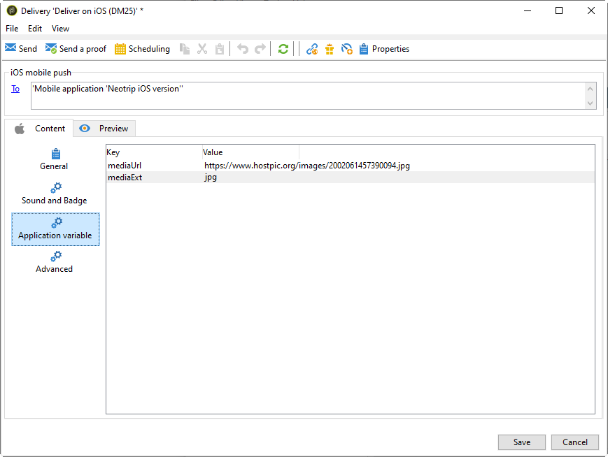

# iOS에 대한 알림 만들기{#create-notifications-ios}

이 섹션에서는 iOS 알림 전달과 관련된 요소에 대해 자세히 설명합니다. 게재 만들기에 대한 전체적인 개념은에 나와 있습니다. [이 섹션](steps-about-delivery-creation-steps.md).

새 게재를 만드는 것으로 시작합니다.

iOS 장치에 대한 푸시 알림을 만들려면 아래 단계를 따르십시오.

1. 다음 항목 선택 **[!UICONTROL Deliver on iOS]** 게재 템플릿.

   

1. 알림 대상을 정의하려면 **[!UICONTROL To]** 링크를 클릭한 다음 **[!UICONTROL Add]**.

   

   >[!NOTE]
   >
   >게재의 대상 모집단을 선택할 때의 자세한 프로세스는에 나와 있습니다. [이 섹션](steps-defining-the-target-population.md).
   >
   >개인화 필드 사용에 대한 자세한 내용은 을 참조하십시오. [이 섹션](about-personalization.md).
   >
   >시드 목록 포함에 대한 자세한 내용은 을 참조하십시오. [시드 주소 정보](about-seed-addresses.md).

1. 선택 **[!UICONTROL Subscribers of an iOS mobile application (iPhone, iPad)]**&#x200B;에서 모바일 애플리케이션 관련 서비스(이 경우 Neotrips)를 선택한 다음, 애플리케이션의 iOS 버전을 선택합니다.

   

1. 다음 항목 선택 **[!UICONTROL Notification type]** 사이 **[!UICONTROL General notification (Alert, Sound, Badge)]** 또는 **[!UICONTROL Silent notification]**.

   

   >[!NOTE]
   >
   >다음 **자동 푸시** 모드에서는 &quot;자동&quot; 알림을 모바일 애플리케이션으로 전송할 수 있습니다. 사용자는 알림이 도착한 것을 알 수 없습니다. 애플리케이션에 바로 전송됩니다.

1. 다음에서 **[!UICONTROL Title]** 필드에 알림 센터에서 사용할 수 있는 알림 목록에 표시할 제목의 레이블을 입력합니다.

   이 필드에서는 의 값을 정의할 수 있습니다. **제목** iOS 알림 페이로드의 매개 변수.

1. 다음을 추가할 수 있습니다. **[!UICONTROL Subtitle]**: iOS 알림 페이로드의 자막 매개 변수 값입니다. 다음을 참조하십시오. [이 섹션](configuring-the-mobile-application.md).

1. 에 메시지 내용 입력 **[!UICONTROL Message content]** 섹션에 있는 마지막 항목이 될 필요가 없습니다. 개인화 필드의 사용은에 나와 있습니다. [개인화 기본 정보](about-personalization.md) 섹션.

   

1. 다음을 클릭합니다. **[!UICONTROL Insert emoticon]** 아이콘: 푸시 알림에 이모티콘을 삽입합니다. 이모티콘 목록을 사용자 지정하려면 을 참조하십시오. [이 섹션](customizing-emoticon-list.md)

1. 다음에서 **[!UICONTROL Sound and Badge]** 탭에서 다음 옵션을 편집할 수 있습니다.

   * **[!UICONTROL Clean Badge]**: 배지 값을 새로 고치려면 이 옵션을 활성화합니다.

   * **[!UICONTROL Value]**: 애플리케이션 아이콘에 읽지 않은 새로운 정보의 수를 직접 표시하는 데 사용할 숫자를 설정합니다.

   * **[!UICONTROL Critical alert mode]**: 사용자의 휴대폰이 포커스 모드로 설정되어 있거나 iPhone이 음소거된 경우에도 알림에 사운드를 추가하려면 이 옵션을 활성화합니다.

   * **[!UICONTROL Name]**: 알림을 수신할 때 모바일 디바이스에서 재생할 사운드를 선택합니다.

   * **[!UICONTROL Volume]**: 0에서 100 사이의 사운드 볼륨입니다.
   >[!NOTE]
   >
   >사운드는 애플리케이션에 포함되어야 하며 서비스를 만들 때 정의되어야 합니다. [이 섹션](configuring-the-mobile-application.md#configuring-external-account-ios)을 참조하십시오.

   

1. 다음에서 **[!UICONTROL Application variables]** 탭, **[!UICONTROL Application variables]** 자동으로 추가됩니다. 알림 동작을 정의할 수 있습니다. 예를 들어, 사용자가 알림을 활성화할 때 특정 애플리케이션 화면이 표시되도록 구성할 수 있습니다.

   이 작업에 대한 자세한 정보는 [이 섹션](configuring-the-mobile-application.md)을 참조하십시오.

1. 다음에서 **[!UICONTROL Advanced]** 탭에서 다음 일반 옵션을 편집할 수 있습니다.

   * **[!UICONTROL Mutable content]**: 모바일 애플리케이션에서 미디어 콘텐츠를 다운로드하도록 하려면 이 옵션을 활성화합니다.

   * **[!UICONTROL Thread-id]**: 관련 알림을 함께 그룹화하는 데 사용되는 식별자.

   * **[!UICONTROL Category]**: 작업 버튼을 표시할 범주 ID의 이름입니다. 이러한 알림은 사용자가 애플리케이션을 열거나 탐색하지 않고도 알림에 응답하여 다른 작업을 보다 빠르게 수행할 수 있도록 합니다.

   

1. 시간 구분 알림의 경우 다음 옵션을 지정할 수 있습니다.

   * **[!UICONTROL Target content ID]**: 알림을 열 때 앞으로 가져올 애플리케이션 창을 타겟팅하는 데 사용되는 식별자입니다.

   * **[!UICONTROL Launch image]**: 표시할 론치 이미지 파일의 이름입니다. 사용자가 응용 프로그램을 시작하도록 선택하면 응용 프로그램의 시작 화면 대신 선택한 이미지가 표시됩니다.

   * **[!UICONTROL Interruption level]**:

      * **[!UICONTROL Active]**: 기본적으로 설정되어 있으므로 시스템에서 알림을 즉시 표시하고 화면을 켜며 사운드를 재생할 수 있습니다. 알림은 포커스 모드를 통과하지 않습니다.

      * **[!UICONTROL Passive]**: 화면에 불이 들어오거나 소리가 재생되지 않고 알림 목록에 알림이 추가됩니다. 알림은 포커스 모드를 통과하지 않습니다.

      * **[!UICONTROL Time sensitive]**: 시스템에서 알림을 즉시 표시하고 화면을 켜며 사운드를 재생하고 포커스 모드를 중단할 수 있습니다. 이 수준에서는 Apple의 특별한 권한이 필요하지 않습니다.

      * **[!UICONTROL Critical]**: 시스템에서 알림을 즉시 표시하고 화면을 켜며 음소거 스위치 또는 포커스 모드를 건너뜁니다. 이 수준에는 Apple의 특별한 권한이 필요합니다.
   * **[!UICONTROL Relevance score]**: 관련성 점수를 0에서 100으로 설정합니다. 시스템은 이 옵션을 사용하여 알림 요약의 알림을 정렬합니다.

   

1. 알림이 구성되면 **[!UICONTROL Preview]** 탭을 클릭하여 알림을 미리 봅니다.

   

   >[!NOTE]
   >
   >알림 스타일(배너 또는 경고)이 Adobe Campaign에 정의되어 있지 않습니다. iOS 설정에서 사용자가 선택한 구성에 따라 다릅니다. 하지만 Adobe Campaign에서는 각 유형의 알림 스타일을 미리 볼 수 있습니다. 한 스타일에서 다른 스타일로 전환하려면 오른쪽 하단에 있는 화살표를 클릭하십시오.
   >
   >미리 보기는 iOS 10 디자인을 사용합니다.

증명을 보내고 최종 게재를 보내려면 이메일 게재와 동일한 프로세스를 사용합니다. [자세히 알아보기](steps-validating-the-delivery.md)

메시지를 보낸 후 게재를 모니터링하고 추적할 수 있습니다. 자세한 정보는 다음 섹션을 참조하십시오.

* [푸시 알림 격리](understanding-quarantine-management.md#push-notification-quarantines)
* [게재 모니터링](about-delivery-monitoring.md)
* [게재 실패 이해](understanding-delivery-failures.md)

## iOS 리치 알림 만들기 {#creating-ios-delivery}

iOS 10 이상을 사용하면 풍부한 알림을 생성할 수 있습니다. Adobe Campaign은 디바이스가 풍부한 알림을 표시할 수 있도록 해 주는 변수를 사용하여 알림을 보낼 수 있습니다.

이제 새 게재를 만들고 만든 모바일 애플리케이션에 연결해야 합니다.

1. 다음으로 이동 **[!UICONTROL Campaign management]** > **[!UICONTROL Deliveries]**.

1. **[!UICONTROL New]**&#x200B;를 클릭합니다.

   

1. 선택 **[!UICONTROL Deliver on iOS (ios)]** 다음에서 **[!UICONTROL Delivery template]** 드롭다운. 추가 **[!UICONTROL Label]** 게재를 위해.

1. 클릭 **[!UICONTROL To]** 타겟팅할 모집단을 정의합니다. 기본적으로 **[!UICONTROL Subscriber application]** 대상 매핑이 적용됩니다. 클릭 **[!UICONTROL Add]** 을 클릭하여 이전에 만든 서비스를 선택합니다.

   

1. 다음에서 **[!UICONTROL Target type]** 창, 선택 **[!UICONTROL Subscribers of an iOS mobile application (iPhone, iPad)]** 및 클릭 **[!UICONTROL Next]**.

1. 다음에서 **[!UICONTROL Service]** 드롭다운에서 앞에서 만든 서비스를 선택한 다음 타깃팅할 애플리케이션을 선택하고 을 클릭합니다. **[!UICONTROL Finish]**.

   

1. 리치 알림을 편집합니다.

   

1. 다음에서 **[!UICONTROL Application variables]** 탭, **[!UICONTROL Application variables]** 는 구성 단계 중에 추가된 내용에 따라 자동으로 추가됩니다.

   >[!NOTE]
   >
   >애플리케이션 변수는 모바일 애플리케이션의 코드에 정의되어 있어야 하며 서비스 생성 중에 입력해야 합니다. 이 작업에 대한 자세한 정보는 [이 섹션](configuring-the-mobile-application.md)을 참조하십시오.

   

1. 다음에서 **[!UICONTROL Advanced]** 탭에서 다음을 확인합니다 **[!UICONTROL Mutable content]** 모바일 애플리케이션이 미디어 콘텐츠를 다운로드할 수 있도록 하는 상자입니다.

1. 클릭 **[!UICONTROL Save]** 게재를 보낼 수 있습니다.

구독자의 모바일 iOS 장치에서 수신할 때 푸시 알림에 이미지와 웹 페이지가 표시되어야 합니다.

