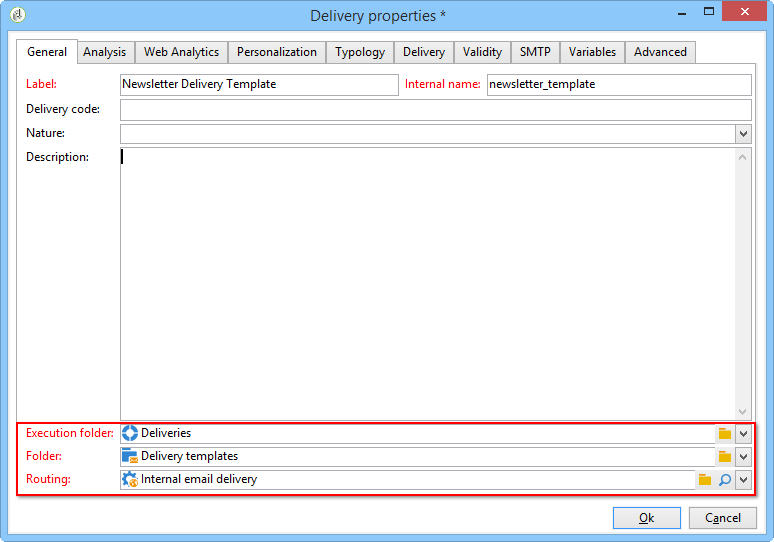

# Creating a delivery template{#creating-a-delivery-template}

 [비디오에서 이 기능 살펴보기](#delivery-template-video)

## 기존 배달을 템플릿으로 변환 {#converting-an-existing-delivery-to-a-template}

새 반복 전달 작업을 위해 배달을 템플릿으로 변환할 수 있습니다. 게재를 템플릿으로 변환하려면 배달 목록에서 해당 배달을 선택하고 트리 노드를 통해 액세스할 수 **[!UICONTROL Campaign management]** 있습니다.

마우스 오른쪽 버튼을 클릭하고 선택합니다 **[!UICONTROL Actions > Save as template...]**.

이 작업은 선택한 배달에서 배달 템플릿을 만듭니다. 저장된 폴더( **[!UICONTROL Folder]** 필드)와 이 템플릿을 기반으로 만든 배달이 만들어진 폴더( **[!UICONTROL Execution folder]** 필드)를 입력해야 합니다.

구성 모드에 대한 자세한 내용은 템플릿을 게재에 [연결을 참조하십시오](../../delivery/using/creating-a-delivery-from-a-template.md#linking-the-template-to-a-delivery).

## 새 템플릿 만들기 {#creating-a-new-template}

배달 템플릿을 구성하려면 다음 단계를 수행하십시오.

1. 캠페인 탐색기를 엽니다.
1. 리소스 **폴더** 에서 템플릿 **** , 배달 템플릿 **을 선택합니다**.

   

1. 도구 모음 **에서** 새로 만들기를 클릭하여 새 배달 템플릿을 만듭니다.

   

1. 폴더의 **레이블** 및 **내부 이름을** 수정합니다.
1. 템플릿을 저장하고 다시 엽니다.
1. 속성 **단추를** 클릭한 다음 요구 사항에 따라 값을 수정합니다.

   

1. [ **일반** ] 탭에서 **실행 폴더**, **폴더**&#x200B;및 라우팅 **드롭다운 메뉴에서 선택한 위치를 확인하거나** 변경합니다.

   

1. 이메일 **제목과** 타깃팅된 모집단으로 이메일 매개 변수 카테고리를 완성합니다.
1. 템플릿을 개인화하기 위해 **HTML 컨텐츠를** 추가하면 미러 페이지 링크 및 구독 취소 링크를 표시할 수 있습니다.
1. Select the **Preview** tab. 개인화 **테스트** 드롭다운 메뉴에서 **수신자를** 선택하여 템플릿을 선택한 프로필로 미리 봅니다.

   

1. Click **Save**. 이제 배달에서 템플릿을 사용할 준비가 되었습니다.

>[!NOTE]
>
>구성 오류를 방지하려면 새 템플릿을 만드는 대신 기본 템플릿을 복제하고 해당 속성을 변경하는 것이 좋습니다.

## 배달 템플릿을 구성하는 방법 {#delivery-template-video}

다음 비디오에서는 애드혹 전달에 대한 템플릿을 구성하는 방법을 보여 줍니다.

>[!VIDEO](https://video.tv.adobe.com/v/24066?quality=12)

## 배달 템플릿 속성을 설정하는 방법

다음 비디오에서는 배달 템플릿 속성을 설정하는 방법을 보여 주고 각 속성에 대해 자세히 설명합니다.

>[!VIDEO](https://video.tv.adobe.com/v/24067?quality=12)

## 임시 배달 템플릿을 배포하는 방법

이 비디오에서는 임시 이메일 배달 템플릿을 배포하는 방법에 대해 설명하고 이메일 배달과 배달 워크플로우의 차이점을 설명합니다.

>[!VIDEO](https://video.tv.adobe.com/v/24065?quality=12)
