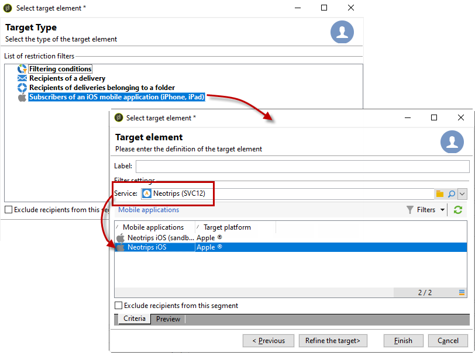

# 알림 만들기{#creating-notifications}

이 섹션에서는 iOS 및 Android 알림의 배달과 관련된 요소에 대해 자세히 설명합니다. 배달 생성에 대한 글로벌 개념이 [이 섹션에 나와 있습니다](../../delivery/using/steps-about-delivery-creation-steps.md).

먼저 새 배달을 만듭니다.

## iOS에서 알림 전송 {#sending-notifications-on-ios}

1. 배달 템플릿을 **[!UICONTROL Deliver on iOS]** 선택합니다.

   

1. 알림의 대상을 정의하려면 **[!UICONTROL To]** 링크를 클릭한 다음 을 클릭합니다 **[!UICONTROL Add]**.

   

   >[!NOTE]
   >
   >게재의 대상 모집단을 선택할 때의 세부 프로세스는 [이 섹션에 나와 있습니다](../../delivery/using/steps-defining-the-target-population.md).
   >
   >개인화 필드 사용에 대한 자세한 내용은 개인화 [정보를 참조하십시오](../../delivery/using/about-personalization.md).
   >
   >시드 목록 포함에 대한 자세한 내용은 [시드 주소 정보를 참조하십시오](../../delivery/using/about-seed-addresses.md).

1. 모바일 응용 프로그램 **[!UICONTROL Subscribers of an iOS mobile application (iPhone, iPad)]**&#x200B;과 관련된 서비스(이 경우 Neotraps)를 선택한 다음 iOS 버전의 응용 프로그램을 선택합니다.

   

1. 알림 유형을 선택합니다. **[!UICONTROL Alert]**, **[!UICONTROL Badge]**&#x200B;또는 **[!UICONTROL Alert and badge]** 또는 **[!UICONTROL Silent Push]**.

   

   >[!NOTE]
   >
   >자동 **푸시** 모드는 iOS 7에서 사용할 수 있습니다. 이를 통해 모바일 애플리케이션에 &quot;자동&quot; 알림을 보낼 수 있습니다. 사용자가 알림의 도착을 알지 못합니다. 애플리케이션에 직접 전송됩니다.

1. 필드에 **[!UICONTROL Title]** 알림에 표시할 제목 레이블을 입력합니다. 알림 센터에서 사용할 수 있는 알림 목록에만 표시됩니다. 이 필드에서는 iOS 알림 페이로드의 **제목** 매개 변수 값을 정의할 수 있습니다.

1. HTTP/2 커넥터를 사용하는 경우 자막을 추가할 수 있습니다(iOS 알림 페이로드의 **자막** 매개 변수 값). Adobe Campaign에서 [모바일 애플리케이션 구성 섹션을](../../delivery/using/configuring-the-mobile-application.md) 참조하십시오.

1. 그런 다음 선택한 알림 유형 **[!UICONTROL Message]** 을 **[!UICONTROL Value of the badge]** 기준으로 및 를 입력합니다.

   

   >[!NOTE]
   >
   >**[!UICONTROL Badge]** 및 **[!UICONTROL Alert and badge]** 문자 알림을 통해 배지 값(모바일 응용 프로그램 로고 위의 숫자)을 수정할 수 있습니다. 배지를 새로 고치려면 0을 값으로 입력해야 합니다. 필드가 비어 있으면 배지 값이 변경되지 않습니다.

1. 푸시 알림에 이모티콘을 삽입하려면 **[!UICONTROL Insert emoticon]** 아이콘을 클릭합니다. 이모티콘 목록을 사용자 정의하려면 이모티콘 목록 [사용자 정의를 참조하십시오](../../delivery/using/customizing-emoticon-list.md)

1. 이 **[!UICONTROL Action button]** 를 사용하면 경고 알림(페이로드의&#x200B;**action_loc_key** 필드)에 나타나는 작업 단추에 대한 레이블을 정의할 수 있습니다. iOS 응용 프로그램이 지역화할 수 있는 문자열(**Localizable.strings**)을 관리하는 경우 이 필드에 해당 키를 입력합니다. 응용 프로그램에서 지역화 가능 텍스트를 관리하지 않을 경우 작업 단추에 표시할 레이블을 입력합니다. 현지화 가능한 문자열에 대한 자세한 내용은 [Apple 설명서를 참조하십시오](https://developer.apple.com/library/archive/documentation/NetworkingInternet/Conceptual/RemoteNotificationsPG/CreatingtheNotificationPayload.html#//apple_ref/doc/uid/TP40008194-CH10-SW1) .
1. 알림을 받을 **[!UICONTROL Play a sound]** 때 모바일 터미널에서 재생할 사운드를 선택합니다.

   >[!NOTE]
   >
   >사운드는 애플리케이션에 포함되고 서비스가 만들어질 때 정의되어야 합니다. iOS [외부 계정 구성을 참조하십시오](../../delivery/using/configuring-the-mobile-application.md#configuring-external-account-ios).

1. 필드에 **[!UICONTROL Application variables]** 각 변수의 값을 입력합니다. 애플리케이션 변수를 사용하여 알림 동작을 정의할 수 있습니다. 예를 들어 사용자가 알림을 활성화할 때 표시할 특정 애플리케이션 화면을 구성할 수 있습니다.

   >[!NOTE]
   >
   >응용 프로그램 변수는 모바일 응용 프로그램 코드에서 정의되어야 하며 서비스를 만드는 동안 입력해야 합니다. 자세한 내용은 다음을 참조하십시오. [Adobe Campaign에서 모바일 응용 프로그램 구성을 참조하십시오](../../delivery/using/configuring-the-mobile-application.md).

1. 알림이 구성되면 **[!UICONTROL Preview]** 탭을 클릭하여 알림을 미리 봅니다.

   

   >[!NOTE]
   >
   >알림 스타일(배너 또는 경고)이 Adobe Campaign에 정의되지 않았습니다. iOS 설정에서 사용자가 선택한 구성에 따라 다릅니다. 하지만 Adobe Campaign을 사용하면 각 유형의 알림 스타일을 미리 볼 수 있습니다. 오른쪽 하단에 있는 화살표를 클릭하여 한 스타일에서 다른 스타일로 전환합니다.
   >
   >미리 보기에서는 iOS 10 모양과 느낌을 사용합니다.

증명 자료를 보내고 최종 전달을 보내려면 이메일 배달과 동일한 프로세스를 사용합니다.

메시지를 보낸 후 배달을 모니터링하고 추적할 수 있습니다. 자세한 내용은 다음 섹션을 참조하십시오.

* [푸시 알림 검역소](../../delivery/using/understanding-quarantine-management.md#push-notification-quarantines)
* [게재 모니터링](../../delivery/using/monitoring-a-delivery.md)
* [게재 실패 이해](../../delivery/using/understanding-delivery-failures.md)

## Android에서 알림 보내기 {#sending-notifications-on-android}

1. 배달 템플릿을 선택하여 **[!UICONTROL Deliver on Android (android)]** 시작합니다.

   

1. 알림의 대상을 정의하려면 **[!UICONTROL To]** 링크를 클릭한 다음 을 클릭합니다 **[!UICONTROL Add]**.

   

1. 모바일 응용 프로그램 **[!UICONTROL Subscribers of an Android mobile application]**&#x200B;과 관련된 서비스(이 경우 네오트피)를 선택한 다음 Android 버전의 응용 프로그램을 선택합니다.

   

1. 그런 다음 알림의 컨텐츠를 입력합니다.

   

1. 푸시 알림에 이모티콘을 삽입하려면 **[!UICONTROL Insert emoticon]** 아이콘을 클릭합니다. 이모티콘 목록을 사용자 정의하려면 이모티콘 목록 [사용자 정의를 참조하십시오](../../delivery/using/defining-interactive-content.md)

1. 필드에 **[!UICONTROL Application variables]** 각 변수의 값을 입력합니다. 애플리케이션 변수를 사용하여 알림 동작을 정의할 수 있습니다. 예를 들어 사용자가 알림을 활성화할 때 표시할 특정 애플리케이션 화면을 구성할 수 있습니다.

   >[!NOTE]
   >
   >응용 프로그램 변수는 모바일 응용 프로그램 코드에서 정의되어야 하며 서비스를 만드는 동안 입력해야 합니다. 자세한 내용은 다음을 참조하십시오. [Adobe Campaign에서 모바일 응용 프로그램 구성을 참조하십시오](../../delivery/using/configuring-the-mobile-application.md).

1. 알림이 구성되면 **[!UICONTROL Preview]** 탭을 클릭하여 알림을 미리 봅니다.

   

증명 자료를 보내고 최종 전달을 보내려면 이메일 배달과 동일한 프로세스를 사용합니다.

배달을 확인하고 전송할 때의 세부 프로세스는 아래 섹션에 나와 있습니다.

* [배달 유효성 확인](../../delivery/using/steps-validating-the-delivery.md)
* [배달 전송](../../delivery/using/steps-sending-the-delivery.md)

메시지를 보낸 후 배달을 모니터링하고 추적할 수 있습니다. 자세한 내용은 다음 섹션을 참조하십시오.

* [푸시 알림 검역소](../../delivery/using/understanding-quarantine-management.md#push-notification-quarantines)
* [게재 모니터링](../../delivery/using/monitoring-a-delivery.md)
* [게재 실패 이해](../../delivery/using/understanding-delivery-failures.md)
